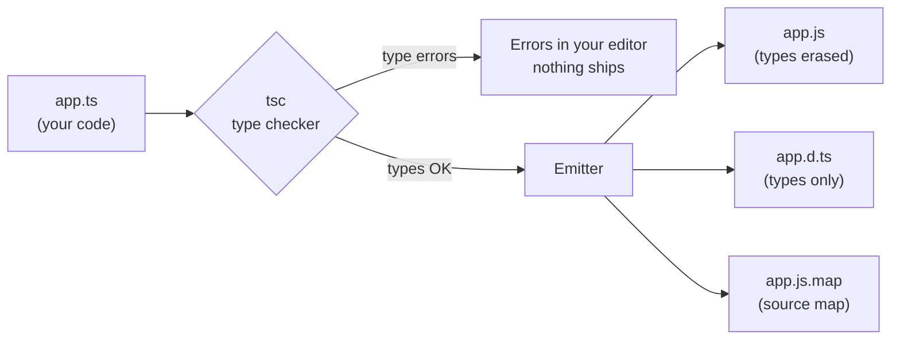
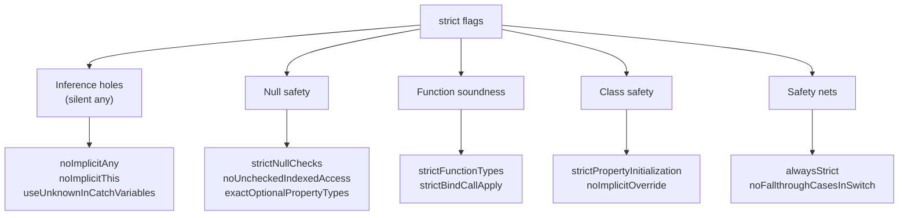

# 01 — Setup & Tooling

## Why this exists

JavaScript only finds mistakes when the code runs — often in production.
TypeScript adds a *type layer* on top of JavaScript that finds those
mistakes while you type. The types are erased at build time; what runs is
plain JavaScript.

## The compiler pipeline



*What to notice: types never reach runtime — `tsc` checks them, then throws
them away. `.d.ts` files keep the types so other code can still see them.*

## Minimal syntax

A type annotation is a colon after a name:

```ts
function add(a: number, b: number): number {
  return a + b
}
add(2, 3)      // ✅ 5
add('2', 3)    // ❌ compile error — caught before running
```

Run TypeScript directly (no compile step) with `tsx`:

```bash
npx tsx playground/demo.ts
```

Or compile with `tsc` (config comes from `tsconfig.json`):

```bash
npx tsc --noEmit     # just type-check, emit nothing
```

## tsconfig: the strict flags, one by one

`"strict": true` switches on a *family* of flags. This course also enables
extra strictness. Each one exists to kill a specific class of bug.

The table below is the map. Each flag then gets its own section with a
real example the compiler rejects — every example here was verified
against `tsc`.

| Flag | What it catches |
| --- | --- |
| `noImplicitAny` | Values TS can't infer silently become `any` |
| `strictNullChecks` | `null`/`undefined` sneaking into other types |
| `strictFunctionTypes` | Unsound callback assignments |
| `strictBindCallApply` | Wrong args to `.bind`/`.call`/`.apply` |
| `strictPropertyInitialization` | Class fields declared but never assigned |
| `noImplicitThis` | `this` with unknown type |
| `useUnknownInCatchVariables` | Treating a caught error as `any` |
| `alwaysStrict` | Emits JS `"use strict"` (safety net) |
| `noUncheckedIndexedAccess`* | Assuming `arr[i]` always exists |
| `exactOptionalPropertyTypes`* | Writing `undefined` into an optional prop |
| `noImplicitOverride`* | Silent method overrides in classes |
| `noFallthroughCasesInSwitch`* | A `case` that falls into the next one |

\* Not part of the `strict` umbrella — enabled separately in this course.

The flags group into five themes:



*What to notice: most flags fight two enemies — `any` appearing silently,
and `null`/`undefined` appearing silently.*

### `noImplicitAny` — no silent `any`

When TS can't infer a type, the fallback is `any` — which turns off
checking entirely. This flag makes the fallback an error instead.

```ts
// ❌ error TS7006: Parameter 'x' implicitly has an 'any' type.
function len(x) {
  return x.lenght       // typo! but `any` would let it compile
}

// ✅ annotate — now the typo is a compile error
function len(x: string) {
  return x.length
}
```

### `strictNullChecks` — `undefined` is not a `string`

Without this flag, `null` and `undefined` are assignable to *everything*,
so "possibly missing" values pass as present. This is the flag behind the
famous "billion-dollar mistake" fix.

```ts
const users = new Map<string, string>()
const name = users.get('alice')   // type: string | undefined

// ❌ error TS18048: 'name' is possibly 'undefined'.
name.toUpperCase()

// ✅ narrow first
if (name !== undefined) name.toUpperCase()
```

### `strictFunctionTypes` — callbacks that promise too little

A function that only handles `Dog` cannot stand in where *any* `Animal`
may arrive. Without this flag, TS allowed it — and the callback could
receive a `Cat` at runtime.

```ts
class Animal { name = '' }
class Dog extends Animal { bark() {} }

type AnimalHandler = (a: Animal) => void

// ❌ error TS2322: Type '(d: Dog) => void' is not assignable
//    to type 'AnimalHandler'.
const handle: AnimalHandler = (d: Dog) => d.bark()
// if allowed: handle(new Animal()) → d.bark is not a function 💥
```

Don't worry about the theory name (*contravariance*) yet — module 08
covers it. The intuition: **a handler must accept at least as much as
its type promises.**

### `strictBindCallApply` — typed `.call` / `.apply` / `.bind`

Without the flag, these three methods accepted any arguments.

```ts
function greet(who: string) { return `hi ${who}` }

// ❌ error TS2345: Argument of type 'number' is not assignable
//    to parameter of type 'string'.
greet.call(undefined, 42)
```

### `strictPropertyInitialization` — no half-built objects

A field declared `name: string` must be **definitely assigned** before
the constructor finishes. Otherwise it silently holds `undefined` and
the type is a lie.

```ts
class User {
  // ❌ error TS2564: Property 'name' has no initializer and is
  //    not definitely assigned in the constructor.
  name: string

  role = 'student'          // ✅ initializer at the declaration
  id: number                // ✅ assigned in the constructor below
  nickname!: string         // ✅ `!` = "trust me" — check skipped
  bio: string | undefined   // ✅ undefined is part of the type

  constructor() {
    this.id = 1
  }
}
```

Gotcha: assigning in a method called *from* the constructor does **not**
count — TS only follows assignments directly in the constructor body.
The `!` escape hatch works but shifts the burden onto you: if the
assignment is ever removed, the crash comes at runtime, not compile time.

### `noImplicitThis` — `this` must have a known type

In a loose function, `this` could be anything, so TS would give it `any`.

```ts
// ❌ error TS2683: 'this' implicitly has type 'any' because it
//    does not have a type annotation.
function getX() {
  return this.x
}

// ✅ declare what `this` must be (a fake first parameter, erased at runtime)
function getX(this: { x: number }) {
  return this.x
}
```

### `useUnknownInCatchVariables` — you can `throw` anything

JavaScript lets you `throw 'oops'` or `throw 42`, so a caught value is
not guaranteed to be an `Error`. The flag types it `unknown` instead of
`any`, forcing a check before use.

```ts
try {
  JSON.parse('{')
} catch (e) {
  // ❌ error TS18046: 'e' is of type 'unknown'.
  console.log(e.message)

  // ✅ narrow first
  if (e instanceof Error) console.log(e.message)
}
```

### `alwaysStrict` — the runtime safety net

Not a type check: it parses your files in ES strict mode and emits
`"use strict"` into the JS. Sloppy-mode footguns (silent failed
assignments, accidental globals) become runtime errors. You never
notice this flag — it just quietly closes doors.

### `noUncheckedIndexedAccess` — `arr[i]` might miss

An array type says what the *elements* are, not that index `i` exists.
With the flag, every index read is `T | undefined`.

```ts
const words: string[] = []

// ❌ error TS2532: Object is possibly 'undefined'.
console.log(words[0].length)

// ✅ acknowledge the miss
console.log(words[0]?.length)
```

### `exactOptionalPropertyTypes` — missing ≠ set to `undefined`

`theme?: string` means the key may be *absent*. Without the flag you
could also write `undefined` into it — a different thing, visible to
`'theme' in obj` and `Object.keys`.

```ts
type Settings = { theme?: string }

// ❌ error TS2375: Type '{ theme: undefined; }' is not assignable
//    to type 'Settings' with 'exactOptionalPropertyTypes: true'.
const s: Settings = { theme: undefined }

// ✅ leave it out entirely
const s: Settings = {}
```

### `noImplicitOverride` — overriding must be on purpose

If a subclass method happens to match a base-class name, is that an
override or an accident? The flag makes you say so with the `override`
keyword — and then TS errors if the base method is renamed and your
"override" no longer overrides anything.

```ts
class Base { save() {} }

class Sub extends Base {
  // ❌ error TS4114: This member must have an 'override' modifier
  //    because it overrides a member in the base class 'Base'.
  save() {}

  // ✅ explicit — now renaming Base.save() breaks loudly here
  override save() {}
}
```

### `noFallthroughCasesInSwitch` — forgotten `break`

A non-empty `case` without `break`/`return` falls into the next case.
Occasionally intended, usually a bug.

```ts
switch (n) {
  case 1:
    result = 'one'
    // ❌ error TS7029: Fallthrough case in switch.
  case 2:
    result = 'two'
    break
}
```

## Declaration files & source maps (30-second version)

- **`.d.ts`** — types without code. This is how libraries ship types and
  how your editor knows `Array.prototype.map` exists. You'll author them
  in module 09.
- **Source maps** — link the emitted `.js` back to your `.ts`, so debuggers
  and stack traces show your original code.

## Common gotchas

- **TypeScript doesn't run.** `node app.ts` fails; use `tsx` or compile first.
- **Types are erased.** `if (typeof x === 'MyInterface')` can never work —
  runtime checks work on values, not types.
- **`any` is an off-switch,** not a type. Every `any` is a hole in the
  safety net. The strict flags exist to stop them appearing silently.

## Try it now

→ `exercises/ex01.ts` — start there, then ex02–ex04.
Check with `npm test -- 01`.
