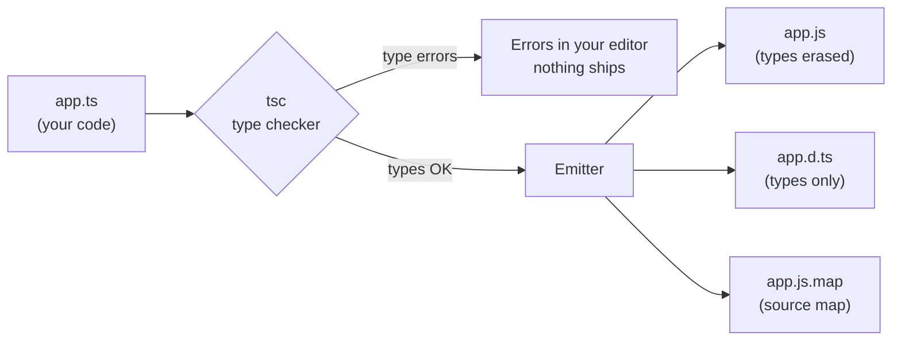

# 01 — Setup & Tooling

## Why this exists

JavaScript only finds mistakes when the code runs — often in production.
TypeScript adds a *type layer* on top of JavaScript that finds those
mistakes while you type. The types are erased at build time; what runs is
plain JavaScript.

## The compiler pipeline



*What to notice: types never reach runtime — `tsc` checks them, then throws
them away. `.d.ts` files keep the types so other code can still see them.*

## Minimal syntax

A type annotation is a colon after a name:

```ts
function add(a: number, b: number): number {
  return a + b
}
add(2, 3)      // ✅ 5
add('2', 3)    // ❌ compile error — caught before running
```

Run TypeScript directly (no compile step) with `tsx`:

```bash
npx tsx playground/demo.ts
```

Or compile with `tsc` (config comes from `tsconfig.json`):

```bash
npx tsc --noEmit     # just type-check, emit nothing
```

## tsconfig: the strict flags, one by one

`"strict": true` switches on a *family* of flags. This course also enables
extra strictness. Each one exists to kill a specific class of bug:

| Flag | What it catches | Example it rejects |
| --- | --- | --- |
| `noImplicitAny` | Parameters/values TS can't infer silently become `any` | `function f(x) {...}` |
| `strictNullChecks` | `null`/`undefined` sneaking into other types | `const s: string = null` |
| `strictFunctionTypes` | Unsound function-argument assignments | callback with wrong param type |
| `strictBindCallApply` | Wrong args to `.bind`/`.call`/`.apply` | `f.call(null, wrongType)` |
| `strictPropertyInitialization` | Class fields never assigned | `class C { name: string }` |
| `noImplicitThis` | `this` with unknown type | loose function using `this` |
| `useUnknownInCatchVariables` | Treating a caught error as `any` | `catch (e) { e.foo }` |
| `alwaysStrict` | Emits JS `"use strict"` | (safety net) |
| `noUncheckedIndexedAccess`* | Assuming `arr[i]` always exists | `arr[99].length` |
| `exactOptionalPropertyTypes`* | Writing `undefined` into an optional prop | `{x: undefined}` into `{x?: number}` |
| `noImplicitOverride`* | Silent method overrides in classes | override without `override` keyword |

\* Not part of the `strict` umbrella — enabled separately in this course.

## Declaration files & source maps (30-second version)

- **`.d.ts`** — types without code. This is how libraries ship types and
  how your editor knows `Array.prototype.map` exists. You'll author them
  in module 09.
- **Source maps** — link the emitted `.js` back to your `.ts`, so debuggers
  and stack traces show your original code.

## Common gotchas

- **TypeScript doesn't run.** `node app.ts` fails; use `tsx` or compile first.
- **Types are erased.** `if (typeof x === 'MyInterface')` can never work —
  runtime checks work on values, not types.
- **`any` is an off-switch,** not a type. Every `any` is a hole in the
  safety net. The strict flags exist to stop them appearing silently.

## Try it now

→ `exercises/ex01.ts` — start there, then ex02–ex04.
Check with `npm test -- 01`.
