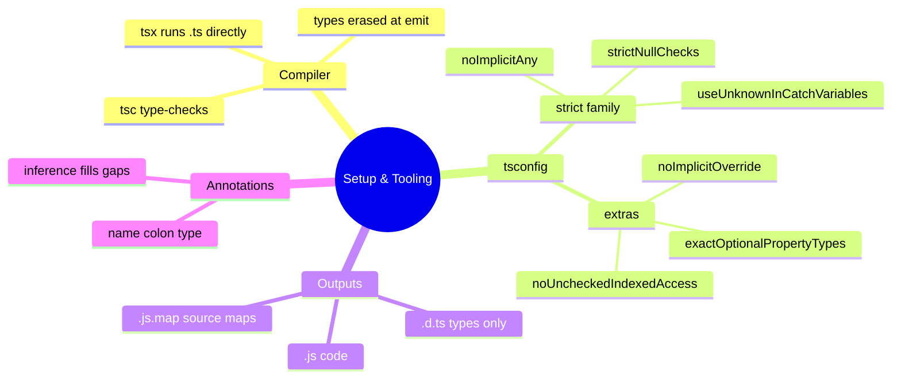

# 01 — Setup & Tooling · Cheat-sheet

## Concept map



*What to notice: two worlds — the compiler (left) checks and erases; your
annotations (bottom) are the input it checks against.*

## Key syntax

```ts
function add(a: number, b: number): number { return a + b }
const items: string[] = []
let maybe: string | null = null
```

```bash
npx tsx file.ts        # run TS directly
npx tsc --noEmit       # type-check only
```

## Rules to remember

- Types exist only at compile time; runtime sees plain JS.
- `any` disables checking — strict flags stop it appearing silently.
- With `noUncheckedIndexedAccess`, `arr[i]` is `T | undefined` — handle it
  (`??`, `if`, or `?.`).
- With `strictNullChecks`, `null`/`undefined` must be declared and handled.
- `JSON.parse` returns `any` — give it a declared shape (later: validate it).

## Gotchas

- `node app.ts` doesn't run TypeScript — use `npx tsx app.ts`.
- `Number('')` is `0`, not `NaN`.
- Optional (`x?:`) means *may be absent* — with `exactOptionalPropertyTypes`
  you can't assign `undefined` explicitly.

## Self-quiz

1. What does `tsc` do with your type annotations when emitting JS?
2. Which flag makes `list[3]` have type `T | undefined`?
3. Why can't `if (typeof x === 'User')` ever work?
4. What type does `JSON.parse` return, and why is that risky?
5. What's the difference between `x?: number` and `x: number | undefined`?
6. Which file kind carries types but no executable code?

<details><summary>Answers</summary>

1. Erases them — emitted JS has no types.
2. `noUncheckedIndexedAccess`.
3. Types are erased at runtime; `typeof` only sees runtime values.
4. `any` — it silently disables all checking on the result.
5. `?` means the property may be **absent**; `| undefined` means it must be
   present but may hold `undefined` (and with `exactOptionalPropertyTypes`
   these are truly different).
6. A declaration file, `.d.ts`.

</details>
