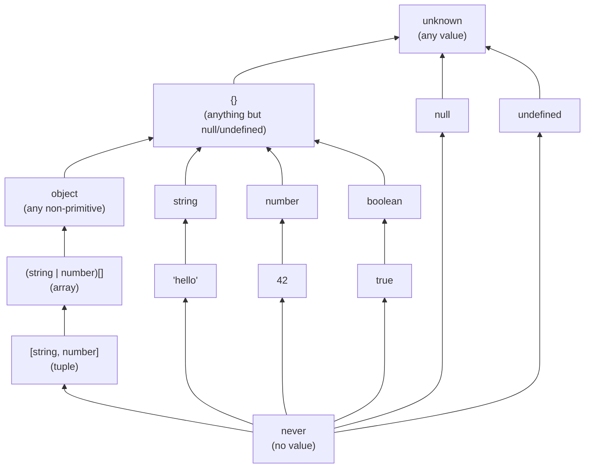
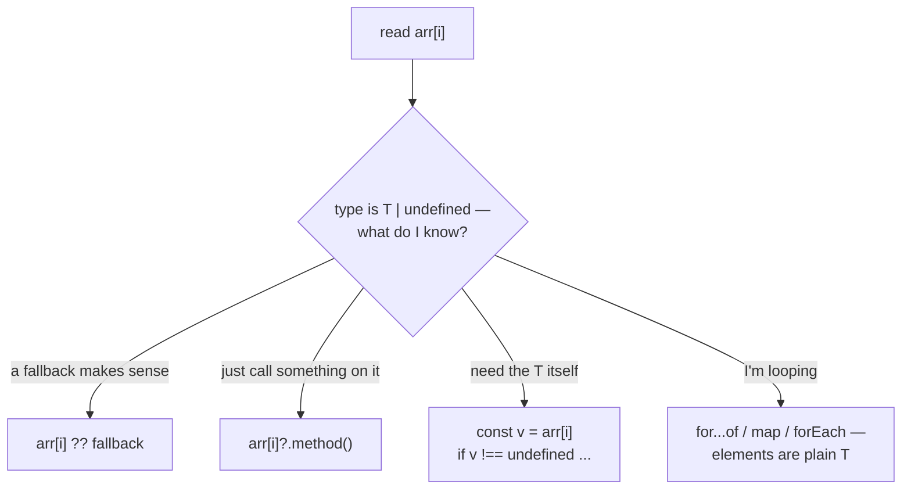
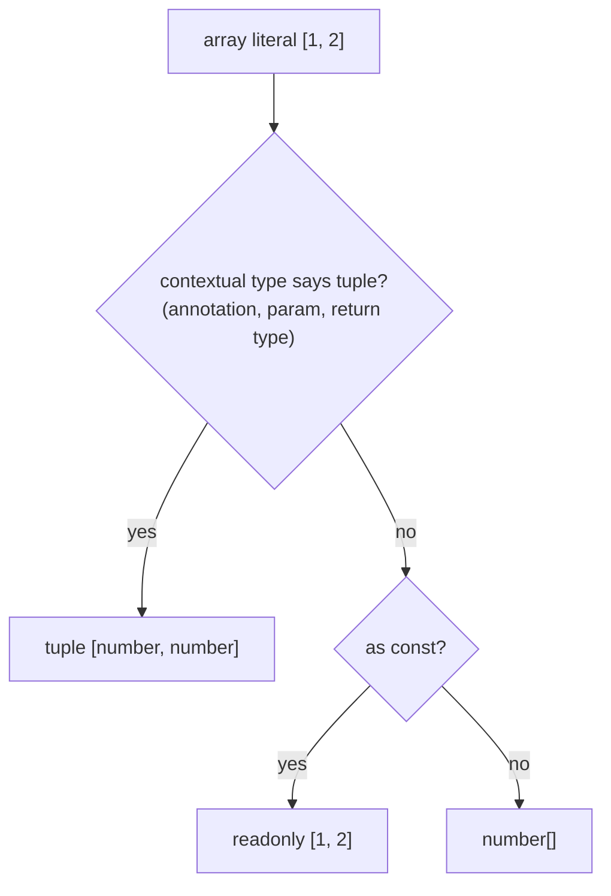
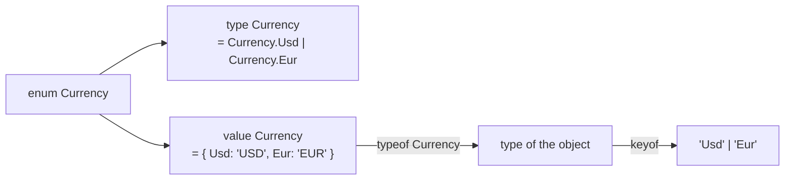
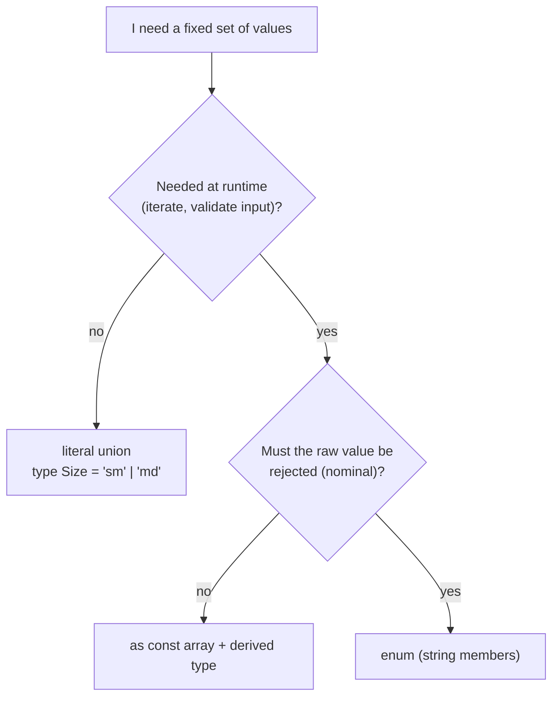
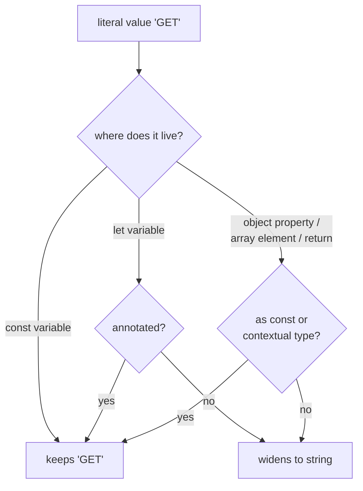
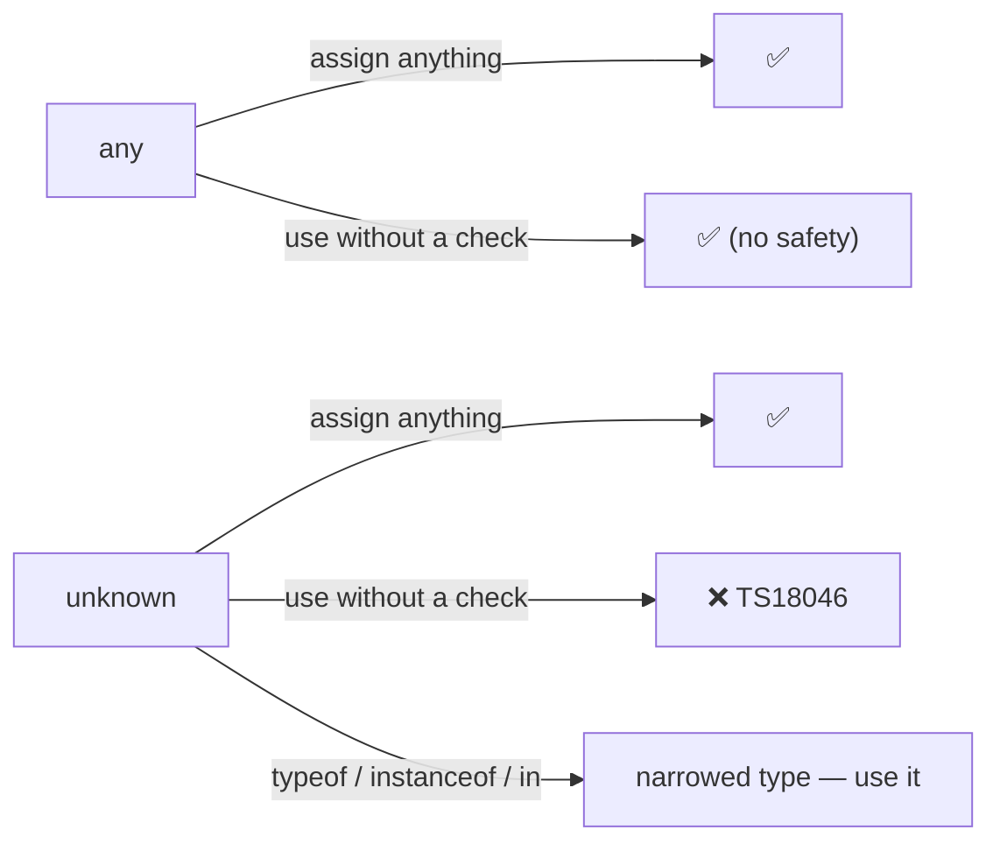
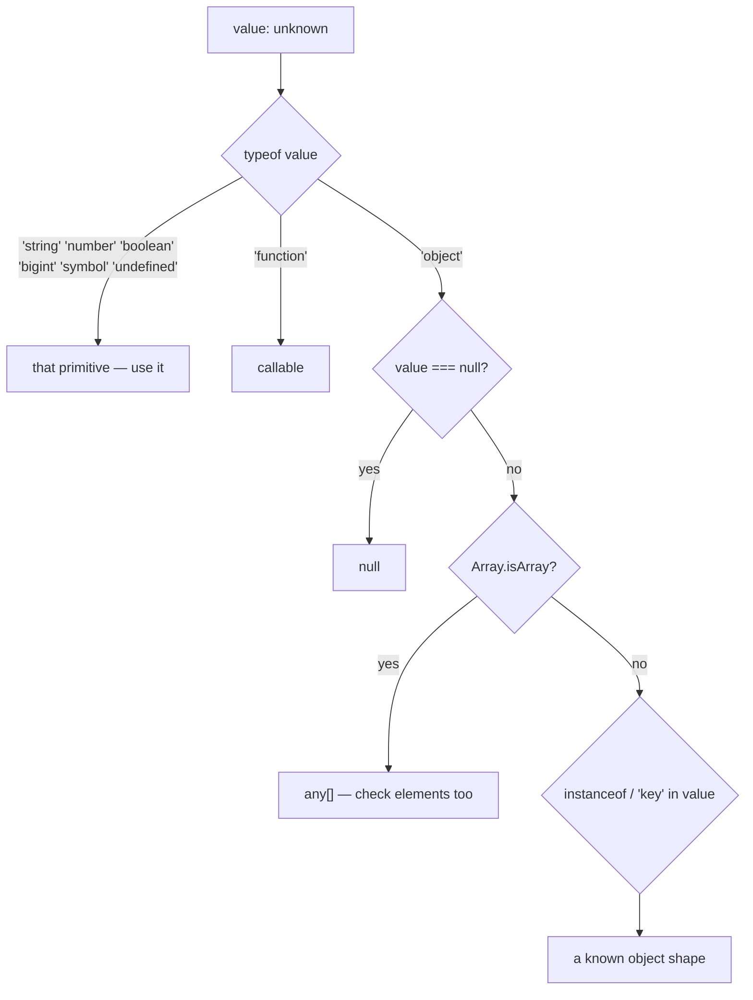
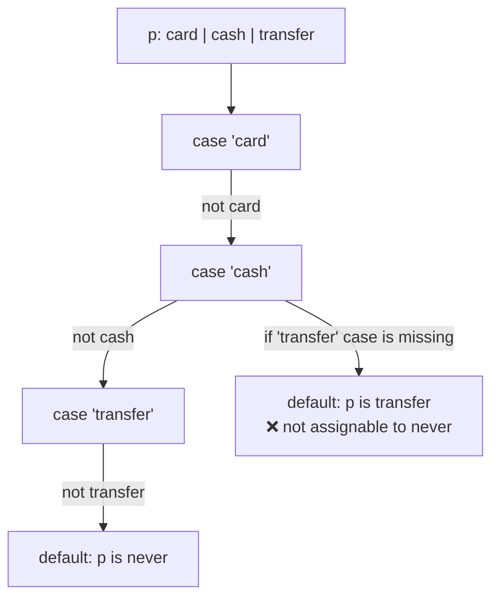
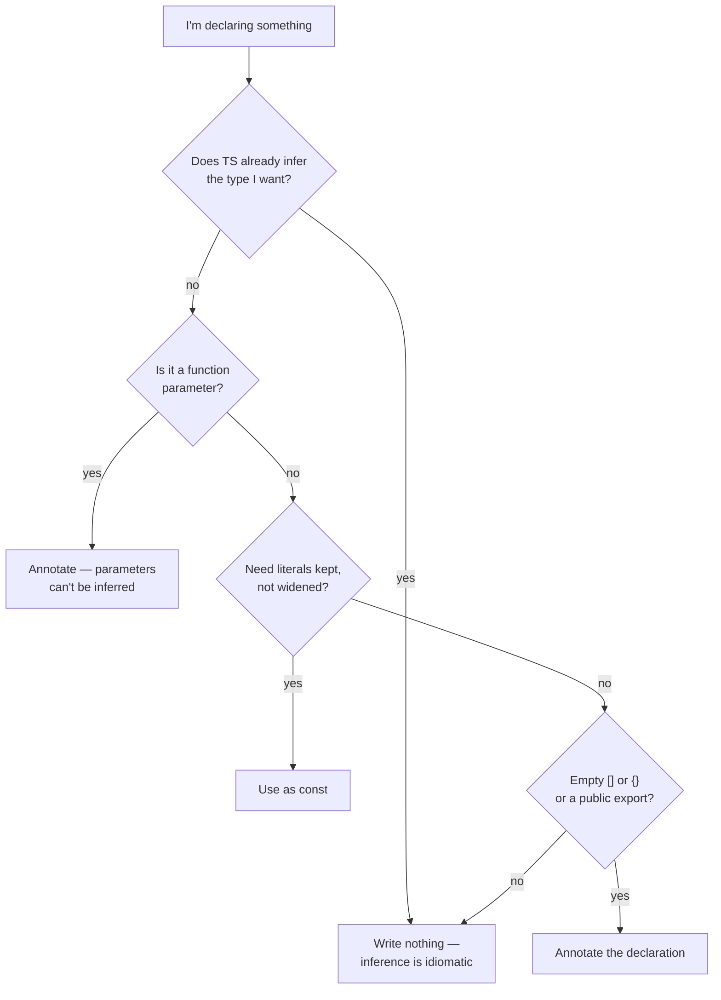

# 02 — Basics: Values and Their Types

## Why this exists

Every JavaScript value already has a type at runtime — TypeScript just
lets you *name* those types so the compiler can check them. Getting fluent
here means knowing which type TS gives a value when you don't say
anything, and how to say something when you need to. Almost every later
module builds on the small vocabulary in this one.

## The assignability hierarchy



*What to notice: an arrow means "is assignable to". `never` fits anywhere
(it has no values), everything fits into `unknown`. A tuple is a special
array, an array is an `object`, and `null`/`undefined` skip `{}` entirely.
`any` is missing on purpose — it sits outside the hierarchy and is
assignable in **both** directions, which is exactly why it's dangerous.*

## Minimal syntax

```ts
// primitives
const name: string = 'Ada'
const age: number = 36
const admin: boolean = true
const big: bigint = 10n
const id: symbol = Symbol('id')

// arrays & tuples
const tags: string[] = ['a', 'b']         // any length, one type
const entry: [string, number] = ['a', 1]  // fixed length, fixed order

// enums
enum LogLevel { Debug = 'DEBUG', Info = 'INFO' }

// literal types — a type with exactly one value
let direction: 'north' | 'south' = 'north'
```

## Map of this module

| Section | Exercise |
| --- | --- |
| The seven primitives · `null`/`undefined` · `typeof` · `string` vs `String` · `bigint`/`symbol` | ex01 |
| Arrays · readonly arrays · `arr[i]` may be missing · array of unions | ex02 |
| Tuples · optional & rest elements · named & readonly tuples · tuple inference · destructuring | ex03 |
| Enums · type and value · `const enum` · enum vs alternatives | ex04 |
| Literal types · widening · `as const` · keeping literals · assertions · `as const` vs `as T` | ex05 |
| `any` vs `unknown` · narrowing `unknown` | ex06 |
| `never` · `void` vs `undefined` · the special types table | ex07 |
| Annotation vs inference · contextual typing · `object` vs `{}` · reading errors | ex08 |
| Everything above | checkpoint |

### The seven primitives

A primitive is a value that is not an object: it has no methods of its
own and is compared by value. JavaScript has exactly seven, and each one
is a TypeScript type with the same lowercase name.

```ts
const title: string = 'Invoice #42'
const total: number = 1_250.5          // integers and floats are one type
const paid: boolean = false
const nothing: null = null
const notYet: undefined = undefined
const population: bigint = 8_100_000_000n
const token: symbol = Symbol('token')
```

| Primitive | Sample values | Notes |
| --- | --- | --- |
| `string` | `'a'`, `` `x${1}` `` | one type for all quote styles |
| `number` | `1`, `1.5`, `NaN`, `Infinity` | 64-bit float — no separate int type |
| `boolean` | `true`, `false` | equal to the union `true \| false` |
| `null` | `null` | "intentionally empty" |
| `undefined` | `undefined` | "not set" — what missing things default to |
| `bigint` | `10n`, `2n ** 64n` | arbitrary size; never mixes with `number` |
| `symbol` | `Symbol('id')` | unique, hidden-ish property keys |

Gotcha: you rarely *write* these annotations on a `const` — TS infers them
(see "Annotation vs inference"). You write them on parameters, and on
declarations whose initializer comes later.

### `null` and `undefined` are their own types

Under `strictNullChecks` (part of `strict`), `null` and `undefined` are
**not** members of every type. A `string` is always a string; if it may
be missing, the type must say so with a union.

```ts
let owner: string = 'Ada'
// ❌ error TS2322: Type 'null' is not assignable to type 'string'.
owner = null

let maybeOwner: string | null = 'Ada'
maybeOwner = null                     // ✅ the type admits it

function greet(who: string | undefined) {
  // ❌ error TS18048: 'who' is possibly 'undefined'.
  who.toUpperCase()
  return who?.toUpperCase() ?? 'stranger'   // ✅ narrow, or default
}
```

The two mean different things and the difference survives at runtime:

| | `undefined` | `null` |
| --- | --- | --- |
| Produced by | missing property, no `return`, uninitialized `let` | only when someone writes `null` |
| `typeof` | `'undefined'` | `'object'` (a historic bug) |
| `JSON.stringify` | property is dropped | property is kept as `null` |
| `== null` | true | true |
| Idiom | "absent" | "deliberately empty" |

Gotcha: `x == null` (two equals) is the one place loose equality is
idiomatic — it catches both. Everywhere else use `===`.

### `typeof` at runtime — the table and its traps

`typeof` is a JavaScript operator. It returns one of a few strings, and
TypeScript understands those strings well enough to narrow types
(module 05 goes deep). Learn the table — including its two traps.

```ts
const results = [
  typeof 'a',          // 'string'
  typeof 1,            // 'number'
  typeof 1n,           // 'bigint'
  typeof true,         // 'boolean'
  typeof undefined,    // 'undefined'
  typeof Symbol(),     // 'symbol'
  typeof (() => 1),    // 'function'
  typeof {},           // 'object'
  typeof [],           // 'object'   ← trap 1: arrays are objects
  typeof null,         // 'object'   ← trap 2: null is NOT an object
]
```

```ts
function keysOf(value: unknown) {
  if (typeof value === 'object') {
    // ❌ error TS18047: 'value' is possibly 'null'.
    return value.toString()                   // value: object | null
  }
  if (typeof value === 'object' && value !== null) {
    return Object.keys(value)                 // ✅ value: object
  }
  return []
}
```

Gotcha: TS knows both traps. `typeof x === 'object'` narrows to
`object | null`, so add `x !== null`; and use `Array.isArray(x)` to tell
arrays from other objects.

### `string`, not `String` — lowercase always

`String`, `Number`, `Boolean`, `Symbol`, `Object` (capitalized) are the
**wrapper object** interfaces — what `new String('x')` produces. They are
not the primitive types. A primitive fits into its wrapper type, but the
wrapper never fits back into the primitive, so a capitalized annotation
quietly breaks every call that expects the real thing.

```ts
const boxed: String = new String('hi')   // compiles — it's an object
// ❌ error TS2322: Type 'String' is not assignable to type 'string'.
//    'string' is a primitive, but 'String' is a wrapper object. Prefer using 'string' when possible.
const plain: string = boxed

function shout(text: string) { return text.toUpperCase() }
const label: String = 'hi'                // a primitive fits into the wrapper...
// ❌ error TS2345: Argument of type 'String' is not assignable to parameter of type 'string'.
shout(label)                              // ...but the wrapper doesn't fit back
```

| Write | Never write | Why |
| --- | --- | --- |
| `string` | `String` | wrapper object; `new String('a') === 'a'` is `false` |
| `number` | `Number` | same |
| `boolean` | `Boolean` | `new Boolean(false)` is truthy! |
| `symbol` | `Symbol` | the constructor's interface |
| `object` | `Object` | see "`object` vs `Object` vs `{}`" below |

Rule: **if it matches a `typeof` result, it is lowercase.** The capitalized
names should never appear in an annotation.

### `bigint` and `symbol`

`bigint` holds integers of any size. It is a separate type: arithmetic
with `number` is a compile error, which stops silent precision loss.

```ts
const big = 2n ** 64n
// ❌ error TS2365: Operator '+' cannot be applied to types 'bigint' and '1'.
const mixed = big + 1
const ok = big + 1n                  // ✅ bigint + bigint
const asNumber = Number(big)         // explicit conversion (may lose precision)
```

Every `Symbol()` call makes a brand-new value — two symbols with the
same description are still different. A `const` holding a symbol gets
a **`unique symbol`** type: a type with exactly one value, which TS
tracks by name.

```ts
const KEY = Symbol('key')            // type: typeof KEY (a unique symbol)
const OTHER = Symbol('key')
// ❌ error TS2367: This comparison appears to be unintentional because the types 'typeof KEY' and 'typeof OTHER' have no overlap.
KEY === OTHER
const generic: symbol = KEY          // ✅ widens to plain symbol

const invoice = { id: 1, [KEY]: 'internal note' }
invoice[KEY]                         // 'internal note'
Object.keys(invoice)                 // ['id'] — symbol keys are skipped
JSON.stringify(invoice)              // '{"id":1}' — and not serialized
```

Gotcha: `unique symbol` only exists on `const` declarations and
`readonly static` class fields. A `let` symbol is just `symbol`.

### Arrays: `T[]` and `Array<T>`

An array type says "any number of elements, all of type `T`". The two
spellings are identical; `T[]` is the idiom, `Array<T>` reads better
when `T` is long or a union.

```ts
const scores: number[] = [90, 85]
const names: Array<string> = ['Ada', 'Grace']       // same as string[]
const grid: number[][] = [[1, 2], [3, 4]]
const cells: Array<string | number> = ['a', 1]      // clearer than (string | number)[]

// ❌ error TS2345: Argument of type 'string' is not assignable to parameter of type 'number'.
scores.push('100')
scores.push(100)                                    // ✅
```

Gotcha: `T[]` binds tightly. `string | number[]` is "a string, or an
array of numbers". Wrap the union: `(string | number)[]`.

### Readonly arrays

`readonly T[]` (or `ReadonlyArray<T>`) removes every mutating method
from the type. Use it for parameters — it is a promise to callers that
you won't touch their array — and for shared constants.

```ts
const days: readonly string[] = ['mon', 'tue']
// ❌ error TS2339: Property 'push' does not exist on type 'readonly string[]'.
days.push('wed')
// ❌ error TS2542: Index signature in type 'readonly string[]' only permits reading.
days[0] = 'sun'

const longer = [...days, 'wed']                     // ✅ copies are fresh string[]
const upper = days.map((d) => d.toUpperCase())      // ✅ non-mutating methods stay

function total(values: readonly number[]) {         // "I won't mutate this"
  return values.reduce((sum, v) => sum + v, 0)
}
const mutable: number[] = [1, 2]
total(mutable)                                      // ✅ mutable → readonly is fine
```

```ts
const frozen: readonly number[] = [1, 2]
// ❌ error TS4104: The type 'readonly number[]' is 'readonly' and cannot be assigned to the mutable type 'number[]'.
const thawed: number[] = frozen
```

Gotcha: `readonly` is compile-time only. The array can still be mutated
by anyone holding a `number[]` reference to it — use `Object.freeze` if
you need the runtime guarantee.

### `arr[i]` may be missing

An array type describes the *elements*, not that index `i` exists. This
course enables `noUncheckedIndexedAccess`, so every index read is
`T | undefined` — you must handle the miss.

```ts
const queue: string[] = ['build', 'test']

// ❌ error TS2532: Object is possibly 'undefined'.
queue[0].toUpperCase()

const first = queue[0]                  // type: string | undefined
// ❌ error TS18048: 'first' is possibly 'undefined'.
first.toUpperCase()

queue[0]?.toUpperCase()                 // ✅ optional chaining
const job = queue[0] ?? 'idle'          // ✅ default value
const last = queue.at(-1)               // string | undefined — .at() was always honest
for (const item of queue) item.toUpperCase()   // ✅ iteration yields plain string
if (first !== undefined) first.toUpperCase()   // ✅ narrowed
```



*What to notice: `?.` and `??` cover most cases; a length check does
**not** narrow an index read, only checking the element itself does.*

### Array of unions vs union of arrays

`(A | B)[]` is one array whose elements may each be `A` or `B`.
`A[] | B[]` is *either* an all-`A` array *or* an all-`B` array. The
difference matters at the call site.

```ts
const mixed: (string | number)[] = ['a', 1, 'b']      // ✅ any mix
const uniform: string[] | number[] = ['a', 'b']       // ✅ all one kind
// ❌ error TS2322: Type '(string | number)[]' is not assignable to type 'string[] | number[]'.
const wrong: string[] | number[] = ['a', 1]
```

Gotcha: methods on `A[] | B[]` used to be hard to call; since TS 5.2
`.map`, `.filter` and friends work on a union of arrays and give the
element union.

### Tuples: fixed length, fixed order

A tuple is an array type where each **position** has its own type and
the length is known. Use it for "a pair of coordinates", "a return of
two things", or a database row.

```ts
type Coordinate = [number, number]
const home: Coordinate = [51.5, -0.12]
const lat = home[0]                 // number — NOT number | undefined: TS knows slot 0 exists

// ❌ error TS2322: Type '[number, number, number]' is not assignable to type 'Coordinate'.
const bad: Coordinate = [1, 2, 3]
// ❌ error TS2493: Tuple type 'Coordinate' of length '2' has no element at index '2'.
home[2]
```

Gotcha: at runtime a tuple is a plain array, and `home.push(3)` still
compiles — `push` accepts `number`. If the tuple must never grow, make
it `readonly` (below).

### Optional and rest elements

`?` marks trailing slots that may be absent; `...T[]` marks a stretch of
any length. Optional slots change the `length` type; rest elements make
it `number`.

```ts
type Semver = [major: number, minor: number, patch?: number]
const v1: Semver = [5, 9]
const v2: Semver = [5, 9, 3]
const patch = v2[2]                 // number | undefined
const len: 2 | 3 = v1.length        // ✅ the length type follows the optional slot
// ❌ error TS2322: Type '2 | 3' is not assignable to type '2'.
const exact: 2 = v1.length
```

```ts
type Series = [label: string, ...values: number[]]
const temps: Series = ['temps', 21.5, 22.1, 19.8]
const empty: Series = ['none']                        // ✅ the rest may be empty
const howMany: number = temps.length                  // length is just number

type Trailing = [...values: number[], unit: string]   // leading rest
type Framed = [start: string, ...middle: number[], end: string]   // rest in the middle
const framed: Framed = ['begin', 1, 2, 3, 'end']
```

Gotcha: an optional element must come after all required ones, and only
one rest element is allowed. `[a?: number, b: number]` is an error.

### Named tuple members and readonly tuples

Names document what each slot means. They are labels only — they do not
create properties, and destructuring still uses positions. `readonly`
freezes the tuple: no writes, no `push`, no `pop`.

```ts
type Range = [start: number, end: number]        // hover shows the names
const r: Range = [0, 10]

const pair: readonly [string, number] = ['a', 1]
// ❌ error TS2540: Cannot assign to '0' because it is a read-only property.
pair[0] = 'b'
// ❌ error TS2339: Property 'push' does not exist on type 'readonly [string, number]'.
pair.push(2)
```

Gotcha: a `readonly [string, number]` is not assignable to
`[string, number]` — same rule as arrays. Prefer `readonly` on
parameters so both kinds can be passed in.

### Tuple inference: why `[1, 2]` is `number[]`

An array literal infers as an **array**, never a tuple — TS assumes you
may push later. This bites when a function returns a pair: the caller
gets a union-element array and loses the positions.

```ts
function useCounter() {
  let count = 0
  return [count, (n: number) => { count = n }]     // (number | ((n: number) => void))[]
}
const [value, setValue] = useCounter()             // both sides get the union
// ❌ error TS2349: This expression is not callable.
setValue(1)
```

Three ways to keep the positions:

```ts
function annotated(): [number, (n: number) => void] {   // 1. annotate the return
  let count = 0
  return [count, (n) => { count = n }]
}
function frozen() {
  let count = 0
  return [count, (n: number) => { count = n }] as const  // 2. as const → readonly tuple
}
const literal: [number, number] = [1, 2]                 // 3. annotate the variable
const [count, setCount] = annotated()
setCount(count + 1)                                      // ✅
```



*What to notice: TS only produces a tuple when something *asks* for one.
No context, no `as const` → plain array.*

### Destructuring tuples

Destructuring gives each position its own type, and a rest pattern
collects the tail as an array. Parameters can destructure too.

```ts
type Coordinate = [number, number]
const start: Coordinate = [3, 4]
const [x, y] = start                    // x: number, y: number

type Series = [label: string, ...values: number[]]
const series: Series = ['temps', 21, 22]
const [label, ...values] = series       // label: string, values: number[]

function manhattan([ax, ay]: Coordinate, [bx, by]: Coordinate) {
  return Math.abs(ax - bx) + Math.abs(ay - by)
}
manhattan(start, [0, 0])                // 7
```

Gotcha: destructuring a plain `number[]` gives `number | undefined` per
slot (strict indexing again). If you know the shape, make it a tuple.

### Enums: numeric and string

An `enum` names a fixed set of values and — unlike everything else in
this module — it also **exists at runtime** as an object. Numeric
members auto-increment from `0` (or from the first explicit value);
string members must all be explicit.

```ts
enum Weekday { Mon, Tue, Wed }              // 0, 1, 2
enum Priority { Low = 1, Medium, High }     // 1, 2, 3 — increments continue
enum Perm { Read = 1 << 0, Write = 1 << 1, Exec = 1 << 2 }   // bit flags: 1, 2, 4

enum Format { Json = 'json', Text = 'text' }
const f: Format = Format.Json               // ✅
// ❌ error TS2322: Type '"json"' is not assignable to type 'Format'.
const g: Format = 'json'
```

Numeric enums get a **reverse mapping** — the object maps names to
numbers *and* numbers back to names. String enums do not.

```ts
enum Weekday { Mon, Tue, Wed }
Weekday.Tue                     // 1
Weekday[1]                      // 'Tue' — reverse mapping
Object.keys(Weekday)            // ['0', '1', '2', 'Mon', 'Tue', 'Wed']  ← both directions!

enum Format { Json = 'json', Text = 'text' }
Object.keys(Format)             // ['Json', 'Text'] — no reverse entries
```

Gotcha: `Object.keys(NumericEnum).length` is *twice* the member count.
To iterate the names, filter with `isNaN(Number(key))` — or use a
literal union instead (see the comparison below).

### Enum as a type and as a value

An enum name works in both worlds: as a **type** it means "one of the
members"; as a **value** it is the runtime object. `keyof typeof Enum`
gives you the member *names* as a literal union.

```ts
enum Currency { Usd = 'USD', Eur = 'EUR' }

function convert(amount: number, to: Currency) {        // type position
  return `${amount} ${to}`
}
convert(10, Currency.Eur)                               // value position

type CurrencyName = keyof typeof Currency               // 'Usd' | 'Eur'
const codes = Object.values(Currency)                   // Currency[] → ['USD', 'EUR']
```



*What to notice: `typeof Currency` is the type of the runtime object, not
the enum type — you need it to reach the member names.*

### `const enum`, computed and heterogeneous members

A `const enum` is erased: each use is replaced by its literal value at
compile time, so no object exists at runtime and you cannot iterate it.
Numeric enums may compute members from expressions; string enums
cannot. Mixing numbers and strings ("heterogeneous") is legal and
almost always a mistake.

```ts
const enum Axis { X, Y }
const a = Axis.X                          // emitted as: 0 /* Axis.X */
// ❌ error TS2475: 'const' enums can only be used in property or index access expressions or the right hand side of an import declaration or export assignment or type query.
Object.keys(Axis)

enum FileSize { Kb = 1024, Mb = Kb * 1024, LabelLength = 'MB'.length }   // computed OK
enum Mixed { No = 0, Yes = 'YES' }        // heterogeneous — compiles, avoid

enum Level {
  Low = 'low',
  // ❌ error TS18033: Type 'string' is not assignable to type 'number' as required for computed enum member values.
  High = 'HIGH'.toLowerCase(),
}
```

Gotcha: `const enum` breaks with `isolatedModules`/single-file
transpilers (`tsx`, esbuild, Babel) because they cannot see the enum
across files. Modern advice: don't use it.

### Enum vs `const enum` vs literal union vs `as const` object

| | `enum` | `const enum` | literal union | `as const` object/array |
| --- | --- | --- | --- | --- |
| Exists at runtime | ✅ (an object) | ❌ (inlined) | ❌ (type only) | ✅ (a plain object) |
| Reverse mapping (`E[0]`) | numeric only | ❌ | ❌ | ❌ |
| Iterable at runtime | ✅ (with the reverse-mapping noise) | ❌ | ❌ | ✅ (`Object.values`, `for...of`) |
| Accepts the raw value | ❌ (`'json'` ≠ `Format.Json`) | ❌ | ✅ | ✅ |
| Nominal (only members fit) | ✅ | ✅ | ❌ | ❌ |
| Works in plain JS callers | ✅ | ❌ | ✅ | ✅ |
| Extra syntax to learn | yes | yes | no | `as const` + one type line |
| Idiomatic today | sometimes | rarely | ✅ | ✅ |

The modern replacement pattern — one runtime list, one derived type:

```ts
const SIZES = ['sm', 'md', 'lg'] as const           // readonly ['sm', 'md', 'lg']
type Size = (typeof SIZES)[number]                  // 'sm' | 'md' | 'lg'

function isSize(input: string): boolean {
  return SIZES.some((s) => s === input)             // runtime check, no enum needed
}
let chosen: Size = 'md'                             // ✅ raw literal is fine
// ❌ error TS2322: Type '"xl"' is not assignable to type '"sm" | "md" | "lg"'.
chosen = 'xl'                                       // Size is shown expanded

const HTTP = { Ok: 200, NotFound: 404 } as const
type HttpCode = (typeof HTTP)[keyof typeof HTTP]    // 200 | 404
```

`(typeof X)[number]` and `keyof` are indexed-access types — module 08
explains the mechanics. For now, memorize the two lines.



*What to notice: the literal union is the default; reach for the
`as const` list when you need a runtime array; `enum` only when the
nominal wall is the point.*

### Literal types

A literal type has exactly one value: `'md'` is a type whose only
member is the string `'md'`. Unions of literals give you an exact
vocabulary the compiler can check, with zero runtime cost.

```ts
let size: 'sm' | 'md' | 'lg' = 'md'
size = 'lg'                                 // ✅
// ❌ error TS2322: Type '"xl"' is not assignable to type '"sm" | "md" | "lg"'.
size = 'xl'

type Dice = 1 | 2 | 3 | 4 | 5 | 6           // number literals
type Enabled = true                         // boolean literal (boolean itself is true | false)
type Method = 'GET' | 'POST'

function request(method: Method, path: `/${string}`) {}   // template literal — module 08
request('GET', '/users')
// ❌ error TS2345: Argument of type '"users"' is not assignable to parameter of type '`/${string}`'.
request('GET', 'users')
```

Gotcha: autocomplete works on literal unions. If your editor offers you
the options, you've got the type right.

### Widening: `let` vs `const`, properties, returns

TS keeps a literal type only where the value **cannot change**. A
`const` keeps `'GET'`; a `let` could be reassigned, so it widens to
`string`. Object properties and array elements are mutable, so they
widen too — even inside a `const`. Return values widen unless the
signature says otherwise.

```ts
const method = 'GET'                    // 'GET'
let verb = 'GET'                        // string — could be reassigned
let copy = method                       // string — copying into a let widens again

const req = { method: 'GET' }           // { method: string } — properties widen
const list = ['GET', 'POST']            // string[] — elements widen

function pick() { return 'GET' }        // return type: string
const pickConst = () => 'GET' as const  // 'GET'

let kept: 'GET' | 'POST' = 'GET'        // ✅ an annotation stops widening on a let
```



*What to notice: mutability is the trigger. Anything that could be
overwritten later widens, unless you pin it.*

### `as const`

`as const` tells TS "treat this exactly as written": every literal stays
a literal, every array becomes a readonly tuple, every property becomes
`readonly` — all the way down.

```ts
const config = { retries: 3, mode: 'fast', tags: ['a', 'b'] } as const
// type: { readonly retries: 3; readonly mode: 'fast'; readonly tags: readonly ['a', 'b'] }

// ❌ error TS2540: Cannot assign to 'retries' because it is a read-only property.
config.retries = 4
// ❌ error TS2339: Property 'push' does not exist on type 'readonly ["a", "b"]'.
config.tags.push('c')

const status = { state: 'active' as const, id: 1 }   // pin just one property
// type: { state: 'active'; id: number }
```

Gotcha: `as const` only works on literals (`'x'`, `1`, `[...]`, `{...}`),
not on variables or calls — `someString as const` is an error. And it
is compile-time only: nothing is frozen at runtime.

### When literals get lost, and how to keep them

The classic bug: you build an options object, then pass a property to a
function that wants a literal union — and the property already widened.

```ts
function send(method: 'GET' | 'POST') {}

const opts = { method: 'POST' }                       // method: string
// ❌ error TS2345: Argument of type 'string' is not assignable to parameter of type '"GET" | "POST"'.
send(opts.method)

const pinned = { method: 'POST' } as const            // 1. as const
send(pinned.method)                                   // ✅

const typed: { method: 'GET' | 'POST' } = { method: 'POST' }   // 2. annotation
send(typed.method)                                    // ✅

const checked = { method: 'POST' } satisfies { method: 'GET' | 'POST' }   // 3. satisfies
send(checked.method)                                  // ✅ checked AND literal kept
```

| Tool | Keeps literals | Checks against a type | Adds `readonly` | Module |
| --- | --- | --- | --- | --- |
| annotation `: T` | only what `T` names | ✅ | no | here |
| `as const` | all of them | no | yes, deeply | here |
| `satisfies T` | all of them | ✅ | no | 08 |

### Type assertions: `as`, `<T>`, `!`, double assertion

An assertion changes what the compiler *believes*, not what the value
*is*. Nothing is converted, nothing is checked at runtime. Reach for it
only when you know something the compiler cannot.

```ts
const raw: unknown = JSON.parse('{"id": 7}')
const rec = raw as { id: number }              // "trust me" — the idiom
const rec2 = <{ id: number }>raw               // same thing, old syntax — clashes with JSX, avoid

const cache = new Map<string, string>([['a', 'Ada']])
const forced = cache.get('a')!                 // string — `!` strips null/undefined
```

The compiler only lets you assert between types that **sufficiently
overlap**. When they don't, `as unknown as T` is the escape hatch — and
a loud signal that you are lying.

```ts
const count: string = 'ten'
// ❌ error TS2352: Conversion of type 'string' to type 'number' may be a mistake because neither type sufficiently overlaps with the other. If this was intentional, convert the expression to 'unknown' first.
const n = count as number
const forcedN = count as unknown as number     // compiles — and is a lie
```

`as` is **not** a cast. It can make a wrong type look right, and the
crash moves to runtime:

```ts
const empty = {} as { id: number }
empty.id.toFixed()      // compiles; throws at runtime: cannot read 'toFixed' of undefined
```

Gotcha: an `as` can also *widen* silently. `'north' as Direction` turns
a literal into the whole union, so a wrong mapping still compiles. That
is the next section.

### `as const` vs `as T` — narrows-and-checks vs overrides

They share a keyword and nothing else. `as const` makes the type *more*
precise and leaves every check in place. `as T` replaces the type with
whatever you said, and the compiler stops looking.

```ts
type Method = 'GET' | 'POST'
const table = {
  read: 'GET' as Method,       // type Method — the literal is gone
  write: 'PUT' as Method,      // compiles! 'PUT' is not a Method, nobody noticed
}

const checkedTable = {
  read: 'GET' as const,        // type 'GET' — still a literal
  write: 'PUT' as const,       // type 'PUT'
}
function call(method: Method) {}
call(checkedTable.read)        // ✅ 'GET' is a Method
// ❌ error TS2345: Argument of type '"PUT"' is not assignable to parameter of type 'Method'.
call(checkedTable.write)       // the mistake surfaces exactly where it matters
```

| | `as const` | `as T` |
| --- | --- | --- |
| Direction | narrows (to the literal) | overrides (to `T`) |
| Still checked later | ✅ | ❌ — you claimed `T`, TS believes you |
| Can hide a wrong value | ❌ | ✅ (`'PUT' as Method` compiles) |
| Adds `readonly` | ✅ deeply | ❌ |
| Runtime effect | none | none |
| Use when | you want exact literals | you truly know more than TS |

Rule of thumb: **`as const` narrows and stays checked; `as SomeType`
overrides the checker.** If you reach for `as T` to make an error go
away, stop — the error was probably right.

### `any` vs `unknown`

`any` switches checking off: you can read, call and assign anything,
and mistakes surface at runtime. `unknown` is the safe "I don't know
yet": it accepts every value, but you must **prove** what it is before
using it. Values from the outside world — `JSON.parse`, network, user
input, `catch` — deserve `unknown`.

```ts
const loose = JSON.parse('{"ok": true}')     // any — JSON.parse's return type
loose.does.not.exist                         // compiles, crashes at runtime

const input: unknown = JSON.parse('{"ok": true}')
// ❌ error TS18046: 'input' is of type 'unknown'.
input.ok
if (typeof input === 'object' && input !== null && 'ok' in input) {
  input.ok                                   // ✅ narrowed step by step
}
```

Where `any` sneaks in — and what `strict` does about it:

```ts
// ❌ error TS7006: Parameter 'row' implicitly has an 'any' type.
function parseRow(row) {
  return row.split(',')
}

function collect() {
  // ❌ error TS7034: Variable 'found' implicitly has type 'any[]' in some locations where its type cannot be determined.
  const found = []                           // evolving any[] ...
  // ❌ error TS7005: Variable 'found' implicitly has an 'any[]' type.
  return found                               // ... reported where it is read
}
```



*What to notice: both accept everything. Only `unknown` makes you earn
the right to use it.*

### Narrowing `unknown`

You narrow `unknown` with runtime checks. TS follows each check and
shrinks the type inside the branch.



*What to notice: `'object'` is where the work is — three more checks
separate `null`, arrays and real objects.*

```ts
function summarize(value: unknown): string {
  if (typeof value === 'string') return `text(${value.length})`
  if (typeof value === 'number') return value.toFixed(2)
  if (value instanceof Date) return value.toISOString()
  if (Array.isArray(value)) return `list(${value.length})`
  if (typeof value === 'object' && value !== null && 'id' in value) {
    return `entity ${String(value.id)}`       // value: object & Record<'id', unknown>
  }
  return 'something else'
}
```

The same rule applies to `catch` — you can `throw` anything in JS, so
the caught value is `unknown`:

```ts
try {
  JSON.parse('{')
} catch (err) {
  // ❌ error TS18046: 'err' is of type 'unknown'.
  console.log(err.message)
  if (err instanceof Error) console.log(err.message)     // ✅
}
```

Gotcha: `Array.isArray` narrows to `any[]`, not `unknown[]`. Check the
elements too before trusting them.

### `never`

`never` is the type with **no values**. It appears when something can't
happen: a function that always throws or loops forever never returns; a
union with every member removed is empty; an impossible intersection
collapses. Its superpower is proving a `switch` handled everything.

```ts
function fail(message: string): never {      // never returns normally
  throw new Error(message)
}
function serveForever(): never {
  while (true) {}
}
const crash = () => { throw new Error('x') }   // inferred: () => never
function crashDecl() { throw new Error('x') }  // inferred: () => void — declarations infer void

type Sizes = 'sm' | 'md' | never             // 'sm' | 'md' — never vanishes from unions
type Impossible = string & number            // never — no value is both

function useNever(n: never) {
  const s: string = n                        // ✅ never is assignable to everything
}
let blocked: never
// ❌ error TS2322: Type '1' is not assignable to type 'never'.
blocked = 1                                  // nothing is assignable to never
```

The exhaustiveness pattern (module 05 explains discriminated unions;
here you only need the shape):

```ts
type Payment =
  | { kind: 'card'; last4: string }
  | { kind: 'cash' }
  | { kind: 'transfer'; iban: string }

function unreachable(value: never): never {
  throw new Error(`Unhandled case: ${JSON.stringify(value)}`)
}

function describePayment(p: Payment): string {
  switch (p.kind) {
    case 'card': return `card ending ${p.last4}`
    case 'cash': return 'cash'
    case 'transfer': return `transfer to ${p.iban}`
    default: return unreachable(p)            // p is never here — every case handled
  }
}
```

```ts continue
function incomplete(p: Payment): string {
  switch (p.kind) {
    case 'card': return 'card'
    case 'cash': return 'cash'
    // ❌ error TS2345: Argument of type '{ kind: "transfer"; iban: string; }' is not assignable to parameter of type 'never'.
    default: return unreachable(p)            // one case missing → p is not never
  }
}
```



*What to notice: each `case` subtracts from the union. Only when nothing
is left does `p` become `never` and the call compile.*

Gotcha: `never` also appears in **error messages** as a symptom — "Type
'X' is not assignable to type 'never'" usually means TS proved a branch
unreachable, or an intersection collapsed. Read it as "you handled this
already, or these types contradict".

### `void` vs `undefined`

`void` as a return type means "the result is meaningless — don't use
it". `undefined` is a real value. A function *declared* `: void` may not
return a value; but a function *type* `() => void` accepts a callback
that returns anything, because the caller promises to ignore it.

```ts
function logLine(text: string): void {
  console.log(text)
}
const result = logLine('x')                  // type: void — nothing to use
// ❌ error TS2322: Type 'void' is not assignable to type 'undefined'.
const u: undefined = logLine('x')

function bad(): void {
  // ❌ error TS2322: Type 'number' is not assignable to type 'void'.
  return 42
}

type Callback = () => void
const cb: Callback = () => 42                // ✅ allowed — the return is ignored
const ids: number[] = []
const source = [1, 2, 3]
source.forEach((n) => ids.push(n))           // ✅ push returns number; forEach wants void
```

| | `void` | `undefined` |
| --- | --- | --- |
| Means | "ignore the result" | the value `undefined` |
| `function f(): T { }` with no `return` | ✅ | ✅ since TS 5.1 |
| `function f(): T { return 42 }` | ❌ | ❌ |
| `const cb: () => T = () => 42` | ✅ (return ignored) | ❌ |
| Assignable to the other | `undefined` → `void` ✅ | `void` → `undefined` ❌ |
| Use it for | procedures and callback types | a value that may be absent |

Gotcha: `forEach`, event listeners and `Promise.then` callbacks are all
typed `=> void`. That is why `arr.forEach((x) => set.add(x))` compiles
even though `add` returns the set. Module 04 revisits this.

### The special types, side by side

| | `any` | `unknown` | `never` | `void` | `undefined` |
| --- | --- | --- | --- | --- | --- |
| Means | "stop checking" | "some value, unknown type" | "no value can exist" | "nothing to use" | the value `undefined` |
| Assign anything **to** it | ✅ | ✅ | ❌ | only `undefined`/`void` | only `undefined` |
| Assign it **to** anything | ✅ (danger) | ❌ only `unknown`/`any` | ✅ | ❌ | only under unions with it |
| Use without checking | ✅ | ❌ must narrow | — | — | — |
| Appears when | implicit any, `JSON.parse` | `catch (e)`, safe inputs | exhaustive `default`, `throw` functions | procedure returns | missing props, `arr[i]`, no `return` |
| Reach for it | almost never | outside-world input | exhaustiveness proofs | procedure return type | "may be absent" unions |

### Annotation vs inference

TypeScript infers most types from the value. Annotate when inference
cannot see the value (parameters), when the initial value is empty
(`[]`, `{}`), or when the type is a public promise (exported functions).
Rule of thumb: **inputs annotated, outputs inferred.**

```ts
const port = 3000                       // number
const host = 'localhost'                // 'localhost'
const tags = ['a', 'b']                 // string[]
const user = { id: 1, name: 'Ada' }     // { id: number; name: string }
function double(n: number) {            // parameter: must annotate
  return n * 2                          // return: inferred number
}
const lengths = tags.map((t) => t.length)   // t: string (contextual), result number[]
```

```ts
const cache = {}                        // type {} — no known properties
// ❌ error TS2339: Property 'hits' does not exist on type '{}'.
cache.hits = 1
const counters: Record<string, number> = {}   // ✅ say what will go in
counters.hits = 1
```



*What to notice: annotation is the exception, not the rule — parameters
always need it, everything else usually doesn't.*

### Contextual typing (preview)

When a value sits where a type is already expected — a callback
parameter, an annotated variable, an argument — TS reads the expected
type *inward*. That is why callback parameters need no annotation, and
why annotating a variable keeps literals inside it.

```ts
type Handler = (event: { type: string; at: number }) => void
const onEvent: Handler = (event) => console.log(event.type)   // event typed from Handler

const methods: ('GET' | 'POST')[] = ['GET']    // literal kept: the context asked for it
const ids = [1, 2, 3].filter((n) => n > 1)     // n: number from the array
```

Gotcha: context flows from the annotation to the value, never sideways.
`const evt = { type: 'x', at: 1 }; onEvent(evt)` still works — but
`evt.type` is `string`, because `evt` was inferred before the call.

### `object` vs `Object` vs `{}`

| Type | Accepts | Rejects | Use it? |
| --- | --- | --- | --- |
| `object` | arrays, functions, class instances, plain objects | every primitive, `null`, `undefined` | ✅ "any non-primitive" |
| `{}` | everything except `null`/`undefined` (primitives too!) | `null`, `undefined` | rarely — it means "non-nullish", not "object" |
| `Object` | same as `{}` in practice | `null`, `undefined` | ❌ legacy wrapper interface |

```ts
let a: object = { x: 1 }             // ✅
let b: {} = 'text'                   // ✅ primitives are "not nullish"
// ❌ error TS2322: Type 'string' is not assignable to type 'object'.
let c: object = 'text'
// ❌ error TS2322: Type 'null' is not assignable to type '{}'.
let d: {} = null
```

Gotcha: `{}` reads like "empty object" but means "anything non-nullish".
For "a plain object with unknown keys" write `Record<string, unknown>`.

### Reading compiler errors

Each code has a fixed shape. Learn to read the shape and the fix is
usually obvious.

| Code | Message shape | It is telling you |
| --- | --- | --- |
| TS2322 | Type 'X' is not assignable to type 'Y'. | the value's type `X` doesn't fit the declared `Y` (assignment, return, initializer) |
| TS2345 | Argument of type 'X' is not assignable to parameter of type 'Y'. | same, at a call site — check argument order and literal widening |
| TS7006 | Parameter 'p' implicitly has an 'any' type. | annotate the parameter |
| TS7005 | Variable 'v' implicitly has an 'any[]' type. | give the empty array a type |
| TS18046 | 'v' is of type 'unknown'. | narrow before use |
| TS18048 | 'v' is possibly 'undefined'. | a named value may be missing — `?.`, `??`, or an `if` |
| TS2532 | Object is possibly 'undefined'. | same, for an expression like `arr[0]` |
| TS2339 | Property 'p' does not exist on type 'T'. | wrong shape, typo, or a readonly array's `push` |
| TS2540 | Cannot assign to 'p' because it is a read-only property. | `readonly` or `as const` is doing its job |
| TS2352 | Conversion of type 'X' to type 'Y' may be a mistake... | your `as` is too far a stretch |

When a message has a long "Types of property ... are incompatible" tail,
read from the **bottom** — the last line names the exact mismatch.

### How it shows up at runtime

Types are erased. Only a few of this module's features leave a trace.

| Feature | At runtime |
| --- | --- |
| annotations, literal types, tuples, `readonly`, `as`, `as const`, `satisfies`, `unique symbol` | gone — plain JS values |
| `enum` | an object (numeric ones with reverse entries) |
| `const enum` | gone — each use inlined as a literal |
| `typeof x` | the JS operator — reports the runtime kind, never your type |
| `Object.keys` / `JSON.stringify` | see own string keys only; symbols and `undefined` props are skipped |

```ts
enum Level { Low, High }
const prefs = { level: Level.High, tags: ['a'] as const, note: undefined }
typeof prefs.tags                 // 'object' — a tuple is an array is an object
JSON.stringify(Level)             // '{"0":"Low","1":"High","Low":0,"High":1}'
JSON.stringify(prefs)             // '{"level":1,"tags":["a"]}' — note is dropped
```

### Rules to remember

- Primitive types are lowercase. `String` is a wrapper — never annotate with it.
- `null` and `undefined` are separate types; say `T | undefined` when a value may be missing.
- `arr[i]` is `T | undefined`; `tuple[0]` is exact. Loops give plain `T`.
- `[1, 2]` infers `number[]`. Ask for a tuple (annotation) or pin it (`as const`).
- `const` keeps a primitive literal; `let`, properties, elements and returns widen.
- `as const` narrows and stays checked. `as T` overrides and can lie.
- Prefer a literal union; use an `as const` list when you need the runtime array; `enum` only for a nominal wall.
- `unknown` for outside input; narrow with `typeof`, `Array.isArray`, `instanceof`, `in`.
- `never` in a `default` proves exhaustiveness. `void` means "ignore me".
- Inputs annotated, outputs inferred.

## Common gotchas

- `let` widens literals; `const` keeps them — but only for primitives.
  Object properties widen either way unless you use `as const`.
- `typeof null === 'object'` and `typeof [] === 'object'` — check `null`
  with `!== null` and arrays with `Array.isArray`.
- `enum` members are types *and* values; a union of literals is type-only.
  A numeric enum's `Object.keys` includes the reverse entries.
- `[number, number, number?]` has length `2 | 3`; a rest element makes
  the length `number`.
- `void` ≠ `undefined`: a `() => void` callback is allowed to return
  anything — the return is just ignored (details in module 04).
- `arr[i]` includes `undefined` in this course (strict indexing) — a
  `length` check does not remove it; check the element.
- `'x' as SomeUnion` compiles even when `'x'` is not in the union — the
  assertion hides the mistake. Use `as const` and let the checker work.
- `{}` means "not null or undefined", not "an object".

## Try it now

→ `exercises/ex01.ts` through `ex08.ts`, then `checkpoint.ts`.
Check with `npm test -- 02`.
