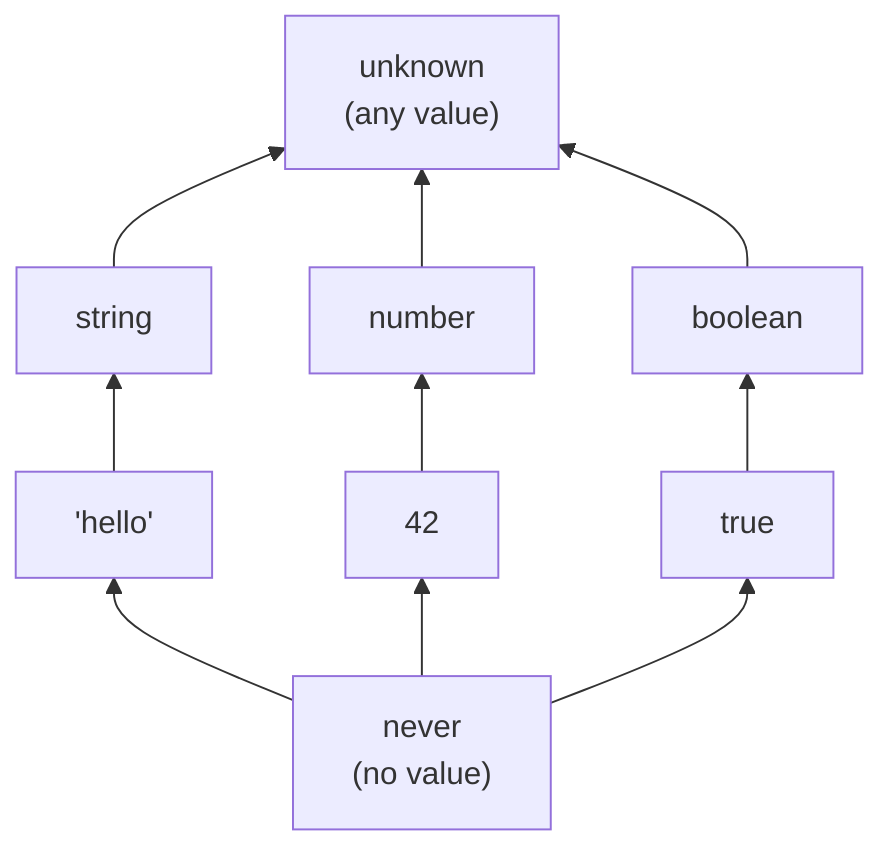
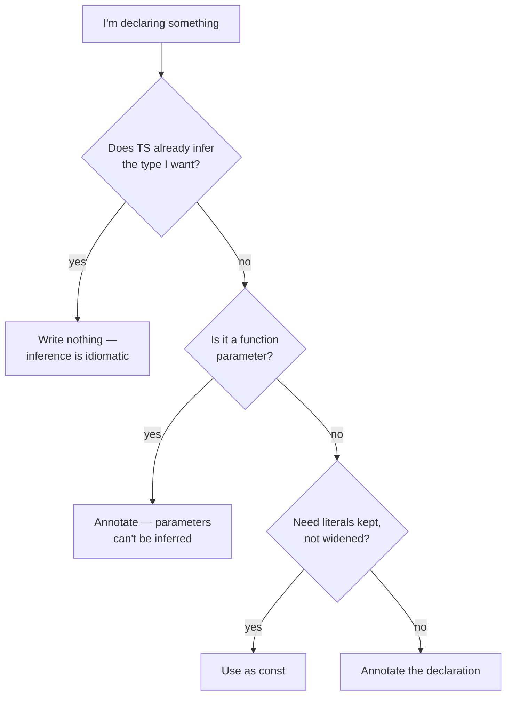

# 02 — Basics: Values and Their Types

## Why this exists

Every JavaScript value already has a type at runtime — TypeScript just
lets you *name* those types so the compiler can check them. Getting fluent
here means knowing which type TS gives a value when you don't say
anything, and how to say something when you need to.

## The assignability hierarchy



*What to notice: an arrow means "is assignable to". `never` fits anywhere
(it has no values), everything fits into `unknown`. `any` is missing on
purpose — it sits outside the hierarchy and is assignable in **both**
directions, which is exactly why it's dangerous.*

## Minimal syntax

```ts
// primitives
const name: string = 'Ada'
const age: number = 36
const admin: boolean = true
const big: bigint = 10n
const id: symbol = Symbol('id')

// arrays & tuples
const tags: string[] = ['a', 'b']         // any length, one type
const entry: [string, number] = ['a', 1]  // fixed length, fixed order

// enums
enum LogLevel { Debug = 'DEBUG', Info = 'INFO' }

// literal types — a type with exactly one value
let direction: 'north' | 'south' = 'north'
```

## Annotation vs inference — when to write the type



*What to notice: annotation is the exception, not the rule — parameters
always need it, everything else usually doesn't.*

**Widening:** `const x = 'hi'` infers the literal type `'hi'`, but
`let x = 'hi'` widens to `string` (it could be reassigned). `as const`
freezes literals inside objects and arrays:

```ts
const origin = { x: 0, y: 0 } as const
// type: { readonly x: 0; readonly y: 0 }
```

## The special types

| | `any` | `unknown` | `never` | `void` |
| --- | --- | --- | --- | --- |
| Means | "stop checking" | "some value, unknown type" | "no value can exist" | "nothing returned" |
| Can assign anything to it | ✅ | ✅ | ❌ | ❌ |
| Can use it without checking | ✅ (danger!) | ❌ must narrow first | — | — |
| Typical use | avoid it | safe input (e.g. `catch`, JSON) | exhaustiveness proofs | return type of procedures |

## Enums vs alternatives

| | `enum` | `const enum` | union of literals |
| --- | --- | --- | --- |
| Exists at runtime | ✅ (an object) | ❌ (inlined) | ❌ (type only) |
| Reverse mapping (`E[0]`) | numeric only | ❌ | ❌ |
| Iterable at runtime | ✅ | ❌ | via an `as const` array |
| Idiomatic today | sometimes | rarely | ✅ mostly preferred |

## Common gotchas

- `let` widens literals; `const` keeps them — but only for primitives.
  Object properties widen either way unless you use `as const`.
- `enum` members are types *and* values; a union of literals is type-only.
- `void` ≠ `undefined`: a `() => void` callback is allowed to return
  anything — the return is just ignored (details in module 04).
- `arr[i]` includes `undefined` in this course (strict indexing).

## Try it now

→ `exercises/ex01.ts` through `ex08.ts`, then `checkpoint.ts`.
Check with `npm test -- 02`.
