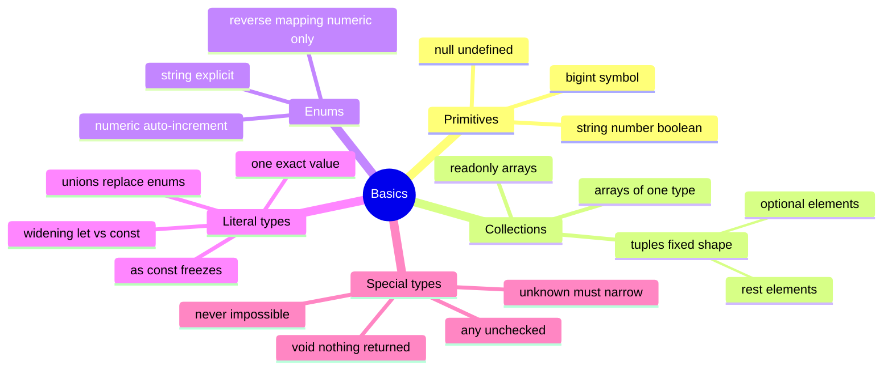

# 02 — Basics · Cheat-sheet

## Concept map



*What to notice: literal types + `as const` (bottom-left) are the modern
replacement for most enum use cases.*

## Key syntax

```ts
const tags: string[] = []
const frozen: readonly number[] = [1, 2]
const pair: [string, number] = ['a', 1]
const rgba: [number, number, number, number?] = [255, 0, 0]
const line: [string, ...number[]] = ['t', 1, 2]

type Dir = 'north' | 'south'          // literal union
const origin = { x: 0 } as const      // { readonly x: 0 }

function assertNever(x: never): never { throw new Error() }
```

## Rules to remember

- `const x = 'hi'` → type `'hi'`; `let x = 'hi'` → type `string`.
- Object properties widen even under `const` — `as const` stops it and
  adds `readonly` deeply.
- `unknown` requires narrowing before use; `any` requires nothing (avoid).
- Exhaustiveness: `default: assertNever(x)` makes the compiler complain
  when a union grows.
- Numeric enums get reverse mappings (`Status[0]`); string enums don't.

## Gotchas

- `typeof null === 'object'` — check `null` separately.
- `[number, number, number?]` has length `3 | 4` — optional tuple slots
  change the length type.
- `void` return type on a callback does NOT forbid returning values.

## Self-quiz

1. What type does `let x = 5` infer? And `const x = 5`?
2. How do you make `{ a: 1 }` infer `{ readonly a: 1 }`?
3. Why is `unknown` safer than `any` for a JSON.parse result?
4. What does it mean when a value has type `never` inside a switch default?
5. Name two things `enum` gives you that a literal union doesn't.
6. Write the tuple type for "a name followed by one or more scores".

<details><summary>Answers</summary>

1. `number` (let widens) and `5` (const keeps the literal).
2. `{ a: 1 } as const`.
3. You must narrow `unknown` before using it — the compiler forces the
   runtime checks `any` lets you skip.
4. Every union member was handled — only the impossible remains.
5. A runtime object you can iterate, and (numeric only) reverse mapping.
6. `[string, number, ...number[]]`.

</details>
