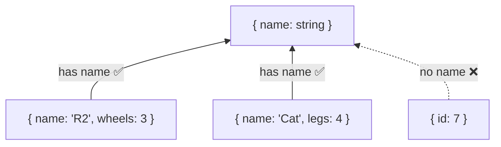
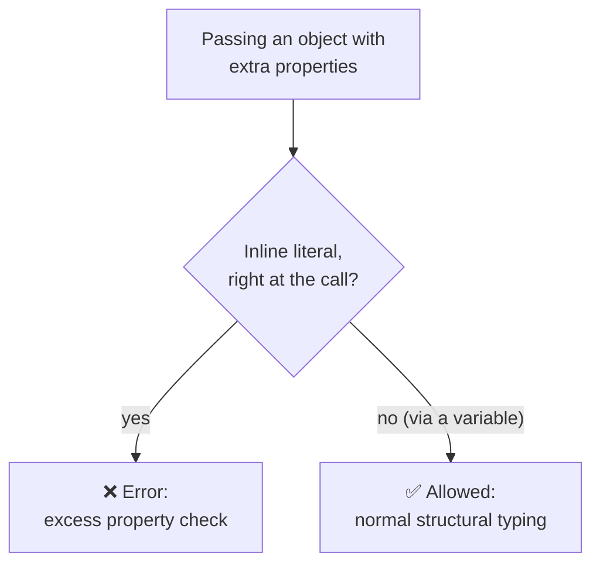

# 03 — Objects & Interfaces

## Why this exists

Almost all real data is objects. TypeScript needs a way to describe an
object's *shape* — which properties exist, their types, and whether they
can change. Two tools do this: object type aliases and interfaces.

## Structural typing: shapes, not names

TypeScript compares types by **structure**, not by name. If it has the
right properties, it fits — no matter what it's called.



*What to notice: extra properties don't matter for compatibility — missing
ones do. Any value with a `name: string` is a valid `{ name: string }`.*

## Minimal syntax

```ts
type Book = {
  title: string
  pages: number
  author?: string        // optional — may be ABSENT
  readonly isbn: string  // cannot be reassigned
}

interface Point {
  x: number
  y: number
}

interface Point3D extends Point {  // extension
  z: number
}

type WordCount = { [word: string]: number }  // index signature
```

## Interface vs type alias

| | `interface` | `type` |
| --- | --- | --- |
| Object shapes | ✅ | ✅ |
| Unions, primitives, tuples | ❌ | ✅ |
| Extension | `extends` | `&` intersection |
| Declaration merging | ✅ (same name merges) | ❌ (duplicate = error) |
| Use when | public object contracts, augmenting libs | everything else |

Declaration merging — two declarations, one type:

```ts
interface AppGlobals { appName: string }
interface AppGlobals { version: string }
// AppGlobals now requires BOTH properties
```

## Excess property checks

Structural typing says extras are fine — with one exception: a *fresh
inline literal* is checked strictly, because an unknown property there is
almost certainly a typo.



*What to notice: the same object is rejected inline but accepted through a
variable. The check targets typos, not extra data.*

## Common gotchas

- `author?: string` means *may be absent*. With this course's
  `exactOptionalPropertyTypes`, you may not write `author: undefined`
  explicitly — leave it out instead.
- `readonly` is compile-time only; it doesn't freeze the object at runtime
  (that's `Object.freeze`).
- Index-signature reads (`counts[word]`) include `undefined` here — handle
  the miss (`?? 0`).
- Interfaces merging silently can surprise you — it's a feature for
  augmenting globals/libraries, not for everyday code.

## Try it now

→ `exercises/ex01.ts` through `ex07.ts`, then `checkpoint.ts`.
Check with `npm test -- 03`.
