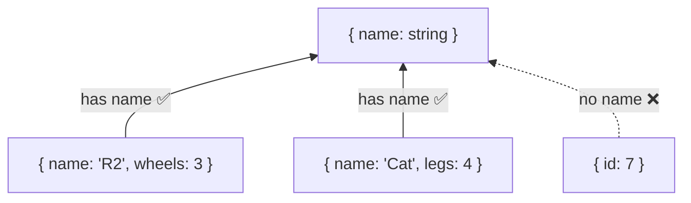
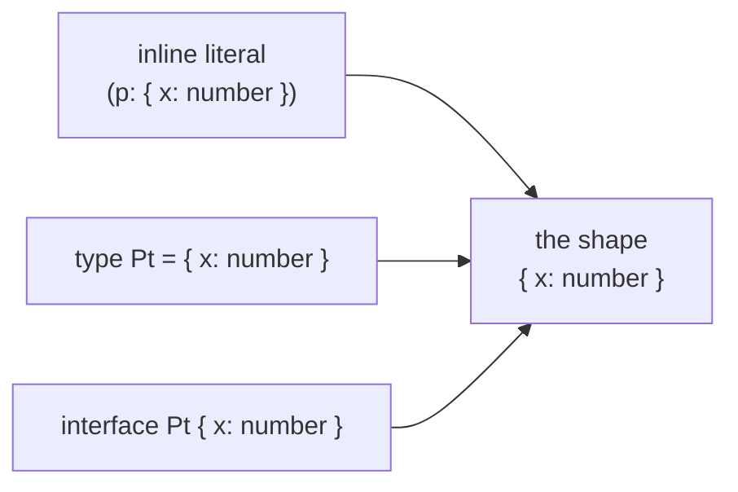
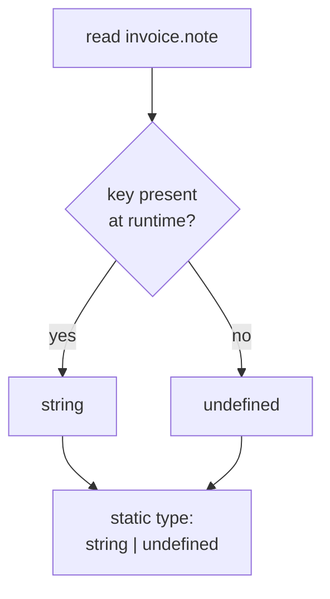
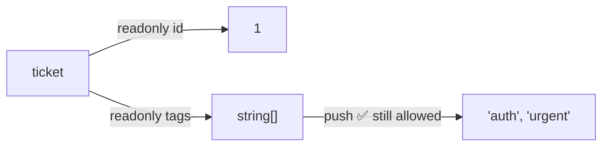
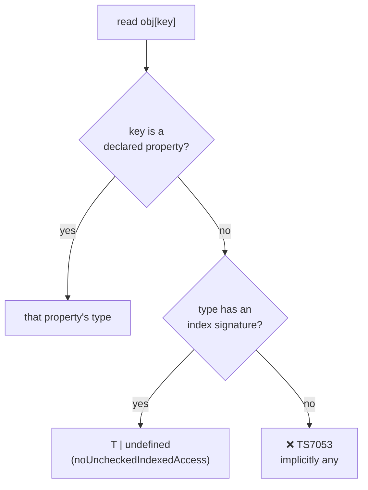
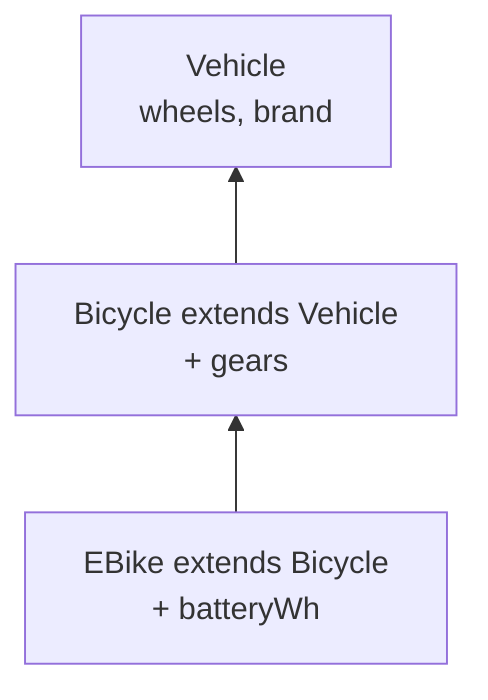
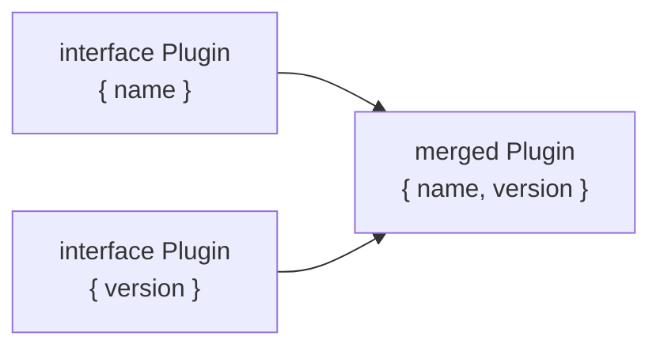
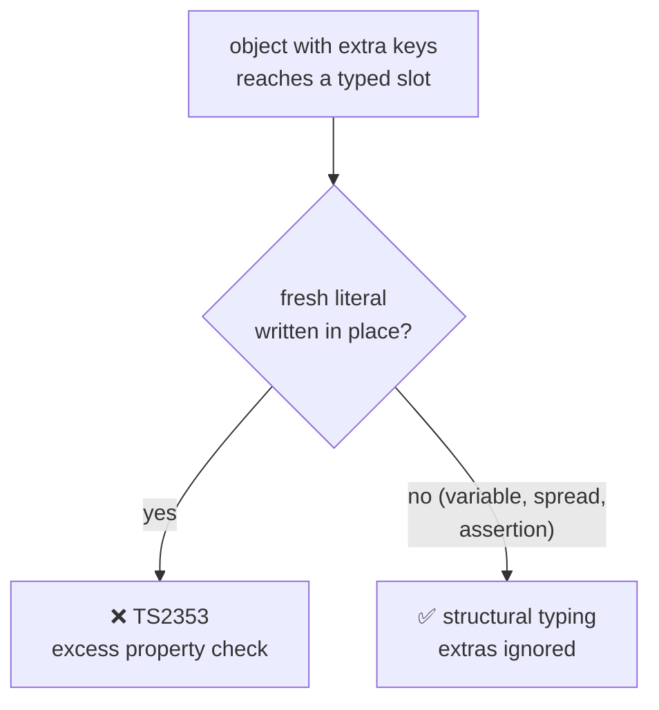
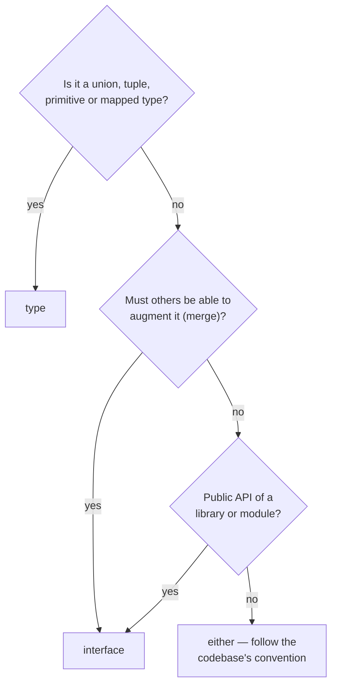
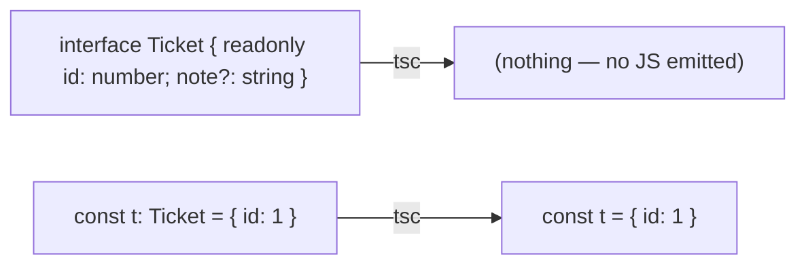

# 03 — Objects & Interfaces

## Why this exists

Almost all real data is objects. TypeScript needs a way to describe an
object's *shape* — which properties exist, their types, whether they may
be missing, and whether they can change. Two tools do this: object type
aliases and interfaces. Both compile to nothing; they exist only to catch
the typo, the forgotten field, and the accidental mutation before you run.

## Structural typing: shapes, not names

TypeScript compares types by **structure**, not by name. If a value has
the right properties, it fits — no matter what it is called.



*What to notice: extra properties don't matter for compatibility — missing
ones do. Any value with a `name: string` is a valid `{ name: string }`.*

## Map of this module

| Section | Exercise |
| --- | --- |
| Three ways to write an object type · Optional properties · Reading optional props | ex01 |
| `readonly` · `Readonly<T>`, `Object.freeze`, `as const` · Immutable updates | ex02 |
| Index signatures · The compatibility rule · `Record` vs `Map` · `Object.keys` | ex03 |
| `extends` · `&` intersection · Mixing interface and type | ex04 |
| interface vs type · Which one do I reach for? | ex05 |
| Declaration merging | ex06 |
| Structural typing · Excess property checks · Weak types | ex07 |
| Everything above + `keyof`/`typeof` preview | checkpoint |

## Minimal syntax

```ts
type Recipe = {
  title: string
  servings: number
  source?: string           // optional — may be ABSENT
  readonly id: string       // cannot be reassigned
}

interface Coord {
  lat: number
  lng: number
}

interface Coord3D extends Coord {   // extension
  alt: number
}

type Inventory = { [sku: string]: number }   // index signature
```

### Three ways to write an object type

You can describe a shape inline, with a `type` alias, or with an
`interface`. All three produce the *same* shape — the choice is about
reuse and naming, not about the type itself.



*What to notice: three syntaxes, one shape. The compiler does not care
which spelling produced it.*

```ts
function distanceInline(p: { x: number; y: number }) { return Math.hypot(p.x, p.y) }

type PointT = { x: number; y: number }
interface PointI { x: number; y: number }
function distanceT(p: PointT) { return Math.hypot(p.x, p.y) }
function distanceI(p: PointI) { return Math.hypot(p.x, p.y) }

const p = { x: 3, y: 4 }
distanceInline(p)   // 5
distanceT(p)        // 5
distanceI(p)        // 5 — same shape, all three accept it
```

Inline literals are fine for one-off parameters. Name the shape the
moment you use it twice — a name is documentation and shows up in error
messages. Members are separated by `;` or newlines. Nested objects are
just object types inside object types:

```ts
type Order = {
  id: number
  customer: { name: string; address: { city: string; zip: string } }
}
const o: Order = { id: 1, customer: { name: 'Ada', address: { city: 'London', zip: 'N1' } } }
o.customer.address.city   // string
```

Gotcha: deeply nested inline types are hard to read and reuse. Pull
`Address` and `Customer` out into their own aliases once they grow.

### Method syntax vs property syntax

A function-valued member can be written two ways. They look alike but
behave differently under `strictFunctionTypes`.

| Syntax | Example | Parameter checking |
| --- | --- | --- |
| Method | `handle(e: Event): void` | **bivariant** — loose, like a class method |
| Property | `handle: (e: Event) => void` | **strict** — contravariant, as module 01 showed |

```ts
type Base = { id: number }
type Tagged = { id: number; tag: string }

type MethodStyle = { handle(e: Base): void }
type PropertyStyle = { handle: (e: Base) => void }

const needsTag = (e: Tagged) => e.tag.length

const m: MethodStyle = { handle: needsTag }    // ✅ method syntax lets it through

// ❌ error TS2322: Type '(e: Tagged) => number' is not assignable to type '(e: Base) => void'.
//    Types of parameters 'e' and 'e' are incompatible.
const p: PropertyStyle = { handle: needsTag }
```

Why the loophole? Method syntax stays bivariant so that `Array<Dog>` can
still be assignable to `Array<Animal>` (its `push` takes a `Dog`). Rule:
**use property syntax for callbacks you store** (event handlers,
strategies) — you want the strict check.

### Optional properties: `?:` means "may be absent"

Not every field is known when an object is built. `?:` marks a property
that may be **left out** entirely. Without it, every object literal must
list every key.

```ts
type Invoice = { id: string; total: number; note?: string }

const plain: Invoice = { id: 'A1', total: 10 }               // ✅ note omitted
const rush: Invoice = { id: 'B2', total: 20, note: 'rush' }  // ✅ note present

// ❌ error TS2375: Type '{ id: string; total: number; note: undefined; }' is not assignable to type 'Invoice' with 'exactOptionalPropertyTypes: true'. Consider adding 'undefined' to the types of the target's properties.
const odd: Invoice = { id: 'C3', total: 30, note: undefined }
```

That last error is this course's `exactOptionalPropertyTypes` flag.
"Absent" and "present but `undefined`" are different at runtime — `in`,
`Object.keys` and `JSON.stringify` all see the difference — so the
compiler refuses to blur them.

### `?:` versus `T | undefined`

Three spellings, three meanings:

| Declaration | Key may be absent? | Value may be `undefined`? |
| --- | --- | --- |
| `note?: string` | ✅ | ❌ (with `exactOptionalPropertyTypes`) |
| `note: string \| undefined` | ❌ — key is required | ✅ |
| `note?: string \| undefined` | ✅ | ✅ |

```ts
type Loose = { note: string | undefined }
type Both = { note?: string | undefined }

// ❌ error TS2741: Property 'note' is missing in type '{}' but required in type 'Loose'.
const l1: Loose = {}
const l2: Loose = { note: undefined }   // ✅ key present, value undefined

const b1: Both = {}                     // ✅
const b2: Both = { note: undefined }    // ✅ both allowed
```

Reach for `note?: string` by default. Use `T | undefined` when the key
must always be written (a form where every field is spelled out, even
if empty).

### Reading an optional property narrows to `T | undefined`

Whatever you declared, a *read* of an optional property is `T | undefined`.
The compiler makes you handle the miss before using the value.



*What to notice: the compiler cannot know which branch runs, so the type
of the read is the union of both.*

```ts
type Invoice = { id: string; total: number; note?: string }
const inv: Invoice = { id: 'A1', total: 10 }

// ❌ error TS18048: 'inv.note' is possibly 'undefined'.
const n1 = inv.note.length

const n2 = inv.note?.length          // number | undefined — optional chaining
const n3 = inv.note?.length ?? 0     // number — with a fallback
const n4 = inv.note !== undefined ? inv.note.length : 0   // number — narrowing
```

`?.` stops the whole chain and yields `undefined` if the left side is
`null` or `undefined`. It chains through nested optionals too:

```ts
type Shipment = { recipient?: { address?: { city: string } } }
const s: Shipment = {}
const city = s.recipient?.address?.city   // string | undefined — no crash
```

### Falsy is not missing

`||` and `if (x)` test for **falsy**. `??` and `!== undefined` test for
**missing**. `0`, `''` and `false` are real values that happen to be
falsy — treating them as missing is a classic bug.

```ts
type Retry = { attempts?: number; label?: string }
const cfg: Retry = { attempts: 0, label: '' }

const a1 = cfg.attempts || 3    // 3  — WRONG: 0 was a real setting
const a2 = cfg.attempts ?? 3    // 0  — right: only absent/undefined falls back

const l1 = cfg.label || 'none'  // 'none' — WRONG if '' was intentional
const l2 = cfg.label ?? 'none'  // ''     — right
```

| Value of `attempts` | `attempts \|\| 3` | `attempts ?? 3` | `if (attempts)` | `attempts !== undefined` |
| --- | --- | --- | --- | --- |
| absent | `3` | `3` | false | false |
| `0` | `3` ⚠️ | `0` | false ⚠️ | true |
| `5` | `5` | `5` | true | true |

Rule: when the property's type includes `0`, `''` or `false`, always use
`??` and `!== undefined`. When it is an object or a non-empty string,
`||` happens to work — but `??` says what you mean.

### Checking presence: `in` and `Object.hasOwn`

Sometimes you need "was this key set?", not "is the value truthy?".
The `in` operator answers that at runtime (and narrows unions — module 05).

```ts
type Retry = { attempts?: number; label?: string }
const cfg: Retry = { attempts: 0 }

'attempts' in cfg              // true  — key exists, even though value is 0
'label' in cfg                 // false — key was never written
Object.hasOwn(cfg, 'label')    // false — same, but ignores the prototype chain
```

`in` walks the prototype chain (`'toString' in cfg` is `true`);
`Object.hasOwn` checks only the object itself.

### `readonly`: compile-time only, and shallow

`readonly` blocks *reassignment* of a property. It is the cheapest
immutability you can buy — but it is a compile-time promise only, and it
is one level deep.



*What to notice: `readonly tags` locks the arrow from `ticket` to the
array. It says nothing about the array's own contents.*

```ts
type Ticket = { readonly id: number; title: string; readonly tags: string[] }
const ticket: Ticket = { id: 1, title: 'Login bug', tags: ['auth'] }

ticket.title = 'Login crash'   // ✅ normal property

// ❌ error TS2540: Cannot assign to 'id' because it is a read-only property.
ticket.id = 2

ticket.tags.push('urgent')     // ✅ compiles — readonly is shallow!

// ❌ error TS2540: Cannot assign to 'tags' because it is a read-only property.
ticket.tags = []
```

To lock the array too, make the *array type* readonly:

```ts
type Frozen = { readonly tags: readonly string[] }
const f: Frozen = { tags: ['auth'] }

// ❌ error TS2339: Property 'push' does not exist on type 'readonly string[]'.
f.tags.push('urgent')
```

`readonly string[]` is the same as `ReadonlyArray<string>`: no `push`,
`pop`, `splice`, `sort` — only the non-mutating methods.

Gotcha: `readonly` is erased. At runtime nothing stops a write; only the
compiler does. It does not even affect assignability — a `Ticket` is
freely assignable to `{ id: number; title: string }`, whose `id` is
*mutable*, and a write through that alias mutates the original.

### `Readonly<T>`, `Object.freeze`, and `as const`

Marking every property by hand is tedious. Three shortcuts:

| Tool | What it does | Runtime effect |
| --- | --- | --- |
| `Readonly<T>` | Every top-level property of `T` becomes `readonly` | none — type only |
| `Object.freeze(obj)` | Returns `Readonly<typeof obj>` | ✅ actually freezes (shallow) |
| `as const` | Literal becomes deeply `readonly` with literal types | none — type only |

```ts
type Profile = { name: string; age: number }

const p: Readonly<Profile> = { name: 'Ada', age: 36 }
// ❌ error TS2540: Cannot assign to 'age' because it is a read-only property.
p.age = 37

const frozen = Object.freeze({ name: 'Ada', age: 36 })   // Readonly<{ name: string; age: number }>
// ❌ error TS2540: Cannot assign to 'age' because it is a read-only property.
frozen.age = 37

const origin = { x: 0, y: 0 } as const   // { readonly x: 0; readonly y: 0 }
// ❌ error TS2540: Cannot assign to 'x' because it is a read-only property.
origin.x = 1
```

`Readonly<T>` is a *mapped type* — you will build it yourself in
module 08. `Object.freeze` is the only one of the three that survives
to runtime, and it is shallow just like the keyword.

### Immutable updates with spread

If you cannot assign, how do you change anything? You don't — you build
a **new** object with the changed fields, using spread.

```ts
type Ticket = { readonly id: number; title: string; readonly tags: string[] }
const ticket: Ticket = { id: 1, title: 'Login bug', tags: ['auth'] }

const renamed: Ticket = { ...ticket, title: 'Login crash' }        // copy, then override
const tagged: Ticket = { ...ticket, tags: [...ticket.tags, 'p1'] } // nested → spread that too

ticket.title   // 'Login bug' — the original is untouched
```

Order matters: later keys win, so the override goes *after* the spread.

Gotcha: spread is shallow. `{ ...ticket }` copies the `tags` *reference*;
both objects share one array until you spread the inner value too. Also,
the *inferred* type of a spread drops `readonly` — annotate the result
(`const renamed: Ticket = ...`) if you want the modifier to survive.

### Index signatures: when you don't know the keys

Sometimes you know the *type* of the keys but not the keys themselves —
a word count, a lookup by SKU, HTTP headers. An index signature says
"any key of this type maps to this value type".



*What to notice: declared properties are certain; index-signature reads
are not, so the compiler adds `undefined`; with no signature at all, the
read is an error.*

```ts
type Inventory = { [sku: string]: number }

const stock: Inventory = { 'apple-1': 4, 'pear-2': 0 }
stock['kiwi-3'] = 9                 // ✅ any string key may be written

const grapes = stock['grape-4']     // number | undefined — key may not exist

// ❌ error TS18048: 'grapes' is possibly 'undefined'.
grapes.toFixed()

const safe = stock['grape-4'] ?? 0  // number
```

The `T | undefined` on reads is `noUncheckedIndexedAccess` at work. It is
honest: the object really may lack that key. Handle the miss with `??`.

Keys can be `string`, `number`, `symbol`, or a template-literal pattern:

```ts
type ByYear = { [year: number]: string }
const releases: ByYear = { 1999: 'v1', 2004: 'v2' }
releases[2020]      // string | undefined
releases['2020']    // ✅ numeric strings count as numbers
// ❌ error TS7015: Element implicitly has an 'any' type because index expression is not of type 'number'.
releases['latest']

type DataAttrs = { [attr: `data-${string}`]: string }
const el: DataAttrs = { 'data-id': '42', 'data-role': 'tab' }
// ❌ error TS2353: Object literal may only specify known properties, and 'id' does not exist in type 'DataAttrs'.
const el2: DataAttrs = { id: '42' }

const secret = Symbol('secret')
type Vault = { [key: symbol]: string }
const v: Vault = { [secret]: 'hunter2' }
```

Gotcha: a `number` index signature is really a `string` one underneath —
JavaScript turns every key into a string. `[year: number]` just tells the
compiler to reject non-numeric keys.

### The compatibility rule: every property must fit the signature

When a type has both an index signature and named properties, each
named property must be assignable to the signature's value type. The
signature is a promise about *every* key — including the named ones.

```ts
type Scores = {
  [player: string]: number
  // ❌ error TS2411: Property 'winner' of type 'string' is not assignable to 'string' index type 'number'.
  winner: string
}
```

Two fixes, each with a cost:

```ts
// Fix A: widen the signature — now every read is string | number | undefined
type ScoresA = { [player: string]: number | string; winner: string }

// Fix B: split the shapes — usually the better design
type ScoresB = { winner: string; byPlayer: { [player: string]: number } }
```

Fix B keeps reads precise. Mixing "a fixed field" and "a bag of keys" in
one object is almost always a smell.

### `Record<K, V>` and when to prefer a `Map`

`Record<string, number>` is exactly `{ [key: string]: number }`. With a
*union* of literal keys, it becomes a closed set of required properties.

```ts
type Inventory = Record<string, number>          // same as an index signature
type Theme = Record<'bg' | 'fg', string>         // exactly these two keys

const dark: Theme = { bg: '#000', fg: '#fff' }
// ❌ error TS2741: Property 'fg' is missing in type '{ bg: string; }' but required in type 'Theme'.
const half: Theme = { bg: '#000' }
```

| Need | Use |
| --- | --- |
| Known key set, JSON-friendly | `Record<'a' \| 'b', V>` |
| Open string keys, JSON-friendly | `Record<string, V>` / index signature |
| Non-string keys, insertion order, frequent add/delete | `Map<K, V>` |
| Keys like `'constructor'` or `'__proto__'` from user input | `Map` — objects inherit those |

```ts
const byId = new Map<number, string>()
byId.set(3, 'three')
const three = byId.get(3)   // string | undefined — same honesty, cleaner API
```

### Why `Object.keys` returns `string[]`

You might expect `Object.keys(theme)` to be `('bg' | 'fg')[]`. It is
`string[]` — on purpose. Structural typing means a `Theme` variable may
hold an object with *extra* keys at runtime, so the precise type would
be a lie.

```ts
type Theme = { bg: string; fg: string }
const dark: Theme = { bg: '#000', fg: '#fff' }

for (const key of Object.keys(dark)) {
  // ❌ error TS7053: Element implicitly has an 'any' type because expression of type 'string' can't be used to index type 'Theme'.
  const colour = dark[key]
}

// Fix 1: iterate values or entries instead of keys
for (const [key, colour] of Object.entries(dark)) console.log(key, colour)

// Fix 2: assert the key type when you KNOW the object has no extras
for (const key of Object.keys(dark) as (keyof Theme)[]) {
  const colour = dark[key]   // string
}
```

Fix 2 is a promise you make to the compiler; module 08 builds a typed
`keysOf` helper instead.

### Interface extension with `extends`

Hierarchies of shapes share fields. `extends` copies every member of the
parent into the child, so you declare each field once.



*What to notice: each level only adds. An `EBike` has all five fields,
and any function that accepts a `Vehicle` accepts an `EBike`.*

```ts
interface Vehicle { wheels: number; brand: string }
interface Bicycle extends Vehicle { gears: number }
interface EBike extends Bicycle { batteryWh: number }

const ride: EBike = { wheels: 2, brand: 'Trek', gears: 11, batteryWh: 500 }

function describe(v: Vehicle) { return `${v.brand} on ${v.wheels} wheels` }
describe(ride)   // ✅ an EBike is a Vehicle

// ❌ error TS2741: Property 'gears' is missing in type '{ wheels: number; brand: string; }' but required in type 'Bicycle'.
const noGears: Bicycle = { wheels: 2, brand: 'Trek' }
```

An interface can extend **several** parents at once — the members are
merged:

```ts
interface Timestamped { createdAt: Date }
interface Owned { ownerId: string }
interface Memo extends Timestamped, Owned { body: string }

const memo: Memo = { createdAt: new Date(), ownerId: 'u1', body: 'hi' }
```

A child may *narrow* an inherited property (`status: string` →
`status: 'open'`) but may not change it to an unrelated type:

```ts
interface Item { id: number }
// ❌ error TS2430: Interface 'Labelled' incorrectly extends interface 'Item'.
interface Labelled extends Item { id: string }
```

### Intersection with `&` — and its silent `never`

Type aliases combine with `&`. For plain objects it reads like
`extends`: the result has every member of both sides.

```ts
type Timestamped = { createdAt: Date }
type Owned = { ownerId: string }
type Memo = Timestamped & Owned & { body: string }

const memo: Memo = { createdAt: new Date(), ownerId: 'u1', body: 'hi' }
```

The difference shows on conflicts. `extends` errors at the declaration;
`&` quietly intersects the two property types — and `number & string` is
`never`, so the object becomes impossible to construct:

```ts
type A = { id: number }
type B = { id: string }
type AB = A & B                 // ✅ no error here — id is now `never`

// ❌ error TS2322: Type 'number' is not assignable to type 'never'.
const ab: AB = { id: 1 }
```

Rule: when you see `never` in an error about a property you never
declared as `never`, look for an intersection with a conflicting field.

### Mixing interface and type, plus `implements`

The two systems interoperate. An interface can extend an alias, and an
alias can intersect an interface — as long as the alias is an *object*
shape.

```ts
type Timestamped = { createdAt: Date }
interface Memo extends Timestamped { body: string }     // interface extends alias ✅

interface Owned { ownerId: string }
type OwnedMemo = Memo & Owned                            // alias intersects interface ✅

const m: OwnedMemo = { createdAt: new Date(), body: 'hi', ownerId: 'u1' }

type Shape = { kind: 'circle' } | { kind: 'square' }
// ❌ error TS2312: An interface can only extend an object type or intersection of object types with statically known members.
interface Named extends Shape { name: string }
```

Classes can promise to match a shape with `implements` (module 06):

```ts
interface Printable { print(): string }

class Receipt implements Printable {
  constructor(private total: number) {}
  print() { return `total: ${this.total}` }
}
```

### Declaration merging: two declarations, one interface

Declaring an interface twice with the same name does not error — the
declarations **merge** into one. This is how you add fields to types
you do not own: library types, `Window`, `ProcessEnv`.



*What to notice: the merged type requires both members. Order of the
declarations does not matter for properties.*

```ts
interface Plugin { name: string }
interface Plugin { version: string }

const lint: Plugin = { name: 'lint', version: '1.0' }   // both required now

// ❌ error TS2741: Property 'version' is missing in type '{ name: string; }' but required in type 'Plugin'.
const old: Plugin = { name: 'lint' }
```

Conflicts are checked: the same property must keep the same type. Methods
with the same name become overloads (later declarations are tried first).
A `type` alias never merges — a duplicate is simply an error:

```ts
interface Plugin { name: string }
// ❌ error TS2717: Subsequent property declarations must have the same type.  Property 'name' must be of type 'string', but here has type 'number'.
interface Plugin { name: number }

// ❌ error TS2300: Duplicate identifier 'Settings'.
type Settings = { theme: string }
// ❌ error TS2300: Duplicate identifier 'Settings'.
type Settings = { fontSize: number }
```

The real use is *augmentation* through `declare global` (from inside a
module) — adding a member to a built-in every array now has:

```ts
declare global {
  interface Array<T> {
    last(): T | undefined
  }
}

Array.prototype.last = function () { return this[this.length - 1] }

const tail = [1, 2, 3].last()   // number | undefined
```

Module 09 does this for real with `Window`, `ProcessEnv` and third-party
packages (and `namespace` merging for the rare legacy case). Gotcha:
merging is *silent* — two `interface User` declarations in one scope
combine without warning. Keep interface names distinct in everyday code.

### Structural typing: the duck test

"If it walks like a duck and quacks like a duck, it is a duck." A
function that needs `{ email: string }` accepts *any* object that has an
`email: string`, whatever else it carries and whatever it is called.

```ts
type HasEmail = { email: string }
function sendReminder(target: HasEmail) { return `mail → ${target.email}` }

const customer = { email: 'ada@shop.io', plan: 'pro' }
const employee = { email: 'bob@shop.io', badge: 42, dept: 'ops' }

sendReminder(customer)   // ✅ has email — plan is ignored
sendReminder(employee)   // ✅ has email — badge and dept are ignored

const lead = { phone: '555-0100' }
// ❌ error TS2345: Argument of type '{ phone: string; }' is not assignable to parameter of type 'HasEmail'.
//    Property 'email' is missing in type '{ phone: string; }' but required in type 'HasEmail'.
sendReminder(lead)
```

This is why you can pass a rich domain object to a function that needs
only a slice of it — and why `Object.keys` cannot promise an exact key
list.

### Excess property checks on fresh literals

Structural typing says extras are fine — with one exception. An object
literal written *right where a type is expected* is **fresh**, and the
compiler checks it strictly: an unknown key there is almost certainly a
typo.



*What to notice: the same object is rejected inline but accepted through
a variable. The check targets typos, not extra data.*

The check runs in all three places a literal meets a type — assignment,
argument, and return:

```ts
type Coord = { lat: number; lng: number }

// ❌ error TS2353: Object literal may only specify known properties, and 'alt' does not exist in type 'Coord'.
const home: Coord = { lat: 51.5, lng: -0.1, alt: 11 }

function origin(): Coord {
  // ❌ error TS2353: Object literal may only specify known properties, and 'alt' does not exist in type 'Coord'.
  return { lat: 0, lng: 0, alt: 0 }
}

function plot(c: Coord) { return `${c.lat},${c.lng}` }
// ❌ error TS2353: Object literal may only specify known properties, and 'alt' does not exist in type 'Coord'.
plot({ lat: 0, lng: 0, alt: 0 })
```

Three ways to say "the extra is intentional" — freshness is lost the
moment the literal is stored, spread, or asserted:

```ts
type Coord = { lat: number; lng: number }
function plot(c: Coord) { return `${c.lat},${c.lng}` }

const withAlt = { lat: 0, lng: 0, alt: 0 }
plot(withAlt)                          // ✅ 1. via a variable — no longer fresh
plot({ ...withAlt })                   // ✅ 2. spread — spread-in keys are not checked
plot({ lat: 0, lng: 0, alt: 0 } as Coord)   // ✅ 3. assertion — you took responsibility

type OpenCoord = { lat: number; lng: number; [extra: string]: unknown }
const open: OpenCoord = { lat: 0, lng: 0, alt: 0 }   // ✅ 4. the type itself allows extras
```

Gotcha: an assertion (`as Coord`) also silences *real* typos. Prefer the
variable or the index signature when extras are genuinely part of the
data. And spread only exempts the keys that *come from* the spread —
a key you write out next to it (`{ ...withAlt, alt: 4 }`) is still
checked and still errors.

### Weak types: all-optional is still checked

A type whose properties are *all* optional is "weak". Structurally,
`{}` and `{ atempts: 3 }` both satisfy it — so a misspelled key would
slip through silently. TypeScript adds a special rule: a value must share
**at least one** property with a weak type.

```ts
type Retry = { attempts?: number; delayMs?: number }

const typo = { atempts: 3 }
// ❌ error TS2559: Type '{ atempts: number; }' has no properties in common with type 'Retry'.
const r1: Retry = typo

const okay = { attempts: 3, extra: true }
const r2: Retry = okay   // ✅ shares 'attempts' — extra is ignored as usual
```

Note this fires even through a variable — it is a separate check from
freshness.

### When structural typing bites

Two types with the same shape are the *same type* to the compiler, even
when they mean different things in your domain.

```ts
type Meters = { value: number }
type Seconds = { value: number }

function wait(delay: Seconds) { return delay.value * 1000 }

const height: Meters = { value: 3 }
wait(height)   // ✅ compiles — and is nonsense
```

The same applies to primitives: `type UserId = string` and
`type OrderId = string` are interchangeable. Module 11 fixes this with
*branded types* — a phantom property that makes shapes deliberately
different.

### interface vs type: the full comparison

| | `interface` | `type` |
| --- | --- | --- |
| Object shapes | ✅ | ✅ |
| Unions, tuples, primitives, function types | ❌ | ✅ |
| Mapped and conditional types (module 08) | ❌ | ✅ |
| Extension | `extends` — conflicts error | `&` — conflicts become `never` |
| Declaration merging | ✅ same name merges | ❌ duplicate is TS2300 |
| Augment library / global types | ✅ the tool for it | ❌ |
| `class X implements` | ✅ | ✅ (object shapes only) |
| Recursive shapes | ✅ | ✅ (aliases may need a wrapper for some patterns) |
| Computed / template-literal keys | via index signature only | ✅ full mapped-type syntax |
| Error messages | show the name (`Coord`) | often expand to the structure |
| Performance folklore | cached by name — marginally faster in huge codebases | fine in practice |

The "performance" row is the least important: pick for meaning, not
speed. The three rows that decide are **unions**, **merging**, and
**conflict handling**.

### Which one do I reach for?



*What to notice: only two questions have a forced answer. Everything else
is convention — consistency beats preference.*

```ts
interface User { id: number; name: string }               // public object contract
type UserRole = 'admin' | 'member' | 'guest'              // union → must be type
type UserWithRole = User & { role: UserRole }             // composition → either works
type Pair = [User, User]                                   // tuple → must be type
```

### `keyof` and `typeof`: a preview

Two operators let you derive types from existing things instead of
retyping them. `typeof value` gives the type of a *value*. `keyof Type`
gives the union of a type's *keys*. Module 08 goes deep; here is the
shape of it.

```ts
const defaults = { theme: 'dark', fontSize: 14 }

type Defaults = typeof defaults        // { theme: string; fontSize: number }
type DefaultKey = keyof Defaults       // 'theme' | 'fontSize'

function read(key: DefaultKey) {
  return defaults[key]                 // string | number — no TS7053, keys are known
}
read('theme')
// ❌ error TS2345: Argument of type '"font"' is not assignable to parameter of type 'keyof Defaults'.
read('font')
```

This is the idiomatic fix for TS7053: instead of widening the object with
an index signature, *narrow the key* to `keyof T`.

### What survives to runtime

Types are erased. An `interface` or `type` compiles to nothing at all;
`readonly`, `?:` and index signatures vanish with it. What remains is the
plain JavaScript object.



*What to notice: only the value survives. Every check you saw in this
lesson happened before the code ran.*

```ts
type Ticket = { readonly id: number; title: string; note?: string }
const t: Ticket = { id: 1, title: 'Login bug' }

typeof t                    // 'object' — not 'Ticket'
Object.keys(t)              // ['id', 'title'] — absent optional key is absent
JSON.stringify(t)           // '{"id":1,"title":"Login bug"}'
JSON.stringify({ a: undefined })   // '{}' — undefined values are dropped, absent-like
Object.keys({ a: undefined })      // ['a'] — but the key still exists!
```

That last pair is the runtime reason `exactOptionalPropertyTypes` exists:
`Object.keys`, `in` and `for…in` treat "set to `undefined`" differently
from "absent".

### Reading the compiler errors

| Code | Message (abridged) | It means |
| --- | --- | --- |
| TS2322 | Type 'X' is not assignable to type 'Y' | Shapes don't match — read the nested lines for the exact property |
| TS2339 | Property 'p' does not exist on type 'T' | You read a key the type doesn't declare (typo, or `readonly` array method) |
| TS2345 | Argument of type 'X' is not assignable to parameter | TS2322 for function arguments |
| TS2353 | Object literal may only specify known properties | Excess property check on a fresh literal — typo or intentional extra |
| TS2375 | ...with 'exactOptionalPropertyTypes: true' | You wrote `undefined` into a `?:` property — omit the key instead |
| TS2411 | Property 'p' of type 'A' is not assignable to 'string' index type 'B' | A named property breaks the index signature's promise |
| TS2430 | Interface 'C' incorrectly extends interface 'P' | Child redeclares a parent property with an incompatible type |
| TS2540 | Cannot assign to 'p' because it is a read-only property | Write to `readonly` — build a new object with spread |
| TS2559 | Type 'X' has no properties in common with type 'Y' | Weak-type check — probably a misspelled optional key |
| TS2717 | Subsequent property declarations must have the same type | Declaration merging conflict |
| TS2741 | Property 'p' is missing in type 'X' but required in type 'Y' | A required property was left out |
| TS7053 | Element implicitly has an 'any' type because expression of type 'string' can't be used to index | Indexing with a wide key — use `keyof` or add an index signature |
| TS18048 | 'x' is possibly 'undefined' | Optional or index-signature read — narrow with `?.`, `??`, or `!== undefined` |

## Rules to remember

- `?:` = the key **may be absent**. Reading it gives `T | undefined`.
  Never write `undefined` into it — leave it out.
- `??` and `!== undefined` test for *missing*; `||` and `if (x)` test for
  *falsy*. `0`, `''`, `false` are values, not gaps.
- `readonly` is compile-time, shallow, and ignored by assignability.
  Lock arrays with `readonly T[]`; change things with spread.
- Index-signature reads are `T | undefined`. Named properties must fit
  the signature. No signature + wide key = TS7053 → use `keyof`.
- `extends` errors on conflicts; `&` produces `never`.
- Interfaces merge by name; aliases never do. Merging is for augmenting
  types you don't own.
- Extras pass through variables; fresh literals get the excess property
  check; weak types need one shared property.
- Unions, tuples, primitives → `type`. Augmentation → `interface`.
  Otherwise, follow the codebase.

## Common gotchas

- `source?: string` means *may be absent*. With this course's
  `exactOptionalPropertyTypes`, you may not write `source: undefined`
  explicitly — leave it out instead.
- `readonly` is compile-time only; it doesn't freeze the object at runtime
  (that's `Object.freeze`). And it is shallow — `readonly tags: string[]`
  still allows `tags.push`.
- Index-signature reads (`stock[sku]`) include `undefined` here — handle
  the miss (`?? 0`). `cfg.retries || 3` turns a deliberate `0` into `3`.
- Interfaces merging silently can surprise you — it's a feature for
  augmenting globals/libraries, not for everyday code.
- `A & B` with a conflicting property does not error where you wrote it;
  it errors later, as "not assignable to type 'never'".

## Try it now

→ `exercises/ex01.ts` through `ex07.ts`, then `checkpoint.ts`.
Check with `npm test -- 03`.
