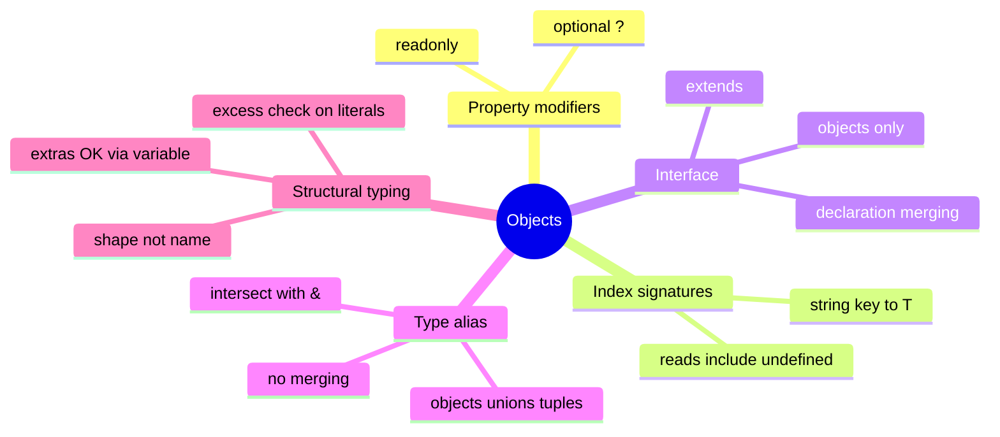

# 03 — Objects & Interfaces · Cheat-sheet

## Concept map



*What to notice: interface and type overlap for objects — the differences
(merging, unions) decide which one to reach for.*

## Key syntax

```ts
type Book = { title: string; author?: string; readonly isbn: string }
type Counts = { [key: string]: number }

interface Pet extends Animal { owner: string }

interface App { name: string }
interface App { version: string }   // merges!

const updated = { ...config, port: 3000 }   // immutable update
```

## Rules to remember

- `x?:` = may be **absent**. Under `exactOptionalPropertyTypes`, you can't
  write `x: undefined` into it.
- `readonly` blocks reassignment at compile time only.
- Index-signature reads are `T | undefined` in this course — `?? fallback`.
- Extra properties pass structurally **via variables**; inline literals get
  the excess property check.
- Unions need `type`; augmenting someone else's type needs `interface`.

## Gotchas

- Interface merging is silent — same name in the same scope merges, it
  doesn't error.
- `readonly` isn't deep: `readonly items: string[]` still allows
  `items.push(...)` (the array itself isn't readonly).
- Spread (`{...a, ...b}`) is shallow.

## Self-quiz

1. When must you use `type` instead of `interface`?
2. What's the difference between passing `{name: 'a', extra: 1}` inline
   vs through a variable?
3. What does `counts['missing']` return, and what's its type here?
4. Two `interface Foo` declarations in one file — error or feature?
5. How do you "change" a readonly property?
6. Does `readonly tags: string[]` prevent `tags.push('x')`?

<details><summary>Answers</summary>

1. Unions, tuples, primitives, mapped/conditional types — anything that
   isn't a plain object shape.
2. Inline literals get the excess property check (error); variables pass
   structurally.
3. `undefined` at runtime; type `number | undefined` (strict indexing).
4. Feature — declaration merging combines them.
5. You don't — build a new object with spread.
6. No — the property can't be reassigned, but the array is still mutable
   (use `readonly string[]` for that).

</details>
