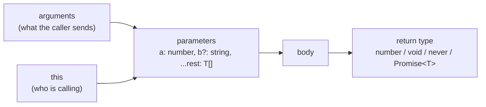
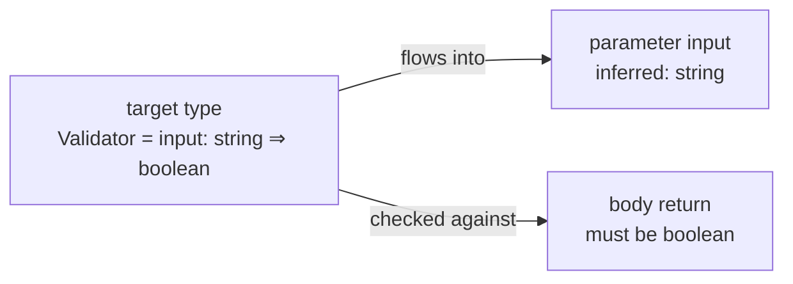
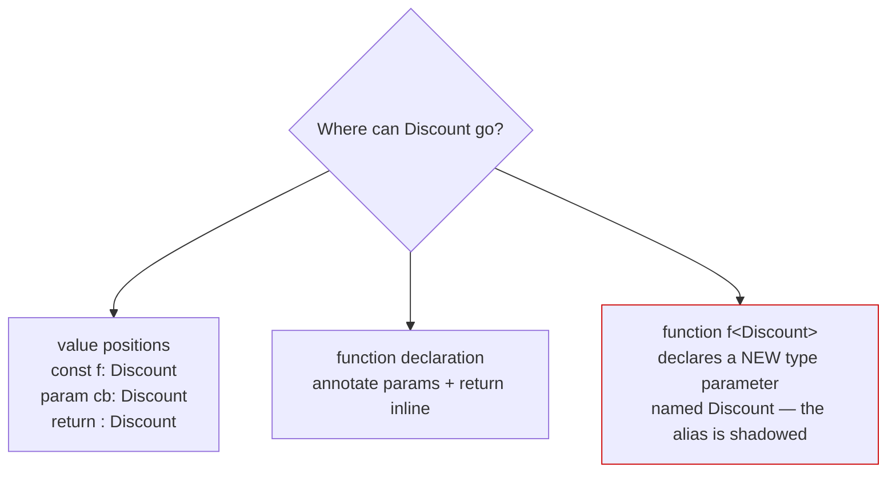
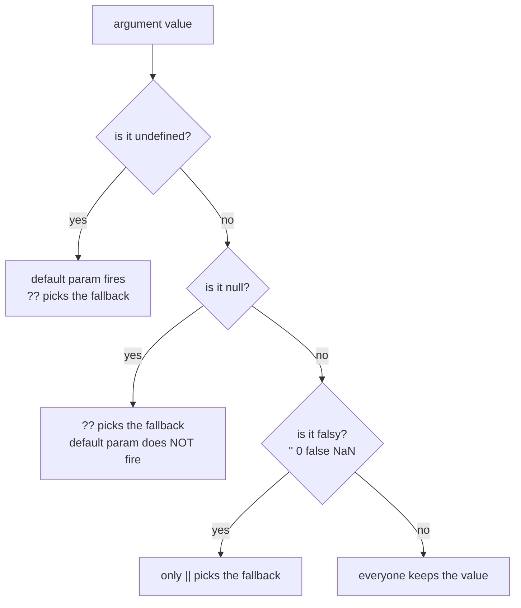
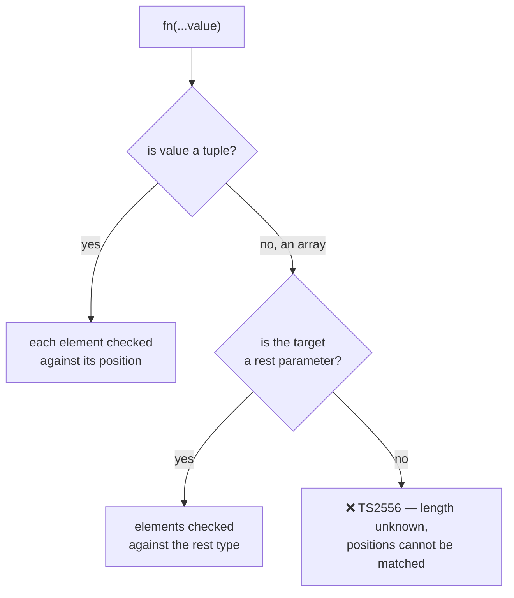
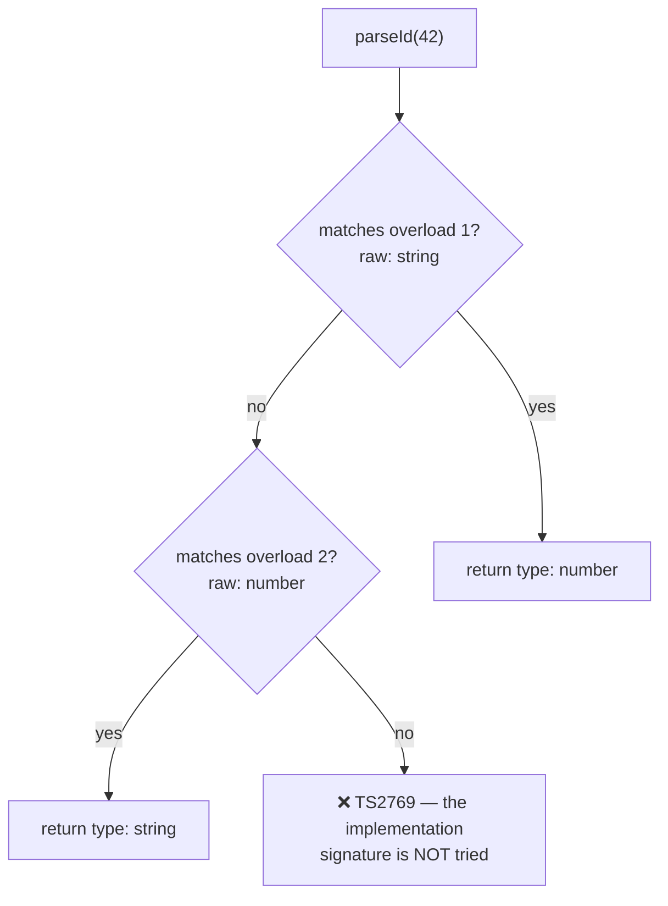
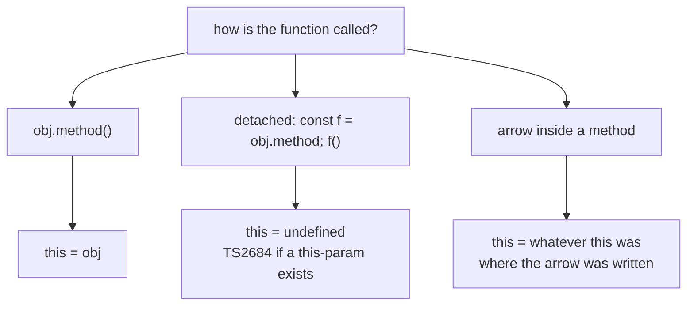
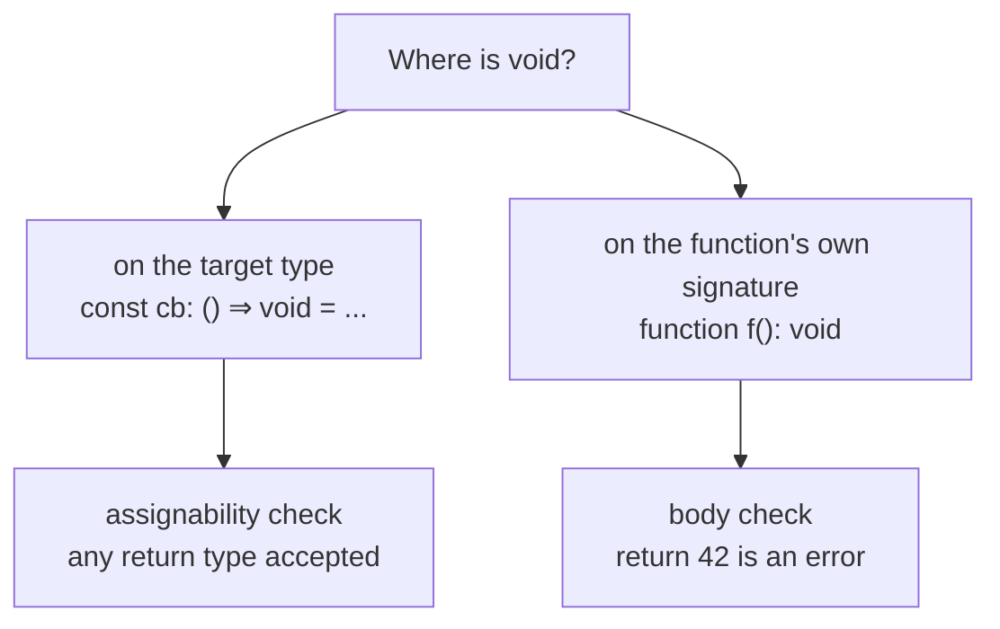
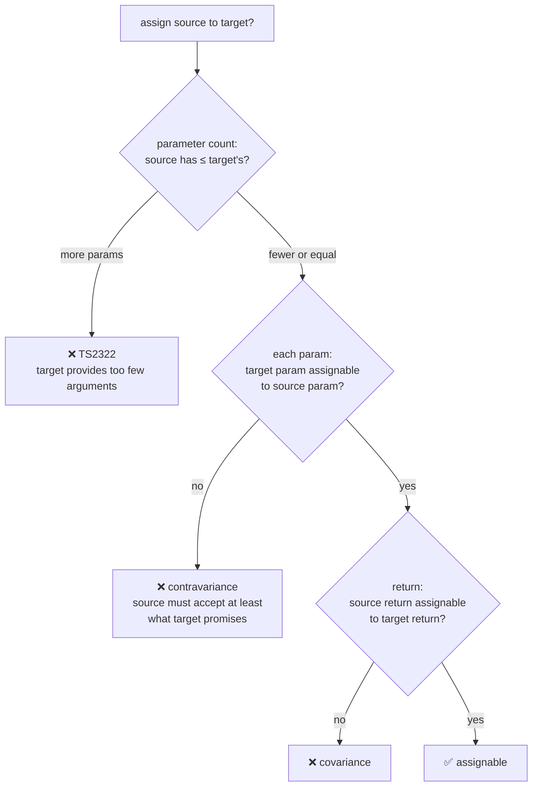
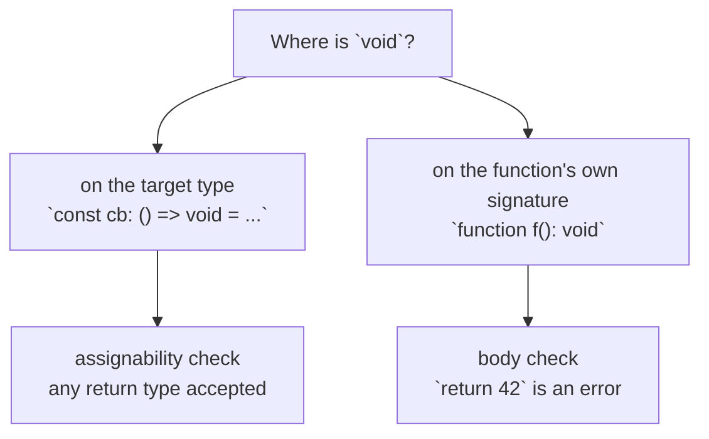

# 04 — Functions

## Why this exists

Functions are where types earn their keep: every call site is a contract.
TypeScript lets you describe exactly what a function accepts, what it
returns, what `this` is inside it — and even different behaviors for
different argument shapes (overloads). Get this module right and most
"wrong argument" bugs die in the editor.

## A function is a contract



*What to notice: a function type has three parts the checker can see —
parameters, `this`, and the return. Every rule in this module is about one
of the three.*

## Minimal syntax

```ts
// A function TYPE (the shape of a function value)
type Discount = (price: number, percent: number) => number

const applyDiscount: Discount = (price, percent) => price * (1 - percent / 100)

// optional, default, rest
function shout(text: string, suffix = '!'): string {        // default ⇒ optional
  return text.toUpperCase() + suffix
}
function longest(...words: string[]): string | undefined {  // rest
  return words.sort((a, b) => b.length - a.length)[0]
}
```

## Map of this module

| Section | Exercise |
| --- | --- |
| Three ways to write a function · Annotating parameters and returns · Function types · Contextual typing · Call and construct signatures · `typeof fn` · Giving a declaration a type | ex01 |
| Optional parameters · Default parameters · "Was it passed?" vs "is it truthy?" · Destructured parameters | ex02 |
| Rest parameters · Tuple rests and spreading · `Parameters<typeof fn>` | ex03 |
| Overloads · Overload errors · Union or overload? · Overloads in interfaces | ex04 |
| Typing `this` · Arrows and lexical `this` | ex05 |
| The `void` return quirk · `never`-returning functions | ex06 |
| Function assignability · Higher-order functions · Closures and currying · `Function` is an anti-pattern | ex07 |
| Async preview · Reading compiler errors · What survives at runtime | checkpoint |

### Three ways to write a function

JavaScript has three syntaxes; TypeScript types all three the same way.
The differences are hoisting and `this` — not types.

```ts
// 1. declaration — hoisted, has its own `this`
function area(w: number, h: number): number {
  return w * h
}

// 2. expression — a value stored in a const
const perimeter = function (w: number, h: number): number {
  return 2 * (w + h)
}

// 3. arrow — a value, no own `this` (see "Typing this")
const diagonal = (w: number, h: number): number => Math.hypot(w, h)
```

| | Declaration | Expression | Arrow |
| --- | --- | --- | --- |
| Hoisted (usable before its line) | ✅ | ❌ | ❌ |
| Own `this` | ✅ | ✅ | ❌ (captures outer) |
| Can be overloaded | ✅ | ❌ | ❌ |
| Can be typed by an alias | ❌ (annotate inline) | ✅ `const f: Alias = ...` | ✅ |

### Annotating parameters and return types

Parameters need annotations — TS cannot guess what a caller will send.
Return types are usually inferred from the `return` statements.

```ts
// ❌ error TS7006: Parameter 'items' implicitly has an 'any' type.
function countWrong(items) {
  return items.length
}

// ✅ parameters annotated; return type inferred as number
function count(items: string[]) {
  return items.length
}
```

Annotate the return anyway in three situations:

| Situation | Why |
| --- | --- |
| Public API (exported functions) | The contract is stated, not accidental. Changing the body cannot silently change the type. |
| Literal returns | `return 'ok'` infers `string`, not `'ok'`. Annotate `: 'ok'` to keep the literal. |
| Recursion | TS cannot infer a type that depends on itself. |

```ts
function statusLoose() {
  return 'ok'          // inferred: string (widened)
}
function status(): 'ok' {
  return 'ok'          // kept: 'ok'
}

// ❌ error TS7023: 'depth' implicitly has return type 'any' because it does not have a return type annotation and is referenced directly or indirectly in one of its return expressions.
function depth(n: number) {
  return n <= 0 ? 0 : 1 + depth(n - 1)
}
// ✅ annotate: function depth(n: number): number
```

Gotcha: a missing `return` in an annotated function is caught too —
TS2355 *"A function whose declared type is neither 'undefined', 'void',
nor 'any' must return a value."*

### Function types

A function type describes a function *value*: its parameters and its
return. It lets you name a shape once and reuse it for many functions.

```ts
type Validator = (input: string) => boolean

const notEmpty: Validator = (input) => input.length > 0
const isEmail: Validator = (input) => input.includes('@')

function runAll(input: string, checks: Validator[]): boolean {
  return checks.every((check) => check(input))
}
runAll('ada@example.com', [notEmpty, isEmail])   // true
```

The arrow in a *type* (`=>`) is not a function — it is the syntax that
separates parameters from the return. Parameter names in a function type
are required but they are only documentation; `(s: string) => boolean`
and `(input: string) => boolean` are the same type.

### Contextual typing: parameters inferred from the target

When a function is assigned to something with a known function type, TS
reads the parameter types *from the target*. You do not repeat them.



*What to notice: the types flow from the annotation into the parameters,
then the body's return is checked against the annotation. That is why
`(input) =>` needs no `: string`.*

```ts
type Validator = (input: string) => boolean

const short: Validator = (input) => input.length < 10   // input: string

const scores = [70, 85, 92]
scores.filter((s) => s >= 80)                            // s: number

// ❌ error TS2345: Argument of type '(s: string) => number' is not assignable to parameter of type '(value: number, index: number, array: number[]) => number'.
scores.map((s: string) => s.length)
```

Gotcha: re-annotating a callback parameter is at best noise and at worst
a lie the compiler must reject. Let the target type do the work.

### Call signatures and construct signatures

A function is an object. Sometimes it also carries properties — think
`fetchUser.cacheSize`. A **call signature** inside an object type
describes both. A **construct signature** (`new (...) => T`) describes
something you call with `new` — a class.

```ts
type Formatter = {
  (value: number): string     // call signature
  currency: string            // extra property
}

const usd: Formatter = Object.assign(
  (value: number) => `$${value.toFixed(2)}`,
  { currency: 'USD' },
)
usd(9.5)        // '$9.50'
usd.currency    // 'USD'
```

```ts
class Point {
  x: number
  y: number
  constructor(x: number, y: number) {
    this.x = x
    this.y = y
  }
}

type PointCtor = new (x: number, y: number) => Point

const make: PointCtor = Point     // a class IS a construct-signature value
const origin = new make(0, 0)     // Point
```

| Syntax | Reads as |
| --- | --- |
| `(a: A) => R` | function type expression — the short form |
| `{ (a: A): R }` | call signature — same thing, room for properties |
| `new (a: A) => R` | construct signature — callable with `new` |
| `{ (a: A): R; (b: B): R2 }` | two call signatures = overloads (see below) |

### `typeof fn` — the type of an existing function

You already have a function and want its type? `typeof` in a *type
position* reads it off the value. No need to write the signature twice.

```ts
function toCents(amount: number) {
  return Math.round(amount * 100)
}

type ToCents = typeof toCents          // (amount: number) => number
const mock: ToCents = () => 0          // fewer parameters is fine (see assignability)
```

### How to give a function declaration a type

An alias annotates a **value**: a `const`, a parameter, or a return. A
`function` declaration has no value slot to annotate — you annotate its
parameters and return inline. And `<T>` after a function name never
*applies* a type; it always **declares** a new type parameter.



*What to notice: angle brackets on a function are a declaration site, like
`let`. Writing `<Discount>` invents a type variable that hides the alias.*

```ts
type Discount = (price: number, percent: number) => number

// ❌ error TS7006: Parameter 'price' implicitly has an 'any' type.
function offWrong<Discount>(price, percent) {
  return price * (1 - percent / 100)
}
```

The `<Discount>` did nothing for `price` and `percent` — they are still
untyped. Three correct spellings:

```ts
type Discount = (price: number, percent: number) => number

// 1. a const typed by the alias — parameters inferred
const off: Discount = (price, percent) => price * (1 - percent / 100)

// 2. a declaration — annotate inline
function offDecl(price: number, percent: number): number {
  return price * (1 - percent / 100)
}

// 3. a declaration, then prove it matches the alias
const offChecked: Discount = offDecl
```

Gotcha: `function f<T>(x: T)` is a *generic* function (module 07). If you
see `<...>` right after a function name, read it as "introduce a type
variable", never "use this alias".

### Optional parameters `?`

`?` makes a parameter omittable by the caller. Inside the body it is
`T | undefined`, because the caller may have left it out.

```ts
function slice(text: string, end?: number): string {
  // end: number | undefined
  if (end === undefined) return text
  return text.slice(0, end)
}
slice('typescript')       // 'typescript'
slice('typescript', 4)    // 'type'
```

`x?: number` is not the same as `x: number | undefined`. The second still
*requires* an argument — the caller must write `undefined` explicitly.

```ts
function withUnion(end: number | undefined): number {
  return end ?? 0
}
// ❌ error TS2554: Expected 1 arguments, but got 0.
withUnion()
withUnion(undefined)    // ✅ the argument is present, its value is undefined
```

Optional parameters must come after required ones — otherwise the
caller could never skip them.

```ts
// ❌ error TS1016: A required parameter cannot follow an optional parameter.
function bad(end?: number, text: string) {}
```

### Default parameters `= v`

A default fills in a value when the caller passes nothing. The parameter
becomes optional for callers, but inside the body its type is plain `T`
— the `undefined` case is gone.

```ts
function repeat(text: string, times = 2, separator = ' '): string {
  // times: number, separator: string — no undefined here
  return Array(times).fill(text).join(separator)
}
repeat('ha')            // 'ha ha'
repeat('ha', 3, '-')    // 'ha-ha-ha'
```

The parameter's type is inferred from the default (`times = 2` ⇒ `number`).
Annotate when the default is narrower than what you accept — `mode = 'safe'`
infers `string`; write `mode: 'fast' | 'safe' = 'safe'` to keep the union.

A default may use earlier parameters — they are already in scope:

```ts
function clip(text: string, start = 0, end = text.length): string {
  return text.slice(start, end)
}
```

Gotcha: a default can sit before a required parameter, but then callers
must pass `undefined` to reach it. Put defaults last.

### "Was it passed?" vs "is it truthy?"

A default parameter fires only when the argument is **`undefined`**. It
does not fire for `''`, `0`, `null`, or `false` — those are real values
the caller chose to send. `||` behaves differently: it replaces anything
falsy. Confusing these two is a classic source of bugs.

```ts
function label(text: string, prefix = '> ') {
  return prefix + text
}
label('a')               // '> a'    — nothing passed, default fires
label('a', undefined)    // '> a'    — undefined counts as "not passed"
label('a', '')           // 'a'      — '' is a value; the default does NOT fire

function labelOr(text: string, prefix?: string) {
  return (prefix || '> ') + text
}
labelOr('a', '')         // '> a'    — || treats '' as missing
```



*What to notice: the default parameter is the strictest — it only reacts
to `undefined`. `??` also catches `null`. `||` catches every falsy value,
including ones you probably meant to keep.*

| Value of `x` | `x ?? d` | `x \|\| d` | default param `x = d` | `x !== undefined` |
| --- | --- | --- | --- | --- |
| not passed | `d` | `d` | `d` | `false` |
| `undefined` | `d` | `d` | `d` | `false` |
| `null` | `d` | `d` | `null` | `true` |
| `''` | `''` | `d` | `''` | `true` |
| `0` | `0` | `d` | `0` | `true` |
| `false` | `false` | `d` | `false` | `true` |
| `'hi'` | `'hi'` | `'hi'` | `'hi'` | `true` |

Rule: "was it passed?" ⇒ default parameter or `=== undefined`.
"Is it null-ish?" ⇒ `??`. "Is it falsy?" ⇒ `||` — and think twice.

### Optional vs default vs rest — the comparison

| | Optional `x?: T` | Default `x: T = v` | Rest `...xs: T[]` |
| --- | --- | --- | --- |
| Caller may omit | ✅ | ✅ | ✅ (zero or more) |
| Type inside body | `T \| undefined` | `T` (default fills in) | `T[]` (never undefined) |
| Position | after required | anywhere (but odd mid-list) | last only |
| Fires on `undefined` argument | — (you see `undefined`) | ✅ default replaces it | collected as an element |
| Fires on `''` / `0` / `null` | — | ❌ value kept | collected as an element |
| Erased at runtime? | ✅ | ❌ (becomes an `=== undefined` check) | ❌ (real JS syntax) |
| Reach for it when | the body branches on "given or not" | you have a sensible fallback | "any number of" |

### Destructured parameters with types and defaults

An options object is destructured in the parameter list. The type goes
after the whole pattern; per-field defaults go inside the pattern.

```ts
type ConnectOptions = { host: string; port?: number; tls?: boolean }

function connect({ host, port = 5432, tls = false }: ConnectOptions): string {
  // port: number, tls: boolean — the defaults removed undefined
  return `${tls ? 'pg+tls' : 'pg'}://${host}:${port}`
}
connect({ host: 'db.local' })               // 'pg://db.local:5432'
connect({ host: 'db.local', tls: true })    // 'pg+tls://db.local:5432'
```

Make the *whole* object optional by defaulting it to `{}` — then every
field needs a default or `?`:

```ts
function paginate({ page = 1, size = 20 }: { page?: number; size?: number } = {}) {
  return { offset: (page - 1) * size, limit: size }
}
paginate()               // { offset: 0, limit: 20 }
paginate({ page: 3 })    // { offset: 40, limit: 20 }
```

Gotcha: `function f({ host, port }: ConnectOptions = {})` fails — `{}`
is missing the required `host`. The default must satisfy the type.

### Rest parameters

`...xs: T[]` collects "all remaining arguments" into a real array. It
must be the last parameter, and its type must be an array or a tuple.

```ts
function tag(name: string, ...classes: string[]): string {
  // classes: string[] — always an array, possibly empty
  return classes.length === 0 ? `<${name}>` : `<${name} class="${classes.join(' ')}">`
}
tag('div')                     // '<div>'
tag('div', 'card', 'wide')     // '<div class="card wide">'

// ❌ error TS1014: A rest parameter must be last in a parameter list.
function tagWrong(...classes: string[], name: string) {}
```

Rest is the typed replacement for the old `arguments` object.

### Tuple rests and spreading into a call

A rest parameter typed as a **tuple** fixes the count and the per-position
types. That is also what lets you *spread* a tuple into a call.

```ts
function move(...coords: [x: number, y: number]): string {
  return `moved to ${coords[0]},${coords[1]}`
}
move(3, 4)                             // exactly two numbers

const target: [number, number] = [7, 1]
move(...target)                        // ✅ tuple length is known: 2

const loose = [7, 1]                   // number[] — length unknown
// ❌ error TS2556: A spread argument must either have a tuple type or be passed to a rest parameter.
move(...loose)
```



*What to notice: an array does not know its length, so it can only be
spread into a rest parameter. A tuple does know, so it can fill fixed
positions.*

Tuple element labels (`x: number`) are documentation only. A `readonly`
tuple (`[7, 1] as const`) spreads too. Mixing is allowed: `(first: string,
...rest: [number, boolean])`.

### `Parameters<typeof fn>` — a preview

The built-in `Parameters` type reads a function's parameter list as a
tuple. Module 08 shows how it is built; here it is useful for
"call this later with the same arguments":

```ts
function send(to: string, body: string, urgent = false) {
  return `${urgent ? '!' : ''}${to}: ${body}`
}

type SendArgs = Parameters<typeof send>     // [to: string, body: string, urgent?: boolean]

const queued: SendArgs = ['ada', 'hello']
send(...queued)
```

### Overloads: one function, several contracts

Sometimes the return type depends on the *argument* type: pass a string,
get a `string[]`; pass a number, get a `number[]`. A union return
(`string[] | number[]`) makes every caller narrow. Overloads give each
call its precise type.

Write the specific signatures first, then one (wider) implementation that
handles them all. Callers only see the overloads — never the
implementation signature.

```ts
function parseId(raw: string): number
function parseId(raw: number): string
function parseId(raw: string | number): number | string {
  return typeof raw === 'string' ? Number(raw) : String(raw)
}

const asNumber = parseId('42')    // number
const asString = parseId(42)      // string
```



*What to notice: overloads are tried top-to-bottom, first match wins — and
the implementation signature is invisible to callers.*

Order matters. Put the most specific overload first; if a wide one comes
first it swallows every call.

### Overload errors: TS2394 and TS2769

Two errors cover almost every overload mistake.

**TS2394** — the implementation cannot handle one of the promises:

```ts
function stamp(when: Date): string
// ❌ error TS2394: This overload signature is not compatible with its implementation signature.
function stamp(when: boolean): string
function stamp(when: Date | number): string {
  return String(when)
}
```

The second overload accepts `boolean`, but the implementation only
accepts `Date | number`. Widen the implementation, or drop the overload.

**TS2769** — the call matches no overload, even if the implementation
could handle it:

```ts
function stamp(when: Date): string
function stamp(when: number): string
function stamp(when: Date | number): string {
  return String(when)
}
// ❌ error TS2769: No overload matches this call.
stamp(true)
```

The implementation signature is not a fallback. Only the listed
overloads exist for callers.

### Union parameter or overloads?

Overloads are heavier than a union. Reach for them only when the
*return* type changes with the input.

| Situation | Use |
| --- | --- |
| Same return type, several input types | union parameter `(x: string \| number)` |
| Return type depends on input type | overloads |
| Different *numbers* of arguments with different meanings | overloads |
| Caller might pass a union value | union — an overload set rejects `string \| number` unless one overload accepts it |

```ts
// same return either way — a union is simpler and accepts a union argument
function normalize(id: string | number): string {
  return String(id).trim()
}
const mixed: string | number = Math.random() > 0.5 ? 7 : '7'
normalize(mixed)     // ✅
```

Gotcha: the implementation signature is checked *loosely* against the
overloads. An implementation that is wider than any overload compiles
fine and can hide mistakes — keep the overloads tight and the
implementation body defensive.

### Overloads in interfaces and on methods

Interfaces list overloads as repeated members. A function declaration
with matching overloads satisfies them; a method in a class can carry
its own overload list the same way.

```ts
interface Settings {
  read(key: string): string | undefined
  read(key: string, fallback: string): string
}

const store = new Map<string, string>()

function readSetting(key: string): string | undefined
function readSetting(key: string, fallback: string): string
function readSetting(key: string, fallback?: string) {
  return store.get(key) ?? fallback
}

const settings: Settings = { read: readSetting }
settings.read('theme')            // string | undefined
settings.read('theme', 'light')   // string
```

### Typing `this`

Inside a plain `function`, `this` is whatever the *caller* attached it
to. With `noImplicitThis` TS refuses to guess. A fake first parameter
named `this` states what it must be — and is erased from the real
parameter list.

```ts
// ❌ error TS2683: 'this' implicitly has type 'any' because it does not have a type annotation.
function describeWrong() { return this.name }

// ✅ declare what `this` must be
function describe(this: { name: string }) {
  return `I am ${this.name}`
}
describe.call({ name: 'kettle' })   // 'I am kettle'
describe.length                     // 0 — `this` is not a real parameter
```

Its main job is protecting methods that get *detached* from their
object. Detach a method, and `this` becomes `undefined` at runtime — the
`this` parameter turns that into a compile error.

```ts
interface Stopwatch {
  ticks: number
  tick(this: Stopwatch): number
}

const watch: Stopwatch = {
  ticks: 0,
  tick() { return ++this.ticks },
}
watch.tick()               // ✅ 1 — called ON the object

const loose = watch.tick
// ❌ error TS2684: The 'this' context of type 'void' is not assignable to method's 'this' of type 'Stopwatch'.
loose()
```

Two helpers read the `this` type back: `ThisParameterType<typeof
describe>` is `{ name: string }`, and `OmitThisParameter<typeof describe>`
is `() => string` — the type of `describe.bind(obj)`.

### Arrow functions and lexical `this`; `this: void`

Arrow functions have no `this` of their own. They *capture* the `this`
of the surrounding scope at creation time, so you cannot declare a
`this` parameter on one — there is nothing to declare.



*What to notice: for `function`s the call site decides `this`; for arrows
the definition site does. Use a regular method when you need a `this`
parameter, an arrow when you need to capture it.*

```ts
const timer = {
  label: 'build',
  start() {
    // the arrow captures the method's `this` — still the timer
    return [1, 2].map((n) => `${this.label} step ${n}`)
  },
}
timer.start()   // ['build step 1', 'build step 2']
```

`this: void` says the opposite: *nobody* may rely on `this` here. Use
it for callbacks that will be invoked without a receiver.

```ts
function onTick(this: void, count: number) {
  // ❌ error TS2339: Property 'label' does not exist on type 'void'.
  return this.label + count
}
```

### The `void` return quirk

A callback typed `() => void` **may return anything** — the value is just
ignored. This is deliberate: it lets you pass `(n) => results.push(n)`
where a `(n: number) => void` is expected, even though `push` returns a
number.

```ts
const seen: number[] = []
const input = [3, 1, 2]

input.forEach((n) => seen.push(n))     // ✅ push returns number; forEach wants void

function runLater(task: () => void) {
  task()
}
runLater(() => 42)                     // ✅ the 42 is thrown away
```

The leniency applies only when `void` is on a **type the function is
assigned to**. Put `void` on the function's **own** signature and the body
is checked strictly:

```ts
const cb: () => void = () => 42        // ✅ assignability: result will be ignored

// ❌ error TS2322: Type 'number' is not assignable to type 'void'.
function tidy(): void { return 42 }
```



*What to notice: same word, two checks — the assignment, or the body.*

`undefined` has no such leniency. `() => undefined` means exactly that:

```ts
// ❌ error TS2322: Type '() => number' is not assignable to type '() => undefined'.
const strict: () => undefined = () => 42
```

Gotcha: the quirk is one-directional. A `() => void` callback's *result*
is typed `void` and is unusable — `const x = cb()` gives you a `void`,
not the `42`. If you need the value, type the callback's return.

### `never`-returning functions

A function that never returns normally — it always throws, or loops
forever — has return type `never`. Nothing after a `never` call is
reachable, and TS uses that for narrowing.

```ts
function fail(message: string): never {
  throw new Error(message)
}

function parsePort(raw: string): number {
  const port = Number(raw)
  if (Number.isNaN(port)) fail(`not a port: ${raw}`)
  return port     // ✅ TS knows fail() never comes back
}
```

Annotate `: never` explicitly on declarations — a `function` that only
throws is inferred as `void`, not `never` (only arrows and expressions
infer `never`).

The most useful `never` function is `assertNever` — a compile-time
"this branch is impossible" check. Module 05 uses it for exhaustive
switches:

```ts
function assertNever(value: never): never {
  throw new Error(`Unexpected value: ${JSON.stringify(value)}`)
}
```

### Function assignability: which functions fit where?

When is `(a: A) => R` assignable to `(b: B) => S`? Three checks, one
diagram.



*What to notice: parameters are checked "backwards" (target → source) and
returns "forwards" (source → target). Fewer parameters is always fine —
the extra arguments are simply ignored.*

```ts
type Handler = (event: string, at: number) => void

const brief: Handler = (event) => console.log(event)          // ✅ fewer params
const full: Handler = (event, at) => console.log(event, at)   // ✅ exact

type OneArg = (event: string) => void
// ❌ error TS2322: Type '(event: string, at: number) => void' is not assignable to type 'OneArg'.
const greedy: OneArg = (event: string, at: number) => console.log(event, at)
```

Parameter types are **contravariant** under `strictFunctionTypes`: a
handler must accept *at least* what its type promises. Return types are
**covariant**: the function may return something *more* specific.

```ts
type Shape = { area: number }
type Circle = Shape & { radius: number }

type OnShape = (s: Shape) => void
type MakeShape = () => Shape

// ❌ error TS2322: Type '(c: Circle) => void' is not assignable to type 'OnShape'.
const onCircle: OnShape = (c: Circle) => { console.log(c.radius) }   // needs MORE than promised

const makeCircle: MakeShape = () => {
  const c: Circle = { area: 3.14, radius: 1 }
  return c                                            // ✅ returns MORE than promised
}
```

Two more rules a fluent developer knows:

| Rule | Detail |
| --- | --- |
| Method shorthand is bivariant | `{ handle(s: Shape): void }` accepts `(c: Circle) => void`. Property syntax `{ handle: (s: Shape) => void }` does not. Prefer property syntax for callbacks. |
| Optional ↔ required parameters | `(x?: number) => void` and `(x: number) => void` are assignable to each other in both directions — TS allows this on purpose. |

### Higher-order functions: taking functions

A higher-order function takes a function, returns one, or both. Typing
the "takes" direction is just a parameter with a function type. Callers
then get contextual typing for free.

```ts
type Predicate = (word: string) => boolean

function countWhere(words: string[], keep: Predicate): number {
  let n = 0
  for (const word of words) if (keep(word)) n++
  return n
}

countWhere(['ada', 'grace', 'linus'], (word) => word.length > 3)   // 2
```

### Returning functions: closures and currying

The "returns" direction: the return type is itself a function type.
Variables of the outer function stay alive inside the returned one — a
**closure**. Type the returned function and TS checks its body like any
other.

```ts
function makeIdGenerator(prefix: string): () => string {
  let next = 1                       // captured by the closure
  return () => `${prefix}-${next++}`
}
const orderId = makeIdGenerator('ord')
orderId()    // 'ord-1'
orderId()    // 'ord-2'
```

**Currying** is one parameter per call. Each arrow returns the next arrow;
TS infers the whole chain.

```ts
const between = (lo: number) => (hi: number) => (n: number) => n >= lo && n <= hi
//    (lo: number) => (hi: number) => (n: number) => boolean

const isPercent = between(0)(100)   // (n: number) => boolean
isPercent(42)                       // true
```

Composing functions is the same idea with two inputs:

```ts
type Step = (text: string) => string

function compose(first: Step, second: Step): Step {
  return (text) => second(first(text))      // text: string — contextual
}

const shout = compose((t) => t.trim(), (t) => t.toUpperCase() + '!')
shout('  hi ')   // 'HI!'
```

Every step here is `string => string`. Module 07 makes `compose` generic
so any types flow through: `compose<A, B, C>(f: (a: A) => B, g: (b: B) => C)`.

### `Function` is an anti-pattern

The global `Function` type means "some callable thing". Calling it
returns `any` and checks no arguments — it is `any` wearing a hat.

```ts
function runLoose(fn: Function) {
  return fn(1, 'two', false)          // compiles, returns any — nothing checked
}

// ✅ say what you actually accept
function run(fn: (...args: unknown[]) => unknown) {
  return fn(1, 'two', false)          // returns unknown — you must narrow
}
```

Rule: always spell the signature, even a vague one like `(...args:
unknown[]) => unknown`.

### Async functions — a preview

`async` wraps the return in a `Promise`. Annotate `Promise<T>`, never
the bare `T`. Module 10 covers the rest.

```ts
async function loadCount(): Promise<number> {
  return 3                     // wrapped: Promise<number>
}

// ❌ error TS1064: The return type of an async function or method must be the global Promise<T> type. Did you mean to write 'Promise<number>'?
async function loadWrong(): number {
  return 3
}
```

### Reading compiler errors

| Code | Message (abridged) | What it is telling you |
| --- | --- | --- |
| TS7006 | Parameter 'x' implicitly has an 'any' type | Annotate the parameter — or give the function a contextual type |
| TS2554 | Expected 2 arguments, but got 1 | Count mismatch. Make the parameter optional/default, or pass it |
| TS2345 | Argument of type 'X' is not assignable to parameter of type 'Y' | Wrong type at one call site |
| TS2322 | Type '(a, b) => ...' is not assignable to type 'F' | The whole function does not fit the slot — check arity, params, return |
| TS2355 | A function whose declared type is neither 'undefined', 'void', nor 'any' must return a value | A code path ends without `return` |
| TS2394 | This overload signature is not compatible with its implementation signature | Widen the implementation |
| TS2769 | No overload matches this call | The call fits no listed overload — the implementation is not tried |
| TS2683 | 'this' implicitly has type 'any' | Add a `this:` parameter or use an arrow |
| TS2684 | The 'this' context of type 'void' is not assignable to method's 'this' | A method was called detached |
| TS2556 | A spread argument must either have a tuple type or be passed to a rest parameter | Spread a tuple, or make the target a rest param |

### What survives at runtime

| Feature | At runtime |
| --- | --- |
| Parameter and return annotations | erased |
| Function type aliases, call/construct signatures | erased |
| Overload signatures | erased — only the implementation is emitted |
| `this` parameter | erased — `fn.length` does not count it |
| Optional `?` | erased — the argument is simply `undefined` |
| Default `= v` | **kept** — real JS, runs an `undefined` check |
| Rest `...xs` | **kept** — real JS |
| Arrow vs `function` | **kept** — `this` behavior is a runtime fact |

```ts
function ship(order: string, express = false, ...notes: string[]) {
  return { order, express, notes }
}

typeof ship     // 'function'
ship.length     // 1 — counts parameters before the first default or rest
ship.name       // 'ship'
```

## Rules to remember

- Annotate parameters; let returns infer — except for public APIs,
  literal returns, and recursion.
- An alias types a **value** (`const f: Alias`). A `function` declaration
  is typed inline. `<T>` always declares.
- Default parameters fire on `undefined` only. `??` adds `null`; `||`
  adds every falsy value.
- Rest must be last; spread a **tuple** into fixed positions, an
  **array** only into a rest parameter.
- Overloads: specific first, one wide implementation, implementation
  invisible to callers.
- `this` parameter: fake, erased, guards detached calls. Arrows capture
  `this`; they cannot declare it.
- `() => void` callbacks may return anything; `function f(): void` may not.
- Fewer parameters fit; extra ones do not. Parameters check backwards,
  returns check forwards.

The leniency applies only when `void` is on a **type the function is
assigned to**. Put `void` on the function's **own** signature and the body
is checked strictly:

```ts
const cb: () => void = () => 42;   // OK — assignability: result will be ignored
function f(): void { return 42; }  // Error — body check: promised to return nothing
```


*Same word, two checks: the assignment, or the body.*

`undefined` has no such leniency — `() => undefined` rejects `() => 42`.

## Common gotchas

- Optional parameters are `T | undefined` inside the body; defaults are not.
- Overload implementations must be **compatible with every overload** —
  and the implementation signature is not callable directly.
- `(x?: number)` and `(x: number | undefined)` differ: the second still
  requires an argument.
- Contextual typing means callback parameters usually need no annotations:
  `nums.map(n => n * 2)` — `n` is already `number`. Re-annotating with a
  different type is an error, not a cast.
- `function f<Alias>()` does not apply `Alias` — it declares a new type
  parameter that shadows it.
- A `function` that only throws infers `void`, not `never`. Annotate.

## Try it now

→ `exercises/ex01.ts` through `ex07.ts`, then `checkpoint.ts`.
Check with `npm test -- 04`.
