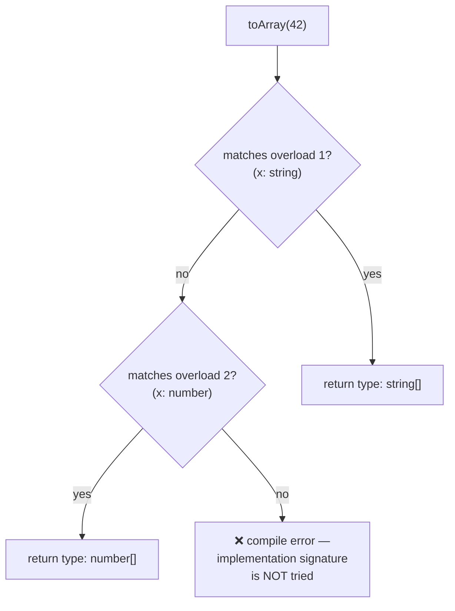

# 04 — Functions

## Why this exists

Functions are where types earn their keep: every call site is a contract.
TypeScript lets you describe exactly what a function accepts, what it
returns, what `this` is inside it — and even different behaviors for
different argument shapes (overloads).

## Minimal syntax

```ts
// A function TYPE (shape of a function value)
type BinaryOp = (a: number, b: number) => number

const add: BinaryOp = (a, b) => a + b   // params inferred from the type!

// optional, default, rest
function greet(name: string, greeting = 'Hello'): string {   // default ⇒ optional
  return `${greeting}, ${name}!`
}
function sum(...nums: number[]): number {                    // rest
  return nums.reduce((s, n) => s + n, 0)
}
```

## Parameter kinds compared

| | Optional `x?: T` | Default `x: T = v` | Rest `...xs: T[]` |
| --- | --- | --- | --- |
| Caller may omit | ✅ | ✅ | ✅ (zero or more) |
| Type inside body | `T \| undefined` | `T` (default fills in) | `T[]` |
| Position | after required | anywhere (but odd mid-list) | last only |

## Overloads: one function, several contracts

Write the specific signatures first, then one (wider) implementation that
handles them all. Callers only see the overloads — never the
implementation signature.

```ts
function toArray(x: string): string[]
function toArray(x: number): number[]
function toArray(x: string | number): string[] | number[] {
  return typeof x === 'string' ? x.split('') : [...String(x)].map(Number)
}
```



*What to notice: overloads are tried top-to-bottom, first match wins — and
the implementation signature is invisible to callers.*

## Typing `this`

A fake first parameter named `this` types what `this` must be — it's
erased from the real parameter list:

```ts
interface Counter { count: number; increment(this: Counter): number }
```

Now `counter.increment()` is fine, but detaching the method
(`const f = counter.increment; f()`) is a compile error.

## The `void` return quirk

A callback typed `() => void` **may return anything** — the return value
is just ignored. This is deliberate: it lets you write
`items.forEach((x) => results.push(x))` even though `push` returns a
number. But a variable of type `void` is unusable.

## Common gotchas

- Optional parameters are `T | undefined` inside the body; defaults are not.
- Overload implementations must be **compatible with every overload** —
  and the implementation signature is not callable directly.
- `(x?: number)` and `(x: number | undefined)` differ: the second still
  requires an argument.
- Contextual typing means callback parameters usually need no annotations:
  `nums.map(n => n * 2)` — `n` is already `number`.

## Try it now

→ `exercises/ex01.ts` through `ex07.ts`, then `checkpoint.ts`.
Check with `npm test -- 04`.
