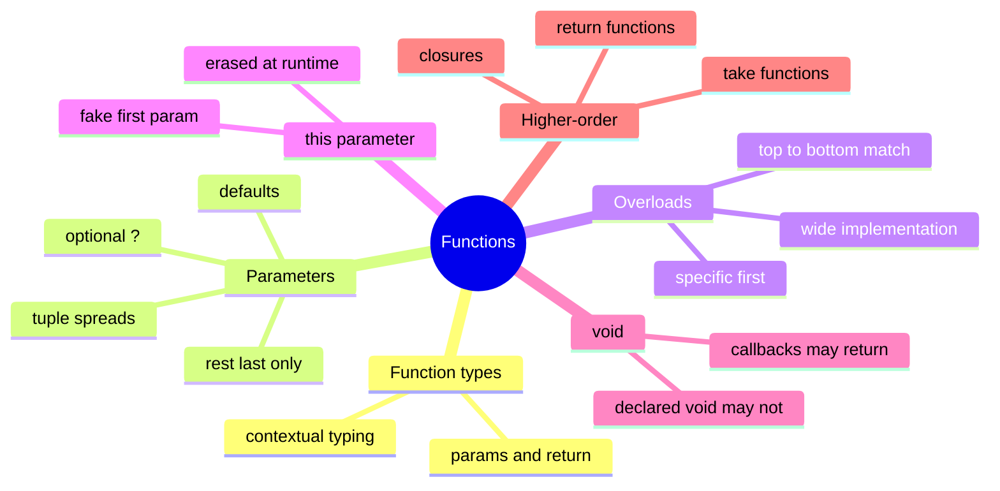

# 04 — Functions · Cheat-sheet

## Concept map



*What to notice: overloads and the `this` parameter both exist only at
compile time — the emitted JavaScript never sees them.*

## Key syntax

```ts
type Op = (a: number, b: number) => number

function greet(name: string, greeting = 'Hello'): string { ... }
function range(start: number, end?: number): number[] { ... }
function sum(...nums: number[]): number { ... }
fn(...tupleArgs)                       // spread a typed tuple

function toArray(x: string): string[]  // overload 1
function toArray(x: number): number[]  // overload 2
function toArray(x: string | number): string[] | number[] { ... }

interface Counter { increment(this: Counter): number }
```

## Rules to remember

- Default value ⇒ parameter becomes optional for callers, but is plain `T`
  inside the body. Optional (`?`) is `T | undefined` inside.
- Overloads: specific signatures first; implementation signature invisible
  to callers; first matching overload wins.
- `() => void` callback: return values are allowed and ignored.
- Contextual typing: params of a callback take their types from the
  expected function type — don't re-annotate.

## Gotchas

- `(x?: number)` ≠ `(x: number | undefined)` — the latter still requires
  an argument at the call.
- Arrow functions have no own `this` — use method/function syntax when you
  declare a `this` parameter.
- An overload implementation that doesn't cover all overloads is an error —
  but an implementation that's *wider* than any overload compiles and can
  hide mistakes. Keep overloads tight.

## Self-quiz

1. What type does `greeting` have inside `greet(name: string, greeting = 'Hello')`?
2. Why does `forEach(x => arr.push(x))` compile if `push` returns number?
3. In overload resolution, when is the implementation signature callable?
4. What does a `this: Foo` first parameter compile to in JavaScript?
5. How do you type "a function taking at least one string, then any
   number of numbers"?
6. What's the return type of `twice` given `twice(fn: (n: number) => number)`?

<details><summary>Answers</summary>

1. `string` — defaults remove `undefined` inside the body.
2. The callback is *typed* `=> void`, and void-typed callbacks may return
   anything; it's ignored.
3. Never — callers only see the overload signatures.
4. Nothing — it's erased; it exists only for checking.
5. `(first: string, ...rest: number[]) => ...`
6. `(n: number) => number` — a new function of the same shape.

</details>
