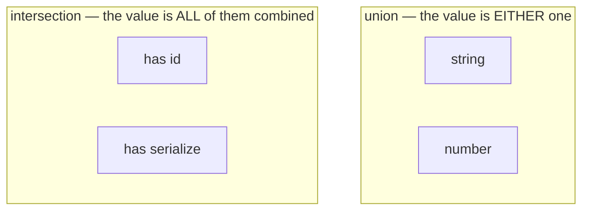
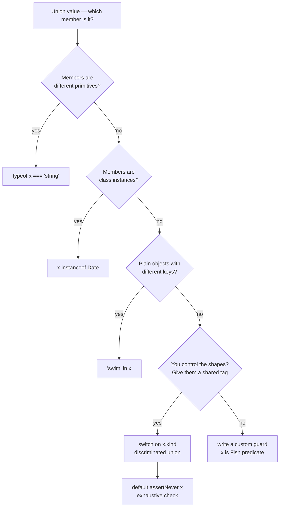

# 05 — Unions & Narrowing

## Why this exists

Real data is usually "one of several shapes": an id is a string *or* a
number, a request is loading *or* done *or* failed. Unions let the type
system model that honestly — and narrowing is how you *prove* to the
compiler which shape you actually hold before you use it.

## Union vs intersection



*What to notice: a union widens the possibilities (either shape), an
intersection stacks requirements (one value satisfying every member).*

| | `A \| B` (union) | `A & B` (intersection) |
| --- | --- | --- |
| A value is | one of the members | all members at once |
| Before narrowing you can use | only **common** members | every member of every part |
| Typical use | alternatives, states | composing object types |
| Surprise | must narrow before use | `string & number` = `never` |

## Minimal syntax

```ts
type Id = string | number                    // union
type Entity = { id: number } & { name: string }  // intersection

function len(x: string | unknown[]): number {
  return x.length            // ok WITHOUT narrowing: .length is common
}
```

## Narrowing — proving which member you hold



*What to notice: which tool narrows which kind of value — `typeof` for
primitives, `instanceof` for class instances, `in` for objects with
distinct keys, a discriminant tag (ended by an exhaustive `never`
default) for shapes you control, and a custom predicate for the rest.*

Also in the toolbox: **truthiness** (`if (x)` drops `null`/`undefined` —
and `''`/`0`, careful!) and **equality** (`if (x === y)` narrows both
sides to their common type).

## Discriminated unions + exhaustiveness

```ts
type State =
  | { status: 'loading' }
  | { status: 'success'; data: string }
  | { status: 'error'; message: string }

function assertNever(value: never): never {
  throw new Error(`Unhandled: ${JSON.stringify(value)}`)
}

function render(state: State): string {
  switch (state.status) {
    case 'loading': return '…'
    case 'success': return state.data      // narrowed to the variant
    case 'error': return state.message
    default: return assertNever(state)     // add a variant → compile error
  }
}
```

## Custom guards: predicates & assertions

A plain `boolean` result does **not** narrow across a function call —
TypeScript forgets what the function checked. Declare the meaning in the
signature instead:

```ts
function isFish(pet: Fish | Bird): pet is Fish {   // type predicate
  return 'swim' in pet
}

function assertIsUser(value: unknown): asserts value is User {
  if (typeof value !== 'object' || value === null) throw new Error('nope')
  // …field checks…
}

function assert(condition: unknown, msg: string): asserts condition {
  if (!condition) throw new Error(msg)
}
```

After `if (isFish(p))` the compiler knows `p: Fish`; after
`assertIsUser(v)` returns, `v: User` for the rest of the scope.

## Common gotchas

- Before narrowing, a union only offers members **shared by all** parts.
- A helper returning `boolean` narrows nothing — only `x is T` does.
- TypeScript *trusts* your predicate: wrong logic means a lying type.
- Truthiness narrowing also drops `''` and `0` — compare with `=== null`
  when empty string / zero are valid values.
- Intersections of incompatible primitives silently become `never`.
- Assertion functions need an explicit return annotation
  (`asserts x is T` or `asserts condition`) to have any effect.

## Try it now

→ `exercises/ex01.ts` through `ex08.ts`, then `checkpoint.ts`.
Check with `npm test -- 05`.
