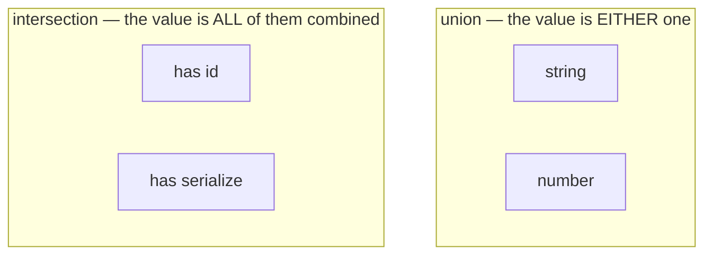
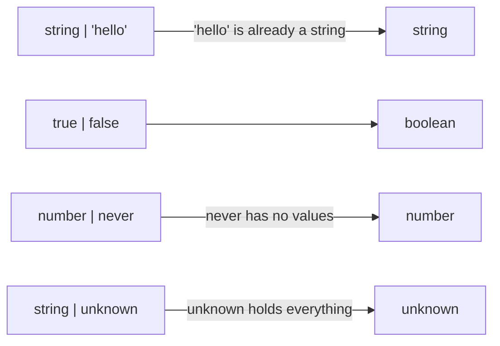
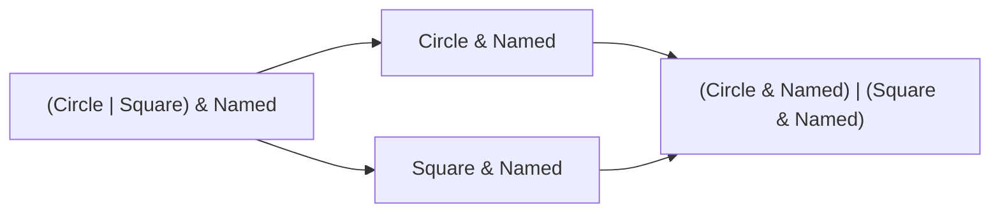
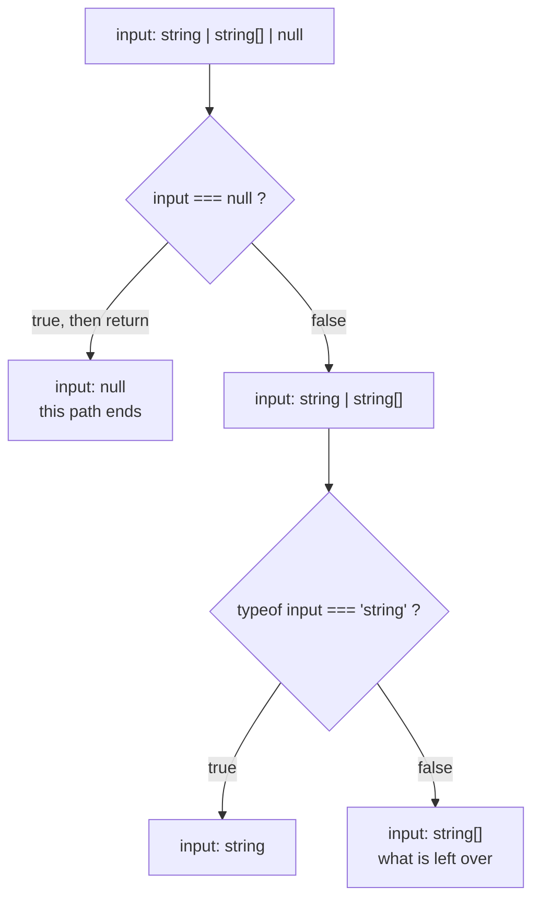
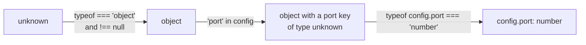
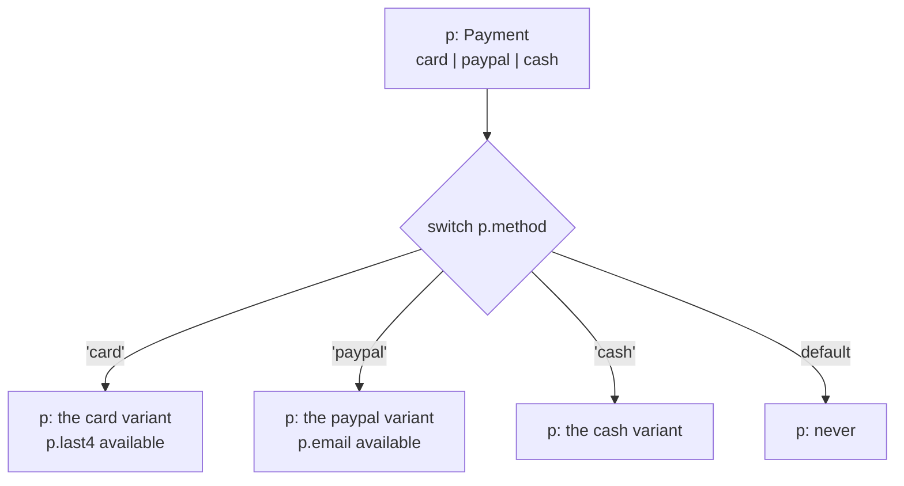
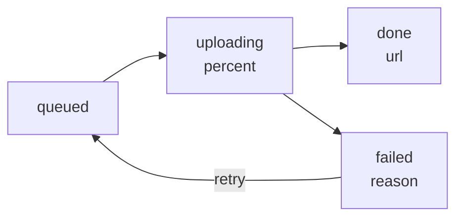
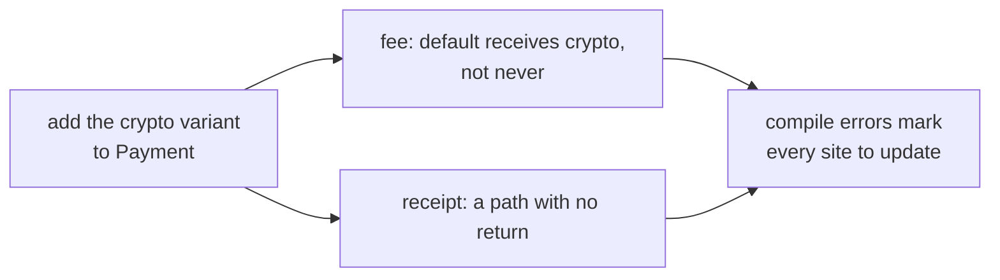
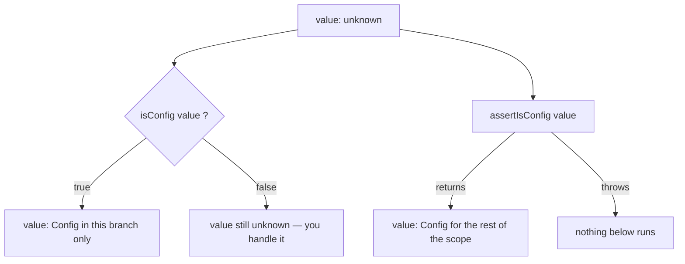
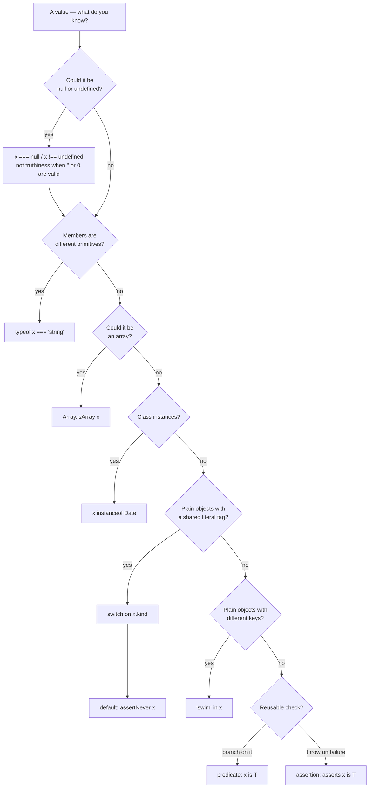

# 05 — Unions & Narrowing

## Why this exists

Real data is usually "one of several shapes": an id is a string *or* a
number, an upload is queued *or* running *or* failed. Unions let the type
system model that honestly. Narrowing is how you *prove* to the compiler
which shape you actually hold — and until you prove it, the compiler only
lets you touch what every shape has in common.

## Union vs intersection



*What to notice: a union widens the possibilities (either shape), an
intersection stacks requirements (one value satisfying every member).*

| | `A \| B` (union) | `A & B` (intersection) |
| --- | --- | --- |
| A value is | one of the members | all members at once |
| Before narrowing you can use | only **common** members | every member of every part |
| Adding a member makes the type | wider (more values fit) | narrower (fewer values fit) |
| Typical use | alternatives, states, "maybe missing" | composing object types |
| With primitives | `string \| number` — fine | `string & number` = `never` |
| Surprise | must narrow before use | clashes collapse silently |

## Minimal syntax

```ts
type Id = string | number                        // union
type Entity = { id: number } & { name: string }  // intersection

function len(x: string | unknown[]): number {
  return x.length            // ok WITHOUT narrowing: .length is common
}

function show(x: string | number): string {
  if (typeof x === 'string') return x.toUpperCase()   // narrowed: string
  return x.toFixed(2)                                 // what's left: number
}
```

## Map of this module

| Section | Exercise |
| --- | --- |
| Union types → Union parameter or overloads? | ex01 |
| Intersection types → Intersection vs `extends` | ex02 |
| Control flow, `typeof`, truthiness, equality, assignment, `&&`/`?:`, callbacks, `unknown` | ex03 |
| `in` narrowing, `instanceof` narrowing | ex04 |
| Discriminated unions, literal tags, boolean/numeric tags, state machines | ex05 |
| Exhaustiveness with `never`, adding a variant | ex06 |
| Type predicates, `filter`, inferred predicates, lying predicates | ex07 |
| Assertion functions, TS2775, casting inside a guard | ex08 |
| Everything, on a message pipeline | checkpoint |

## Unions

### Union types — one of several shapes

`A | B` is a type whose values are *either* an `A` or a `B`. The members
can be primitives, literals, or whole object types.

```ts
type Id = string | number                       // two primitives
type Priority = 'low' | 'normal' | 'urgent'     // a literal union — a tiny enum
type Money =                                    // object members — one per line reads best
  | { currency: 'USD'; cents: number }
  | { currency: 'EUR'; cents: number }

const ticket: Id = 'T-42'
const level: Priority = 'urgent'
const price: Money = { currency: 'EUR', cents: 999 }

// ❌ error TS2322: Type '"high"' is not assignable to type 'Priority'.
const oops: Priority = 'high'
```

A literal union is the everyday replacement for an `enum`: it is checked
at compile time, costs nothing at runtime, and autocompletes.

### Only common members before narrowing

The compiler does not know *which* member you hold. So it only offers
what **every** member has. Anything else is TS2339.

```ts
function describe(value: string | number): string {
  // ❌ error TS2339: Property 'toUpperCase' does not exist on type 'string | number'.
  value.toUpperCase()
  return value.toString()      // ✅ both members have toString
}

type Circle = { radius: number; color: string }
type Square = { side: number; color: string }

function paint(shape: Circle | Square): string {
  // ❌ error TS2339: Property 'radius' does not exist on type 'Circle | Square'.
  shape.radius
  return shape.color           // ✅ common to both
}
```

Read the second line of that error message — tsc names the member that
lacks the property (`Property 'radius' does not exist on type 'Square'`).
That is the member you need to rule out.

### `T | undefined` vs optional `?:`

`| undefined` says the value may be `undefined`. `?:` says the *key* may
be absent. This course's `exactOptionalPropertyTypes` keeps them apart.

```ts
type Profile = {
  nickname?: string               // key may be ABSENT
  avatarUrl: string | undefined   // key must be PRESENT, value may be undefined
}

const a: Profile = { avatarUrl: undefined }                    // ✅
const b: Profile = { nickname: 'ada', avatarUrl: undefined }   // ✅

// ❌ error TS2741: Property 'avatarUrl' is missing in type '{}' but required in type 'Profile'.
const c: Profile = {}

// ❌ error TS2375: Type '{ nickname: undefined; avatarUrl: undefined; }' is not assignable
//    to type 'Profile' with 'exactOptionalPropertyTypes: true'.
const d: Profile = { nickname: undefined, avatarUrl: undefined }
```

`| undefined` also arrives uninvited. These all produce it:

| Expression | Type | Why |
| --- | --- | --- |
| `map.get(key)` | `V \| undefined` | key may be missing |
| `list.find(...)` | `T \| undefined` | nothing may match |
| `list[i]` | `T \| undefined` | `noUncheckedIndexedAccess` |
| `profile.nickname` | `string \| undefined` | optional property |
| `process.env.HOME` | `string \| undefined` | env var may be unset |

```ts
const scores = new Map<string, number>()
const best = scores.get('ada')          // number | undefined

// ❌ error TS18048: 'best' is possibly 'undefined'.
best.toFixed(1)

if (best !== undefined) best.toFixed(1) // ✅ narrowed
```

### Array of union vs union of arrays

Where you put the parentheses changes the meaning completely.

```ts
type Mixed = (string | number)[]      // each element is a string OR a number
type Uniform = string[] | number[]    // the WHOLE array is all-strings OR all-numbers

const tags: Mixed = ['a', 1, 'b']     // ✅

// ❌ error TS2322: Type '(string | number)[]' is not assignable to type 'Uniform'.
const ids: Uniform = ['a', 1]

function inspect(list: Uniform): void {
  list.length                         // ✅ common member
  list.map((item) => String(item))    // ✅ map/filter/find work on unions of arrays
  // ❌ error TS2345: Argument of type '"x"' is not assignable to parameter of type 'never'.
  list.push('x')
}
```

`push` fails because the only value safe for *both* arrays is a
`string & number` — which is `never`. Reach for `(A | B)[]` unless you
really mean "homogeneous, but which kind is unknown".

### How TypeScript simplifies a union

The compiler removes members that are already covered by another member
(*subtype reduction*). Hovering shows the reduced type, not what you wrote.



*What to notice: a wide member swallows the narrow ones. `boolean` is
itself the union `true | false`, and `unknown` swallows the whole union.*

```ts
type Loose = string | 'hello'        // hover: string — the literal is absorbed
type Flag = true | false             // hover: boolean
type Same = 'a' | 'a' | 'b'          // hover: 'a' | 'b'
type Gone = number | never           // hover: number
type All = string | unknown          // hover: unknown

const anything: Loose = 'goodbye'    // ✅ compiles: Loose is just string
```

Gotcha: `string | 'hello'` looks like "string, but suggest `'hello'`". It
is not — it is plain `string`, and the literal is gone. Autocomplete for
"suggested but open" values needs the `string & {}` trick from module 11.

### Union parameter or overloads?

When a function accepts several types, a union parameter is the default:
one signature, one body. Overloads (module 04) earn their keep only when
the **return type** depends on which argument type came in.

```ts
// One union parameter, one body — the default choice
function formatId(id: string | number): string {
  return typeof id === 'string' ? id : `#${id}`
}

// Overloads — the return type flips with the input type
function widen(input: string): number
function widen(input: number): string
function widen(input: string | number): string | number {
  return typeof input === 'string' ? input.length : String(input)
}
const n = widen('four')    // number
const s = widen(4)         // string
```

| You need | Reach for |
| --- | --- |
| accept `A` or `B`, same return type | union parameter |
| return type depends on the argument type | overloads (or generics, module 07) |
| several *arities* (1 arg vs 2 args) | optional parameters, then overloads |

## Intersections

### Intersection types — all shapes at once

`A & B` is a type whose values satisfy `A` **and** `B`. For object types
that means "has every property of both". No narrowing is ever needed —
everything is present.

```ts
type Identified = { id: number }
type Timestamped = { createdAt: number; updatedAt: number }
type Article = Identified & Timestamped & { title: string }

const post: Article = { id: 1, createdAt: 0, updatedAt: 0, title: 'Hello' }
post.id           // ✅ every member of every part is available
post.title

// ❌ error TS2322: Type '{ id: number; updatedAt: number; title: string; }' is not assignable to type 'Article'.
//    Property 'createdAt' is missing in type '{ ... }' but required in type 'Timestamped'.
const draft: Article = { id: 2, updatedAt: 0, title: 'Draft' }
```

Use `&` to compose reusable slices (`Identified`, `Timestamped`,
`SoftDeletable`) into concrete records.

### Clashing members collapse to `never` — silently

Two primitives have no value in common, so `string & number` is `never`.
Same for a property typed differently on each side. The compiler does
**not** complain at the type alias — only when you try to make a value.

```ts
type Impossible = string & number            // never — and NO error on this line
type Clash = { id: string } & { id: number } // { id: never } — still no error

// ❌ error TS2322: Type '"hello"' is not assignable to type 'never'.
const x: Impossible = 'hello'

// ❌ error TS2322: Type 'number' is not assignable to type 'never'.
const c: Clash = { id: 1 }
```

When the clashing property is a **literal tag**, the whole object type
collapses — you cannot be a circle and a square at once:

```ts
type Both = { kind: 'circle' } & { kind: 'square' }   // never — the entire object

// ❌ error TS2322: Type 'string' is not assignable to type 'never'.
const b: Both = { kind: 'circle' }
```

Gotcha: a `never` that appears far from where you wrote the `&` is the
usual symptom of a clash. If a type "accepts nothing", hover its parts and
look for two definitions of the same property.

### Intersections distribute over unions

`(A | B) & C` becomes `(A & C) | (B & C)`. For literal unions this reads
as "keep the members both sides share". For object unions it means the
extra properties are stamped onto **every** variant — and the union still
narrows afterwards.



*What to notice: the `&` is pushed inside each union member, exactly like
multiplication over addition.*

```ts
type Overlap = ('read' | 'write' | 'admin') & ('write' | 'admin' | 'owner')
const ok: Overlap = 'write'          // ✅ 'write' | 'admin' — shared by both sides
// ❌ error TS2322: Type '"read"' is not assignable to type '"write" | "admin"'.
const no: Overlap = 'read'

type Shape = { kind: 'circle'; r: number } | { kind: 'square'; side: number }
type Named = Shape & { name: string }

function label(s: Named): string {
  if (s.kind === 'circle') return `${s.name} r=${s.r}`    // still narrows on the tag
  return `${s.name} side=${s.side}`
}
```

### Intersection vs `extends` (and optional/readonly)

`interface … extends` and `&` both combine object types. The difference
is what happens on a conflict: `extends` refuses loudly, `&` collapses
quietly.

```ts
interface Money { amount: number }

// ❌ error TS2430: Interface 'Wrong' incorrectly extends interface 'Money'.
interface Wrong extends Money { amount: string }

type Silent = Money & { amount: string }     // amount: never — compiles without a word
```

Modifiers are dropped when **any** part drops them — required beats
optional, mutable beats `readonly`:

```ts
type Loose = { name?: string; readonly tags: string[] }
type Strict = { name: string; tags: string[] }
type Merged = Loose & Strict        // name: string (required), tags: string[] (writable)

const m: Merged = { name: 'x', tags: [] }
m.tags = ['a']                      // ✅ writable
// ❌ error TS2322: Type '{ tags: never[]; }' is not assignable to type 'Merged'.
const m2: Merged = { tags: [] }
```

| | `interface X extends Y` | `type X = Y & Z` |
| --- | --- | --- |
| Conflicting property | error TS2430 | property becomes `never` |
| Works on | interfaces and object aliases | any types, including unions |
| Performance / hover | cached, shows `X` | recomputed, shows the parts |
| Reach for it when | modeling a hierarchy you own | mixing in slices, generic composition |

## Narrowing

### Control flow — how the compiler follows a variable

Narrowing is not a special syntax. It is the compiler reading your
`if`/`return`/`throw`/`switch` and shrinking a variable's type along each
path. The *declared* type never changes; the *current* type does.



*What to notice: every check removes members from the union, and the
`false` branch gets the leftovers. Order your checks so the leftovers are
exactly what you want.*

### `typeof` narrowing

`typeof x` returns one of exactly eight strings. TypeScript knows the list
and narrows on it — but the list has two famous traps.

| `typeof x` | True for | Trap |
| --- | --- | --- |
| `'string'` | strings | — |
| `'number'` | numbers, `NaN`, `Infinity` | `NaN` is a number |
| `'bigint'` | `10n` | — |
| `'boolean'` | `true`, `false` | — |
| `'symbol'` | symbols | — |
| `'undefined'` | `undefined` | — |
| `'object'` | objects, arrays, `Date`, **`null`** | `null` and arrays are `'object'` |
| `'function'` | functions **and classes** | a class is a function |

```ts
function firstLine(input: string | string[] | null): string {
  if (typeof input === 'object') {
    // input: string[] | null — typeof null is 'object' too!
    // ❌ error TS18047: 'input' is possibly 'null'.
    return input[0] ?? ''
  }
  return input                 // string
}

function firstLineFixed(input: string | string[] | null): string {
  if (input === null) return ''          // rule out null FIRST
  if (typeof input === 'string') return input
  return input[0] ?? ''                  // string[] is what's left
}
```

Typos are caught: the compiler compares your string against the eight
known results.

```ts
function isText(value: string | number): boolean {
  // ❌ error TS2367: This comparison appears to be unintentional because the types
  //    '"string" | "number" | "bigint" | "boolean" | "symbol" | "undefined" | "object" | "function"'
  //    and '"strng"' have no overlap.
  return typeof value === 'strng'
}
```

Gotcha: `typeof` cannot tell two object shapes apart — every object is
`'object'`. For those, keep reading: `in`, `instanceof`, or a tag.

### Truthiness narrowing — and the `''`/`0` bug

`if (x)` removes `null` and `undefined` from `x`. It **also** removes
every other falsy value, and that is where a very common bug lives.

| Falsy value | Type | When it bites |
| --- | --- | --- |
| `false` | `boolean` | a flag that is legitimately off |
| `0`, `-0` | `number` | a count, index, or page size of zero |
| `0n` | `bigint` | — |
| `''` | `string` | an empty name, an empty search box |
| `null` | `null` | what you meant to check |
| `undefined` | `undefined` | what you meant to check |
| `NaN` | `number` | a failed parse |

```ts
function pageSize(size: number | undefined): number {
  if (!size) return 20        // compiles — but pageSize(0) returns 20, not 0
  return size
}

function pageSizeFixed(size: number | undefined): number {
  if (size === undefined) return 20     // asks "was it provided?", not "is it truthy?"
  return size                           // 0 stays 0
}

function greeting(name: string | null): string {
  return name ? `Hi ${name}` : 'Hi stranger'   // '' is also "stranger" — is that intended?
}
```

The rule: **falsy is not missing.** When `''`, `0` or `false` are valid
values, compare with `=== null` / `!== undefined` (or `== null` for both),
and use `??` instead of `||` for defaults. Ask yourself: "am I asking
whether it was *provided*, or whether it is *truthy*?" For optionals the
answer is always the former.

### Equality narrowing

`===`, `!==`, `==`, `!=` and `switch` all narrow. Comparing two unions
narrows **both** sides to what they could share.

```ts
function sameSize(a: number | string, b: number | boolean): string {
  if (a === b) {
    return a.toFixed(2)      // a AND b narrowed to number — the only type they share
  }
  return `${a} vs ${b}`
}

function clean(text: string | null | undefined): string {
  if (text == null) return ''   // loose == null removes BOTH null and undefined
  return text.trim()
}
```

`== null` is the one place loose equality is idiomatic: it is the shortest
"missing" check that leaves `''` and `0` alone.

A `switch` on a literal union is equality narrowing too — and when every
member has a `case`, the compiler knows the end of the function is
unreachable:

```ts
type Level = 'debug' | 'info' | 'error'

function prefix(level: Level): string {
  switch (level) {
    case 'debug': return '[d]'
    case 'info': return '[i]'
    case 'error': return '[e]'
  }                            // no default needed: every case returned
}

// ❌ error TS2366: Function lacks ending return statement and return type does not include 'undefined'.
function prefixMissing(level: Level): string {
  switch (level) {
    case 'debug': return '[d]'
    case 'info': return '[i]'
  }
}

function prefixTypo(level: Level): string {
  switch (level) {
    // ❌ error TS2678: Type '"warn"' is not comparable to type 'Level'.
    case 'warn': return '[w]'
    default: return '[?]'
  }
}
```

TS2366 is *return-type-driven exhaustiveness*: with an explicit return
type, a switch that misses a member leaves a path with no `return`, and
the compiler tells you. It only works when you annotate the return type
and skip `default` — the `never` approach below is more explicit.

### Narrowing by assignment, early `return`, and `throw`

Assigning a value narrows a `let` to that value's type. A `return` or
`throw` inside an `if` narrows everything *after* the `if`.

```ts
let id: string | number = 'T-1'   // declared: string | number
id.toUpperCase()                  // ✅ narrowed by the assignment: string
id = 7
id.toFixed()                      // ✅ now number

function requireEnv(name: string): string {
  const value = process.env[name]                       // string | undefined
  if (value === undefined) throw new Error(`Missing ${name}`)
  return value                                          // string — the throw removed undefined
}
```

Early exits keep functions flat: check the bad case, leave, and the rest
of the body enjoys the narrowed type without extra nesting.

### Narrowing inside `&&`, `||`, `?:` and loops

The right side of `&&` runs only when the left was truthy, so it sees the
narrowed type. The right side of `||` sees the *falsy* leftovers. A
ternary narrows each branch. Loops re-check on every iteration.

```ts
function shout(text: string | null): string {
  const upper = text && text.toUpperCase()   // right of &&: text is string
  const fallback = text || 'n/a'             // right of ||: text was null (or '')
  return text ? text.toUpperCase() : fallback
}

type ListNode = { value: number; next: ListNode | null }

function sum(head: ListNode | null): number {
  let total = 0
  let cursor = head                      // ListNode | null
  while (cursor !== null) {
    total += cursor.value                // ListNode inside the loop
    cursor = cursor.next                 // back to ListNode | null — the loop re-checks
  }
  return total
}
```

### Narrowing does not always survive into callbacks

A callback may run *later*. If the variable could be reassigned before
then, the compiler cannot trust the narrowing inside the callback. The
rule since TS 5.4: narrowing is kept for `const`, and for `let` /
parameters that are **not assigned after** the callback is created.

```ts
function onChange(callback: () => void): void { callback() }

function track(values: string[]): void {
  let latest = values[0]                              // string | undefined
  if (latest === undefined) return
  onChange(() => console.log(latest.length))          // ✅ no later assignment: kept
}

function trackAndReset(values: string[]): void {
  let latest = values[0]
  if (latest === undefined) return
  // ❌ error TS18048: 'latest' is possibly 'undefined'.
  onChange(() => console.log(latest.length))
  latest = values[1]       // an assignment AFTER the callback — TS can't know when it runs
}

function trackSafely(values: string[]): void {
  let latest = values[0]
  if (latest === undefined) return
  const snapshot = latest                               // const: fixed forever
  onChange(() => console.log(snapshot.length))          // ✅
  latest = values[1]
}
```

Object **properties** are never kept, because anyone holding the object
could change them. Copy the property into a `const` first:

```ts
function onChange(callback: () => void): void { callback() }
const settings: { theme?: string } = {}

if (settings.theme !== undefined) {
  // ❌ error TS18048: 'settings.theme' is possibly 'undefined'.
  onChange(() => console.log(settings.theme.length))

  const theme = settings.theme                       // ✅ copy into a const first
  onChange(() => console.log(theme.length))
}
```

### Optional chaining as narrowing

`a?.b !== undefined` proves two things at once: `a` exists *and* `b`
exists. The compiler narrows the whole chain.

```ts
type Order = { customer?: { email?: string } }

function domainOf(order: Order): string {
  if (order.customer?.email !== undefined) {
    return order.customer.email.split('@')[1] ?? ''   // both customer and email narrowed
  }
  return 'unknown'
}
```

### Narrowing `unknown` step by step

`unknown` is the honest type for external data: you may do nothing with
it until you prove something. Each check peels one layer.



*What to notice: `in` on a plain `object` does not just say yes/no — it
adds the key to the type, so the next `typeof` has something to narrow.*

```ts
function readPort(config: unknown): number {
  if (typeof config !== 'object' || config === null) {
    throw new Error('config must be an object')
  }
  // config: object
  if (!('port' in config)) throw new Error('config.port is missing')
  // config: object & Record<'port', unknown>
  if (typeof config.port !== 'number') throw new Error('config.port must be a number')
  return config.port                // number
}
```

Gotcha: check `=== null` in the same breath as `typeof === 'object'`.
Forget it and every later line is "possibly null".

### `in` narrowing

`'key' in obj` is a JavaScript operator that checks for a property at
runtime. TypeScript keeps the union members that *can* have that key.

```ts
type Email = { to: string; subject: string }
type Sms = { to: string; phone: string }

function route(msg: Email | Sms): string {
  if ('subject' in msg) return `mail ${msg.to}: ${msg.subject}`   // Email
  return `sms ${msg.phone}`                                        // Sms
}

function hasNumericId(value: object): boolean {
  if ('id' in value) {
    return typeof value.id === 'number'   // value: object & Record<'id', unknown>
  }
  return false
}
```

Two gotchas. First, `in` checks *presence*, not type — an optional key
counts as "can have it" on both branches:

```ts
type Draft = { to: string; subject?: string }
type Text = { to: string; phone: string }

function send(msg: Draft | Text): string {
  if ('subject' in msg) return msg.to           // Draft — fine
  // ❌ error TS2339: Property 'phone' does not exist on type 'Draft | Text'.
  return msg.phone                              // a Draft without subject lands here too
}
```

Second, `in` on a primitive throws at runtime, so the compiler refuses it:

```ts
const word = 'hello'
// ❌ error TS2322: Type 'string' is not assignable to type 'object'.
if ('length' in word) console.log('has length')
```

### `instanceof` narrowing

`x instanceof C` checks the prototype chain at runtime. It narrows to the
class type — for your own classes and for built-ins like `Date`, `Error`,
`Map`, `Set`. Arrays are the exception: use `Array.isArray`.

```ts
function toMillis(when: Date | number): number {
  return when instanceof Date ? when.getTime() : when
}

function describe(err: unknown): string {
  if (err instanceof Error) return `${err.name}: ${err.message}`   // unknown → Error
  return String(err)
}

function size(items: number[] | Map<string, number>): number {
  return Array.isArray(items) ? items.length : items.size          // arrays: Array.isArray
}
```

`instanceof` needs a **class value** on the right and an **object type**
on the left. A `type` or `interface` is erased, so it cannot appear there:

```ts
type Fish = { swim: () => void }

function check(pet: unknown, tag: string): string {
  // ❌ error TS2693: 'Fish' only refers to a type, but is being used as a value here.
  if (pet instanceof Fish) return 'fish'
  // ❌ error TS2358: The left-hand side of an 'instanceof' expression must be of type 'any', an object type or a type parameter.
  if (tag instanceof Date) return 'date'
  return 'other'
}
```

Gotcha: plain object literals have no class, so `{ swim() {} } instanceof
Fish` can never be written. Objects that are *not* class instances need
`in`, a tag, or a predicate.

## Discriminated unions

### Discriminated unions — a shared literal tag

Give every variant the **same property** holding a **different literal**.
Checking that property narrows to exactly one variant. This is *the*
pattern for modeling states, messages, events, and results.



*What to notice: each `case` sees only its own variant's fields, and once
every variant has a case, `default` is impossible — `never`.*

```ts
type Payment =
  | { method: 'card'; last4: string }
  | { method: 'paypal'; email: string }
  | { method: 'cash' }

function receipt(p: Payment): string {
  switch (p.method) {
    case 'card': return `card •••• ${p.last4}`     // p: { method: 'card'; last4: string }
    case 'paypal': return `PayPal ${p.email}`
    case 'cash': return 'cash'
  }
}

function isOnline(p: Payment): boolean {
  if (p.method === 'cash') return false          // if works as well as switch
  return p.method === 'card' ? p.last4.length === 4 : p.email.includes('@')
}
```

Name the tag consistently — `kind`, `type`, `status`, `method` — and keep
variant-specific data *inside* its variant, never on the union as a whole.

### Tags must be literal types — building variants safely

Narrowing works because `'card'` and `'cash'` are *different types*. If
the tag is typed `string`, every variant has the same tag type and the
check proves nothing.

```ts
type LooseCard = { method: string; last4: string }
type LooseCash = { method: string; note: string }

function loose(p: LooseCard | LooseCash): string {
  if (p.method === 'card') {
    // ❌ error TS2339: Property 'last4' does not exist on type 'LooseCard | LooseCash'.
    return p.last4          // 'card' does not single out a variant when both say string
  }
  return ''
}
```

The same widening bites when you *build* a variant: an object literal
stored in a `const` gets `method: string`, not `method: 'card'`.

```ts continue
type Payment =
  | { method: 'card'; last4: string }
  | { method: 'paypal'; email: string }
  | { method: 'cash' }
declare function charge(p: Payment): void

const widened = { method: 'card', last4: '4242' }     // method: string — the literal widened!
// ❌ error TS2345: Argument of type '{ method: string; last4: string; }' is not assignable to parameter of type 'Payment'.
charge(widened)

const exact = { method: 'card', last4: '4242' } as const      // method: 'card'
const annotated: Payment = { method: 'card', last4: '4242' }  // checked against the union
function card(last4: string): Payment { return { method: 'card', last4 } }   // a factory

charge(exact)
charge(annotated)
charge(card('0000'))
```

Three fixes, in order of preference: annotate with the union type, write a
small factory function, or freeze the literal with `as const`. All three
let the compiler *check* the tag instead of trusting a cast.

### Boolean, numeric, and nested discriminants

The tag need not be a string. `true`/`false` and number literals work,
and a variant can carry a second tag that narrows further.

```ts
type Outcome =
  | { ok: true; value: number }
  | { ok: false; error: string }

function unwrap(o: Outcome): number {
  if (o.ok) return o.value          // truthiness on a boolean tag: the ok:true variant
  throw new Error(o.error)          // what's left: ok:false
}

type Reply =
  | { status: 200; body: string }
  | { status: 404 }
  | { status: 503; retryAfter: number }

function bodyOf(r: Reply): string {
  if (r.status === 200) return r.body
  return r.status === 503 ? `retry in ${r.retryAfter}s` : 'not found'
}

type Gesture =
  | { source: 'mouse'; action: 'down' | 'up'; button: number }
  | { source: 'touch'; action: 'down' | 'up'; fingers: number }
  | { source: 'pen'; pressure: number }

function describe(e: Gesture): string {
  if (e.source === 'pen') return `pen ${e.pressure}`
  if (e.action === 'down') {                         // second tag, after the first narrowed
    return e.source === 'mouse' ? `button ${e.button}` : `${e.fingers} fingers`
  }
  return 'released'
}
```

### State machines, not bags of optionals

The tempting design is one object with a status field and every possible
field marked optional. It compiles, and it lies: impossible combinations
are allowed, and the tag never narrows the optionals.

```ts
type UploadBag = {
  phase: 'queued' | 'uploading' | 'done' | 'failed'
  percent?: number    // only meaningful while uploading
  url?: string        // only meaningful when done
  reason?: string     // only meaningful when failed
}

const nonsense: UploadBag = { phase: 'done', reason: 'boom' }   // compiles — nothing forbids it

function link(u: UploadBag): string {
  if (u.phase === 'done') {
    // ❌ error TS18048: 'u.url' is possibly 'undefined'.
    return u.url.toUpperCase()      // the tag does not narrow the optionals
  }
  return ''
}
```

Model each state as its own variant instead. Every field is required
*within* its state, and impossible states cannot be written.



*What to notice: each state names exactly the data that exists in it —
the diagram is the type.*

```ts
type Upload =
  | { phase: 'queued' }
  | { phase: 'uploading'; percent: number }
  | { phase: 'done'; url: string }
  | { phase: 'failed'; reason: string }

function link(u: Upload): string {
  if (u.phase === 'done') return u.url.toUpperCase()    // ✅ url is guaranteed here
  return ''
}

// ❌ error TS2353: Object literal may only specify known properties, and 'reason' does not exist in type '{ phase: "done"; url: string; }'.
const nonsense: Upload = { phase: 'done', url: 'x', reason: 'boom' }
```

## Exhaustiveness

### Exhaustiveness with `never`

After every variant has been handled, the leftover type is `never`. A
helper that *accepts* `never` turns "did I handle everything?" into a
compile-time question.

```ts
type Payment =
  | { method: 'card'; last4: string }
  | { method: 'paypal'; email: string }
  | { method: 'cash' }

function assertNever(value: never): never {
  throw new Error(`Unhandled variant: ${JSON.stringify(value)}`)
}

function fee(p: Payment): number {
  switch (p.method) {
    case 'card': return 0.3
    case 'paypal': return 0.5
    case 'cash': return 0
    default: return assertNever(p)     // p: never — every variant was handled above
  }
}
```

`assertNever` returns `never` so it can sit in a `return` position, and
it throws so a value that sneaks past the types at runtime (bad JSON,
an old client) fails loudly instead of returning `undefined`.

The same idea works without a helper, in an `if` chain:

```ts continue
function feeIf(p: Payment): number {
  if (p.method === 'card') return 0.3
  if (p.method === 'paypal') return 0.5
  if (p.method === 'cash') return 0
  p satisfies never                     // compile-time only: errors if a variant is left
  throw new Error('unreachable')
}
```

| Technique | Runtime cost | Fails when a case is missing |
| --- | --- | --- |
| `default: return assertNever(x)` | throws on unexpected data | TS2345 in `default` |
| `x satisfies never` | none | TS1360 at the `satisfies` |
| explicit return type, no `default` | none | TS2366 on the function |

### What happens when a variant is added

This is the payoff. Add a member to the union and **every** exhaustive
switch in the codebase turns red, each pointing at the exact spot to
update.



*What to notice: you do not search for the switches — the compiler
lists them.*

```ts continue
type Payment4 = Payment | { method: 'crypto'; wallet: string }

function fee4(p: Payment4): number {
  switch (p.method) {
    case 'card': return 0.3
    case 'paypal': return 0.5
    case 'cash': return 0
    // ❌ error TS2345: Argument of type '{ method: "crypto"; wallet: string; }' is not assignable to parameter of type 'never'.
    default: return assertNever(p)
  }
}
```

Read that error as a to-do item: "`crypto` reaches the `default` — write
its `case`". Without the `never` check the new variant would silently
fall into `default` and the bug would surface in production.

## Type predicates

### Type predicates — `x is T`

Narrowing information does not cross a function boundary on its own. A
helper that returns `boolean` narrows **nothing** at the call site — the
compiler cannot see what it checked. Declaring the return type as
`x is T` puts the claim in the signature.

```ts
type FileEntry = { name: string; bytes: number }
type FolderEntry = { name: string; children: Entry[] }
type Entry = FileEntry | FolderEntry

function looksLikeFolder(e: Entry): boolean {
  return 'children' in e                    // correct at runtime…
}

function isFolder(e: Entry): e is FolderEntry {
  return 'children' in e                    // same body — the SIGNATURE carries the claim
}

function countChildren(e: Entry): number {
  if (looksLikeFolder(e)) {
    // ❌ error TS2339: Property 'children' does not exist on type 'Entry'.
    return e.children.length                // boolean told the compiler nothing
  }
  if (isFolder(e)) return e.children.length // ✅ e: FolderEntry
  return 0
}
```

At runtime a predicate is just a function returning a boolean. The
`e is FolderEntry` part is erased — it exists only for the checker.

### Predicates with `filter`, `this is T`, and `unknown`

`Array.prototype.filter` has an overload that accepts a predicate and
returns `T[]` — the narrowed element type. With a plain boolean callback
the element type stays as it was.

```ts continue
const tree: Entry[] = [
  { name: 'notes.txt', bytes: 120 },
  { name: 'src', children: [] },
]

const folders = tree.filter(isFolder)               // FolderEntry[]
const names: string[] = folders.map((f) => f.name)  // ✅

const stillMixed = tree.filter(looksLikeFolder)     // Entry[] — boolean narrows nothing
// ❌ error TS2339: Property 'children' does not exist on type 'Entry'.
stillMixed[0]?.children
```

Inside a class, `this is T` lets a method narrow the receiver:

```ts
class Widget {
  label = ''
  isButton(): this is Button { return this instanceof Button }
}
class Button extends Widget {
  onClick(): void {}
}

const w: Widget = new Button()
if (w.isButton()) w.onClick()       // w: Button inside the block
```

Predicates over `unknown` are how you tame external data — each one is a
reusable, named narrowing step:

```ts
function isStringArray(value: unknown): value is string[] {
  return Array.isArray(value) && value.every((item) => typeof item === 'string')
}

function longest(input: unknown): string {
  if (!isStringArray(input)) return ''
  return input.reduce((best, s) => (s.length > best.length ? s : best), '')   // input: string[]
}
```

### Inferred type predicates (TS 5.5+)

Since TS 5.5 the compiler infers `x is T` for a function whose body is a
simple narrowing check, so `filter((x) => x !== undefined)` finally
drops the `undefined`.

```ts
const names = ['ada', undefined, 'grace']              // (string | undefined)[]

const present = names.filter((n) => n !== undefined)   // TS 5.5+: string[]
const upper: string[] = present.map((n) => n.toUpperCase())   // ✅ no "possibly undefined"

const isNumber = (value: unknown) => typeof value === 'number'  // inferred: value is number
const numbers: number[] = [1, 'two', 3].filter(isNumber)         // ✅

// Inference needs "true means T, false means not T" — an extra condition breaks that:
const long = names.filter((n) => n !== undefined && n.length > 3)
// ❌ error TS2322: Type '(string | undefined)[]' is not assignable to type 'string[]'.
const longOnly: string[] = long
```

When inference gives up, write the predicate yourself:
`(n): n is string => n !== undefined && n.length > 3`.

### The compiler trusts your predicate

A predicate is a *promise*. TypeScript never checks the body against the
`x is T` claim — a wrong body produces confidently wrong types downstream.

```ts
function isNumberLie(value: unknown): value is number {
  return typeof value === 'string'      // wrong — and the compiler cannot tell
}

function double(input: unknown): number {
  if (isNumberLie(input)) {
    return input * 2      // compiles: "input is number" — at runtime 'abc' * 2 is NaN
  }
  return 0
}
double('abc')             // NaN, no error anywhere
```

Rule: keep predicate bodies tiny and obvious, and test them at runtime
like any other function. The type system amplifies whatever they say.

## Assertion functions

### Assertion functions — `asserts x is T` and `asserts condition`

A predicate returns `true`/`false` and you branch. An **assertion
function** never returns `false`: it throws, or it returns — and from the
checker's view, returning *proves* the claim for the rest of the scope.



*What to notice: a predicate narrows one branch; an assertion narrows
everything after the call, because the failing path never gets there.*

```ts
type Config = { host: string; port: number }

function assertIsConfig(value: unknown): asserts value is Config {
  if (typeof value !== 'object' || value === null) throw new Error('config must be an object')
  const candidate = value as Record<string, unknown>          // honest cast: values still unknown
  if (typeof candidate.host !== 'string') throw new Error('host must be a string')
  if (typeof candidate.port !== 'number') throw new Error('port must be a number')
}

function connect(raw: unknown): string {
  assertIsConfig(raw)                    // either throws… or raw: Config from here on
  return `${raw.host}:${raw.port}`
}

function invariant(condition: unknown, message: string): asserts condition {
  if (!condition) throw new Error(message)
}

function firstWord(text: string | undefined): string {
  invariant(text !== undefined, 'text is required')
  return text.split(' ')[0] ?? ''        // text: string — the expression was proven truthy
}
```

`asserts condition` narrows whatever expression you passed, exactly as if
it were inside `if (condition) { … }`. Node's `assert` module is typed
this way.

### Assertions need an explicit annotation — TS2775

Two rules. Without `asserts` in the signature the throw is real but
invisible to the checker. And an assertion stored in a `const` must have
an explicit type on the `const` — the compiler refuses to guess.

```ts
function checkString(value: unknown) {                // no `asserts` in the signature
  if (typeof value !== 'string') throw new Error('expected a string')
}

function shoutUnchecked(input: unknown): string {
  checkString(input)
  // ❌ error TS18046: 'input' is of type 'unknown'.
  return input.toUpperCase()                          // the throw was real, TS never heard about it
}
```

```ts
const assertString = (value: unknown): asserts value is string => {
  if (typeof value !== 'string') throw new Error('expected a string')
}

function shout(input: unknown): void {
  // ❌ error TS2775: Assertions require every name in the call target to be declared with an explicit type annotation.
  assertString(input)
}

type AssertString = (value: unknown) => asserts value is string
const assertStringTyped: AssertString = (value) => {
  if (typeof value !== 'string') throw new Error('expected a string')
}

function shoutTyped(input: unknown): string {
  assertStringTyped(input)                            // ✅ the const has an explicit type
  return input.toUpperCase()
}
```

Simplest fix: write assertion functions as `function` declarations.

### Never cast the input to the target type inside a guard

A guard's job is to *earn* the type. Casting the input to the target type
at the top (`value as Account`) skips the earning: the fields now look
typed, the `typeof` checks feel unnecessary, and garbage sails through.

```ts
type Account = { email: string; balance: number }

function assertAccountBroken(value: unknown): asserts value is Account {
  const acct = value as Account                       // the lie: nothing has been checked yet
  if (acct.email === undefined) throw new Error('missing email')   // compiles — proves nothing
}

function assertAccount(value: unknown): asserts value is Account {
  if (typeof value !== 'object' || value === null) throw new Error('not an object')
  const acct = value as Record<string, unknown>       // honest: we know nothing about the values
  if (typeof acct.email !== 'string') throw new Error('email must be a string')
  if (typeof acct.balance !== 'number') throw new Error('balance must be a number')
}

const suspicious: unknown = { email: 42, balance: 'lots' }
assertAccountBroken(suspicious)      // passes silently — 42 is not undefined
```

Rule: inside a guard or assertion, cast at most to
`Record<string, unknown>`. That says "keys may exist, values are still
unknown" — which is the truth. The narrowing to `Account` is what the
**signature** earns after the checks, never what a cast grants before
them.

## Beyond the exercises

### Narrowing decision flowchart



*What to notice: rule out `null`/`undefined` first, then pick the tool by
what kind of value remains — primitives, arrays, class instances, tagged
objects, keyed objects — and wrap the check in a predicate or assertion
when you need it in more than one place.*

### `NonNullable`, `Exclude`, `Extract` — utilities on unions

Three built-in types edit a union for you. Module 08 reimplements them;
here is what they do.

```ts
type Maybe = string | null | undefined
type Sure = NonNullable<Maybe>                       // string

type Method = 'card' | 'paypal' | 'cash'
type Online = Exclude<Method, 'cash'>                // 'card' | 'paypal'
type CashOnly = Extract<Method, 'cash' | 'cheque'>   // 'cash'

type Payment =
  | { method: 'card'; last4: string }
  | { method: 'paypal'; email: string }
  | { method: 'cash' }
type CardPayment = Extract<Payment, { method: 'card' }>   // the card variant only

const c: CardPayment = { method: 'card', last4: '4242' }
// ❌ error TS2322: Type '"cash"' is not assignable to type 'Online'.
const o: Online = 'cash'
```

| Utility | Reads as | Typical use |
| --- | --- | --- |
| `NonNullable<T>` | `T` without `null`/`undefined` | the type after a null check |
| `Exclude<T, U>` | members of `T` not assignable to `U` | "every method except cash" |
| `Extract<T, U>` | members of `T` assignable to `U` | pull one variant out of a tagged union |

### Reading compiler errors

| Code | Message (short) | What it is telling you |
| --- | --- | --- |
| TS2339 | Property 'x' does not exist on type 'A \| B' | you have not narrowed yet; the second line names the member lacking `x` |
| TS2367 | This comparison appears to be unintentional… no overlap | the two sides can never be equal — a typo, or a check already made impossible by earlier narrowing |
| TS2678 | Type '"warn"' is not comparable to type 'Level' | a `case` label outside the union |
| TS18047 | 'x' is possibly 'null' | rule out `null` (remember `typeof null === 'object'`) |
| TS18048 | 'x' is possibly 'undefined' | rule out `undefined` — `!== undefined`, not `if (x)`, when `''`/`0` are valid |
| TS18046 | 'x' is of type 'unknown' | prove something first; a boolean helper or an un-annotated assertion proved nothing |
| TS2345 | Argument of type '{ method: "crypto" … }' is not assignable to parameter of type 'never' | your `assertNever` found an unhandled variant |
| TS2366 | Function lacks ending return statement | a `switch` missed a member of the union |
| TS2775 | Assertions require every name in the call target to be declared with an explicit type annotation | an assertion stored in an un-annotated `const` |
| TS2693 | 'Fish' only refers to a type, but is being used as a value | `instanceof` needs a class, not a `type` |

### How it shows up at runtime

Everything in this module is erased **except** the JavaScript operators
and the data you put in your objects.

| Construct | At runtime |
| --- | --- |
| `A \| B`, `A & B`, `never` | gone — no trace |
| `typeof`, `instanceof`, `in`, `===`, `Array.isArray` | real JS, they survive |
| the tag field (`method: 'card'`) | plain data — `JSON.stringify` keeps it, `Object.keys` lists it |
| `x is T`, `asserts x is T` | a normal function returning a boolean / throwing |
| `assertNever` | a normal function that throws |
| `x satisfies never` | gone — only the expression `x` remains |

This is why discriminated unions are the friendly pattern for JSON: the
tag travels with the data, so the same `switch` works on the wire format
and in memory. And it is why an `interface` can never be on the right of
`instanceof` — there is nothing left of it to check.

### Rules to remember

- A union offers only the members **every** part shares. Narrow first.
- Narrowing is control flow: `if`/`return`/`throw`/`switch`/`&&`/`?:`
  shrink the *current* type; the declared type never changes.
- `typeof` for primitives (`null` and arrays say `'object'`); `instanceof`
  for class instances; `Array.isArray` for arrays; `in` for distinct keys;
  a literal tag for shapes you control.
- **Falsy is not missing.** `if (x)` also drops `''`, `0`, `false`. Use
  `=== null` / `!== undefined` / `== null`, and `??` over `||`.
- Tags must be **literal** types. Build variants with an annotation, a
  factory, or `as const` — never with `as Payment`.
- End every exhaustive `switch` with `default: assertNever(x)` (or
  `x satisfies never`). Adding a variant then fails at compile time.
- A `boolean` helper narrows nothing. Say `x is T` or `asserts x is T`,
  and remember the compiler *trusts* the claim.
- Inside a guard, cast at most to `Record<string, unknown>`; the
  signature earns the target type, the cast does not.
- Narrowing survives into a callback only for `const` and for `let` that
  is never assigned afterwards — never for object properties.

## Common gotchas

- Before narrowing, a union only offers members **shared by all** parts.
- `typeof x === 'object'` is `true` for `null` (and arrays) — check
  `=== null` first.
- Truthiness narrowing also drops `''`, `0`, `false` and `NaN` — compare
  with `=== null` / `!== undefined` when those are valid values.
- A tag typed `string` is not a discriminant; only literal types narrow.
- An object literal in a `const` widens `'card'` to `string` — annotate
  it or use `as const` before passing it where the union is expected.
- Intersections of incompatible primitives — or of variants with clashing
  tags — silently become `never`.
- A helper returning `boolean` narrows nothing — only `x is T` does, and
  `filter` only changes its element type for a real predicate.
- TypeScript *trusts* your predicate: wrong logic means a lying type.
- Assertion functions need an explicit return annotation
  (`asserts x is T` or `asserts condition`) and, when stored in a
  `const`, an explicit type on the `const` (TS2775).
- Inside a guard, `value as Target` before checking anything makes the
  checks look unnecessary — and they get skipped.
- `'key' in obj` on an optional key keeps the member on *both* branches.

## Try it now

→ `exercises/ex01.ts` through `ex08.ts`, then `checkpoint.ts`.
Check with `npm test -- 05`.
