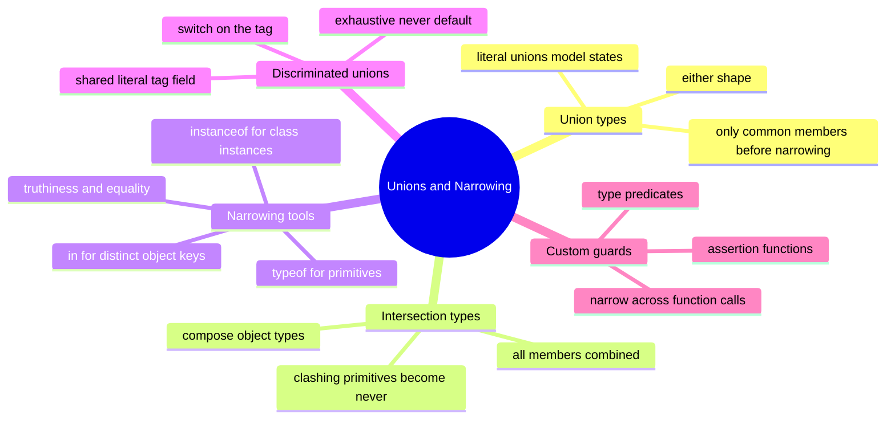

# 05 — Unions & Narrowing · Cheat-sheet

## Concept map



*What to notice: the narrowing tools branch is ordered by what they work
on — primitives, class instances, plain objects, then tagged shapes.*

## Key syntax

```ts
type Id = string | number                          // union
type Entity = Identified & Serializable            // intersection

if (typeof x === 'string') { }                     // primitive
if (x instanceof Date) { }                         // class instance
if ('swim' in pet) { }                             // object key
if (state.status === 'error') { }                  // discriminant

function isFish(p: Fish | Bird): p is Fish { }     // predicate
function assertIsUser(v: unknown): asserts v is User { }
function assert(cond: unknown, msg: string): asserts cond { }

function assertNever(value: never): never { throw new Error() }
```

## Rules to remember

- A union value only offers members common to **every** part until you
  narrow it.
- `typeof` → primitives; `instanceof` → class instances; `in` → objects
  with distinct keys; discriminant tag → shapes you control.
- Give every variant of a state union the same literal tag field
  (`status`, `kind`, `type`) — then `switch` narrows each case.
- End the switch with `default: assertNever(x)` — adding a variant then
  becomes a compile error at every unhandled site.
- A `boolean`-returning helper never narrows; declare `x is T` or
  `asserts x is T` in the signature.
- `arr.filter(isFish)` returns `Fish[]` only when `isFish` is a real
  type predicate.

## Gotchas

- `if (x)` also excludes `''` and `0` — use `x === null` /
  `x !== undefined` when falsy values are legitimate.
- The compiler never checks your predicate's logic against `x is T` —
  a bug there produces confidently wrong types downstream.
- `string & number` is `never` (no error until you try to make one).
- Assertion functions must have an explicit return annotation
  (`asserts x is T` / `asserts condition`) or calls won't narrow.
- `typeof x === 'object'` is true for `null` too — check `null` first.

## Self-quiz

1. Given `x: string | number[]`, which members can you use before
   narrowing?
2. What type is `('a' | 'b') & ('b' | 'c')`? And `string & number`?
3. Which narrowing tool fits `Date | string`? And
   `{ swim(): void } | { fly(): void }`?
4. Why doesn't `if (looksLikeFish(pet))` narrow `pet` when
   `looksLikeFish` returns `boolean`?
5. What must be true of a union for `switch (x.kind)` narrowing to work?
6. What does `default: assertNever(state)` buy you when a fifth variant
   is added to a four-variant union?
7. Write the signature of a function that throws unless its argument is
   a `User`, and narrows the argument afterwards.
8. What's the return type of `pets.filter(isFish)` when `isFish` is
   `(p: Fish | Bird) => p is Fish`?

<details><summary>Answers</summary>

1. Only members shared by both — e.g. `.length` and nothing else useful.
2. `'b'` (intersections distribute over unions); `never`.
3. `instanceof Date` for the first; `'swim' in x` for the second.
4. The boolean doesn't tell the compiler *what* was checked — narrowing
   information doesn't cross a function boundary unless the signature
   says `pet is Fish`.
5. Every variant carries the same property (`kind`) holding a distinct
   literal type — a discriminated union.
6. A compile error in every switch that forgot the new variant: the new
   variant isn't `never`, so it can't be passed to `assertNever`.
7. `function assertIsUser(value: unknown): asserts value is User`.
8. `Fish[]`.

</details>
