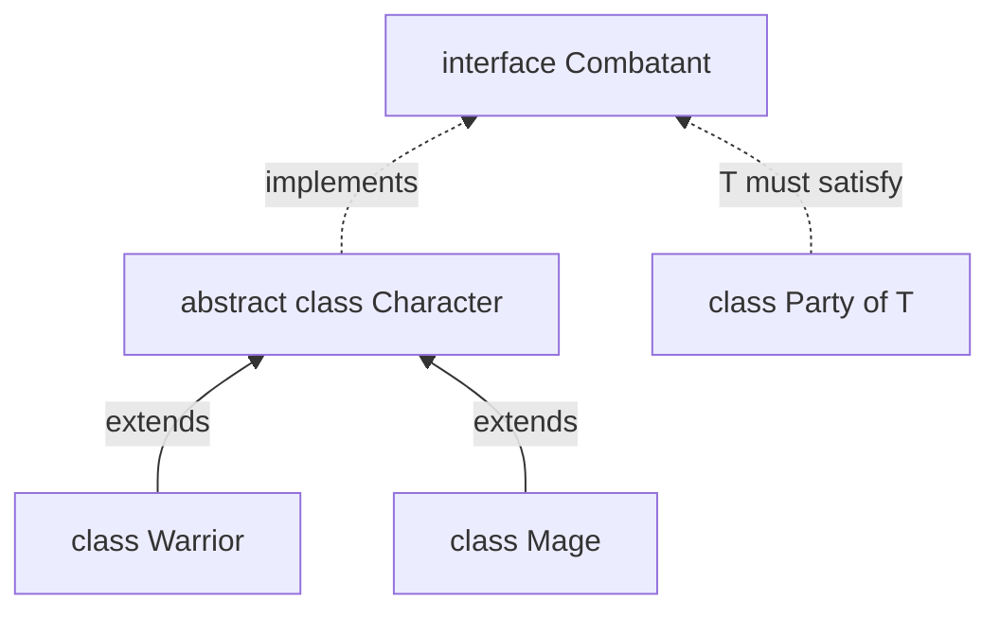
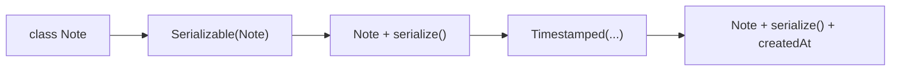

# 06 — Classes

## Why this exists

JavaScript classes already work at runtime — TypeScript adds the
*contracts*: which fields exist and get initialized, who is allowed to
touch them, and what a subclass must implement. Nail these and whole
categories of "cannot read property of undefined" die at compile time.

## A small hierarchy



*What to notice: `extends` (solid) inherits code AND type; `implements`
(dashed) is a compile-time promise only — no code, no types flow into the
class from it.*

## Minimal syntax

```ts
class Account {
  readonly id: string        // assignable only at declaration or in ctor
  protected balance = 0      // initializer satisfies strict init
  #pin: string               // real runtime privacy (JS, not just TS)

  static count = 0
  static {                   // runs ONCE, when the class is defined
    Account.count = 0
  }

  constructor(id: string, pin: string) {
    this.id = id             // strictPropertyInitialization demands this
    this.#pin = pin
    Account.count++
  }

  get empty(): boolean {     // getter — used like a property
    return this.balance === 0
  }
}

class Savings extends Account {
  // parameter property: declares AND assigns this.rate in one stroke
  constructor(id: string, pin: string, private rate: number) {
    super(id, pin)
  }
}
```

## Access modifiers

| | class body | subclass | outside | at runtime |
| --- | --- | --- | --- | --- |
| `public` (default) | ✅ | ✅ | ✅ | normal property |
| `protected` | ✅ | ✅ | ❌ | normal property |
| `private` | ✅ | ❌ | ❌ | **normal property!** (compile-time only) |
| `#name` | ✅ | ❌ | ❌ | truly hidden (JS enforces it) |
| `readonly` | write in ctor only | — | read-only | normal property |

TS `private` disappears after compilation — `Object.keys` and
`JSON.stringify` still see the field. `#name` is the only privacy that
survives to runtime.

## abstract & override

```ts
abstract class Shape {
  abstract area(): number              // no body — subclasses MUST supply
  describe(): string {                 // concrete code lives here too
    return `area ${this.area()}`
  }
}

class Rect extends Shape {
  constructor(readonly w: number, readonly h: number) {
    super()
  }
  override area(): number {            // `override` — see below
    return this.w * this.h
  }
}
```

This repo has `noImplicitOverride` ON: replacing a *concrete* inherited
member without writing `override` is a compile error. Implementing an
*abstract* member doesn't require the keyword — but write it anyway, so a
rename in the base class breaks loudly instead of silently forking.

## Mixins — class in, class out



*What to notice: a mixin is just a function taking a constructor and
returning a bigger one — features compose by chaining calls.*

## Common gotchas

- Under `strictPropertyInitialization` every field needs an initializer
  or a constructor assignment. Escape hatch when you init elsewhere:
  `name!: string` (definite-assignment `!` — you take responsibility).
- `implements` does NOT type your methods — an unannotated parameter is
  still an error (or `any`), even if the interface spells out the type.
- A getter with no setter makes the property `readonly` at the type level.
- `static readonly` must be initialized at its declaration — a static
  block is not allowed to assign it (unlike a constructor for instance
  `readonly`).
- Generic classes: the type parameter lives on the *instance* —
  `new Stack<number>()`, and statics can't see `T`.

## Try it now

→ `exercises/ex01.ts` through `ex07.ts`, then `checkpoint.ts`.
Check with `npm test -- 06`.
