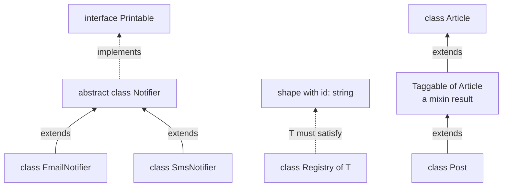
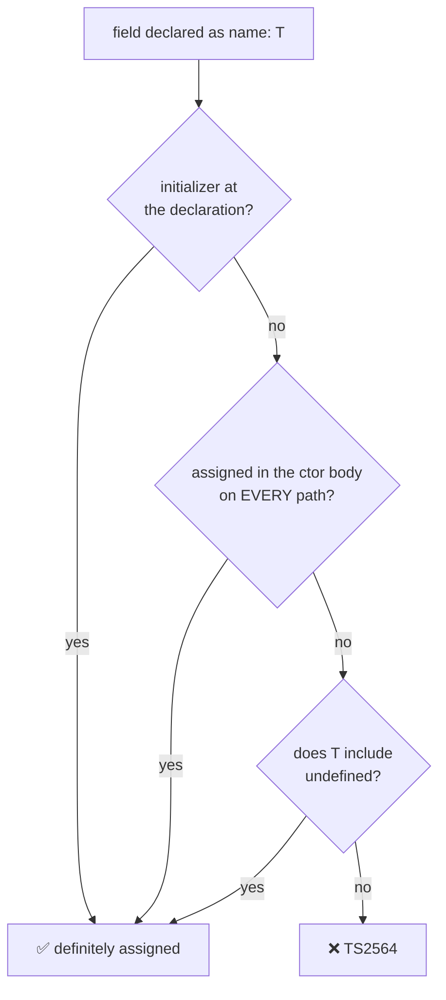
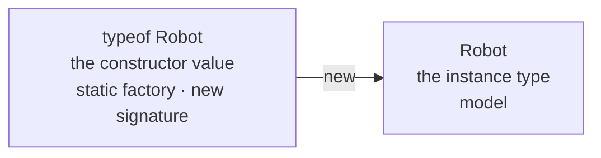
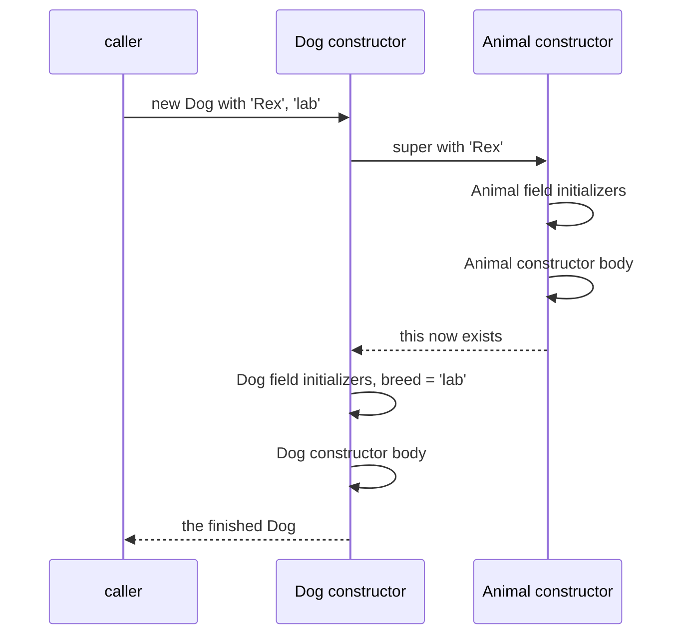
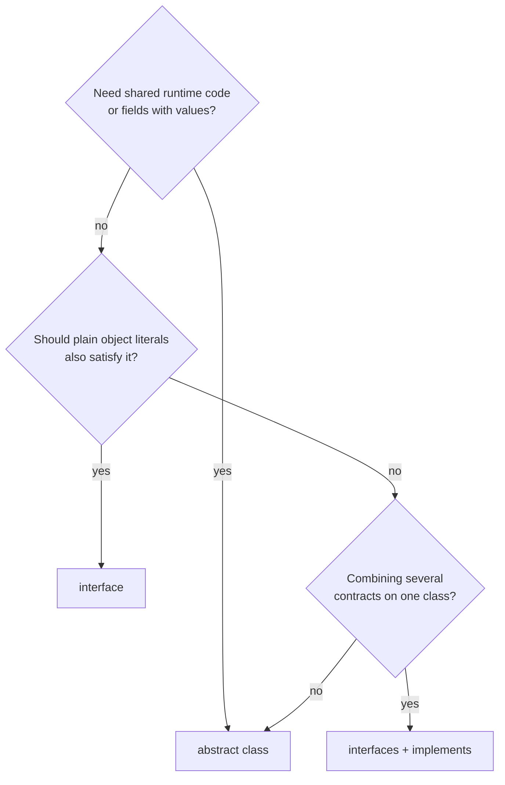
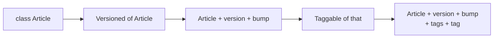

# 06 — Classes

## Why this exists

JavaScript classes already work at runtime — TypeScript adds the
*contracts*: which fields exist and get initialized, who is allowed to
touch them, and what a subclass must implement. Nail these and whole
categories of "cannot read property of undefined" die at compile time.

## Map of this module

| Section | Exercise |
| --- | --- |
| Class anatomy · strict initialization · `!` and `declare` | ex01 |
| Access modifiers · `#private` · `readonly` · nominal classes · private constructors | ex02 |
| Parameter properties · accessors | ex03 |
| Static members · static blocks · `typeof Class` | ex04 |
| Inheritance · `super` · `override` | ex05, ex06 |
| Abstract classes · `implements` · classes are structural | ex05, checkpoint |
| Generic classes · `this` return type | ex06, checkpoint |
| Mixins | ex07 |
| Class expressions · `this` pitfalls · field semantics · decorators | reference |

## A small hierarchy



*What to notice: `extends` (solid) inherits code AND type; `implements`
(dashed) is a compile-time promise only — no code, no types flow into the
class from it. A mixin is just another `extends`, aimed at a class a
function built for you.*

## Minimal syntax

```ts
class Account {
  readonly id: string        // assignable only at declaration or in ctor
  protected balance = 0      // initializer satisfies strict init
  #pin: string               // real runtime privacy (JS, not just TS)

  static count = 0
  static {                   // runs ONCE, when the class is defined
    Account.count = 0
  }

  constructor(id: string, pin: string) {
    this.id = id             // strictPropertyInitialization demands this
    this.#pin = pin
    Account.count++
  }

  get empty(): boolean {     // getter — used like a property
    return this.balance === 0
  }
}

class Savings extends Account {
  // parameter property: declares AND assigns this.rate in one stroke
  constructor(id: string, pin: string, private rate: number) {
    super(id, pin)
  }
}
```

Every piece of that snippet gets its own section below.

### Class anatomy — fields, constructor, methods, `this`

A class is a blueprint plus a factory. Fields hold each instance's data,
the constructor fills them in, and methods are shared functions that reach
the instance through `this`.

```ts
class Roster {
  team: string               // field: declared here, assigned in the ctor
  members: string[] = []     // field with an initializer (type inferred)

  constructor(team: string) {
    this.team = team
  }

  join(name: string): void { // method: lives on the prototype, shared
    this.members.push(name)
  }
}

const backend = new Roster('Backend')
backend.join('Ada')
backend.members.length       // 1
```


*What to notice: field initializers run BEFORE the constructor body — a
constructor can rely on `this.members` already being an array.*

### `strictPropertyInitialization` — no half-built objects

A field typed `string` that is never assigned silently holds `undefined`,
so the type would be a lie. This flag (part of `strict`) refuses any field
that might still be unassigned when the constructor finishes.

```ts
class Invoice {
  // ❌ error TS2564: Property 'customer' has no initializer and is not definitely assigned in the constructor.
  customer: string
  total = 0                  // ✅ initializer
  currency: string           // ✅ assigned below
  note: string | undefined   // ✅ undefined is part of the type

  constructor() {
    this.currency = 'EUR'
  }
}
```



*What to notice: "every path" is literal — an assignment inside an `if`
without an `else` does not count, and neither does one made in a method
the constructor calls.*

That last case is the one that bites:

```ts
class Session {
  // ❌ error TS2564: Property 'token' has no initializer and is not definitely assigned in the constructor.
  token: string

  constructor() {
    this.reset()             // assigns token — but TS does not follow calls
  }

  reset(): void { this.token = Math.random().toString(36).slice(2) }
}
```

Gotcha: the fix is not to sprinkle `!`. Assign directly in the constructor
(`this.token = this.makeToken()` — assigning a call's *result* is fine),
or widen to `string | undefined` and narrow where you read it.

### The `!` escape hatch and `declare` fields

Sometimes a field really is set elsewhere — by a framework, a test
`beforeEach`, or an `init()` you always call. `store!: T` (definite
assignment assertion) tells TS "trust me, it will be there". The cost:
the compiler stops guarding that field — remove the `init()` call and the
crash arrives at runtime, not at compile time.

```ts
class Cache {
  store!: Map<string, string>   // set by init(), not the ctor

  init(): void { this.store = new Map() }

  read(key: string): string | undefined {
    return this.store.get(key)  // compiles — crashes if init() was skipped
  }
}
```

`declare` is different: it re-declares a field's *type* only and emits no
field. Use it in a subclass to narrow an inherited field's type without
touching its value.

```ts
class Widget {
  kind: string
  constructor(kind: string) {
    this.kind = kind
  }
}

class Slider extends Widget {
  declare kind: 'horizontal' | 'vertical'   // type only, no runtime field
  constructor() {
    super('horizontal')
  }
}

new Slider().kind   // type: 'horizontal' | 'vertical'
```

Without `declare`, the redeclared field would trip TS2564 *and* be
re-created as `undefined` after `super()` returns, wiping the value the
base constructor wrote (see *Field semantics* near the end).

### Access modifiers — who may touch a member

Modifiers limit *where* a member can be used — the difference between
"implementation detail" and "part of the API".

```ts
class Safe {
  readonly serial: string
  protected contents: string[] = []
  private attempts = 0
  #combo: string

  constructor(serial: string, combo: string) {
    this.serial = serial
    this.#combo = combo
  }

  open(combo: string): boolean {
    this.attempts++
    return combo === this.#combo
  }
}

class WallSafe extends Safe {
  count(): number {
    return this.contents.length   // ✅ protected: a subclass may read it
  }
}

const safe = new Safe('S-1', '4-2-7')
// ❌ error TS2445: Property 'contents' is protected and only accessible within class 'Safe' and its subclasses.
safe.contents
// ❌ error TS2341: Property 'attempts' is private and only accessible within class 'Safe'.
safe.attempts
// ❌ error TS18013: Property '#combo' is not accessible outside class 'Safe' because it has a private identifier.
safe.#combo
```

| | class body | subclass | outside | `Object.keys` / `JSON.stringify` | enforced by |
| --- | --- | --- | --- | --- | --- |
| `public` (default) | ✅ | ✅ | ✅ | visible | — |
| `protected` | ✅ | ✅ | ❌ | visible | TS only |
| `private` | ✅ | ❌ | ❌ | **visible** | TS only |
| `#name` | ✅ | ❌ | ❌ | hidden | JS engine |
| `readonly` | write in ctor only | read | read | visible | TS only |

Gotcha: `private` is a compile-time promise. The emitted JavaScript has a
normal property, so `(safe as any).attempts` and `Object.keys(safe)` both
see it. Only `#name` survives to runtime.

### `#private` — privacy the engine enforces

`#combo` is JavaScript syntax, not a TypeScript modifier. The field is
invisible to reflection, and `#key in obj` is a *brand check* — `true`
only for objects this exact class constructed.

```ts
class Vault {
  private label = 'top secret'
  #key = 'xyz'

  static isVault(value: unknown): value is Vault {
    return typeof value === 'object' && value !== null && #key in value
  }
}

const vault = new Vault()
Object.keys(vault)          // ['label']  — TS private is erased
JSON.stringify(vault)       // '{"label":"top secret"}'
Vault.isVault(vault)        // true
Vault.isVault({ label: 'top secret' })   // false — no #key brand
```

Gotcha: `#name` must be declared in the class before use, cannot combine
with `private`, and cannot be reached as `this['#key']` — it is not a
string key.

### `readonly` — write once, and only shallowly

`readonly` stops reassignment after construction. It says nothing about
what is *inside* the value — for that, type the field `readonly string[]`
(module 08 builds a `DeepReadonly`).

```ts
class Ticket {
  readonly id: string
  readonly tags: string[] = []

  constructor(id: string) {
    this.id = id            // ✅ the constructor may write
  }

  rename(id: string): void {
    // ❌ error TS2540: Cannot assign to 'id' because it is a read-only property.
    this.id = id
  }
}

new Ticket('T-1').tags.push('urgent')  // ✅ shallow: the array is still mutable
```

### `private` makes a class nominal

Types are structural: same shape, same type. A `private` (or `protected`)
member breaks that rule on purpose — two classes with a private member of
the same name are *not* interchangeable, and no object literal can ever
satisfy the class.

```ts
class Meters {
  constructor(private value: number) {}
}
class Seconds {
  constructor(private value: number) {}
}
class Plain {
  constructor(public value: number) {}
}

let distance: Meters = new Meters(5)
// ❌ error TS2322: Type 'Seconds' is not assignable to type 'Meters'. Types have separate declarations of a private property 'value'.
distance = new Seconds(5)

const plain: Plain = { value: 5 }       // ✅ public shape — a literal is fine
// ❌ error TS2322: Property 'value' is private in type 'Meters' but not in type '{ value: number; }'.
const fake: Meters = { value: 5 }
```

This is a feature: one `private` field turns a class into a lightweight
*branded* type (module 11). Gotcha: it also means you cannot mock such a
class with a plain object in tests — `new` the real thing or subclass it.

### `private` and `protected` constructors — singletons and factories

A private constructor means "only this class may call `new`", forcing
every caller through a static method you control. A protected one still
lets subclasses call `super()`.

```ts
class AppConfig {
  private static instance: AppConfig | undefined
  private constructor(readonly env: string) {}

  static get(): AppConfig {
    return (AppConfig.instance ??= new AppConfig('prod'))
  }
}

AppConfig.get().env        // 'prod' — always the same instance
// ❌ error TS2673: Constructor of class 'AppConfig' is private and only accessible within the class declaration.
new AppConfig('dev')

class Repository {
  protected constructor(readonly table: string) {}
}
class UserRepository extends Repository {
  constructor() {
    super('users')          // ✅ a subclass may call it
  }
}
new UserRepository()
// ❌ error TS2674: Constructor of class 'Repository' is protected and only accessible within the class declaration.
new Repository('x')
```

### Parameter properties — declare and assign in one stroke

Writing `id: number`, then `id: number` again in the constructor, then
`this.id = id` is three lines for one idea. A modifier on a constructor
parameter (`public`, `private`, `protected`, `readonly`, or a combination)
collapses them. A parameter *without* a modifier stays a plain parameter.

```ts
class Employee {
  constructor(
    public readonly id: number,
    public name: string,
    private salary: number,
  ) {}

  raise(pct: number): void { this.salary *= 1 + pct / 100 }
}

class Person {
  constructor(name: string) {}   // NO modifier — a plain parameter, no field

  greet(): string {
    // ❌ error TS2339: Property 'name' does not exist on type 'Person'.
    return `hi ${this.name}`
  }
}

new Employee(1, 'Ada', 5000).name   // 'Ada'
```

| Parameter properties shine when… | They hurt when… |
| --- | --- |
| The class is mostly data (`Employee`, `Point`) | The constructor body also transforms inputs |
| Every parameter maps 1:1 to a field | Some parameters are fields and some are not — readers must scan modifiers |
| The list is short (≤ 4) | The list is long — one field per line in the body reads better |

### Accessors — `get` and `set`

A getter runs code but is *used* like a property. That lets you validate
writes, derive values, or change storage later without breaking callers.

```ts
class Volume {
  private level = 50                 // 0..100

  get percent(): number { return this.level }

  set percent(next: number) {
    if (next < 0 || next > 100) throw new RangeError('0–100 only')
    this.level = next
  }
}

const speaker = new Volume()
speaker.percent = 80                 // runs the setter (validates)
speaker.percent                      // 80 — runs the getter
```

Three more facts: a getter with **no setter** is `readonly` in the type
(you never write the keyword — the compiler infers it); since TS 5.1 the
setter may accept a *wider* type than the getter returns; and the
`accessor` keyword (TS 4.9+) generates a hidden field plus a get/set pair
— it exists mainly for decorators, so just recognise it.

```ts
class Book {
  constructor(private readonly rawIsbn: string) {}

  get isbn(): string {               // getter only ⇒ readonly
    return this.rawIsbn.replaceAll('-', '')
  }
}

class Timer {
  private ms = 0

  get delay(): number { return this.ms }

  set delay(value: number | string) {   // setter wider than the getter
    this.ms = typeof value === 'string' ? parseInt(value, 10) : value
  }
}

class Draft {
  accessor title = 'untitled'        // = hidden field + get title / set title
}

const book = new Book('978-0-13')
// ❌ error TS2540: Cannot assign to 'isbn' because it is a read-only property.
book.isbn = '000'

const timer = new Timer()
timer.delay = '250'                  // ✅ setter takes a string
const wait: number = timer.delay     // ✅ getter always gives a number
new Draft().title
```

Gotcha: a getter and setter must agree on visibility — no `public get`
with a `private set`. Make the setter validate instead.

### Static members — state on the class, not the instance

Some data belongs to the class as a whole: an instance counter, a
registry, a constant. `static` puts it on the constructor object, so there
is exactly one copy. A `static {}` block runs once, when the class is
defined, and is the only place (besides the declaration line) to compute
*private* static state.

```ts
class Logger {
  static readonly LEVELS = ['debug', 'info', 'warn'] as const
  static defaultLevel: 'debug' | 'info' | 'warn'
  private static created: number    // private static state, set up below
  private static registry = new Map<string, Logger>()

  static {                           // runs once, when the class is defined
    Logger.defaultLevel = process.env.LOG_LEVEL === 'debug' ? 'debug' : 'info'
    Logger.created = 0               // only a static block can reach a private static
  }

  constructor(readonly name: string) {
    Logger.created++                 // `Logger.`, not `this.` — it is on the class
    Logger.registry.set(name, this)
  }

  static count(): number {
    return this.created              // inside a static, `this` IS the class
  }
}

new Logger('http')
new Logger('db')
Logger.count()                       // 2
```

Two rules the compiler enforces:

```ts
class Build {
  static readonly VERSION: string

  static {
    // ❌ error TS2540: Cannot assign to 'VERSION' because it is a read-only property.
    Build.VERSION = '1.0.0'          // readonly statics: initialize at the declaration
  }
}

class Box<T> {
  // ❌ error TS2302: Static members cannot reference class type parameters.
  static empty: T
  constructor(public value: T) {}
}
```

Why the second? `T` belongs to each *instance* (`Box<number>`,
`Box<string>`). The static side exists once, before any instance — there
is no single `T` for it to mean.

### `typeof Class` — the static side vs the instance side

One `class` declaration creates **two** types. `Robot` names the
instances. `typeof Robot` names the constructor value — the thing with the
statics and the `new` signature.



*What to notice: statics live on the left, instance members on the
right — a value of type `Robot` has no `factory`.*

```ts
class Robot {
  static factory = 'Acme'
  constructor(public model: string) {}
}

const unit: Robot = new Robot('R2')          // instance side
const Ctor: typeof Robot = Robot             // static side (the constructor)
type RobotInstance = InstanceType<typeof Robot>   // Robot, recovered from the ctor

Ctor.factory                                 // 'Acme'
// ❌ error TS2339: Property 'factory' does not exist on type 'Robot'.
unit.factory
```

`InstanceType<typeof X>` matters when you only hold the constructor — a
class passed into a function, for example (see *interfaces describing
constructors* below).

### Inheritance — `extends`, `super`, and construction order

`extends` copies the base class's members (instance *and* static) into the
subclass and lets you add or replace. The subclass constructor must call
`super(...)` before it touches `this`, because `this` does not exist
until the base constructor has built it. Omit the constructor entirely and
the base one is inherited — signature included.

```ts
class Animal {
  constructor(public name: string) {}

  speak(): string { return `${this.name} makes a sound` }
}

class Dog extends Animal {
  constructor(name: string, public breed: string) {
    super(name)                      // builds the Animal part first
  }

  override speak(): string {
    return `${super.speak()} — woof` // super.method() reaches the base version
  }
}

class Cat extends Animal {}          // no ctor: inherits (name: string)

new Dog('Rex', 'lab').speak()        // 'Rex makes a sound — woof'
new Cat('Tom')                       // ✅
// ❌ error TS2554: Expected 1 arguments, but got 2.
new Cat('Tom', 'tabby')
```



*What to notice: subclass fields are initialized only AFTER `super()`
returns — a base constructor that calls an overridden method sees the
subclass's fields as `undefined`.*

The compiler enforces both halves of the `super` rule:

```ts
class Base {
  constructor(public id: number) {}
}

class NoSuper extends Base {
  // ❌ error TS2377: Constructors for derived classes must contain a 'super' call.
  constructor() {}
}

class ThisTooEarly extends Base {
  label: string
  constructor() {
    // ❌ error TS17009: 'super' must be called before accessing 'this' in the constructor of a derived class.
    this.label = 'early'
    super(1)
  }
}
```

Gotcha (the construction-order trap) — this compiles, then throws,
because TS cannot see the timing. Rule: constructors should not call
overridable methods.

```ts
class Loader {
  constructor() {
    this.setup()                     // runs while Sub.items is still undefined
  }
  setup(): void {}
}

class Sub extends Loader {
  items: string[] = []               // initialized AFTER super() returns
  override setup(): void {
    this.items.push('x')             // TypeError at runtime: items is undefined
  }
}
```

### `override` — replacing a base member on purpose

This course enables `noImplicitOverride`. Replacing a *concrete* inherited
member without the keyword is an error, and the keyword on a member that
matches nothing is also an error — so a base-class rename can never
silently fork a subclass.

```ts
class Widget {
  render(): string { return 'widget' }
}

class Button extends Widget {
  // ❌ error TS4114: This member must have an 'override' modifier because it overrides a member in the base class 'Widget'.
  render(): string { return 'button' }
}

class Link extends Widget {
  override render(): string {        // ✅ explicit
    return 'link'
  }

  // ❌ error TS4113: This member cannot have an 'override' modifier because it is not declared in the base class 'Widget'.
  override rendr(): string { return 'typo' }
}
```

| Base member is… | `override` keyword |
| --- | --- |
| concrete (has a body) | **required** (TS4114 otherwise) |
| abstract (no body) | optional — but write it, so a base rename fails loudly |
| absent | forbidden (TS4113) |

An override must stay compatible: a return type assignable to the base's,
parameters at least as wide. Narrowing a parameter is TS2416.

### Abstract classes — templates with holes

An abstract class holds real code *and* deliberate gaps. Subclasses must
fill the gaps; nobody may `new` the template itself. Reach for it when
several classes share an algorithm but differ in one step.

```ts
abstract class Notifier {
  abstract readonly channel: string               // abstract PROPERTY
  abstract send(to: string, msg: string): void    // abstract METHOD

  broadcast(recipients: string[], msg: string): void {   // concrete code
    for (const r of recipients) this.send(r, msg)        // calls the hole
  }
}

class EmailNotifier extends Notifier {
  readonly channel = 'email'
  override send(to: string, msg: string): void {
    console.log(`[${this.channel}] ${to}: ${msg}`)
  }
}

// ❌ error TS2515: Non-abstract class 'SmsNotifier' does not implement inherited abstract member send from class 'Notifier'.
class SmsNotifier extends Notifier {}

const notifier: Notifier = new EmailNotifier()  // ✅ abstract type as supertype
notifier instanceof Notifier                    // true at runtime
// ❌ error TS2511: Cannot create an instance of an abstract class.
new Notifier()
```

| | `abstract class` | `interface` |
| --- | --- | --- |
| Can hold code and field values | ✅ | ❌ |
| Exists at runtime (`instanceof`) | ✅ | ❌ (erased) |
| A class can use several | ❌ one `extends` | ✅ many `implements` |
| Object literals can satisfy it | ❌ if it has `private`/`protected` | ✅ |
| Can require a constructor shape | ❌ | ✅ (`new (...) => T`) |
| Can mark members `abstract` | ✅ | every member is "abstract" |



*What to notice: the first question decides most cases — an interface
can never carry code, so shared behaviour forces a class.*

### `implements` — a compile-time promise

`implements` says "this class has at least this shape". The compiler
checks it; nothing is inherited, nothing runs. A class may implement
several interfaces at once. And it does **not** type your parameters —
the interface knows `value` is a `number`; your method does not inherit
that knowledge. Annotate it yourself, and the compiler checks it
*against* the interface.

```ts
interface Printable {
  print(): string
}
interface Priced {
  price: number
}

class Product implements Printable, Priced {
  constructor(public name: string, public price: number) {}

  print(): string { return `${this.name} — $${this.price}` }
}

// ❌ error TS2420: Class 'Receipt' incorrectly implements interface 'Printable'. Property 'print' is missing in type 'Receipt' but required in type 'Printable'.
class Receipt implements Printable {}

interface Formatter {
  format(value: number): string
}
class Money implements Formatter {
  // ❌ error TS7006: Parameter 'value' implicitly has an 'any' type.
  format(value) {
    return `$${value}`
  }
}
```

`implements` only ever talks about the **instance** side. To describe the
constructor, write an interface with a `new` signature and pass the class
as a value:

```ts
interface Plugin {
  run(): string
}
interface PluginConstructor {
  new (name: string): Plugin         // "something you can `new` with a string"
}

function boot(Ctor: PluginConstructor, name: string): Plugin {
  return new Ctor(name)
}

class Echo implements Plugin {
  constructor(private name: string) {}
  run(): string { return this.name }
}

boot(Echo, 'hello').run()            // 'hello' — the class is passed as a value
```

### Classes are structural too

A class name used as a type means "anything with this shape". An object
literal with the right members satisfies it — no `new` required. That is
convenient for tests and awkward for `instanceof`. And `instanceof`
narrows a union of classes the way `typeof` narrows primitives.

```ts
class Point {
  constructor(public x: number, public y: number) {}
}

function distance(p: Point): number {
  return Math.hypot(p.x, p.y)
}

distance(new Point(3, 4))            // 5
distance({ x: 3, y: 4 })             // 5 — same shape, accepted
const literal: Point = { x: 0, y: 0 }
literal instanceof Point             // false at runtime — never constructed

class EmailMessage {
  constructor(public address: string) {}
}
class SmsMessage {
  constructor(public phone: string) {}
}

function destination(msg: EmailMessage | SmsMessage): string {
  if (msg instanceof EmailMessage) return msg.address   // EmailMessage here
  return msg.phone                                      // SmsMessage here
}
```

A `private` or `#private` member switches the literal trick off (see
*nominal* above). Gotcha: two classes with *identical* shapes are the same
type to TS, so `instanceof` cannot narrow between them — give each a
distinguishing member (`readonly kind = 'email'` works well).

### Generic classes — the type parameter lives on the instance

`class Queue<T>` is one blueprint that produces many contracts:
`Queue<number>`, `Queue<string>`. `T` is fixed when you `new`, per
instance — and a generic *method* can add its own parameter on top.

```ts
class Queue<T> {
  private items: T[] = []

  enqueue(item: T): void { this.items.push(item) }

  dequeue(): T | undefined { return this.items.shift() }

  get length(): number { return this.items.length }

  map<U>(fn: (item: T) => U): Queue<U> {   // a generic METHOD on a generic class
    const out = new Queue<U>()
    for (const item of this.items) out.enqueue(fn(item))
    return out
  }
}

const numbers = new Queue<number>()
numbers.enqueue(1)
const strings = numbers.map((n) => String(n))   // Queue<string>
// ❌ error TS2345: Argument of type 'string' is not assignable to parameter of type 'number'.
numbers.enqueue('one')
```

`T` is inferred from constructor arguments. A no-argument constructor
gives the compiler nothing to infer from, so you get `unknown` — always
write the type argument then (`new Queue<number>()`). Constraints work
exactly as on functions.

```ts continue
class Pair<T> {
  constructor(public first: T, public second: T) {}
}

const inferred = new Pair(1, 2)      // Pair<number> — inferred from the args
const mystery = new Queue()          // Queue<unknown> — nothing to infer from
mystery.enqueue(42)
// ❌ error TS18046: 'mystery.dequeue()' is of type 'unknown'.
mystery.dequeue().toFixed()

class Registry<T extends { id: string }> {
  private byId = new Map<string, T>()

  add(item: T): void {
    this.byId.set(item.id, item)     // `.id` is known to exist
  }
}

new Registry<{ id: string; label: string }>()
// ❌ error TS2344: Type 'number' does not satisfy the constraint '{ id: string; }'.
new Registry<number>()
```

### `this` as a return type — fluent chains that survive subclassing

Returning `this` (the *type*) instead of the class name makes a chain
keep the most specific type, so subclass methods stay reachable after a
base-class call. Name the class instead and the chain "forgets" the
subclass.

```ts
class QueryBuilder {
  protected parts: string[] = []

  where(condition: string): this {   // `this` = "whatever subclass I am"
    this.parts.push(`WHERE ${condition}`)
    return this
  }

  build(): string { return this.parts.join(' ') }
}

class PagedQuery extends QueryBuilder {
  limit(n: number): this {
    this.parts.push(`LIMIT ${n}`)
    return this
  }
}

new PagedQuery().where('id = 1').limit(10).build()   // ✅ 'WHERE id = 1 LIMIT 10'

class Loose {
  where(): Loose {                   // returns the BASE type, always
    return this
  }
}
class PagedLoose extends Loose {
  limit(): this { return this }
}

// ❌ error TS2339: Property 'limit' does not exist on type 'Loose'.
new PagedLoose().where().limit()
```

### Mixins — a function from a class to a bigger class

A class can `extends` only one base. A *mixin* composes independent
behaviours anyway: a function takes a constructor and returns a new class
extending it. Because it is a plain function, features compose by
chaining calls.



*What to notice: each call wraps the previous result — the final class
has every layer's members on one instance.*

```ts
type Constructor<T = {}> = new (...args: any[]) => T

class Article {
  constructor(public title: string) {}
}

function Versioned<TBase extends Constructor>(Base: TBase) {
  return class extends Base {
    version = 1
    bump(): void { this.version++ }
  }
}

function Taggable<TBase extends Constructor>(Base: TBase) {
  return class extends Base {
    tags: string[] = []
    tag(label: string): void { this.tags.push(label) }
  }
}

class Post extends Taggable(Versioned(Article)) {}

const post = new Post('Hello')       // Article's ctor signature survives
post.bump()
post.tag('typescript')
post.version                         // 2
post.title                           // 'Hello'
```

`Constructor<T>` reads as "anything you can `new` into a `T`". The
`...args: any[]` is required — a mixin cannot know what the base
constructor takes, so it must forward everything.

Constrain the base when the mixin needs something from it. And note why
a runtime function beats a type-level `&`: an intersection describes a
shape but *builds* nothing.

```ts continue
function Greetable<TBase extends Constructor<{ name: string }>>(Base: TBase) {
  return class extends Base {
    greet(): string {
      return `Hello, ${this.name}`   // `this.name` is guaranteed by the constraint
    }
  }
}

class User {
  constructor(public name: string) {}
}

new (Greetable(User))('Ada').greet()   // 'Hello, Ada'
// ❌ error TS2345: Argument of type 'typeof Article' is not assignable to parameter of type 'Constructor<{ name: string; }>'.
Greetable(Article)

type TaggedArticle = Article & { tags: string[] }
// ❌ error TS2322: Property 'tags' is missing in type 'Article' but required in type '{ tags: string[]; }'.
const tagged: TaggedArticle = new Article('x')   // nothing ever CREATES tags
```

Three mixin gotchas:

1. **Constructor shape.** If the returned class declares its own
   constructor, it must be `(...args: any[])` and forward to `super`:

```ts
type Constructor<T = {}> = new (...args: any[]) => T

function Broken<TBase extends Constructor>(Base: TBase) {
  // ❌ error TS2545: A mixin class must have a constructor with a single rest parameter of type 'any[]'.
  return class extends Base {
    constructor(label: string) {
      super()
    }
  }
}

function Fixed<TBase extends Constructor>(Base: TBase) {
  return class extends Base {
    createdAt: Date
    constructor(...args: any[]) {
      super(...args)
      this.createdAt = new Date()
    }
  }
}
```

2. **Evaluation order.** `class Post extends Taggable(Article) {}` calls
   `Taggable` the moment that `class` statement is evaluated — at module
   load. If the mixin throws, the module fails to import; no test ever
   runs.

3. **`JSON.stringify(this)` sees every layer.** All mixins end up as
   fields on *one* instance, so a `snapshot()` method that stringifies
   `this` includes `version`, `tags`, and anything another mixin added —
   whichever order the mixins were applied in.

### Class expressions

A class is a value, so it can be anonymous and assigned — exactly what a
mixin returns. An inner name is visible only inside the class body.

```ts
const Point = class {
  constructor(public x: number, public y: number) {}
}

const Origin = class Named {
  static zero(): Named {
    return new Named()
  }
}

new Point(1, 2).x                    // 1
Origin.zero() instanceof Origin      // true
```

### `this` pitfalls — detached methods

A prototype method's `this` is whatever the *call site* supplies. Pass
the method around without its object and `this` is `undefined`.

| | prototype method `inc() {}` | arrow field `inc = () => {}` |
| --- | --- | --- |
| Where it lives | shared, on the prototype | one copy per instance |
| `this` when detached | lost (`undefined`) | captured — always the instance |
| Overridable with `super.inc()` | ✅ | ❌ (it is a field, not a method) |
| Memory per instance | none | one closure |
| Good for | most methods | callbacks you hand to others |

TS does not flag a detached call by default. Declare a `this` parameter
and it will:

```ts
class Counter {
  count = 0

  inc(this: Counter): void {         // `this` must be a Counter (erased at runtime)
    this.count++
  }

  incArrow = (): void => {           // arrow field: `this` captured at construction
    this.count++
  }
}

const counter = new Counter()
const detached = counter.inc
// ❌ error TS2684: The 'this' context of type 'void' is not assignable to method's 'this' of type 'Counter'.
detached()

const safe = counter.incArrow
safe()                               // ✅ count is 1
counter.inc.bind(counter)()          // ✅ also fine
```

### Field semantics — `useDefineForClassFields`

With `target: ES2022` (this course), class fields compile to native
JavaScript field definitions. Two consequences: a field declared in a
subclass is *defined* (as `undefined`) after `super()` returns even when
the base constructor already assigned it — which is why re-typing needs
`declare` — and initializers run in declaration order, base class first,
before the constructor body. Older targets emitted `this.x = ...` in the
constructor, hiding both effects. Different behaviour in another project?
Check its `target` and `useDefineForClassFields`.

### Decorators — out of scope

TypeScript 5 supports the standard (TC39 stage 3) decorators — `@log
class X {}`, `@bound method() {}` — functions that wrap a class or member
at definition time. Frameworks (NestJS, Angular) lean on them. They are
out of scope here; everything above still applies inside a decorated
class.

### Reading the compiler's class errors

| Code | Message (abridged) | What it tells you |
| --- | --- | --- |
| TS2564 | Property has no initializer and is not definitely assigned | initializer, ctor assignment, or widen with `undefined` |
| TS2341 | Property is private and only accessible within class | you are outside — use a method, or loosen the modifier |
| TS2445 | Property is protected and only accessible within class and its subclasses | same, from outside the hierarchy |
| TS18013 | Property '#x' is not accessible outside class | `#private` reached from outside — no escape hatch |
| TS2540 | Cannot assign because it is a read-only property | `readonly` field, getter-only property, or `static readonly` assigned late |
| TS2377 | Constructors for derived classes must contain a 'super' call | add `super(...)` |
| TS17009 | 'super' must be called before accessing 'this' | move the `this.` line below `super()` |
| TS4114 | This member must have an 'override' modifier | you replaced a concrete base member — say so |
| TS4113 | This member cannot have an 'override' modifier | nothing to override — a rename or typo |
| TS2511 | Cannot create an instance of an abstract class | `new` a concrete subclass instead |
| TS2515 | Non-abstract class does not implement inherited abstract member | fill the hole, or mark the class `abstract` too |
| TS2420 | Class incorrectly implements interface | a member is missing or has the wrong type |
| TS2302 | Static members cannot reference class type parameters | `T` is per-instance; make the static method generic itself |
| TS2673 / TS2674 | Constructor is private / protected | go through the static factory |
| TS2545 | A mixin class must have a constructor with a single rest parameter | use `constructor(...args: any[])` |

### Rules to remember

- Every field: initializer, constructor assignment, or a type that
  includes `undefined`. `!` is a promise you keep by hand.
- `private` and `protected` are erased; `#name` is enforced by the engine.
- `readonly` blocks reassignment, not mutation of the value inside.
- A `private` member makes a class nominal — no literal can stand in.
- A getter without a setter is `readonly`; a setter may accept more than
  the getter returns.
- Statics live on `typeof Class`, run once, and cannot see `T`.
- `super()` before `this`; subclass fields exist only after `super()`
  returns; constructors should not call overridable methods.
- `override` is required for concrete members, recommended for abstract.
- `implements` checks shape only — annotate your own parameters.
- Generic `T` is per instance; a no-arg constructor needs an explicit
  `<T>`. Return `this` (the type) for chains that survive subclassing.
- A mixin is `(Base) => class extends Base { ... }` with a
  `(...args: any[])` constructor if it declares one.

## Common gotchas

- Under `strictPropertyInitialization` every field needs an initializer
  or a constructor assignment. Escape hatch when you init elsewhere:
  `name!: string` (definite-assignment `!` — you take responsibility).
  Assignments inside a helper method called from the constructor do
  **not** count.
- `implements` does NOT type your methods — an unannotated parameter is
  still an error (or `any`), even if the interface spells out the type.
- A getter with no setter makes the property `readonly` at the type level.
- `static readonly` must be initialized at its declaration — a static
  block is not allowed to assign it (unlike a constructor for instance
  `readonly`).
- Generic classes: the type parameter lives on the *instance* —
  `new Queue<number>()`, and statics can't see `T`.
- A base constructor that calls an overridden method runs it *before*
  the subclass's field initializers — expect `undefined` there.
- An inherited constructor brings its *signature*: extra arguments to
  `new Sub(...)` are a real TS2554, not ignored.
- Mixin functions run when the `class ... extends Mixin(Base)` statement
  is evaluated — a throwing mixin breaks the module at import time.

## Try it now

→ `exercises/ex01.ts` through `ex07.ts`, then `checkpoint.ts`.
Check with `npm test -- 06`.
