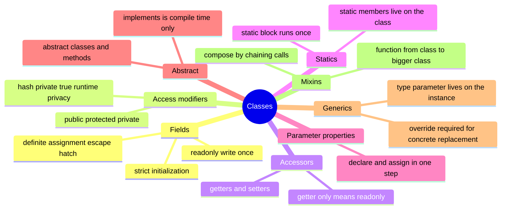

# 06 — Classes · Cheat-sheet

## Concept map



*What to notice: everything on the left is about WHO can touch a field;
everything on the right is about HOW classes combine — through
inheritance, generics, or mixins.*

## Key syntax

```ts
class Account {
  readonly id: string
  protected balance = 0
  #pin: string

  static count = 0
  static {
    Account.count = 0
  }

  constructor(id: string, pin: string) {
    this.id = id
    this.#pin = pin
  }

  get empty(): boolean {
    return this.balance === 0
  }
}

// parameter property: declares AND assigns in the constructor signature
class Savings extends Account {
  constructor(id: string, pin: string, private rate: number) {
    super(id, pin)
  }
}

abstract class Shape {
  abstract area(): number
  describe(): string {
    return `area ${this.area()}`
  }
}

class Rect extends Shape {
  override area(): number {
    return 1
  }
}

class Stack<T> {
  private items: T[] = []
}

type Constructor<T = {}> = new (...args: any[]) => T
function Timestamped<TBase extends Constructor>(Base: TBase) {
  return class extends Base {
    createdAt = new Date()
  }
}
```

## Rules to remember

- `strictPropertyInitialization` needs every field satisfied by a field
  initializer or a constructor assignment — or the escape hatch `x!: T`.
- TS `private` is compile-time only; `#field` is enforced by the JS
  engine and never shows up in `Object.keys` or `JSON.stringify`.
- A getter with no matching setter makes that property `readonly` in the
  type system.
- `static readonly` must be initialized at its declaration; a `static {}`
  block can set up *mutable* static state but not a readonly one.
- `implements` checks the shape at compile time only — it does not type
  your method parameters for you, and no code is inherited from it.
- Implementing an `abstract` member doesn't require `override`, but a
  replaced *concrete* member always does (`noImplicitOverride`).
- A generic class's type parameter belongs to each instance —
  `new Stack<number>()` vs `new Stack<string>()` — statics can't see it.
- A mixin is a plain function: `(Base) => class extends Base { ... }`.
  Nothing magic — compose by nesting calls.

## Gotchas

- Abstract classes can be a supertype for `instanceof` checks and hold
  concrete methods, but `new AbstractThing()` is always a compile error.
- `class Circle extends Shape {}` inherits the base constructor's
  signature when you don't declare your own — passing extra arguments to
  `new Circle(...)` is then a real type error, not silently ignored.
- Mixin functions run at the moment the `extends` expression is
  evaluated — `class X extends Broken(Base) {}` throws immediately if
  `Broken` throws, before any test even runs.
- `JSON.stringify(this)` inside a mixin serializes whatever fields exist
  on the instance at that point, including ones added by mixins applied
  earlier in the chain.

## Self-quiz

1. Why does `class C { x: string }` (no initializer, no constructor
   assignment) fail to compile under `strict`?
2. Name the one privacy mechanism in this list that survives to runtime:
   `public`, `protected`, `private`, `#field`.
3. What makes a class property read as `readonly` in its inferred type
   even though you never wrote the `readonly` keyword?
4. When is `override` required, and when is it optional but recommended?
5. Why can't a static method reference a class's generic type parameter?
6. What is a mixin, in one sentence, using only "function" and "class"?
7. Why does `Serializable(Note)` need to be a function call rather than
   just a static composition like `Note & Serializable`?

<details><summary>Answers</summary>

1. `strictPropertyInitialization` requires every field to be assigned
   before the constructor finishes — either via an initializer or a
   constructor assignment; neither is present here.
2. `#field` — true JS-engine-enforced privacy. TS `private` is erased at
   compile time and the property is still a normal, visible field.
3. A getter defined without a matching setter — the type system treats
   write access as impossible, so it reports the property as `readonly`.
4. Required when replacing a *concrete* member inherited from a base
   class (`noImplicitOverride`); optional (but good style) when
   implementing an `abstract` member, since it still guards against a
   base-class rename silently forking the subclass.
5. Generics on a class parameterize the *instance* type, not the class
   itself — statics exist once per class, before any instance (and its
   `T`) exists.
6. A mixin is a function that takes a class and returns a new class
   extending it with extra members.
7. Classes carry runtime behavior (constructors, methods), so combining
   them needs to happen at runtime too — a function call builds an actual
   new class object; a type-level `&` would only describe the shape, not
   provide the implementation.

</details>
