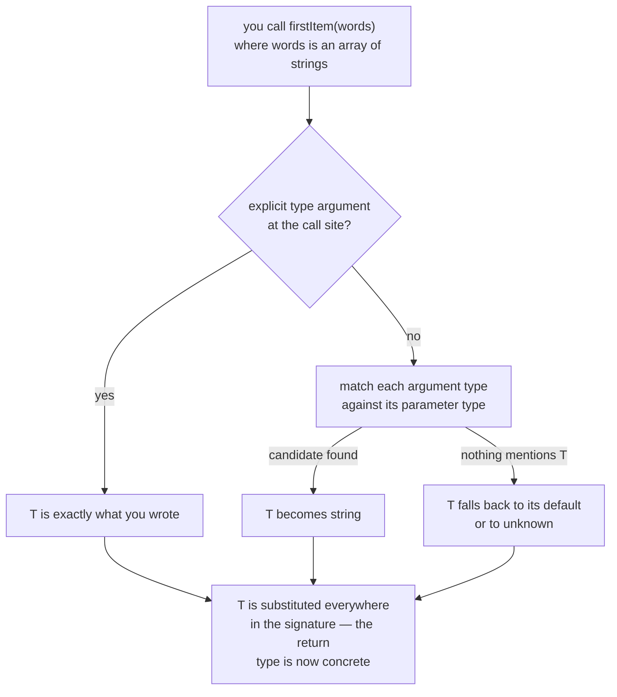
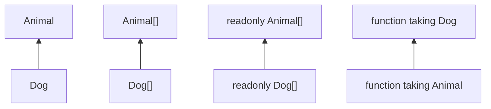

# 07 — Generics: One Implementation, Every Type

## Why this exists

`firstOf(items: any[]): any` works on every array but *forgets* what was
inside — the caller gets `any` back and checking stops. Generics let a
function carry a type **through** itself: whatever type goes in is what
comes out, still checked. One implementation, every type, zero `any`.

## How the compiler picks `T`



*What to notice: inference reads only the ARGUMENTS. If no argument
mentions `T` (like `parseAs<T>(json: string): T`), there is nothing to
infer from — you must pass the type argument yourself or give `T` a
default.*

## Minimal syntax

```ts
// generic function — T is a per-call placeholder
function firstItem<T>(items: readonly T[]): T | undefined {
  return items[0]
}
firstItem([1, 2, 3])   // T inferred as number
firstItem<string>([])  // T chosen explicitly

// multiple type parameters
function zip<A, B>(as: A[], bs: B[]): Array<[A, B]> { /* ... */ }

// generic type alias (interfaces work the same way)
type Box<T> = { value: T }
type Result<T, E = string> =        // E has a DEFAULT
  | { ok: true; value: T }
  | { ok: false; error: E }

// generic class (classes in depth: module 06)
class Stack<T> {
  private items: T[] = []
  push(item: T): void { this.items.push(item) }
  pop(): T | undefined { return this.items.pop() }
}

// constraint — only types with a numeric length may be T
function longest<T extends { length: number }>(a: T, b: T): T {
  return a.length >= b.length ? a : b
}

// keyof constraint — key must belong to obj; T[K] looks up its type
function getProperty<T, K extends keyof T>(obj: T, key: K): T[K] {
  return obj[key]
}
```

## `any` vs generic — what you actually lose

| | `firstOf(xs: any[]): any` | `firstItem<T>(xs: T[]): T \| undefined` |
| --- | --- | --- |
| Input linked to output | ❌ | ✅ |
| Autocomplete on the result | ❌ | ✅ |
| Wrong usage caught | ❌ | ✅ |

## Variance — what substitutes for what



*What to notice: every arrow means "is assignable to". Arrays follow
their element type (covariant) — but for mutable arrays that is a known
hole: alias a `Dog[]` as `Animal[]` and you can `push` a cat into it.
`readonly` arrays close the hole. Function PARAMETERS flip the arrow
(contravariant): the handler accepting more (`Animal`) substitutes for
the one accepting less (`Dog`), never the reverse.*

- Take `readonly T[]` parameters when you only read — every array fits,
  and the unsoundness disappears.
- `(a: Animal) => void` **is** a valid `(d: Dog) => void`. Assigning the
  other direction is rejected under `strict`.

## Common gotchas

- Generics are **erased** at runtime — `T` is not a value; you cannot
  write `new T()` or `typeof T` in code that runs.
- Inference keeps literal types for primitives passed directly
  (`identity('hi')` is type `'hi'`) but widens literals inside array and
  object arguments (`identity(['hi'])` is `string[]`).
- A constraint is not a default: `extends string` *limits* what `T` may
  be; `= string` *fills it in* when inference has nothing to go on.
- If a signature uses `T` only once, you probably don't need a generic —
  a plain type says the same thing.

## Try it now

→ `exercises/ex01.ts` through `ex08.ts`, then `checkpoint.ts`.
Check with `npm test -- 07`.
