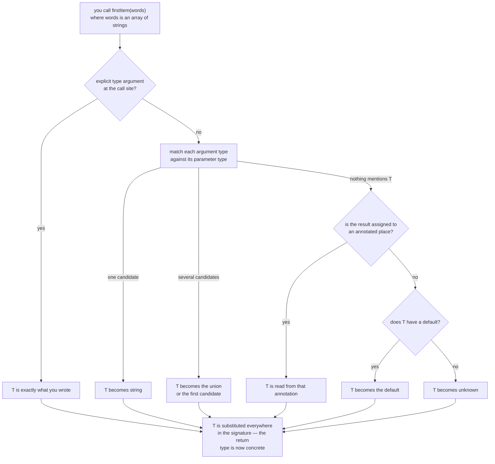
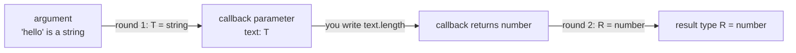
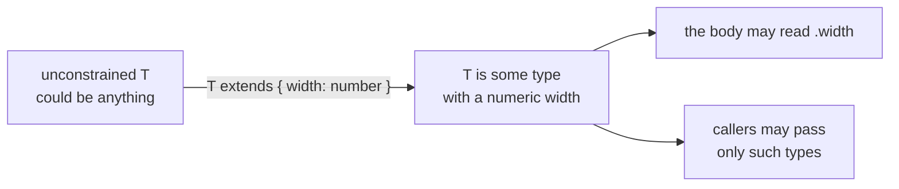
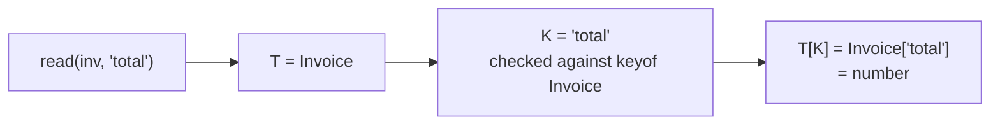
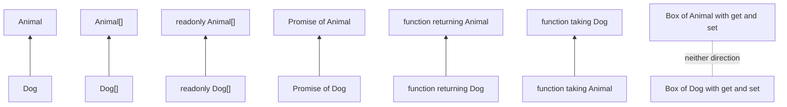

# 07 — Generics: One Implementation, Every Type

## Why this exists

`firstOf(items: any[]): any` works on every array but *forgets* what was
inside — the caller gets `any` back and checking stops. Generics let a
function carry a type **through** itself: whatever type goes in is what
comes out, still checked. One implementation, every type, zero `any`.

## Map of this module

| Section | Exercise |
| --- | --- |
| `any` loses the link · `<T>` declares · Anatomy · Arrows, call signatures, methods | ex01 |
| Inference reads the arguments · Literals · Inference from context | ex01 |
| Inference through a callback | ex02 |
| Multiple type parameters | ex03 |
| Generic aliases, interfaces, `Result<T, E>` · Recursive generic types | ex04 |
| Generic classes · Built-in generics | ex05 |
| Constraints · `keyof T` and `T[K]` · What the body may do · `Record<K, V>` | ex06 |
| Explicit type arguments and `NoInfer` · Defaults | ex07 |
| Variance · Covariance and contravariance · Bivariance · Invariance | ex08 |
| Erasure · Smells · Reading errors | checkpoint |

## How the compiler picks `T`



*What to notice: inference reads the ARGUMENTS first, then the place the
result is assigned to, then the default. If none of those mention `T`
(like `parseAs<T>(json: string): T` called bare), `T` is `unknown`.*

## Minimal syntax

```ts
// generic function — T is a per-call placeholder
function firstItem<T>(items: readonly T[]): T | undefined {
  return items[0]
}
firstItem([1, 2, 3])   // T inferred as number
firstItem<string>([])  // T chosen explicitly

// multiple type parameters
function zip<A, B>(as: A[], bs: B[]): Array<[A, B]> {
  return as.map((a, i) => [a, bs[i] as B])
}

// generic type alias (interfaces work the same way)
type Box<T> = { value: T }
type Result<T, E = string> =        // E has a DEFAULT
  | { ok: true; value: T }
  | { ok: false; error: E }

// generic class (classes in depth: module 06)
class Stack<T> {
  private items: T[] = []
  push(item: T): void { this.items.push(item) }
  pop(): T | undefined { return this.items.pop() }
}

// constraint — only types with a numeric length may be T
function longest<T extends { length: number }>(a: T, b: T): T {
  return a.length >= b.length ? a : b
}

// keyof constraint — key must belong to obj; T[K] looks up its type
function getProperty<T, K extends keyof T>(obj: T, key: K): T[K] {
  return obj[key]
}
```

### `any` loses the link between input and output

`any` accepts everything and returns a value nobody checks. The bug is
not the input — it is the *output*: the caller gets `any`, and every
mistake after that point is invisible.

```ts
function firstOfLoose(items: any[]): any {
  return items[0]
}
const loose = firstOfLoose(['ada', 'grace'])
loose.upper()          // compiles — the typo waits for runtime 💥
```

A generic keeps the link. Whatever element type went in comes out — and
the typo is a compile error.

```ts
function firstOf<T>(items: readonly T[]): T | undefined {
  return items[0]
}
const first = firstOf(['ada', 'grace'])   // string | undefined

// ❌ error TS2339: Property 'upper' does not exist on type 'string'.
first?.upper()
```

| | `firstOfLoose(xs: any[]): any` | `firstOf<T>(xs: readonly T[]): T \| undefined` |
| --- | --- | --- |
| Input linked to output | ❌ | ✅ |
| Autocomplete on the result | ❌ | ✅ |
| Wrong usage caught | ❌ | ✅ |
| Empty array visible in the type | ❌ | ✅ (`\| undefined`) |

Gotcha: `unknown[]` is honest but forces every caller to narrow. A
generic gives the same honesty with no narrowing — the compiler already
knows the type. The `| undefined` is not optional either: under
`noUncheckedIndexedAccess`, `items[0]` is `T | undefined`, and a generic
cannot rule out an empty array any more than a plain type can.

### `<T>` declares a type parameter — it does not apply one

Angle brackets after a name **introduce a new type variable**. They never
"attach" an existing alias. `function add<Money>(...)` does not give
`add` the type `Money` — it declares a brand-new parameter that happens
to be *named* `Money`, shadowing your alias.

```ts
type Money = { cents: number }

function addLoose<Money>(a: Money, b: Money) {
  // ❌ error TS2339: Property 'cents' does not exist on type 'Money'.
  return { cents: a.cents + b.cents }
}
```

The message is the clue: "type `Money`" here is the *type parameter*
`Money`, which could be anything — so it has no `cents`. A pre-existing
type is applied by **annotation**, with a colon:

```ts continue
// ✅ annotate — the alias is applied, not redeclared
function add(a: Money, b: Money): Money {
  return { cents: a.cents + b.cents }
}
```

Rule: `name<X>` in a declaration **creates** `X`; `name: X` **uses** `X`.
If you see `<SomethingYouAlreadyDefined>` after a function or class
name, you have shadowed it.

### Anatomy of a generic function

Once declared, `T` is an ordinary type everywhere in the signature and
body — parameters, return type, locals, nested types like `T[]`.

```ts
function repeat<T>(value: T, times: number): T[] {
  const out: T[] = []                 // T in a local annotation
  for (let i = 0; i < times; i++) out.push(value)
  return out
}
const threes = repeat(3, 2)           // number[]
const dashes = repeat('-', 5)         // string[] — a fresh T per call
```

| Name | Conventional meaning |
| --- | --- |
| `T` | "the" type — one generic thing |
| `K`, `V` | key and value (`Map<K, V>`, `Record<K, V>`) |
| `E` | element, or error (`Result<T, E>`) |
| `R` | result / return type of a callback |
| `TItem`, `TKey` | descriptive names — use them once a signature has three or more |

Gotcha: `T` is a *per-call* placeholder. `repeat(3, 1)` and
`repeat('a', 1)` each pick their own `T`; nothing is shared between
calls.

### Generic arrow functions, call signatures, and methods

The type parameter list always sits **right before the parameter list**.
That gives three more places to write one.

```ts
// arrow function — the trailing comma in <T,> is only needed in .tsx
// files, where a bare <T> reads as a JSX tag; harmless in .ts
const identity = <T,>(value: T): T => value
const wrap = <T>(value: T): T[] => [value]

// a generic CALL SIGNATURE in a type — the caller of the value picks T
type Head = <T>(items: readonly T[]) => T | undefined
const head: Head = (items) => items[0]

// a generic METHOD — T belongs to the method, chosen at each call
interface Parser {
  parseOr<T>(text: string, fallback: T): T
}
const parser: Parser = {
  parseOr(text, fallback) {
    try { return JSON.parse(text) } catch { return fallback }
  },
}
const n = parser.parseOr('42', 0)        // number
```

Gotcha: *placement* decides who picks `T`. `type Head = <T>(...)` makes
every `Head` value generic. `type Head2<T> = (items: T[]) => T` makes
the **alias** generic — you pick `T` once when you write `Head2<string>`,
and the function itself is not generic anymore.

### Inference reads the arguments

You almost never write `<number>` yourself. The compiler compares each
argument's type with its parameter's type and collects **candidates**
for `T`. Parameters that do not mention `T` contribute nothing.

```ts
function bounds<T>(low: T, high: T, label: string): [T, T] {
  return [low, high]
}
bounds(1, 9, 'score')             // T = number   (label: string says nothing about T)
bounds('a', 'z', 'grade')         // T = string
// ❌ error TS2345: Argument of type 'string' is not assignable to parameter of type 'number'.
bounds(1, 'z', 'mixed')
```

Two candidates that disagree are not unioned — the compiler keeps the
*first* and reports the second as a mismatch. Inside a single array the
rule is friendlier: element candidates **are** unioned.

```ts continue
function firstOf<T>(items: readonly T[]): T | undefined { return items[0] }
const mixed = firstOf([1, 'z'])   // T = string | number
```

Gotcha: if you *want* mixed arguments, say so — `bounds<number |
string>(1, 'z', 'mixed')` — or give `low` and `high` separate type
parameters.

### Literals: kept when `T` is returned bare, widened inside structures

Pass `'hi'` directly and the compiler keeps the literal — *if* `T` is the
whole return type. Wrap it in an array or object and it widens to
`string`, exactly like a `let`.

```ts
function identity<T>(value: T): T { return value }
function wrap<T>(value: T): T[] { return [value] }

const a = identity('hi')          // type: 'hi'      — T is the return type itself
const b = wrap('hi')              // type: string[]  — T sits inside T[]
const c = identity(['hi'])        // type: string[]  — literal inside an array
const d = identity({ k: 'hi' })   // type: { k: string }

const keep: 'hi' = a              // ✅
// ❌ error TS2322: Type 'string[]' is not assignable to type '"hi"[]'.
const lost: 'hi'[] = b
```

Ask for literals explicitly with a `const` type parameter — the argument
is then read as if it had `as const`:

```ts
function tuple<const T extends readonly unknown[]>(items: T): T {
  return items
}
const pair = tuple(['a', 1])                   // readonly ['a', 1]
const check: readonly ['a', 1] = pair          // ✅ literals and tuple shape kept
```

Gotcha: `<const T>` only affects *inference*. It does not make `T`
readonly by itself — that is why the constraint says `readonly
unknown[]`, so callers may pass any array.

### Inference from context: the return position counts too

When no argument mentions `T`, the compiler has one more place to look —
the type the result is **assigned to**.

```ts
function empty<T>(): T[] { return [] }

const names: string[] = empty()     // T = string, read from the annotation
const nothing = empty()             // nothing to read → unknown[]

// ❌ error TS2322: Type 'unknown' is not assignable to type 'number'.
const n: number = nothing[0]
```

Gotcha: the context must be *right there* — an annotated `const`, a
typed parameter you pass the call into, a declared return type. Storing
the result in an unannotated `const` first loses it: `T` is `unknown`
from then on.

### Inference through a callback: `T` flows in, `R` flows out

Callbacks are where generics feel like magic. The array's element type
flows **into** the callback's parameter; the callback's return type
flows **out** into a second parameter.



*What to notice: inference runs in two rounds. Round one fixes `T` from
the plain arguments. Round two uses the now-known `T` to type the
callback's parameter, then reads `R` from what the callback returns.*

```ts
function convert<T, R>(value: T, fn: (input: T) => R): R {
  return fn(value)
}
const size = convert('hello', (text) => text.length)   // R = number
const flag = convert(10, (n) => n > 5)                 // R = boolean
```

You never annotated `text` — it is `string` because `T` was fixed from
`'hello'` before the arrow function was examined. The same two-round
dance types every `.map`, `.filter`, and `.reduce` you call.

How many parameters? One for every type that can vary *independently*:

| Operation | Element in | Element out | Parameters |
| --- | --- | --- | --- |
| map / transform | `T` | `R` — whatever the callback returns | `<T, R>` |
| filter / keep | `T` | `T` — the same elements, fewer of them | `<T>` |
| flatten one level | `T[]` | `T` | `<T>` |
| zip two arrays | `A` and `B` | `[A, B]` | `<A, B>` |

Gotcha: if `T` cannot be fixed before the callback is examined (the
callback is the *only* argument), its parameter is implicitly `any` —
error TS7006. Put plain data first, callbacks last.

### Multiple type parameters, each inferred separately

Two independent things, two parameters. Each is inferred from its own
argument — there is no link between them unless you write one.

```ts
function labelled<A, B>(label: A, value: B): { label: A; value: B } {
  return { label, value }
}
const price = labelled('price', 9.5)       // { label: string; value: number }

const stock = new Map<string, number>()    // K = string, V = number
// ❌ error TS2345: Argument of type 'string' is not assignable to parameter of type 'number'.
stock.set('pears', 'many')

labelled<number, string>(1, 'one')         // explicit — filled left to right
// ❌ error TS2345: Argument of type 'number' is not assignable to parameter of type 'string'.
labelled<string, number>(1, 'one')
```

A later parameter may be *constrained by* an earlier one. That is how a
`key` argument gets tied to the object it indexes:

```ts
function setField<T, K extends keyof T>(target: T, key: K, value: T[K]): void {
  target[key] = value
}
const cfg = { retries: 3, host: 'localhost' }
setField(cfg, 'retries', 5)          // ✅ K = 'retries', so T[K] = number
// ❌ error TS2345: Argument of type 'string' is not assignable to parameter of type 'number'.
setField(cfg, 'retries', 'five')
```

Gotcha: a type parameter that never appears in the signature is not an
error — it is inferred as `unknown` and nobody notices. Delete it.

### Generic type aliases, interfaces, and `Result<T, E>`

A type can take parameters too. `Labeled<T>` is not a type — it is a type
**factory**: `Labeled<number>` and `Labeled<string>` are the types.

```ts
type Labeled<T> = { label: string; value: T }
interface Page<T> {
  items: T[]
  total: number
}
const price: Labeled<number> = { label: 'price', value: 9 }
const page: Page<string> = { items: ['a', 'b'], total: 2 }

// ❌ error TS2314: Generic type 'Labeled' requires 1 type argument(s).
const bad: Labeled = { label: 'x', value: 1 }
```

TS2314 is what you get for forgetting the angle brackets on a generic
type with no default. Fix: a type argument, or a default (`<T =
unknown>`) so bare `Labeled` means `Labeled<unknown>`.

Unions can be generic too. This one replaces exceptions with a value the
caller *must* inspect; the discriminant narrows to `T` or `E`:

```ts
type Outcome<T, E = Error> =
  | { ok: true; value: T }
  | { ok: false; error: E }

function parsePort(text: string): Outcome<number, string> {
  const n = Number(text)
  return Number.isInteger(n) && n > 0 && n < 65536
    ? { ok: true, value: n }
    : { ok: false, error: `not a port: ${text}` }
}
const port = parsePort('8080')
if (port.ok) port.value.toFixed()       // number
else port.error.toUpperCase()           // string
```

| | `type Alias<T>` | `interface Iface<T>` |
| --- | --- | --- |
| Type parameters, constraints, defaults | ✅ | ✅ |
| Can be a union, tuple, or conditional | ✅ | ❌ (object shapes only) |
| Extends another generic type | via `&` | `interface B<T> extends A<T>` |
| Declaration merging | ❌ | ✅ |
| `class C implements X<number>` | ✅ | ✅ |

A type argument can be `never` — "no value will ever sit here".
`Outcome<number, never>` is a result that can only be `ok`; the `error`
branch exists in the union but nothing can construct it. Builders that
know which branch they make (`succeed(value)`, `fail(error)`) use this to
give the other side `never`.

Gotcha: `T` and `E` are *independent* — `Outcome<number, string>` is not
assignable to `Outcome<number, Error>`. Pick the error type once per
module; that is what the default is for.

### Recursive generic types

A generic alias may mention itself inside an object or array. That is
how trees, linked lists, and nested JSON get typed.

```ts
type Tree<T> = { value: T; children: Tree<T>[] }

function sumTree(tree: Tree<number>): number {
  let total = tree.value
  for (const child of tree.children) total += sumTree(child)
  return total
}
sumTree({ value: 1, children: [{ value: 2, children: [] }] })    // 3
```

Gotcha: the recursion must sit *inside* a structure (a property, an
array, a tuple). `type Loop<T> = Loop<T>` has no base case and is
rejected as circular.

### Generic classes: the whole instance is specialised

A class can take type parameters. Every method and field then agrees on
the same `T` for that instance — `Queue<string>` only ever holds strings.

```ts
class Queue<T> {
  private items: T[] = []
  enqueue(item: T): void { this.items.push(item) }
  dequeue(): T | undefined { return this.items.shift() }
  get length(): number { return this.items.length }
}

const jobs = new Queue<string>()
jobs.enqueue('build')
// ❌ error TS2345: Argument of type 'number' is not assignable to parameter of type 'string'.
jobs.enqueue(42)
```

Nothing in `new Queue()` mentions `T`, so it cannot be inferred — write
`new Queue<string>()` or you get `Queue<unknown>`. A constructor that
*takes* a `T` can infer it:

```ts
class Cell<T> {
  constructor(public value: T) {}
}
const cell = new Cell(3)             // Cell<number>, inferred from the argument

class Registry<T> {
  // ❌ error TS2302: Static members cannot reference class type parameters.
  static all: T[] = []
}
```

Gotcha: `T` belongs to the *instance*. Static members are shared by
`Queue<string>` and `Queue<number>` alike, so `T` is meaningless there
(TS2302). Give a static method its own `<U>` instead.

### Built-in generics you already use

Every one of these is a generic type. Now you can read their signatures.

| Type | What the parameters are |
| --- | --- |
| `Array<T>` / `T[]`, `readonly T[]` | element type (readonly: no mutators) |
| `Promise<T>` | the resolved value |
| `Map<K, V>`, `Set<T>` | key and value / element |
| `Record<K, V>` | key union (`K extends string \| number \| symbol`) and value |
| `Partial<T>`, `Required<T>`, `Readonly<T>` | the object being transformed |
| `Pick<T, K extends keyof T>` | an object and a subset of its keys |

### Constraints: `extends` limits what `T` may be

An unconstrained `T` could be *anything* — a number, `null`, a function.
So the body may do almost nothing with it. `T extends Shape` narrows the
callers' choices and, in exchange, widens what the body may do.



*What to notice: a constraint is a contract in both directions — it
restricts callers and it enables the body. Neither side gets more than
the constraint states.*

```ts
function widestLoose<T>(items: readonly T[]): number {
  let max = 0
  // ❌ error TS2339: Property 'width' does not exist on type 'T'.
  for (const item of items) max = Math.max(max, item.width)
  return max
}
```

Add the constraint and the property exists — and callers passing the
wrong thing are stopped:

```ts
function widest<T extends { width: number }>(items: readonly T[]): T | undefined {
  let best: T | undefined
  for (const item of items) if (!best || item.width > best.width) best = item
  return best
}
widest([{ width: 3, name: 'door' }, { width: 9, name: 'gate' }])   // ✅ extra props fine
// ❌ error TS2322: Type 'number' is not assignable to type '{ width: number; }'.
widest([1, 2])
```

| Constraint | Allows | Typical use |
| --- | --- | --- |
| `T extends { length: number }` | strings, arrays, anything with `.length` | measure |
| `T extends object` | any non-primitive | `Object.keys`, spreading |
| `T extends string \| number` | just those primitives | keys, template literals |
| `T extends readonly unknown[]` | any array or tuple | tuple-preserving helpers |
| `K extends keyof T` | keys of another parameter | property access |

```ts
function keysOf<T extends object>(value: T): (keyof T)[] {
  return Object.keys(value) as (keyof T)[]
}
function tag<T extends string | number>(id: T): `#${T}` {
  return `#${id}`
}
const k = keysOf({ a: 1, b: 2 })      // ('a' | 'b')[]
const h = tag(42)                     // '#42'
```

A constraint that a *type argument* fails gives error TS2344:

```ts
type Sized<T extends { size: number }> = { largest: T }
type Ok = Sized<{ size: number; label: string }>
// ❌ error TS2344: Type 'string' does not satisfy the constraint '{ size: number; }'.
type Bad = Sized<string>
```

Gotcha: `extends` here means "is assignable to", not "inherits from".
`{ width: 3, name: 'door' }` satisfies `{ width: number }` structurally
— extra properties are fine.

### `keyof T` and `T[K]`: precise property access

`keyof T` is the union of `T`'s property names. Constraining `K extends
keyof T` means every value `K` could hold is a real key — so `T[K]` (the
**indexed access type**) is a genuine lookup, never `undefined` from a
missing key.

```ts
type Invoice = { id: number; total: number; customer: string }

function read<T, K extends keyof T>(record: T, key: K): T[K] {
  return record[key]
}

const inv: Invoice = { id: 1, total: 99, customer: 'Ada' }
const total = read(inv, 'total')        // number — T[K] resolved per call
const who = read(inv, 'customer')       // string
// ❌ error TS2345: Argument of type '"totl"' is not assignable to parameter of type 'keyof Invoice'.
read(inv, 'totl')
```



*What to notice: `K` keeps the literal `'total'` — its constraint is a
union of literals, so widening to `string` would break it. That literal
is what makes `T[K]` precise.*

Gotcha: `key: keyof T` (no `K`) also compiles but returns `T[keyof T]` —
the union of *all* property types (`string | number` here). You need
the separate `K` to remember *which* key was passed.

### What the body may do with `T` — "could be instantiated with…"

The body must work for **every** `T` the constraint allows. So you cannot
return a specific value where a `T` is owed — the caller may have
chosen a `T` that value does not fit.

```ts
function orDefault<T>(value: T | undefined): T {
  if (value !== undefined) return value
  // ❌ error TS2322: Type 'string' is not assignable to type 'T'.
  //    'T' could be instantiated with an arbitrary type which could be unrelated to 'string'.
  return 'none'
}
```

Read it as: "you promised a `T`; the caller might pick `number`; `'none'`
is not a `number`". The fix is to make the caller *provide* the
fallback, so it is a `T` by construction:

```ts
function orDefault<T>(value: T | undefined, fallback: T): T {
  return value ?? fallback          // ✅ both branches are T
}
```

The same wall appears with a constraint. Satisfying the constraint is
not enough — the caller could pick a narrower subtype:

```ts
function blank<T extends { width: number }>(): T {
  // ❌ error TS2322: Type '{ width: number; }' is not assignable to type 'T'.
  //    '{ width: number; }' is assignable to the constraint of type 'T', but 'T' could be
  //    instantiated with a different subtype of constraint '{ width: number; }'.
  return { width: 0 }
}
```

`blank<{ width: number; label: string }>()` is a legal call, and
`{ width: 0 }` has no `label`. When you see this message, the fix is
almost never a cast — take the value as a parameter, or return the
constraint type (`{ width: number }`) instead of `T`.

### `Record<K, V>` needs an indexable key

Only `string`, `number`, and `symbol` can be property keys. `Record<K,
V>` says so in its own constraint — so a type parameter you forward into
it must promise the same.

```ts
// ❌ error TS2344: Type 'K' does not satisfy the constraint 'string | number | symbol'.
type LooseDict<K, V> = Record<K, V>

type Dict<K extends string, V> = Record<K, V>          // ✅
const ports: Dict<'http' | 'https', number> = { http: 80, https: 443 }
```

Gotcha: the compiler cannot know a bare `K` is not `boolean`. The
constraint is how you tell it.

### Explicit type arguments and `NoInfer`: all or nothing

Sometimes inference cannot help — `T` appears only in the return
position, or you want a *wider* type than the argument suggests. Then
you write the type arguments yourself. If you write **one**, you must
write **all** that have no default; there is no partial application.

```ts
function convert<T, R>(value: T, fn: (input: T) => R): R {
  return fn(value)
}
convert<string, number>('42', (s) => s.length)      // ✅ both given
// ❌ error TS2558: Expected 2 type arguments, but got 1.
convert<string>('42', (s) => s.length)
```

An explicit type argument also *replaces* inference: the argument is now
checked against your `T`, so `identity<string>('hi')` is `string`, not
`'hi'`.

When the same `T` appears in two arguments, both vote. Sometimes that is
wrong — a `fallback` should be checked *against* the options, not widen
them. `NoInfer<T>` marks a position as "checked, not inferred":

```ts
function pickLoose<T extends string>(options: T[], fallback: T): T {
  return options.includes(fallback) ? fallback : (options[0] ?? fallback)
}
pickLoose(['sm', 'lg'], 'xl')       // compiles — T became 'sm' | 'lg' | 'xl' 😬

function pick<T extends string>(options: T[], fallback: NoInfer<T>): T {
  return options.includes(fallback) ? fallback : (options[0] ?? fallback)
}
pick(['sm', 'lg'], 'lg')            // ✅ T = 'sm' | 'lg'
// ❌ error TS2345: Argument of type '"xl"' is not assignable to parameter of type '"sm" | "lg"'.
pick(['sm', 'lg'], 'xl')
```

### Defaults: `= X` fills the gap inference leaves

A default is used **only** when inference finds nothing — no argument
mentions `T`, no annotation on the result, no explicit type argument. It
never overrides a real candidate.

```ts
function makeSet<T = string>(): Set<T> { return new Set() }

const tags = makeSet()                     // Set<string>  — default
const ids = makeSet<number>()              // Set<number>  — explicit wins
const flags: Set<boolean> = makeSet()      // Set<boolean> — context wins over the default
```

Defaults work in types and classes, and compose with constraints —
constraint first, default second, and the default must satisfy the
constraint. Required parameters must come *before* defaulted ones:

```ts
type Outcome<T, E = Error> =
  | { ok: true; value: T }
  | { ok: false; error: E }
type Plain = Outcome<number>                  // E = Error
type Texty = Outcome<number, string>          // E overridden

type Status<S extends string = 'draft'> = { state: S }
const s: Status = { state: 'draft' }          // S = 'draft'

// ❌ error TS2344: Type 'number' does not satisfy the constraint 'string'.
type Broken<S extends string = number> = { state: S }
// ❌ error TS2706: Required type parameters may not follow optional type parameters.
type Pair<A = string, B> = [A, B]
```

| | `<T extends X>` | `<T = X>` |
| --- | --- | --- |
| Job | limits what `T` may be | fills `T` in when nothing infers |
| Wrong argument | compile error | never — it is just not used |
| Affects the body | yes — enables `X`'s members | no |
| Combined | `<T extends X = Y>` — `Y` must satisfy `X` | |

Gotcha: `<T = unknown>` is the honest default for "trust-me" functions
like `parseAs<T>(json: string): T`. Defaulting to `any` would silently
disable checking for every caller who forgets the type argument.

### Variance: what substitutes for what

`Circle` is assignable to `Shape`. Is `Circle[]` assignable to `Shape[]`?
Is a circle-handler assignable where a shape-handler is expected — or
the other way round? *Variance* names how a generic type's
assignability follows its parameter's.



*What to notice: every solid arrow means "is assignable to". Arrays,
Promises, and return types follow the element (covariant). Function
PARAMETERS flip the arrow (contravariant): the handler accepting more
substitutes for the one accepting less. A box you can both read and
write goes neither way (invariant).*

| `T` appears as … | Variance | Example |
| --- | --- | --- |
| a return type or readonly property | covariant (same arrow) | `() => T`, `{ readonly value: T }` |
| a `readonly T[]` element, `Promise<T>` | covariant | `readonly Circle[]` → `readonly Shape[]` |
| a function parameter (property syntax) | contravariant (flipped) | `(value: T) => void` |
| a method-shorthand parameter | bivariant (both ways, unsound) | `set(value: T): void` |
| a mutable array element | bivariant (unsound) | `Circle[]` → `Shape[]` compiles |
| both a getter and a setter | invariant (neither) | `{ get: () => T; set: (v: T) => void }` |

### Covariance and contravariance

Anything that only *gives you* a `T` is safe to widen — every circle is
a shape. Anything that *receives* a `T` flips: a handler is safe to
substitute only when it accepts **at least** what will be sent to it.

```ts
type Shape = { area: number }
type Circle = { area: number; radius: number }

// covariant positions — outputs follow T
const circles: Circle[] = [{ area: 3.14, radius: 1 }]
const shapes: readonly Shape[] = circles                          // ✅ read-only view
const later: Promise<Shape> = Promise.resolve(circles[0]!)        // ✅
const make: () => Shape = (): Circle => ({ area: 1, radius: 1 })  // ✅ return type

// contravariant positions — parameters flip
type ShapeHandler = (s: Shape) => void
type CircleHandler = (c: Circle) => void
const logArea: ShapeHandler = (s) => console.log(s.area)
const onCircle: CircleHandler = logArea            // ✅ accepts more than needed

const logRadius: CircleHandler = (c) => console.log(c.radius)
// ❌ error TS2322: Type 'CircleHandler' is not assignable to type 'ShapeHandler'.
const onShape: ShapeHandler = logRadius            // might read .radius from a square
```

The error's second line — "Types of parameters 'c' and 's' are
incompatible" — is the flipped arrow. This is `strictFunctionTypes`
from module 01 doing its job.

Gotcha: one function type has *both* kinds of position. `(s: Shape) =>
Circle` is assignable to `(c: Circle) => Shape`: it accepts more and
returns more.

### Bivariance: the mutable-array hole and method shorthand

Two places deliberately relax the rules for ergonomics. Both can be
exploited.

**Mutable arrays.** `Circle[]` is assignable to `Shape[]`, even though
`push` takes a parameter and should flip. Array methods are checked
bivariantly so everyday code compiles. The price:

```ts
type Shape = { area: number }
type Circle = { area: number; radius: number }

const circles: Circle[] = [{ area: 3.14, radius: 1 }]
const shapes: Shape[] = circles             // allowed — but now an alias
shapes.push({ area: 4 })                    // compiles: it IS a Shape
for (const c of circles) c.radius.toFixed() // 💥 the impostor has no radius

const safe: readonly Shape[] = circles
// ❌ error TS2339: Property 'push' does not exist on type 'readonly Shape[]'.
safe.push({ area: 4 })
```

`readonly T[]` removes every mutator from the type, so there is no door
to push the impostor through. That is why read-only helpers take
`readonly T[]` — it is both *safer* and *more accepting*.

**Method shorthand.** A parameter declared with method syntax
(`handle(s: Shape): void`) is checked bivariantly; the same thing written
as a property (`handle: (s: Shape) => void`) is contravariant.

```ts continue
type Listener = { handle(s: Shape): void }           // method — bivariant
type StrictListener = { handle: (s: Shape) => void } // property — contravariant

const circleOnly = { handle: (c: Circle) => c.radius }
const relaxed: Listener = circleOnly                 // allowed by bivariance
// ❌ error TS2322: Type '{ handle: (c: Circle) => number; }' is not assignable to type 'StrictListener'.
const strict: StrictListener = circleOnly
```

Gotcha: prefer property syntax for callbacks in your own types. Method
syntax exists so class hierarchies and the DOM's `.d.ts` keep
compiling; it is not the safe default.

### Invariance and `in` / `out` annotations

A container you can both read from and write to must match `T` exactly.
Reading wants covariance; writing wants contravariance; only equality
satisfies both.

```ts
type Shape = { area: number }
type Circle = { area: number; radius: number }
type Cell<T> = { get: () => T; set: (value: T) => void }

declare const circleCell: Cell<Circle>
declare const shapeCell: Cell<Shape>

// ❌ error TS2322: Type 'Cell<Circle>' is not assignable to type 'Cell<Shape>'.
const asShape: Cell<Shape> = circleCell     // set would accept a square
// ❌ error TS2322: Type 'Cell<Shape>' is not assignable to type 'Cell<Circle>'.
const asCircle: Cell<Circle> = shapeCell    // get could return a square
```

You can *state* a parameter's variance with `out` (produced, covariant)
and `in` (consumed, contravariant). The compiler checks the body
honours it, and errors get clearer:

```ts
type Producer<out T> = { get: () => T }
type Consumer<in T> = { set: (value: T) => void }
type Both<in out T> = { get: () => T; set: (value: T) => void }

// ❌ error TS2636: Type 'Wrong<super-T>' is not assignable to type 'Wrong<sub-T>' as implied by variance annotation.
type Wrong<in T> = { get: () => T }
```

Gotcha: a plain mutable property `{ value: T }` is *checked* covariantly
— the same hole as arrays. Only an explicit getter/setter pair is
checked invariantly. When soundness matters, mark properties `readonly`.

### Generics are erased — `T` is not a value

Type parameters vanish at build time like every other type. There is no
`T` at runtime, so you cannot construct it, inspect it, or branch on it.

```ts
function makeLoose<T>(): T {
  // ❌ error TS2693: 'T' only refers to a type, but is being used as a value here.
  return new T()
}
```

Pass something that *does* exist at runtime — the constructor — and let
`T` be inferred from it:

```ts
function make<T>(ctor: new () => T): T {
  return new ctor()
}
class Counter { count = 0 }
const counter = make(Counter)          // Counter — T inferred from the constructor type
```

At runtime, `typeof counter` is `'object'`, `Object.keys` sees
`['count']`, and `JSON.stringify` of a `Box<number>` is `{"value":1}` —
nothing remembers that a `T` was ever involved.

Gotcha: `typeof T` and `x instanceof T` are the same mistake in other
clothing. Runtime checks work on *values* — a constructor, a
discriminant field, a type guard — never on a type parameter.

### Smells: when a generic is not pulling its weight

A type parameter earns its place by *linking* two positions. If it
appears once, nothing is linked — a plain type says the same thing.

```ts
function logLoose<T>(value: T): void { console.log(value) }        // T used once
function log(value: unknown): void { console.log(value) }          // same thing, plainer

function nameOfLoose<T extends { name: string }>(x: T): string { return x.name }
function nameOf(x: { name: string }): string { return x.name }    // same thing, plainer
```

| Smell | Symptom | Fix |
| --- | --- | --- |
| `T` used once | signature reads the same without it | plain type, or `unknown` |
| over-constraining | `T extends { a: number; b: string }` but the body reads only `a` | constrain to what the body uses |
| returning a specific type as `T` | "could be instantiated with…" | return the constraint, or take the value as a parameter |
| `as T` in the body | you are guessing | restructure so the compiler proves it |
| a parameter that never appears | inferred as `unknown`, nobody notices | delete it |

Gotcha: "return `unknown` or `T`?" — `unknown` when the result depends on
nothing the caller passed (`JSON.parse`). `T` only when an argument,
annotation, or constructor can tell the compiler what it is.

### Reading generic error messages

Generic errors mention *both* the abstract name and the concrete
instantiation. Find the concrete part first; it is usually the answer.

| Code | Message starts with | What it is telling you |
| --- | --- | --- |
| TS2314 | Generic type 'X' requires N type argument(s) | you wrote a bare `Labeled`; add `<...>` or a default |
| TS2558 | Expected N type arguments, but got M | explicit type arguments are all-or-nothing |
| TS2344 | Type 'X' does not satisfy the constraint 'Y' | a type argument (or a default) breaks `extends` |
| TS2345 | Argument of type 'X' is not assignable to parameter of type 'Y' | a *value* argument breaks a constraint or a fixed `T` |
| TS2322 | … 'T' could be instantiated with an arbitrary type … | the body returns something specific where a `T` is owed |
| TS2322 | … could be instantiated with a different subtype of constraint … | same, but the constraint fooled you — subtypes exist |
| TS2339 | Property 'x' does not exist on type 'T' | `T` is unconstrained (or shadows an alias); add `extends` |
| TS2302 | Static members cannot reference class type parameters | `T` is per instance; give the static its own `<U>` |
| TS2693 | 'T' only refers to a type, but is being used as a value | `new T()` — pass a constructor instead |
| TS7006 | Parameter 'x' implicitly has an 'any' type | a callback's `T` was not fixed yet; reorder or annotate |

## Rules to remember

- `name<T>` **declares** `T`. `name: T` **uses** `T`. Never both for the
  same name.
- Inference reads the arguments, then the result's annotation, then the
  default. Explicit type arguments override all of it — and are
  all-or-nothing.
- A literal survives only when `T` is the return type itself. `<const T>`
  keeps it everywhere.
- One type parameter per *independently varying* type. Map needs
  `<T, R>`; filter needs `<T>`.
- `extends` limits; `= X` fills in. `<T extends X = Y>` does both.
- The body may use only what the constraint guarantees, and may return
  only a real `T` — never a specific value dressed as one.
- Outputs are covariant. Parameters are contravariant. Read-and-write is
  invariant. Mutable arrays and method shorthand are the two known holes.
- `T` does not exist at runtime.

## Common gotchas

- Generics are **erased** at runtime — `T` is not a value; you cannot
  write `new T()` or `typeof T` in code that runs.
- Inference keeps literal types for primitives passed directly
  (`identity('hi')` is type `'hi'`) but widens literals inside array and
  object arguments (`identity(['hi'])` is `string[]`) — and whenever `T`
  is nested in the return type (`wrap('hi')` is `string[]`).
- A constraint is not a default: `extends string` *limits* what `T` may
  be; `= string` *fills it in* when inference has nothing to go on.
- A class's `T` is not inferred from `new Stack()` — nothing in the call
  mentions it. Write `new Stack<number>()`.
- `key: keyof T` returns the union of *all* property types; you need a
  separate `K extends keyof T` to get the *one* you asked for.
- If a signature uses `T` only once, you probably don't need a generic —
  a plain type says the same thing.
- `Circle[]` assigned to `Shape[]` compiles and is unsound. Take
  `readonly T[]` when you only read.

## Try it now

→ `exercises/ex01.ts` through `ex08.ts`, then `checkpoint.ts`.
Check with `npm test -- 07`.
