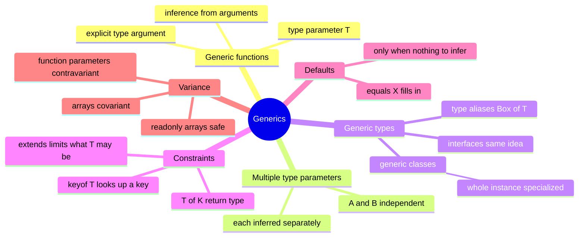

# 07 — Generics · Cheat-sheet

## Concept map



*What to notice: constraints (`extends`) and defaults (`= X`) look similar
but do opposite jobs — one limits, one fills in.*

## Key syntax

```ts
function firstItem<T>(items: readonly T[]): T | undefined {
  return items[0]
}
firstItem<string>([])                      // explicit type argument

function zip<A, B>(as: A[], bs: B[]): Array<[A, B]> { /* ... */ }

type Box<T> = { value: T }
type Result<T, E = string> =               // E defaults to string
  | { ok: true; value: T }
  | { ok: false; error: E }

class Stack<T> {
  private items: T[] = []
  push(item: T): void { this.items.push(item) }
  pop(): T | undefined { return this.items.pop() }
}

function longest<T extends { length: number }>(a: T, b: T): T {
  return a.length >= b.length ? a : b
}

function getProperty<T, K extends keyof T>(obj: T, key: K): T[K] {
  return obj[key]
}
```

## Rules to remember

- Inference reads only the ARGUMENTS. `parseAs<T>(json: string): T` gives
  `T` nothing to match against — pass it explicitly or give it a default.
- A constraint (`extends`) *limits* what `T` may be; a default (`= X`)
  *fills it in* when there's nothing to infer from. They compose:
  `<T extends string = 'a'>`.
- `keyof T` constrains `K` to T's own keys, so `T[K]` is always a real
  lookup — misspelled keys fail to compile.
- Generics are erased at runtime: no `new T()`, no `typeof T` in code
  that runs, no runtime check of what `T` "is".
- Mutable arrays are covariant (unsound: `Dog[]` fits where `Animal[]` is
  expected, then a non-dog can be pushed). `readonly T[]` closes the hole
  for read-only use.
- Function parameters are contravariant: a handler accepting more
  (`Animal`) substitutes for one accepting less (`Dog`), never the
  reverse.

## Gotchas

- If `T` appears only once in a signature, a generic probably isn't
  needed — a plain type says the same thing with less ceremony.
- Literal types survive when passed directly (`identity('hi')` is
  `'hi'`) but widen inside array/object arguments
  (`identity(['hi'])` is `string[]`).
- A class's own type parameters (`class Stack<T>`) are not inferred from
  `new Stack()` — nothing in the constructor call mentions `T`, so the
  caller must supply it: `new Stack<number>()`.
- `Record<K, V>` needs `K extends string` (or a similarly indexable key
  type) before you can use `K` as an index signature's key.

## Self-quiz

1. Why does `firstItem<T>(items: readonly T[]): T | undefined` need the
   `| undefined` even with a generic `T`?
2. What's the difference between `<T extends string>` and `<T = string>`?
3. Why does `mapArray` need two type parameters but `filterArray` needs
   only one?
4. Given `getProperty<T, K extends keyof T>(obj: T, key: K): T[K]`, why
   is `obj[key]` in the body already known to be safe?
5. Is `Dog[]` assignable to `Animal[]`? Is `readonly Dog[]` assignable to
   `readonly Animal[]`? Which one lets you push a non-dog afterwards?
6. Why is `(a: Animal) => void` assignable to `(d: Dog) => void`, but not
   the other way round?
7. `new Stack<number>()` — why must `<number>` be written explicitly
   here, unlike `firstItem([1, 2, 3])`?
8. What type does `parseAs('{}')` have if `parseAs` is declared
   `<T = unknown>(json: string): T`?

<details><summary>Answers</summary>

1. `noUncheckedIndexedAccess` makes any array index access
   `T | undefined` — `items[0]` can't rule out an empty array, generic or
   not.
2. `extends string` restricts `T` to string-like types (a constraint);
   `= string` supplies `string` only when inference has nothing else to
   go on (a default). One narrows input, the other fills a gap.
3. Mapping can change the element type (`string` in, `number` out), so
   the result needs its own parameter `R`. Filtering only ever removes
   elements — the output type is always the same as the input, so one
   `T` covers both.
4. `K extends keyof T` means every value `K` can hold is a real key of
   `T`, so `T[K]` is a genuine, always-present lookup — never `undefined`
   from a missing key.
5. Yes to both. `readonly Dog[]` to `readonly Animal[]` is the safe one:
   without `push` in the type, there's no way to insert a non-dog through
   the alias. The mutable `Dog[]` to `Animal[]` assignment is the unsound
   one — `push({ name: 'Mia' })` compiles and corrupts the original array.
6. Function parameters are contravariant: a handler that already deals
   with every `Animal` can certainly handle any `Dog` (a Dog is an
   Animal). The reverse handler might reach for `.breed`, which a plain
   `Animal` doesn't have.
7. Type parameter inference only looks at the ARGUMENTS of a call.
   `firstItem([1, 2, 3])` has an argument that mentions `T`. The `Stack`
   constructor takes no arguments, so nothing tells the compiler what `T`
   should be — it must be supplied explicitly.
8. `unknown` — the default kicks in because nothing in the call mentions
   `T`, and `unknown` is the honest choice until a caller commits with
   `parseAs<SomeType>(json)`.

</details>
