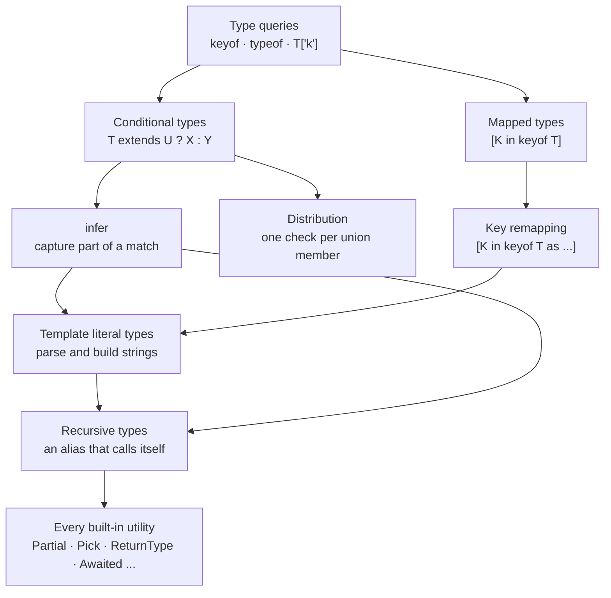
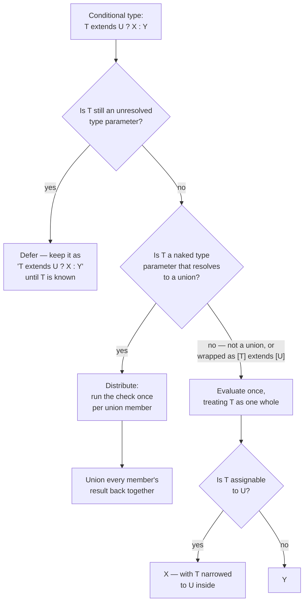
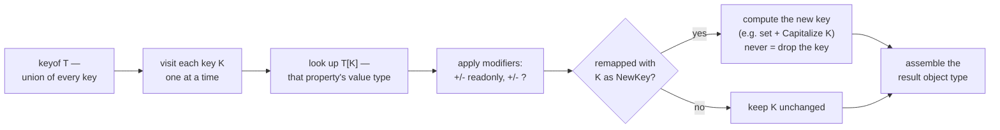
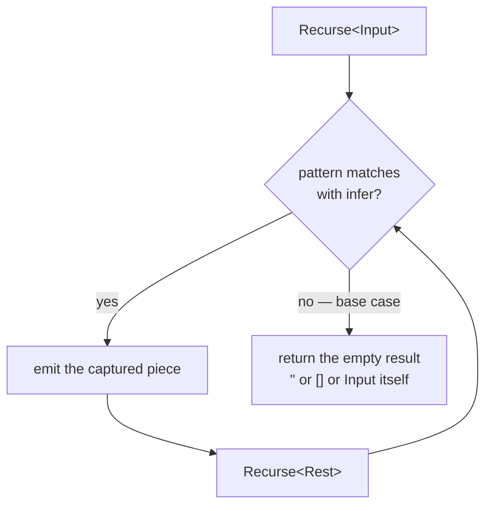
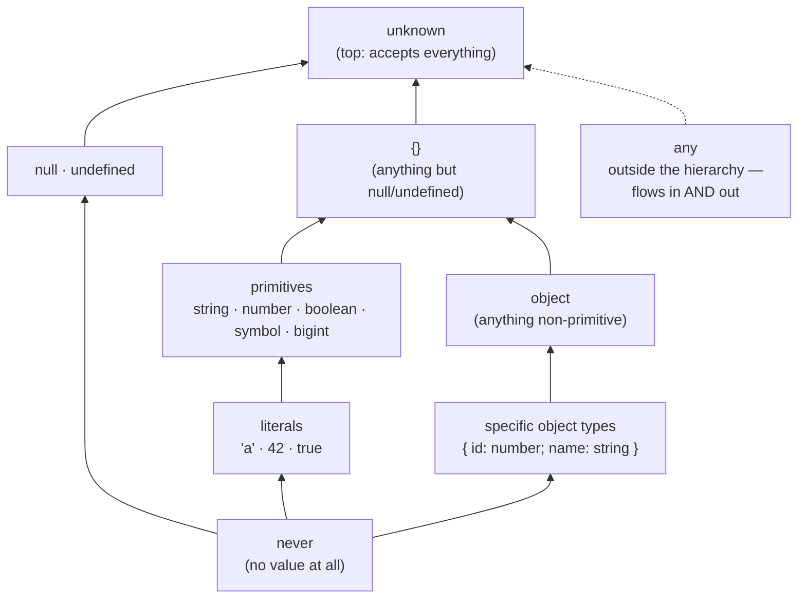
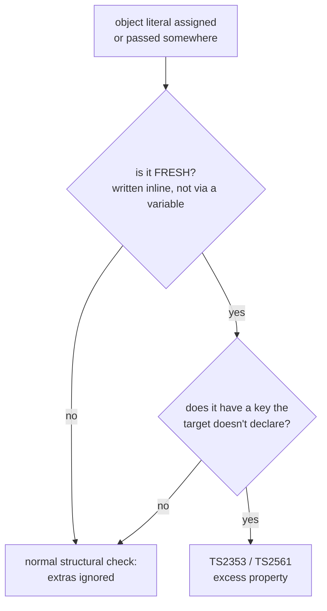
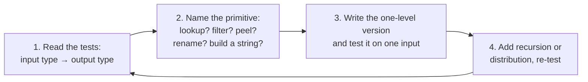

# 08 — Type System Deep Dive: Types as a Programming Language

## Why this exists

Most everyday TypeScript only *describes* shapes. This module is different:
you *compute* with types — deriving a new type from an existing one, the
same way you'd write a function. `keyof`, conditional types, `infer`, and
mapped types are the handful of primitives that computation is built from.
Nearly every advanced type you'll meet in the wild (`Partial`, `ReturnType`,
form validators, ORMs, routers) is assembled from just these pieces.

## Map of this module

| Section | Exercise |
| --- | --- |
| Type queries: `keyof`, `typeof`, indexed access, `T[number]` | ex01 |
| Conditional types: `extends`, `never`, nesting, deferral | ex02 |
| Distribution and how to switch it off | ex03 |
| `infer` in every position | ex04 |
| Mapped types and `+`/`-` modifiers | ex05 |
| Key remapping with `as`, filtering by value | ex06 |
| Template literal types, parsing with `infer` | ex07 |
| Recursive types, depth limits | ex08 |
| The built-in utility catalog and how each is built | ex09, ex10 |
| `as const` + `satisfies` | ex11 |
| Assignability rules and excess property checks | ex12 |
| Type-level toolkit: `Equal`, `Expect`, `Prettify` | puzzles |
| Everything, on a typed event bus | checkpoint |

## The four primitives



*What to notice: there is no primitive past the top four boxes — every
utility type, however scary, is a combination of a query, a conditional,
`infer`, and a mapped type.*

## Minimal syntax

```ts
const origin = { x: 0, y: 0 }
type Origin = typeof origin                          // { x: number; y: number } — from a VALUE
type Axis = keyof Origin                             // 'x' | 'y' — union of property names
type X = Origin['x']                                 // number — indexed access, a lookup

type IsBool<T> = T extends boolean ? true : false    // conditional: an `if` for types
type Inner<T> = T extends (infer E)[] ? E : never     // infer: capture what matched
type Flags<T> = { [K in keyof T]: boolean }          // mapped: loop over every key
type Prefixed<K extends string> = `app:${K}`         // template literal: build a string type
```

Every section below teaches one of those pieces, in exercise order. Every
example compiles under the course's strict `tsconfig`.

## Type queries — deriving types from what already exists

### `keyof` — the union of an object's keys

`keyof T` is the union of every property name of `T`. It removes the bug
where a hand-written `'id' | 'total'` union drifts away from the object it
was copied from.

```ts
type Invoice = { id: number; total: number; paid: boolean }
type InvoiceKey = keyof Invoice          // 'id' | 'total' | 'paid'

const k1: InvoiceKey = 'total'           // ✅
// ❌ error TS2322: Type '"amount"' is not assignable to type 'keyof Invoice'.
const k2: InvoiceKey = 'amount'
```

Index signatures widen the answer — a number is a valid key for a
string-keyed object, so `keyof` says `string | number`. `keyof any` is
"anything usable as a key".

```ts
type ByName = { [name: string]: number }
type ByIndex = { [i: number]: string }
type Row = { 0: 'a'; 1: 'b'; name: string }

type K1 = keyof ByName        // string | number
type K2 = keyof ByIndex       // number
type K3 = keyof Row           // 0 | 1 | 'name' — numeric keys stay numeric
type K4 = keyof any           // string | number | symbol
type K5 = keyof {}            // never

const k: K1 = 5               // ✅
// ❌ error TS2322: Type 'string' is not assignable to type 'number'.
const j: K2 = 'x'
```

Gotcha: `keyof` of a **union** keeps only the keys *every* member has;
`keyof` of an **intersection** keeps them all.

```ts
type Person = { id: number; name: string }
type Account = { id: number; email: string }
type Shared = keyof (Person | Account)   // 'id'
type All = keyof (Person & Account)      // 'id' | 'name' | 'email'

// ❌ error TS2322: Type '"name"' is not assignable to type '"id"'.
const shared: Shared = 'name'
```

### `typeof` — a type from a value

In a type position, `typeof value` reads the *static type* of a variable,
function, or class. It is not the runtime `typeof` operator — same
keyword, different world.

```ts
const SIZES = ['sm', 'md', 'lg'] as const
type Sizes = typeof SIZES                // readonly ['sm', 'md', 'lg']

function parsePrice(raw: string) { return Number(raw) }
type ParsePrice = typeof parsePrice      // (raw: string) => number

class Cart { items: string[] = [] }
type CartCtor = typeof Cart              // the CONSTRUCTOR: typeof Cart
type CartInstance = Cart                 // the INSTANCE: just Cart, no typeof

const ctor: CartCtor = Cart
const cart: CartInstance = new ctor()
```

Gotcha: `typeof` accepts only a *name* (or a dotted path like
`typeof config.theme`). `typeof parsePrice('1')` is a syntax error — use
`ReturnType<typeof parsePrice>` instead.

### Indexed access `T['k']` — looking up a property's type

`T['k']` reads the type of property `k`. The index may be a union of keys,
`keyof T` (every value type), or a chain of lookups.

```ts
type Invoice = {
  id: number
  customer: { name: string; vip: boolean }
  lines: { sku: string; qty: number }[]
}

type Id = Invoice['id']                          // number
type IdOrCustomer = Invoice['id' | 'customer']   // number | { name: string; vip: boolean }
type AnyValue = Invoice[keyof Invoice]           // union of EVERY property type
type CustomerName = Invoice['customer']['name']  // string — nested lookup
type Sku = Invoice['lines'][number]['sku']       // string — into the array, then the field

// ❌ error TS2339: Property 'nope' does not exist on type 'Invoice'.
type Missing = Invoice['nope']
```

Inside a generic the compiler must be *sure* the key exists. That is what
TS2536 means — add a `K extends keyof T` constraint.

```ts
// ❌ error TS2536: Type 'K' cannot be used to index type 'T'.
type LookupLoose<T, K> = T[K]

function prop<T, K extends keyof T>(obj: T, key: K): T[K] {   // ✅ K is provably a key
  return obj[key]
}
const total = prop({ id: 1, total: 9.5 }, 'total')   // number
```

### `T[number]` and `T['length']` — reading arrays and tuples

Arrays and tuples are objects with numeric keys, so `T[number]` is "the
type at any numeric index" — the element union. Tuples also know their
`length` as a literal.

```ts
const STATUSES = ['draft', 'sent', 'paid'] as const
type Status = (typeof STATUSES)[number]     // 'draft' | 'sent' | 'paid'
type Same = typeof STATUSES[number]         // identical — typeof binds first, then [number]

type Pair = [string, number]
type PairEl = Pair[number]                  // string | number
type FirstOfPair = Pair[0]                  // string — tuples index by position
type Len = Pair['length']                   // 2 — a literal
type ArrLen = string[]['length']            // number — arrays don't know

// ❌ error TS2322: Type '3' is not assignable to type '2'.
const n: Len = 3
```

## Conditional types — `if` for types

### `T extends U ? X : Y` — `extends` means "assignable to"

A conditional type asks "is `T` assignable to `U`?" and picks a branch. It
is not equality: subtypes, literals, and objects with extra properties all
count as "yes", exactly like assignment does.

```ts
type IsNumber<T> = T extends number ? true : false
type A = IsNumber<42>          // true  — the literal 42 is assignable to number
type C = IsNumber<'42'>        // false

type HasId<T> = T extends { id: number } ? 'yes' : 'no'
type R1 = HasId<{ id: number; name: string }>   // 'yes' — extra props don't matter
type R2 = HasId<{ id: string }>                  // 'no'

const a: A = true
// ❌ error TS2322: Type 'true' is not assignable to type 'false'.
const c: C = true
```

### `never` results and nested conditionals

Chain conditionals like an `if / else if` ladder. Returning `never` in a
branch means "no result" — the type-level way to say "filtered out".

```ts
type TypeName<T> =
  T extends string ? 'string'
  : T extends number ? 'number'
  : T extends (...args: any[]) => any ? 'function'
  : 'object'

type T1 = TypeName<'hi'>            // 'string'
type T2 = TypeName<() => void>      // 'function'
type T3 = TypeName<Date>            // 'object'

type OnlyArrays<T> = T extends unknown[] ? T : never
type N = OnlyArrays<number>         // never — nothing survives

// ❌ error TS2322: Type '5' is not assignable to type 'never'.
const n: N = 5
```

### Constraints inside a branch, and deferred conditionals

Inside the *true* branch the compiler knows `T` matches `U`, so you may use
`T` where `U` is required.

```ts
// ❌ error TS2344: Type 'T' does not satisfy the constraint 'string'.
type ShoutLoose<T> = Uppercase<T>

type Shout<T> = T extends string ? Uppercase<T> : never   // ✅ T is a string in there
type S = Shout<'hi'>      // 'HI'
```

When `T` is still an unresolved type parameter (inside a generic function),
the conditional cannot be evaluated yet — it is **deferred** and resolved
at each call site. Inside the function you usually need an assertion.

```ts
type Unbox<T> = T extends { value: infer V } ? V : T

function unbox<T>(input: T): Unbox<T> {
  const isBox = typeof input === 'object' && input !== null && 'value' in input
  return (isBox ? (input as { value: unknown }).value : input) as Unbox<T>   // deferred → `as`
}

const v = unbox({ value: 3 })   // number — resolved at the call site
const w = unbox('plain')        // string
```

### How the compiler resolves a conditional type



*What to notice: three questions happen in order — deferred? distribute?
assignable? — and `never` members simply vanish during distribution.*

## Distribution — one check per union member

### The naked type parameter rule

When the checked type is a *naked* type parameter (`T`, not `T[]`,
`{ x: T }`, or `[T]`) and it resolves to a union, the conditional runs once
per member and the results are unioned. This is what makes `Exclude`,
`Extract`, and `NonNullable` work.

```ts
type BoxEach<T> = T extends unknown ? { value: T } : never
type Each = BoxEach<string | number>   // { value: string } | { value: number }

const s: Each = { value: 'a' }         // ✅
// ❌ error TS2322: Type '{ value: string | number; }' is not assignable to type 'Each'.
const m: Each = { value: Math.random() > 0.5 ? 'a' : 1 }
```

### Disabling distribution with `[T] extends [U]`

Wrapping both sides in a one-element tuple makes `T` non-naked, so the
union is tested as one whole. Any wrapper works; the tuple is the idiom
everyone recognises.

```ts
type BoxAll<T> = [T] extends [unknown] ? { value: T } : never
type Whole = BoxAll<string | number>   // { value: string | number }

const w: Whole = { value: Math.random() > 0.5 ? 'a' : 1 }   // ✅ one box, union inside
```

Distribution over `never` is the classic trap: `never` is the *empty*
union, so the check runs zero times and the answer is `never`, whatever
the branches say. `IsNever` must use the tuple form.

```ts
type IsNeverLoose<T> = T extends never ? true : false
type Oops = IsNeverLoose<never>        // never — zero members, zero results

type IsNever<T> = [T] extends [never] ? true : false
type Good = IsNever<never>             // true

const good: Good = true
// ❌ error TS2322: Type 'true' is not assignable to type 'never'.
const oops: Oops = true
```

### Filtering a union — the `Exclude` / `Extract` technique

Distribution plus a `never` branch is a filter. "Drop the members that
match" and "keep the members that match" are the same shape with the
branches swapped.

```ts
// drop members that match (Exclude-style)
type Truthy<T> = T extends false | 0 | '' | null | undefined ? never : T
type Cleaned = Truthy<string | 0 | null | true>     // string | true

// keep members that match (Extract-style)
type OnlyHandlers<T> = T extends `on${string}` ? T : never
type Handlers = OnlyHandlers<'onClick' | 'id' | 'onBlur'>   // 'onClick' | 'onBlur'

const h: Handlers = 'onBlur'
// ❌ error TS2322: Type '"id"' is not assignable to type 'Handlers'.
const bad: Handlers = 'id'
```

### `boolean` splits into `true | false`

`boolean` is secretly the union `true | false`, so it distributes too — the
result is often a surprise union rather than a single answer.

```ts
type Toggle<T> = T extends true ? 'on' : 'off'
type Both = Toggle<boolean>     // 'on' | 'off' — one result per member

const b: Both = 'off'
// ❌ error TS2322: Type '"dim"' is not assignable to type 'Both'.
const bad: Both = 'dim'
```

## `infer` — capturing a piece of the matched type

### Where `infer` may appear

`infer X` declares a placeholder inside the `extends` pattern of a
conditional type. If the pattern matches, `X` is bound to whatever sat in
that position. Anywhere else it is a syntax error.

```ts
type ValueOf<T> = T extends { value: infer V } ? V : never
type V = ValueOf<{ value: Date; label: string }>   // Date

// ❌ error TS1338: 'infer' declarations are only permitted in the 'extends' clause of a conditional type.
type Loose<T> = infer U
```

### `infer` in arrays, tuples, functions, and promises

The pattern can be any type shape. Put `infer` where the interesting part
lives; put `any`/`unknown`/rest elements where you don't care.

```ts
// arrays and tuples — `readonly` in the pattern also matches mutable ones
type Unwrap<T> = T extends readonly (infer E)[] ? E : T
type Tail<T extends readonly unknown[]> = T extends readonly [unknown, ...infer R] ? R : []
type Last<T extends readonly unknown[]> = T extends readonly [...infer _, infer L] ? L : never

type U1 = Unwrap<readonly Date[]>        // Date
type T1 = Tail<['a', 'b', 'c']>          // ['b', 'c']
type L1 = Last<['a', 'b', 'c']>          // 'c'

// functions — infer the rest-parameter tuple, or reach into the return
type ParamCount<T> = T extends (...args: infer A) => any ? A['length'] : never
type AsyncResult<T> = T extends (...args: any[]) => Promise<infer R> ? R : never

declare function fetchUser(id: number, force?: boolean): Promise<{ name: string }>
type PC = ParamCount<typeof fetchUser>    // 2
type AR = AsyncResult<typeof fetchUser>   // { name: string }

const pc: PC = 2
const ar: AR = { name: 'Ada' }
```

### `infer U extends X` and multiple `infer`s

Several `infer`s may live in one pattern. Since TS 4.7 an `infer` can carry
its own constraint: the match fails (false branch) unless the captured
piece fits.

```ts
type DateParts<S extends string> =
  S extends `${infer Y}-${infer M}-${infer D}` ? { year: Y; month: M; day: D } : never
type Parts = DateParts<'2026-09-14'>   // { year: '2026'; month: '09'; day: '14' }

type Verb<R extends string> =
  R extends `${infer M extends 'GET' | 'POST'} ${string}` ? M : never
type V1 = Verb<'GET /orders'>     // 'GET'
type V2 = Verb<'PATCH /orders'>   // never — 'PATCH' fails the constraint

const v1: V1 = 'GET'
// ❌ error TS2322: Type 'string' is not assignable to type 'never'.
const v2: V2 = 'PATCH' as string
```

### Covariant vs contravariant positions — union vs intersection

When the same `infer U` appears twice, the compiler must combine the
candidates. In *output* positions (property types, return types) it takes
the **union**. In *input* positions (function parameters) it takes the
**intersection** — a value passed to both callbacks must satisfy both.
This mirrors module 07's variance rule: outputs are covariant, inputs are
contravariant.

```ts
type BothFields<T> = T extends { a: infer U; b: infer U } ? U : never
type Fields = BothFields<{ a: { id: number }; b: { tag: string } }>
// { id: number } | { tag: string }

type BothParams<T> = T extends { a: (x: infer U) => void; b: (x: infer U) => void } ? U : never
type Params = BothParams<{ a: (x: { id: number }) => void; b: (x: { tag: string }) => void }>
// { id: number } & { tag: string }

const f: Fields = { id: 1 }               // ✅ one side is enough
// ❌ error TS2322: Type '{ id: number; }' is not assignable to type '{ id: number; } & { tag: string; }'.
const p: Params = { id: 1 }
```

## Mapped types — transforming every property at once

### `[K in keyof T]` — the loop

A mapped type visits every key of `T` and produces one property per key.
`T[K]` in the body is "the original type of this property". It removes the
copy-paste that appears when two object types must stay in sync.

```ts
type Product = { sku: string; price: number; tags: string[] }

type Nullable<T> = { [K in keyof T]: T[K] | null }
type Validators<T> = { [K in keyof T]: (value: T[K]) => boolean }

const rules: Validators<Product> = {
  sku: (s) => s.length > 0,       // s: string
  price: (p) => p >= 0,           // p: number
  tags: (t) => t.length <= 5,     // t: string[]
}
const draft: Nullable<Product> = { sku: null, price: 0, tags: null }
```

### The transformation pipeline



*What to notice: a mapped type is a loop over `keyof T` — modifiers adjust
flags per property, and `as` can rename or (mapped to `never`) drop a key
entirely before the result is assembled.*

### Modifiers: `+` / `-` on `readonly` and `?`

Modifiers sit on the `[K in keyof T]` clause. A bare `readonly` or `?`
means `+readonly` / `+?`; the `-` forms strip. Both may appear together.

```ts
type Settings = { readonly locale: string; theme?: 'light' | 'dark' }

type Writable<T> = { -readonly [K in keyof T]: T[K] }
type Concrete<T> = { [K in keyof T]-?: T[K] }
type Frozen<T> = { +readonly [K in keyof T]-?: T[K] }   // both at once

const w: Writable<Settings> = { locale: 'en' }
w.locale = 'fr'                                          // ✅ readonly is gone

const c: Concrete<Settings> = { locale: 'en', theme: 'dark' }
// ❌ error TS2741: Property 'theme' is missing in type '{ locale: string; }' but required in type 'Concrete<Settings>'.
const c2: Concrete<Settings> = { locale: 'en' }
```

Gotcha: modifiers never go on the value side.

```ts
// ❌ error TS1354: 'readonly' type modifier is only permitted on array and tuple literal types.
type Wrong<T> = { [K in keyof T]: readonly T[K] }
```

### Homomorphic mapped types keep modifiers; literal unions don't

A mapped type over `keyof T` is **homomorphic**: it copies each property's
`readonly` and `?` from `T`. Mapping over a hand-written union of keys is
not — it builds fresh required, writable properties. That second form is
exactly what `Record` is.

```ts
type Settings = { readonly locale: string; theme?: 'light' | 'dark' }

type Copy = { [K in keyof Settings]: Settings[K] }         // readonly + ? preserved
type Rebuilt = { [K in 'locale' | 'theme']: Settings[K] }  // plain properties

const copy: Copy = { locale: 'en' }          // ✅ theme still optional
// ❌ error TS2741: Property 'theme' is missing in type '{ locale: string; }' but required in type 'Rebuilt'.
const rebuilt: Rebuilt = { locale: 'en' }

type Level = 'debug' | 'info' | 'error'
type Counts = { [L in Level]: number }       // same as Record<Level, number>
const counts: Record<Level, number> = { debug: 0, info: 2, error: 0 }
const same: Counts = counts                  // ✅ identical shapes
```

### Mapped types over arrays and tuples

A homomorphic mapped type applied to an array produces an array; applied to
a tuple, a tuple of the same length. Only the element positions are mapped
— `length` and `push` are left alone.

```ts
type Boxed<T> = { [K in keyof T]: { value: T[K] } }

type BT = Boxed<[string, number]>   // [{ value: string }, { value: number }]
type BA = Boxed<string[]>           // { value: string }[]

const bt: BT = [{ value: 'a' }, { value: 1 }]
// ❌ error TS2322: ... Source has 3 element(s) but target allows only 2.
const long: BT = [{ value: 'a' }, { value: 1 }, { value: 2 }]
```

## Key remapping — `as` inside a mapped type

### Renaming keys with `as` and a template literal

`[K in keyof T as NewKey]` computes a new name for every key. `keyof T` is
`string | number | symbol`, so intersect with `string` before feeding a
key to a string-only helper like `Capitalize`.

```ts
type Setters<T> = {
  [K in keyof T as `set${Capitalize<string & K>}`]: (value: T[K]) => void
}
type ProductSetters = Setters<{ sku: string; price: number }>
// { setSku: (value: string) => void; setPrice: (value: number) => void }

declare const setters: ProductSetters
setters.setPrice(9.5)                  // ✅
// ❌ error TS2345: Argument of type 'string' is not assignable to parameter of type 'number'.
setters.setPrice('9.5')
```

```ts
// ❌ error TS2344: Type 'K' does not satisfy the constraint 'string'.
type SettersLoose<T> = { [K in keyof T as `set${Capitalize<K>}`]: () => T[K] }
```

### Filtering keys by value type with `as never`

If the new key is `never`, the property is dropped. Combine that with a
conditional on `T[K]` and you keep or remove properties by their *value*
type — "only the data, not the methods".

```ts
type Todo = { title: string; done: boolean; save: () => void }

type WithoutFunctions<T> = { [K in keyof T as T[K] extends Function ? never : K]: T[K] }
type Data = WithoutFunctions<Todo>     // { title: string; done: boolean }

const data: Data = { title: 'ship', done: false }
// ❌ error TS2353: Object literal may only specify known properties, and 'save' does not exist in type 'WithoutFunctions<Todo>'.
const bad: Data = { title: 'ship', done: false, save: () => {} }
```

The same idea without remapping: map every key to itself-or-`never`, then
index with `[keyof T]` to collect the survivors as a union of *names*.

```ts
type KeysOfType<T, V> = { [K in keyof T]: T[K] extends V ? K : never }[keyof T]
type StringKeys = KeysOfType<{ a: string; b: number; c: string }, string>   // 'a' | 'c'

// ❌ error TS2322: Type '"b"' is not assignable to type 'StringKeys'.
const bad: StringKeys = 'b'
```

### Keys from values — mapping to a discriminated union

The new key need not come from `K`. `T[K]['kind']` reads a discriminant out
of each value and uses it as the key — the trick behind typed event maps
and registries.

```ts
type Shapes = {
  circle: { kind: 'circle'; r: number }
  square: { kind: 'square'; side: number }
}
type ByKind<T extends Record<string, { kind: string }>> = {
  [K in keyof T as T[K]['kind']]: T[K]
}
type Lookup = ByKind<Shapes>   // keyed by each value's `kind`

const sq: Lookup['square'] = { kind: 'square', side: 2 }
```

## Template literal types — building and parsing strings

### Interpolation and cross products

A template literal *type* builds string types the way a template literal
*value* builds strings. Interpolating a union produces every combination.
`` `v${number}` `` and `` `on${string}` `` are patterns that match whole
families of strings.

```ts
type CssVar<N extends string> = `--${N}`
type Accent = CssVar<'accent'>            // '--accent'

type Size = 'sm' | 'lg'
type Tone = 'red' | 'blue'
type ClassName = `${Size}-${Tone}`        // 'sm-red' | 'sm-blue' | 'lg-red' | 'lg-blue'

const c: ClassName = 'lg-blue'
// ❌ error TS2322: Type '"sm-green"' is not assignable to type '"sm-red" | "sm-blue" | "lg-red" | "lg-blue"'.
const bad: ClassName = 'sm-green'
```

### `Uppercase`, `Lowercase`, `Capitalize`, `Uncapitalize`

Four intrinsic helpers transform string literal types; they distribute
over unions.

| Helper | `'get'` becomes | Note |
| --- | --- | --- |
| `Uppercase<S>` | `'GET'` | whole string |
| `Lowercase<S>` | `'get'` | whole string |
| `Capitalize<S>` | `'Get'` | first character only |
| `Uncapitalize<S>` | `'get'` | first character only |

```ts
type Verbs = Uppercase<'get' | 'post'>      // 'GET' | 'POST'
type Handler = `handle${Capitalize<'click'>}` // 'handleClick'

const h: Handler = 'handleClick'
// ❌ error TS2322: Type '"DELETE"' is not assignable to type '"GET" | "POST"'.
const v: Verbs = 'DELETE'
```

### Parsing with `infer` inside a template

An `infer` inside a template pattern splits a string at the literal parts.
The first placeholder grabs the *shortest* match, the rest goes to the next
— so `` `${infer A}-${infer B}` `` on `'a-b-c'` gives `A = 'a'`,
`B = 'b-c'`.

```ts
type MethodOf<R extends string> = R extends `${infer M} ${string}` ? M : never
type PathOf<R extends string> = R extends `${string} ${infer P}` ? P : never

type M = MethodOf<'GET /orders/42'>    // 'GET'
type P = PathOf<'GET /orders/42'>      // '/orders/42'
type Miss = MethodOf<'nospace'>        // never — pattern didn't match

const m: M = 'GET'
const p: P = '/orders/42'
```

### String to number literal with `${infer N extends number}`

A constrained `infer` converts a numeric string into a number literal type.

```ts
type ToNumber<S extends string> = S extends `${infer N extends number}` ? N : never
type Port = ToNumber<'8080'>     // 8080 — a number literal, not a string
type Nope = ToNumber<'eighty'>   // never

const port: Port = 8080
// ❌ error TS2322: Type '"8080"' is not assignable to type '8080'.
const str: Port = '8080'
```

## Recursive types — aliases that refer to themselves

### Self-referencing aliases

A type alias may mention itself as long as the reference sits somewhere
*lazy* — inside an object property, an array, a tuple, or a conditional
branch. This describes data of unknown depth: trees, nested lists, JSON.

```ts
type Category = { name: string; children: Category[] }
type NestedNumbers = number | NestedNumbers[]

const tree: Category = { name: 'root', children: [{ name: 'leaf', children: [] }] }
const nested: NestedNumbers = [1, [2, [3, [4]]]]
// ❌ error TS2322: Type 'string' is not assignable to type 'NestedNumbers'.
const bad: NestedNumbers = [1, 'two']
```

A `Json` type is built the same way: a union of the primitives JSON allows,
an array of itself, and a string-keyed object of itself. Because it is a
union, anything outside it (functions, `Date`, `undefined`) is rejected —
that is the whole point.

Gotcha: a *direct* self-reference (`type Loop<T> = Loop<[T]>`) is TS2456
"circularly references itself" — the compiler needs a layer to unwrap.

### Recursion over strings and tuples

Conditional types may call themselves in a branch. Each step peels one
piece off with `infer` and recurses on the remainder; the base case is the
branch where the pattern no longer matches.

```ts
type Join<T extends readonly string[], D extends string> =
  T extends readonly [infer H extends string, ...infer R extends string[]]
    ? R extends [] ? H : `${H}${D}${Join<R, D>}`
    : ''
type Path = Join<['usr', 'local', 'bin'], '/'>   // 'usr/local/bin'

type Reverse<S extends string> = S extends `${infer H}${infer R}` ? `${Reverse<R>}${H}` : ''
type Backwards = Reverse<'abc'>                  // 'cba'

const path: Path = 'usr/local/bin'
// ❌ error TS2322: Type '"usr-local-bin"' is not assignable to type '"usr/local/bin"'.
const wrong: Path = 'usr-local-bin'
```

Splitting a string into a tuple is the mirror image: match
`` `${infer Head}${D}${infer Rest}` ``, emit `Head`, recurse on `Rest`, and
return a one-element tuple once the delimiter is gone. Trimming whitespace
is the same loop with `` ` ${infer R}` `` as the pattern.



*What to notice: every recursive type is one peel step plus one base case —
if you cannot name the base case, the type will never terminate.*

### Recursive mapped types — check functions and arrays before `object`

To transform a nested object, map over its keys and recurse into each
value. The trap: `T extends object` is true for arrays **and functions**.
Mapping over a function yields `{}` — the call signature is gone. Test the
special cases first.

```ts
type DeepNullable<T> =
  T extends (...args: any[]) => any ? T                              // 1. functions untouched
  : T extends (infer E)[] ? DeepNullable<E>[]                        // 2. arrays: recurse on elements
  : T extends object ? { [K in keyof T]: DeepNullable<T[K]> }        // 3. objects: recurse on keys
  : T | null                                                          // 4. leaves

type Draft = DeepNullable<{ name: string; tags: string[]; meta: { ok: boolean }; save: () => void }>
const draft: Draft = { name: null, tags: [null, 'x'], meta: { ok: null }, save: () => {} }
```

```ts
type DeepNullableBad<T> = T extends object ? { [K in keyof T]: DeepNullableBad<T[K]> } : T | null
declare const doc: DeepNullableBad<{ save: () => void }>

// ❌ error TS2349: This expression is not callable. Type '{}' has no call signatures.
doc.save()
```

Module 11 builds the full `DeepReadonly` / `DeepPartial` family on exactly
this skeleton.

### Depth limits and tail recursion

The compiler stops at roughly 50 nested instantiations of an ordinary
recursive type and reports TS2589. Since TS 4.5, a conditional whose
recursive call is *directly* the branch result (a **tail call**) runs as a
loop and may go to 1000 steps. Carry an accumulator parameter to make the
recursion tail-shaped.

```ts
// not tail-recursive: the result is wrapped in [...] after the call returns
type FillNested<N extends number, A extends unknown[] = []> =
  A['length'] extends N ? A : [...FillNested<N, [...A, 1]>]
// ❌ error TS2589: Type instantiation is excessively deep and possibly infinite.
type Sixty = FillNested<60>

// tail-recursive: the branch IS the recursive call
type Fill<N extends number, A extends unknown[] = []> =
  A['length'] extends N ? A : Fill<N, [...A, 1]>
type Count = Fill<500>['length']    // 500 ✅
```

## The built-in utility catalog — and how each one is made

### The catalog

Every built-in is one of three techniques: a mapped type, a distributive
conditional, or `infer`. Know the behaviour first; the implementation
follows from the technique column.

| Utility | Meaning | Technique |
| --- | --- | --- |
| `Partial<T>` | every property optional (shallow) | mapped, `+?` |
| `Required<T>` | every property required | mapped, `-?` |
| `Readonly<T>` | every property readonly (shallow) | mapped, `+readonly` |
| `Pick<T, K>` | only keys `K` — `K` must be `keyof T` | mapped over `K` |
| `Omit<T, K>` | all keys except `K` — `K` may be anything | `Pick` + `Exclude` |
| `Record<K, V>` | object with keys `K`, values `V` | mapped over a union |
| `Exclude<T, U>` | union members NOT assignable to `U` | distributive conditional |
| `Extract<T, U>` | union members assignable to `U` | distributive conditional |
| `NonNullable<T>` | `T` without `null`/`undefined` | `T & {}` |
| `ReturnType<F>` | a function's return type | `infer` in return position |
| `Parameters<F>` | a function's params as a tuple | `infer` in rest position |
| `ConstructorParameters<C>` | a constructor's params | `infer` on `abstract new` |
| `InstanceType<C>` | what `new C()` produces | `infer` on `abstract new` return |
| `Awaited<T>` | unwrap nested promises / thenables | recursive `infer` |
| `ThisParameterType<F>` | the declared `this` of a function | `infer` on `this:` |
| `OmitThisParameter<F>` | same function without its `this` | `infer` + rebuild |
| `ThisType<T>` | marker: `this` inside an object literal is `T` | intrinsic, no body |
| `Uppercase` etc. | string case transforms | intrinsic |
| `NoInfer<T>` | block inference from this position | intrinsic |

Two rules that trip people up: `Omit` is loose on keys, `Pick` is strict;
`Partial` (and `Readonly`) stop at the first level.

```ts
type Order = { id: number; note?: string; lines: { sku: string }[] }

type Loose = Omit<Order, 'zzz'>        // ✅ compiles — a typo goes unnoticed
// ❌ error TS2344: Type '"zzz"' does not satisfy the constraint 'keyof Order'.
type Strict = Pick<Order, 'zzz'>

// ❌ error TS2741: Property 'sku' is missing in type '{}' but required in type '{ sku: string; }'.
const p: Partial<Order> = { lines: [{}] }     // Partial made `lines` optional, not its contents
```

### Building the mapped-type family

`Partial`, `Required`, `Readonly` are the modifier section verbatim.
`Record` is "map over a union of keys". `Pick` is "map over a *constrained*
union of keys and look each one up in `T`". `Omit` is `Pick` of the keys
that survive an `Exclude`. Here is the constrained-keys technique on a
utility the standard library lacks — make only *some* keys optional:

```ts
type Optionalize<T, K extends keyof T> = { [P in K]?: T[P] } & Omit<T, K>

type Draft = Optionalize<{ id: number; title: string; done: boolean }, 'id' | 'done'>
const d: Draft = { title: 'ship' }                 // ✅ id and done may be absent
// ❌ error TS2322: Type '{ id: number; }' is not assignable to type 'Draft'.
const bad: Draft = { id: 1 }
```

### Building the conditional / `infer` family

`Exclude` and `Extract` are the filtering section verbatim; `NonNullable`
is `T & {}`. `ReturnType` puts `infer` in the return slot and `Parameters`
in the rest-args slot — you saw both shapes in `AsyncResult` and
`ParamCount`. Constructors use `abstract new (...args) => …` so abstract
classes match too:

```ts
abstract class Shape {
  constructor(public name: string, public sides: number) {}
}
class Circle { constructor(public r: number) {} }

type Instance<C> = C extends abstract new (...args: any[]) => infer I ? I : never
type Args<C> = C extends abstract new (...args: infer A) => any ? A : never

type S = Instance<typeof Shape>        // Shape
type CircleArgs = Args<typeof Circle>  // [r: number]

const args: CircleArgs = [3]
// ❌ error TS2322: Type 'string' is not assignable to type 'number'.
const bad: CircleArgs = ['3']
```

`Awaited` is recursion: unwrap one layer, then call yourself on the result
until nothing unwraps. The same loop flattens nested arrays:

```ts
type Flatten<T> = T extends (infer E)[] ? Flatten<E> : T
type Leaf = Flatten<number[][][]>     // number
const leaf: Leaf = 1
```

`ThisParameterType` / `OmitThisParameter` read and strip a `this:`
parameter. `NoInfer<T>` (TS 5.4) stops a parameter from contributing
inference candidates — useful when a "default" argument would otherwise
widen `T`:

```ts
function greet(this: { name: string }, punct: string) { return this.name + punct }
type Self = ThisParameterType<typeof greet>    // { name: string }
type Plain = OmitThisParameter<typeof greet>   // (punct: string) => string

function pickColor<C extends string>(options: C[], fallback: NoInfer<C>) {
  return options[0] ?? fallback
}
pickColor(['red', 'green'], 'red')       // ✅ C = 'red' | 'green'
// ❌ error TS2345: Argument of type '"blue"' is not assignable to parameter of type '"red" | "green"'.
pickColor(['red', 'green'], 'blue')
```

## `as const` + `satisfies` — four ways to attach a type

### `: T` replaces, `as T` overrides, `as const` freezes, `satisfies` validates

| Form | Checks the value? | Resulting type | Keeps literals? |
| --- | --- | --- | --- |
| `const x: T = …` | yes | `T` exactly — the literal's own type is gone | no |
| `x as T` | only loosely | `T`, even if that is a lie | no |
| `x as const` | no | narrowest literal, all `readonly` | yes |
| `x satisfies T` | yes | the inferred type, untouched | only where `T` itself is a literal union |
| `x as const satisfies T` | yes | narrowest literal, validated | yes |

```ts
type Theme = { mode: 'light' | 'dark'; label: string }

const annotated: Theme = { mode: 'dark', label: 'Night' }
type A = typeof annotated['label']                      // string — replaced by Theme

const checked = { mode: 'dark', label: 'Night' } satisfies Theme
type B1 = typeof checked['mode']                        // 'dark'  — target was a literal union
type B2 = typeof checked['label']                       // string  — target was string, so it widened

const frozen = { mode: 'dark', label: 'Night' } as const satisfies Theme
type C = typeof frozen['label']                         // 'Night' — literal AND validated

const c: C = 'Night'
// ❌ error TS2322: Type 'string' is not assignable to type '"Night"'.
const wrong: C = 'Day' as string
```

`satisfies` still runs excess property checks and reports a property
mismatch with TS2322; a mismatch of the whole value is TS1360:

```ts
type Theme = { mode: 'light' | 'dark' }

// ❌ error TS2322: Type '"sepia"' is not assignable to type '"light" | "dark"'.
const t1 = { mode: 'sepia' } satisfies Theme
// ❌ error TS2353: Object literal may only specify known properties, and 'extra' does not exist in type 'Theme'.
const t2 = { mode: 'dark', extra: 1 } satisfies Theme
// ❌ error TS1360: Type 'number' does not satisfy the expected type 'Theme'.
const t3 = 5 satisfies Theme
```

### `satisfies` for configs and exhaustive `Record`s

Two everyday wins. A config object keeps autocomplete on its *literal* keys
(`routes.home`, not `string`) while still being validated. And
`satisfies Record<Union, …>` proves you handled every case.

```ts
const routes = {
  home: '/',
  orders: '/orders',
} satisfies Record<string, `/${string}`>

routes.orders                                   // ✅ autocompletes — keys stayed literal
// ❌ error TS2339: Property 'cart' does not exist on type '{ home: "/"; orders: "/orders"; }'.
routes.cart

type Status = 'active' | 'inactive'
// ❌ error TS1360: Type '{ active: string; }' does not satisfy the expected type 'Record<Status, string>'.
const labels = { active: 'Active' } satisfies Record<Status, string>
```

A readonly tuple of names validated against a key union is the same trick
with an array — and here `as const` is essential, because the target
`readonly string[]` would widen every element to `string`:

```ts
type Signals = { open: { port: number }; close: undefined }
const NAMES = ['open', 'close'] as const satisfies readonly (keyof Signals)[]
type Name = (typeof NAMES)[number]     // 'open' | 'close'

// ❌ error TS2322: Type '"reboot"' is not assignable to type 'keyof Signals'.
const WRONG = ['open', 'reboot'] as const satisfies readonly (keyof Signals)[]
```

## Assignability — the rules behind every TS2322

### The hierarchy



*What to notice: arrows mean "is assignable to". Everything flows up to
`unknown`, `never` flows into everything, and `any` cheats — it sits
outside the lattice and is assignable both ways.*

### `any`, `unknown`, `never` — the three edge cases

| | assignable INTO it | assignable OUT to others |
| --- | --- | --- |
| `any` | anything | anything — checking is off |
| `unknown` | anything | only `unknown` / `any` — narrow first |
| `never` | nothing (unreachable) | anything — vacuously true |

```ts
declare let anyValue: any
declare let unknownValue: unknown
declare let neverValue: never

const s1: string = anyValue        // ✅ any flows out
const u: unknown = anyValue        // ✅ any flows in
const s3: string = neverValue      // ✅ never flows out — there is no value to be wrong
// ❌ error TS2322: Type 'unknown' is not assignable to type 'string'.
const s2: string = unknownValue
```

### `{}`, `object`, and `Object`

| Type | Accepts | Rejects |
| --- | --- | --- |
| `{}` | every non-nullish value, including `1` and `'a'` | `null`, `undefined` |
| `object` | non-primitives: objects, arrays, functions | primitives |
| `Object` | same as `{}` in practice — avoid | `null`, `undefined` |

```ts
const a: {} = 1              // ✅ primitives have properties (toFixed)
const b: object = [1, 2]     // ✅ arrays are objects
const c: object = () => {}   // ✅ so are functions
// ❌ error TS2322: Type 'number' is not assignable to type 'object'.
const d: object = 1
// ❌ error TS2322: Type 'null' is not assignable to type '{}'.
const e: {} = null
```

This is why `T extends object` in a recursive type catches arrays and
functions, and why `NonNullable<T>` is just `T & {}`.

### Structural rules: missing properties fail, extra ones pass

Assignability is structural: the source must have *at least* the target's
properties with compatible types. Extra properties are fine — through a
variable.

```ts
type Named = { name: string }

const employee = { name: 'Ada', badge: 42 }
const n: Named = employee              // ✅ extra `badge` is ignored

const badgeOnly = { badge: 42 }
// ❌ error TS2741: Property 'name' is missing in type '{ badge: number; }' but required in type 'Named'.
const m: Named = badgeOnly
```

### Excess property checks on fresh object literals — and the loopholes

A *fresh* object literal assigned or passed directly gets one extra check:
unknown properties are errors, because in a literal an unknown key is
almost always a typo. The check disappears once the object has a type of
its own.

```ts
type Order = { id: number; note?: string }

// ❌ error TS2561: Object literal may only specify known properties, but 'nte' does not exist in type 'Order'. Did you mean to write 'note'?
const o1: Order = { id: 1, nte: 'x' }

const tmp = { id: 1, nte: 'x' }
const o2: Order = tmp                  // ✅ loophole 1: not fresh any more
const o3: Order = { ...tmp }           // ✅ loophole 2: spread properties are not checked

function make(): Order {
  // ❌ error TS2353: Object literal may only specify known properties, and 'extra' does not exist in type 'Order'.
  return { id: 1, extra: true }        // return positions are checked too
}
```



*What to notice: freshness is the only switch — the same shape through a
variable or a spread skips the check entirely.*

### Weak types — all-optional objects get a "nothing in common" check

A type whose properties are *all* optional would accept anything under
plain structural rules. TS adds a guard: the source must share at least one
property, or it fails with TS2559.

```ts
type Options = { verbose?: boolean; depth?: number }

const src = { colour: true }
// ❌ error TS2559: Type '{ colour: boolean; }' has no properties in common with type 'Options'.
const o1: Options = src

const o2: Options = { depth: 2 }       // ✅ one shared key is enough
const o3: Options = {}                 // ✅ empty is fine
```

### Optional vs `undefined`

`theme?: string` means the key may be *absent*. With
`exactOptionalPropertyTypes` (on in this course) that is not the same as
"set to `undefined`" — `Object.keys` and `'theme' in obj` can tell them
apart, so the compiler does too.

```ts
type Prefs = { theme?: string }
type PrefsLoose = { theme?: string | undefined }

const p1: Prefs = {}                          // ✅ absent
const p3: PrefsLoose = { theme: undefined }   // ✅ explicitly allowed
// ❌ error TS2375: Type '{ theme: undefined; }' is not assignable to type 'Prefs' with 'exactOptionalPropertyTypes: true'.
const p2: Prefs = { theme: undefined }
```

### `readonly` and assignability

`readonly` on a *property* does not affect assignability in either
direction — it only blocks writes through that reference. `readonly` on an
*array or tuple* does: a `readonly string[]` cannot become a `string[]`
(that would re-enable `push`).

```ts
const mutableObj: { x: number } = { x: 1 }
const frozenObj: { readonly x: number } = mutableObj      // ✅ property readonly is not tracked
const backAgain: { x: number } = frozenObj                // ✅ ... in either direction

const frozenList: readonly string[] = ['a']
const ok: readonly string[] = ['a', 'b'] as string[]      // ✅ mutable → readonly is fine
// ❌ error TS4104: The type 'readonly string[]' is 'readonly' and cannot be assigned to the mutable type 'string[]'.
const mutableList: string[] = frozenList
```

### Functions, tuples, unions, intersections — the recap table

| Source → Target | Assignable? | Why |
| --- | --- | --- |
| `(a: number) => void` → `(a: number, b: string) => void` | yes | fewer params is fine |
| `(a: number, b: string) => void` → `(a: number) => void` | no | would receive too few |
| `(a: string) => void` → `(a: number) => void` | no | parameter contravariance (`strictFunctionTypes`) |
| `() => number` → `() => void` | yes | `void` return means "ignored" |
| `[number, number]` → `number[]` | yes | a tuple is an array |
| `number[]` → `[number, number]` | no | length unknown |
| `A` → `A \| B` | yes | a member fits its union |
| `A \| B` → `A` | no | might be a `B` |
| `A & B` → `A` | yes | it has everything `A` needs |
| `A` → `A & B` | no | missing `B`'s parts |
| `'active'` → `string` | yes | literal widens |
| `string` → `'active' \| 'inactive'` | no | might be any string |

```ts
type Status = 'active' | 'inactive'
type Tagged = { id: number } & { tag: string }
declare function setStatus(s: Status): void

const t: Tagged = { id: 1, tag: 'x' }
const idOnly: { id: number } = t             // ✅ intersection → one side
const fewer: (a: number, b: string) => void = (a: number) => {}   // ✅ fewer params
const ignore: () => void = () => 42          // ✅ void return leniency
const pair: [number, number] = [1, 2]
const list: number[] = pair                  // ✅ tuple → array

setStatus('active')                          // ✅ literal → union
const widened: string = 'active'
// ❌ error TS2345: Argument of type 'string' is not assignable to parameter of type 'Status'.
setStatus(widened)
```

### Return types widen just like variables

An inferred return type is widened: `return 'ok'` gives `string`. Annotate
the return type, or `as const` the value, to keep the literal.

```ts
function statusLoose() { return 'ok' }
function statusExact(): 'ok' { return 'ok' }
function statusConst() { return 'ok' as const }

const a: 'ok' = statusExact()      // ✅
const b: 'ok' = statusConst()      // ✅
// ❌ error TS2322: Type 'string' is not assignable to type '"ok"'.
const c: 'ok' = statusLoose()
```

## Type-level toolkit — testing, debugging, and solving puzzles

### Testing types: `Equal` and `Expect`

Assignability is too loose for tests (`'a'` is assignable to `string`, but
they are not equal). The standard trick compares two generic functions —
the compiler treats them as identical only when `A` and `B` are *exactly*
the same type. `Expect<T extends true>` turns a `false` into a compile
error you can see.

```ts
type Equal<A, B> =
  (<T>() => T extends A ? 1 : 2) extends (<T>() => T extends B ? 1 : 2) ? true : false
type Expect<T extends true> = T

type Ok1 = Expect<Equal<'a' | 'b', 'b' | 'a'>>            // ✅ order doesn't matter
type Ok2 = Expect<Equal<ReturnType<() => 1>, 1>>          // ✅
// ❌ error TS2344: Type 'false' does not satisfy the constraint 'true'.
type Bad = Expect<Equal<'a', string>>
```

This is also how you check "does this tuple contain *exactly* this type" —
compare each element with `Equal`, not with `extends`.

### Debugging types: `Prettify<T>`

Intersections and mapped results show up in hover text as `A & B` or
`Omit<...>` soup. `Prettify` maps over the keys and intersects with `{}`,
forcing the compiler to compute one flat object. It also rescues `Equal`,
which treats `{ a: 1 } & { b: 2 }` and `{ a: 1; b: 2 }` as different.

```ts continue
type Prettify<T> = { [K in keyof T]: T[K] } & {}

type Raw = { a: 1 } & { b: 2 }
type Flat = Prettify<Raw>                             // { a: 1; b: 2 }

type Ok = Expect<Equal<Flat, { a: 1; b: 2 }>>         // ✅
// ❌ error TS2344: Type 'false' does not satisfy the constraint 'true'.
type Surprise = Expect<Equal<Raw, { a: 1; b: 2 }>>
```

### The type-challenges method



*What to notice: step 2 is the whole game — each puzzle is one of the
primitives from this module wearing a costume.*

| Puzzle smell | Primitive to reach for |
| --- | --- |
| "first / last / rest of a tuple" | `infer` with `[infer H, ...infer R]` |
| "how many elements" | `T['length']` on a tuple |
| "union of a tuple's elements" | `T[number]` |
| "add to the end / start" | spread: `[...T, U]` / `[U, ...T]` |
| "does the union contain" | distributive conditional |
| "exactly this type, not a subtype" | `Equal`, not `extends` |
| "strip / replace part of a string" | template `infer` + recursion |
| "keys whose values are X" | `as` remap with `never` |

Performance hints for larger types: avoid distributing over big unions
inside recursion; prefer `Extract<T, U>` to a hand-written distributive
conditional (the compiler special-cases it); keep recursion tail-shaped;
name intermediate results instead of repeating a long expression.

## Reading compiler errors

| Code | Message (abridged) | What it tells you |
| --- | --- | --- |
| TS2322 | Type 'X' is not assignable to type 'Y' | general assignability failure — read the "Types of property" lines under it |
| TS2344 | Type 'X' does not satisfy the constraint 'Y' | a type argument broke an `extends` constraint — or an `Expect<…>` test failed |
| TS2536 | Type 'K' cannot be used to index type 'T' | add `K extends keyof T` |
| TS2589 | Type instantiation is excessively deep and possibly infinite | recursion too deep or non-terminating — find the base case, make it tail-recursive |
| TS2353 / TS2561 | Object literal may only specify known properties | excess property on a fresh literal (TS2561 adds a "did you mean") |
| TS2559 | Type 'X' has no properties in common with type 'Y' | weak-type check — the target is all-optional |
| TS1360 | Type 'X' does not satisfy the expected type 'Y' | `satisfies` failed as a whole |
| TS1338 | 'infer' declarations are only permitted in the 'extends' clause | `infer` in the wrong place |
| TS4104 | The type 'readonly X[]' is 'readonly' and cannot be assigned to the mutable type | readonly array into a mutable slot |
| TS2769 | No overload matches this call | every overload rejected — each one's reason is listed below it |

```ts
function format(value: string): string
function format(value: number): string
function format(value: string | number) { return String(value) }

// ❌ error TS2769: No overload matches this call.
format(true)
```

## How it shows up at runtime

Nothing in this module survives compilation. `keyof`, conditional types,
mapped types, `satisfies`, and `as const` all vanish — `as const` does
**not** call `Object.freeze`, and a `readonly` array can still be mutated
by untyped code. The only things with a runtime footprint are the values
you built the types *from*: the `as const` array you iterate, the config
object you `satisfies`-checked. `Object.keys(config)` still returns
`string[]`, not `(keyof Config)[]` — the type system knows more than the
runtime can promise.

## Rules to remember

- `keyof` gives keys; `typeof` gives a value's type; `T['k']` looks one
  up; `T[number]` reads array elements; `T['length']` is a literal for
  tuples only.
- `extends` in a conditional means "assignable to", never equality.
- Distribution needs a **naked** type parameter that resolves to a union.
  `[T] extends [U]` switches it off. `never` distributes to `never`.
- `infer` lives only inside `extends`. Two `infer U`s in output positions
  union; in parameter positions they intersect.
- A mapped type is a loop over keys. Modifiers (`-readonly`, `-?`) go on
  the `[K in keyof T]` clause. Homomorphic mapped types keep modifiers and
  turn tuples into tuples.
- `as never` in a key remap deletes the property.
- Template literal unions cross-multiply; `infer` inside a template parses.
- Recursive types need a lazy position and a base case; keep the recursive
  call in tail position for depth.
- `satisfies` checks without changing the type; add `as const` to keep
  literals. `: T` replaces; `as T` overrides.
- Excess property checks fire only on **fresh** object literals.

## Common gotchas

- `T extends never` is never `true` — distribution over the empty union
  produces `never`. Use `[T] extends [never]`.
- `boolean` is `true | false`; conditionals on it return two results.
- `T extends object` matches arrays **and** functions. Handle them before
  the object branch in recursive types.
- `keyof T` includes `number | symbol`; write `string & K` before a
  template literal or `Capitalize`.
- `Omit<T, 'typo'>` compiles silently; `Pick<T, 'typo'>` errors.
- `Partial` and `Readonly` are shallow — nested objects are untouched.
- `satisfies` never widens or narrows the expression's own inferred type —
  pair it with `as const` to keep literals.
- `readonly` on properties is invisible to assignability; `readonly` on
  arrays is not.
- `{}` accepts numbers and strings — it is not "an empty object".

## Try it now

→ `exercises/ex01.ts` through `ex12.ts`, then `exercises/puzzles.ts`, then
`checkpoint.ts`. Check with `npm test -- 08`.
