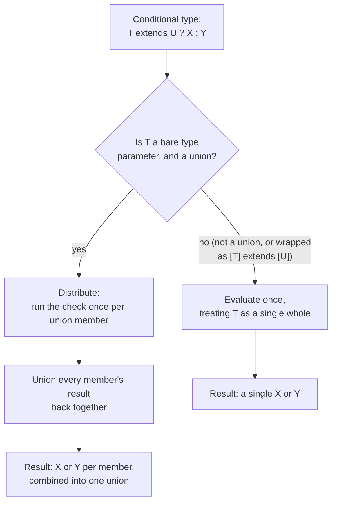
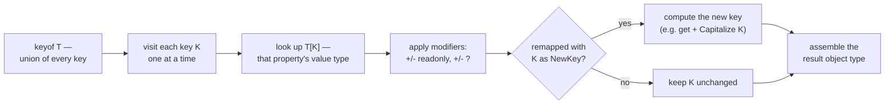

# 08 — Type System Deep Dive: Types as a Programming Language

## Why this exists

Most everyday TypeScript only *describes* shapes. This module is different:
you'll *compute* with types — deriving a new type from an existing one, the
same way you'd write a function. `keyof`, conditional types, `infer`, and
mapped types are the handful of primitives that computation is built from.
Nearly every advanced type you'll meet in the wild (`Partial`, `ReturnType`,
form validators, ORMs, routers) is assembled from just these pieces.

## Type queries: keyof, typeof, indexed access

```ts
const point = { x: 0, y: 0 }
type Point = typeof point        // { x: number; y: number } — from a VALUE
type Key = keyof Point           // 'x' | 'y' — union of property names
type X = Point['x']              // number — indexed access, like a lookup
type Tag = ['a', 'b'][number]    // 'a' | 'b' — T[number] reads array elements
```

## Conditional types: T extends U ? X : Y

A conditional type is an `if` for types, checked with `extends`
(assignability), not `===`.

```ts
type IsString<T> = T extends string ? true : false
type A = IsString<'hi'>   // true
type B = IsString<42>     // false
```

## How the compiler resolves it — and distributes over unions



*What to notice: distribution only fires for a bare type parameter that
resolves to a union — wrapping both sides in a tuple (`[T] extends [U]`)
forces the "single whole" path instead.*

## infer — capturing a piece of the matched type

```ts
type ElementOf<T> = T extends (infer U)[] ? U : never
type E = ElementOf<string[]>   // string

type ReturnOf<T> = T extends (...args: any[]) => infer R ? R : never
```

`infer` only appears inside the `extends` clause of a conditional type — it
declares a placeholder the compiler fills in from whatever actually matched.

## Mapped types — transforming every property at once

```ts
type Stringify<T> = { [K in keyof T]: string }
type Mutable<T> = { -readonly [K in keyof T]: T[K] }
type Optional<T> = { [K in keyof T]?: T[K] }
type Concrete<T> = { [K in keyof T]-?: T[K] }
```

## Mapped-type transformation pipeline



*What to notice: a mapped type is a loop over `keyof T` — modifiers adjust
flags per property, and `as` can rename or (mapped to `never`) drop a key
entirely before the result is assembled.*

## Key remapping with `as` + template literals

```ts
type Getters<T> = { [K in keyof T as `get${Capitalize<string & K>}`]: () => T[K] }
// { id: number } -> { getId: () => number }
```

Mapping a key to `never` drops it — the basis of filtering by value type:
`{ [K in keyof T as T[K] extends string ? K : never]: T[K] }`.

## Template literal types

```ts
type Greeting<N extends string> = `Hello, ${N}!`
type EventName<T extends string> = `on${Capitalize<T>}`
```

`Uppercase`, `Lowercase`, `Capitalize`, `Uncapitalize` are built-in string
transforms. Combined with `infer`, template literals can *parse* a string
type apart: `T extends \`${infer Head}/${infer Tail}\` ? ... : ...`.

## Recursive types

A type alias may refer to itself — the compiler unwinds it lazily as needed.
This is how you describe data whose depth isn't known ahead of time.

```ts
type Json = string | number | boolean | null | Json[] | { [key: string]: Json }
```

## as const + satisfies

```ts
const config = { mode: 'dark', retries: 3 } as const satisfies { mode: string; retries: number }
config.mode   // 'dark' — literal, not string — AND validated
```

`: Type` **replaces** the inferred type with what you wrote (widening it).
`satisfies Type` **checks** assignability without replacing the inferred
type. Combine it with `as const` to validate a literal object while keeping
every value's exact literal type.

## Assignability quick rules

| | assignable INTO it | assignable OUT to others |
| --- | --- | --- |
| `any` | anything | anything |
| `unknown` | anything | only `unknown`/`any` |
| `never` | nothing (unreachable) | anything |

## Common gotchas

- Distribution only triggers for a bare/naked type parameter; `[T] extends
  [U]` disables it.
- `infer` only appears inside the `extends` clause of a conditional type.
- Mapped-type modifiers (`-readonly`, `-?`) go on the `[K in keyof T]`
  clause, not on `T[K]`.
- `satisfies` never widens or narrows the expression's own inferred type —
  pair it with `as const` to keep literals.
- Excess property checks fire only on a FRESH object literal passed
  directly — the same shape via a variable skips the check.

## Try it now

→ `exercises/ex01.ts` through `ex12.ts`, then `exercises/puzzles.ts`, then
`checkpoint.ts`. Check with `npm test -- 08`.
