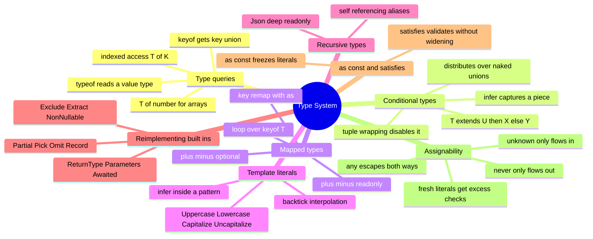

# 08 — Type System Deep Dive · Cheat-sheet

## Concept map



*What to notice: everything below "Reimplementing built-ins" is just a
combination of the four techniques above it — there is no new primitive
past mapped types, conditional types, `infer`, and template literals.*

## Key syntax

```ts
type Keys = keyof T                          // key union
type Shape = typeof value                    // type from a value
type Val = T['key']                          // indexed access
type El = T[number]                          // array element union

type If<T> = T extends U ? X : Y             // conditional
type Whole<T> = [T] extends [U] ? X : Y      // non-distributive
type Elem<T> = T extends (infer U)[] ? U : never   // infer

type Map1<T> = { [K in keyof T]: T[K] }             // mapped
type Map2<T> = { -readonly [K in keyof T]-?: T[K] } // strip modifiers
type Map3<T> = { [K in keyof T as `get${string & K}`]: () => T[K] } // remap

type Tpl<N extends string> = `Hello, ${N}!`  // template literal

const c = { a: 1 } as const satisfies Record<string, number>  // literal + validated
```

## Rules to remember

- `extends` in a conditional type means "is assignable to", not equality.
- Distribution needs a BARE type parameter that resolves to a union.
- `infer` is legal only inside the `extends` clause of a conditional type.
- A mapped type's modifiers (`-readonly`, `-?`) live on `[K in keyof T]`.
- `as never` inside a key remap deletes that property from the result.
- `satisfies` checks, `: Type` replaces — only `satisfies` (+ `as const`)
  keeps literal inference.

## Gotchas

- `T extends object` is also true for arrays AND function types — handle
  arrays as a special case in recursive mapped types.
- `unknown` needs narrowing before use; `never` fits into any type; `any`
  fits everywhere in both directions (that's why it's dangerous).
- Excess property checks apply only to fresh object literals, not values
  passed through a variable.
- Function return types widen through inference just like variables —
  annotate explicitly to keep a literal return type.

## Self-quiz

1. What's the difference between a distributive and a non-distributive
   conditional type?
2. Where, exactly, can `infer` be used?
3. Write the mapped type that strips `readonly` from every property of `T`.
4. What does mapping a key `as never` do inside a mapped type?
5. What's the difference between `: Config` and `satisfies Config` on an
   object literal?
6. Why does `unknown` need narrowing before use, but `any` doesn't?
7. When does an excess property check fire, and when does it not?
8. Why is `never` assignable to every other type?

<details><summary>Answers</summary>

1. Distributive: `T extends U ? X : Y` runs once per union member and
   unions the results. Non-distributive (`[T] extends [U]`): the union is
   tested as one whole, running the check exactly once.
2. Only inside the `extends` clause of a conditional type.
3. `{ -readonly [K in keyof T]: T[K] }`
4. It removes that property from the resulting object type entirely.
5. `: Config` replaces the literal's inferred type with `Config`, widening
   it. `satisfies Config` checks assignability WITHOUT changing the
   inferred type, so literal values stay literal.
6. `unknown` could be any value, so using it unchecked might be unsafe;
   `any` turns type checking off entirely instead of asking you to prove
   safety first.
7. It fires only on a fresh object literal assigned or passed directly;
   the same shape stored in a variable first skips the check.
8. There is no value of type `never`, so any claim about what a `never`
   "is" is vacuously true — it fits wherever it's needed.

</details>
