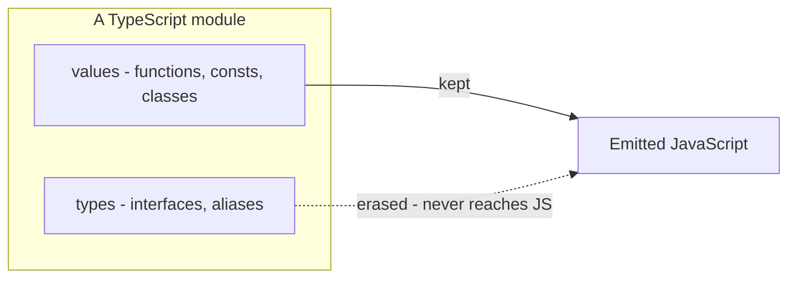
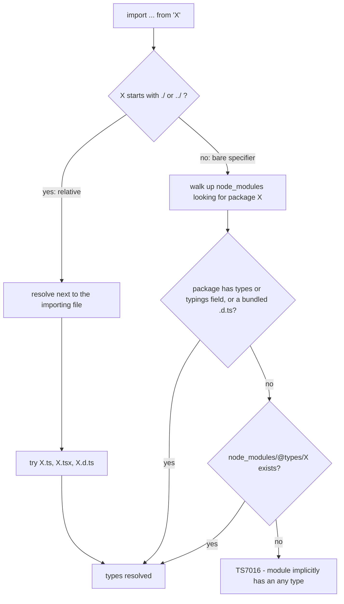

# 09 — Modules & Organization

## Why this exists

Every file that uses `import` or `export` is a module: its own scope, its
own public surface. Organizing a codebase means controlling what crosses
those boundaries — and in TypeScript some of that traffic is *types only*
and must vanish from the compiled JavaScript. Meanwhile npm packages come
from two different module worlds (CommonJS and ES modules), and some ship
no types at all.



*What to notice: types are erased at compile time — an import that only
brings in types can (and should) be erased with it.*

## Minimal syntax

```ts
// type-only: the whole statement is erased at compile time
import type { User } from './models'

// mixed: one value + one inline type-only specifier
import { api, type Role } from './api'

// type-only re-export (a plain `export { User } from` would emit a
// RUNTIME re-export of a type — bundlers crash on it)
export type { User } from './models'

// barrel re-exports: rename, or expose a whole module as a namespace
export { parse as parseJson } from './json'
export * as geometry from './geometry'
```

## ESM vs CommonJS

| | CommonJS (CJS) | ES Modules (ESM) |
| --- | --- | --- |
| Load | `const x = require('x')` | `import x from 'x'` |
| Export | `module.exports = ...`, `exports.f = ...` | `export`, `export default` |
| Resolved | at runtime, can be dynamic | statically, before running |
| Node treats `.js` as | CJS (no `"type"` field) | ESM (`"type": "module"`) |
| Top-level `await` | ❌ | ✅ |

Much of npm is still CJS. A CJS module has no real `default` export —
`module.exports` *is* the module. `esModuleInterop` (on in this course)
papers over the difference:

| The CJS package wrote | Import it as | `esModuleInterop` needed? |
| --- | --- | --- |
| `module.exports = fn` | `import fn from 'pkg'` (default) | ✅ |
| `exports.helper = fn` | `import { helper } from 'pkg'` (named) | ❌ |
| anything, whole module | `import * as pkg from 'pkg'` (namespace) | ❌ |

A **namespace import** (`import * as`) is the module namespace *object* —
you can't call it, even if `module.exports` was a function. The
**default import** is what interop maps `module.exports` onto.

## How the compiler finds a module's types



*What to notice: relative specifiers resolve to sibling files; bare
specifiers go through node_modules, then the `@types` fallback.*

`@types/*` packages come from **DefinitelyTyped** — community-written
declarations for JS packages that ship none: `npm i -D @types/lodash`.
With `allowJs` off (this course), a plain `mathlib.js` is only importable
if a sibling `mathlib.d.ts` describes it — you'll write one in ex04.

## Namespaces (legacy)

Before ESM, TS organized code with `namespace`. Today they survive mainly
in declaration files and in one classic pattern: **merging a namespace
onto a function** so it becomes callable *and* carries properties (think
jQuery's `$()` + `$.ajax`):

```ts
export function greet(name: string): string {
  return `Hello, ${name}!`
}
export namespace greet {
  export const defaultName = 'world'   // greet.defaultName
  export interface Options {}          // greet.Options — types too!
}
```

The namespace must appear *after* the function it merges with.

## Describing plain JavaScript: `.d.ts` files

A declaration file contains only types — no implementations:

```ts
// mathlib.d.ts — the type surface for mathlib.js
export declare function add(a: number, b: number): number
export declare const VERSION: '2.1.0'
```

## Augmenting someone else's types

`declare module '<specifier>'` *reopens* an existing module and merges new
declarations into it — how plugins add fields to a library's interfaces:

```ts
declare module './ex05-events' {
  interface EventMap {
    keypress: { key: string }   // merged into the original interface
  }
}
```

## Triple-slash directives

`/// <reference path="..." />` and `/// <reference types="..." />` are the
pre-ESM way to pull in declarations. In modern code, imports and the
tsconfig `types` array replace them — you'll mostly *see* them in
generated `.d.ts` files, not write them.

## Common gotchas

- `import { SomeType }` compiles, but drags the module in at runtime just
  for its side effects — use `import type` when only types are needed.
- Re-exporting a type with `export { T } from ...` breaks file-by-file
  transpilers (esbuild, Babel) at runtime — always `export type { T }`.
- `import * as x` is never callable; for `module.exports = fn` packages
  use the default import (with `esModuleInterop`).
- A `declare module` augmentation must live in a file that is itself a
  module (has at least one import/export).
- Namespace-before-function merge order is a compile error (TS2434).

## Try it now

→ `exercises/ex01.ts` through `ex06.ts` (ex04 lives in
`exercises/mathlib.d.ts`), then `checkpoint.ts`.
Check with `npm test -- 09`.
