# 09 — Modules & Organization

## Why this exists

Every file that uses `import` or `export` is a module: its own scope, its
own public surface. Organizing a codebase means controlling what crosses
those boundaries — and in TypeScript some of that traffic is *types only*
and must vanish from the compiled JavaScript. Meanwhile npm packages come
from two different module worlds (CommonJS and ES modules), and some ship
no types at all.

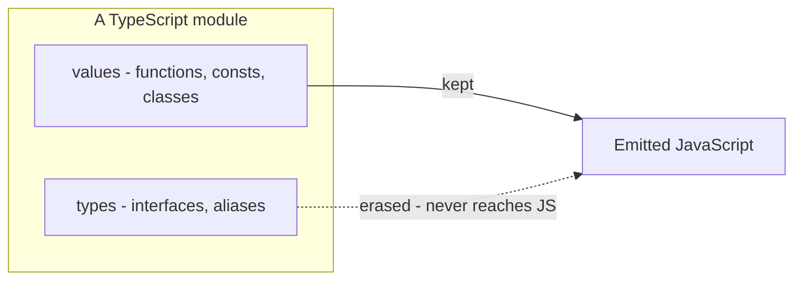

*What to notice: types are erased at compile time — an import that only
brings in types can (and should) be erased with it.*

## Map of this module

| Section | Exercise |
| --- | --- |
| Scripts vs modules · type-only imports · what gets erased · `import type` of a class | ex01 |
| Every import/export form · default exports · barrels | ex02 |
| Namespaces · merging a namespace onto a function/class/enum | ex03, checkpoint |
| The `declare` keyword · authoring a `.d.ts` · ambient modules · `@types` | ex04 |
| Augmenting a module you own · third-party and global augmentation | ex05 |
| ESM vs CJS · `esModuleInterop` · default vs namespace imports | ex06 |
| Module resolution · `package.json` fields · triple-slash · organizing code | background |

## Minimal syntax

```ts skip
// type-only: the whole statement is erased at compile time
import type { User } from './models'

// mixed: one value + one inline type-only specifier
import { api, type Role } from './api'

// type-only re-export (a plain `export { User } from` would emit a
// RUNTIME re-export of a type — bundlers crash on it)
export type { User } from './models'

// barrel re-exports: rename, or expose a whole module as a namespace
export { parse as parseJson } from './json'
export * as geometry from './geometry'
```

The same forms against a real module you can compile today:

```ts
import type { Stats } from 'node:fs'
import { readFileSync, type PathLike } from 'node:fs'

export type { Stats }
export { readFileSync as read }
export * as fsTools from 'node:fs'

const size = (p: PathLike): number => readFileSync(p).length
export { size }
```

### Scripts vs modules — and the `export {}` trick

A file with **no** top-level `import` or `export` is a *script*. Its
declarations live in the global scope, shared with every other script in
the program. A file with at least one `import`/`export` is a *module*:
everything in it is private unless exported.

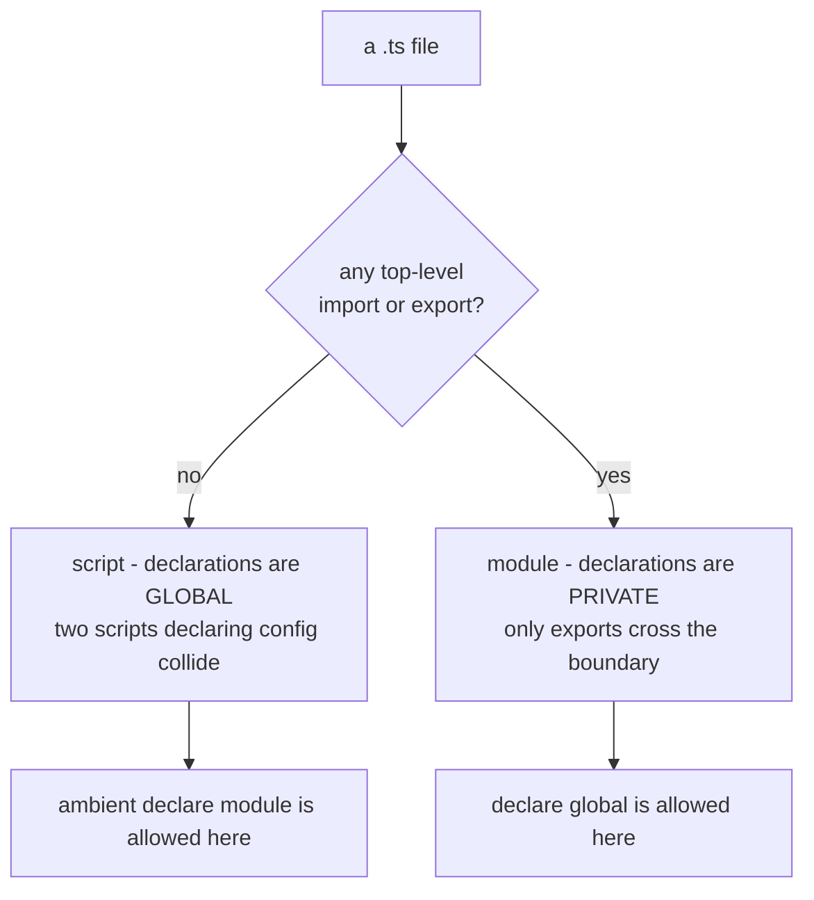

*What to notice: the same `const config` is a global in a script and a
private local in a module. One keyword decides it.*

Two script files that both write `const config = ...` fail with
`TS2451: Cannot redeclare block-scoped variable 'config'`. The fix when a
file has nothing to export yet is an empty export — it changes nothing at
runtime and makes the file a module:

```ts
const config = { retries: 3 }
console.log(config.retries)

export {}   // "I am a module" — config is now private to this file
```

Gotcha: `declare global { ... }` only works inside a module. In a script
it fails with `TS2669: Augmentations for the global scope can only be
directly nested in external modules or ambient module declarations.` —
add `export {}` and it works.

### Type-only imports: `import type` and inline `type`

A plain `import { Thing }` compiles to a real `import` statement even
when `Thing` is an interface. The module still loads — with all its
side effects — for a name that vanishes from the output. `import type`
tells the compiler the whole statement is erasable.

```ts
import type { Stats, Dirent } from 'node:fs'        // erased entirely
import { statSync, type PathLike } from 'node:fs'   // statSync stays, PathLike erased

function isDir(p: PathLike): boolean {
  const info: Stats = statSync(p)
  return info.isDirectory()
}
let entry: Dirent | undefined
export { isDir, entry }
```

| Form | What survives in the JS |
| --- | --- |
| `import type { A, B } from 'm'` | nothing — statement removed |
| `import { fn, type A } from 'm'` | `import { fn } from 'm'` |
| `import { type A, type B } from 'm'` | nothing with `tsc`; an empty `import {} from 'm'` under `verbatimModuleSyntax` |

A type-only import can name a default **or** named bindings, not both:

```ts
// ❌ error TS1363: A type-only import can specify a default import or named bindings, but not both.
import type React, { FC } from 'react'
```

Split it into `import type React from 'react'` and
`import type { FC } from 'react'`.

Gotcha: a name imported with `type` is a type-only alias, even if the
original was a value:

```ts
import { type readFileSync } from 'node:fs'
// ❌ error TS1361: 'readFileSync' cannot be used as a value because it was imported using 'import type'.
readFileSync('notes.txt')

type Reader = typeof readFileSync   // ✅ still fine in a type position
export type { Reader }
```

### What gets erased — `isolatedModules` and `verbatimModuleSyntax`

`tsc` sees the whole program, so it knows `Shape` is an interface and
drops the import. Tools that transpile **one file at a time** — esbuild,
Babel, swc, Vite — cannot know. They must keep every import that is not
marked `type`. Two flags make your code safe for them:

| Flag | What it enforces |
| --- | --- |
| `isolatedModules` | Each file must be transpilable alone. Re-exporting a type needs `export type` — otherwise `TS1205: Re-exporting a type when 'isolatedModules' is enabled requires using 'export type'.` |
| `verbatimModuleSyntax` | Imports/exports are emitted exactly as written. Anything without `type` is kept; anything with `type` is dropped. Stricter and simpler — prefer it in new projects. |

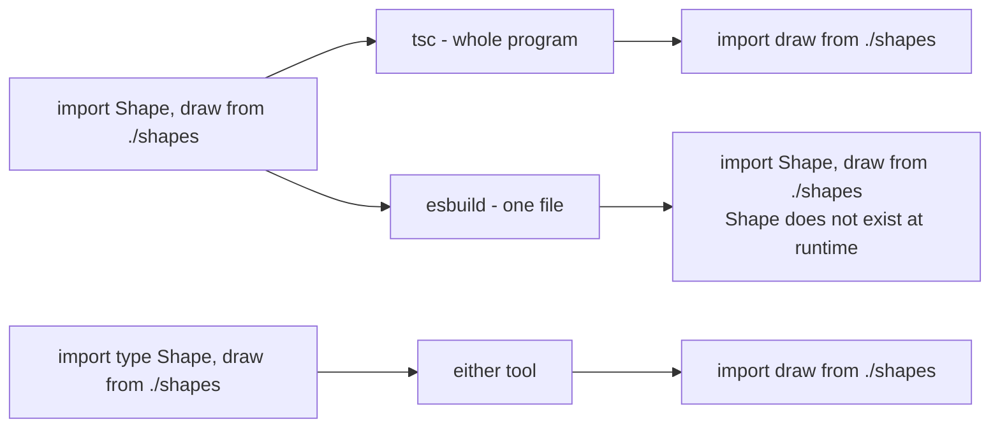

*What to notice: the `type` keyword is information for tools that cannot
see across files. Write it, and every tool agrees on the output.*

Local exports follow the same rule — `export type { Cfg }` marks a
type-only export, and `export type *` re-exports only the types:

```ts
interface Cfg { debug: boolean }
type Mode = 'dev' | 'prod'
const cfg: Cfg = { debug: true }

export type { Cfg, Mode }
export { cfg }
export type * from 'node:os'          // every type of node:os, none of its values
export type * as osTypes from 'node:os'
```

### `import type` of a class gives only the instance type

A class is two things: a *type* (its instances) and a *value* (the
constructor). `import type` brings the type half only.

```ts
import type { EventEmitter } from 'node:events'

// ❌ error TS1361: 'EventEmitter' cannot be used as a value because it was imported using 'import type'.
const bus = new EventEmitter()

let stored: EventEmitter | undefined       // ✅ type position — fine
export { stored }
```

`class Bus extends EventEmitter {}` fails the same way — `extends` needs
the runtime constructor. Rule: if you `new` it or `extends` it, import it
as a value.

### `typeof import('./x')` — the type of a whole module

The type of a module is the type of its namespace object. You get it
without importing anything at runtime:

```ts
type FsModule = typeof import('node:fs')
type ReadSync = FsModule['readFileSync']

const pending: Promise<typeof import('node:path')> = import('node:path')
export type { ReadSync }
export { pending }
```

`import type * as fsTypes from 'node:fs'` gives the same thing as a
namespace of types — usable in type positions only.

### Every import and export form

| Form | Syntax | Notes |
| --- | --- | --- |
| Named export | `export const x = 1` / `export { x, y }` | the default choice |
| Renamed export | `export { x as publicX }` | rename at the boundary |
| Default export | `export default fn` | one per module; importer picks the name |
| Named import | `import { x } from './m'` | must match the exported name |
| Renamed import | `import { x as localX } from './m'` | avoid collisions |
| Default import | `import anything from './m'` | any name works |
| Namespace import | `import * as m from './m'` | one object with every export |
| Side-effect import | `import './polyfills'` | runs the module, binds nothing |
| Re-export | `export { x } from './m'` | pass-through, no local binding |
| Re-export all | `export * from './m'` | every **named** export; not `default` |
| Re-export as namespace | `export * as m from './m'` | groups a module under one name |
| Type-only | `import type`, `export type`, inline `type` | erased |
| Dynamic import | `await import('./m')` | returns a `Promise` of the namespace |
| Legacy CJS-style | `import x = require('m')` / `export = x` | only for CommonJS output |

Gotcha: a side-effect import of a file that does not exist is **not** a
compile error by default. TypeScript assumes you know what you are doing:

```ts
import './setup-polyfills'   // compiles — no such file, no complaint
export {}
```

TypeScript 5.6 added `noUncheckedSideEffectImports` to close that hole.

### Default exports and their pitfalls

`export default` makes one value the "main" thing in a module. It reads
well for a module that *is* one thing (a component, a class). It has
costs:

| Pitfall | Why it bites |
| --- | --- |
| No canonical name | `import Btn from './Button'` and `import Button from './Button'` are both legal — grep and rename tools lose track |
| Anonymous declarations | `export default function () {}` has no name in stack traces |
| Weak refactoring | rename the function and importers keep their old, now misleading, names |
| Interop confusion | CommonJS has no real default — see the ESM/CJS section |
| Not re-exported by `export *` | a barrel must write `export { default as X } from './x'` |

```ts
import defaultOne from 'node:fs'
import somethingElse from 'node:fs'      // same object, different name — no error
console.log(defaultOne === somethingElse) // true at runtime
export {}
```

Rule of thumb: prefer named exports. Use a default only when the
framework demands it (React lazy routes, config files).

### Dynamic `import()` and `import.meta`

`import()` loads a module on demand and returns a promise of its
namespace. Its type is exactly `Promise<typeof import('./x')>`, so the
awaited value is fully typed.

```ts
async function loadPathTools() {
  const path = await import('node:path')     // typeof import('node:path')
  return path.join('reports', 'q3.csv')
}

const tools = await import('node:path')      // top-level await — ESM only
export { loadPathTools, tools }
```

`import.meta` is the module's own metadata. In ESM it replaces the CJS
globals `__filename` and `__dirname`:

```ts
import { fileURLToPath } from 'node:url'
import { dirname } from 'node:path'

const here = fileURLToPath(import.meta.url)  // 'file:///…/app.ts' -> '/…/app.ts'
const folder = dirname(here)
const folderNew = import.meta.dirname        // Node 20.11+: no conversion needed
export { folder, folderNew }
```

### `export =` and `import x = require()` — legacy CJS syntax

Before ESM, TypeScript had its own syntax for "the whole module is this
one value" — the shape of `module.exports = fn`. It still appears in
`.d.ts` files for CommonJS packages (`node:path`, `react`, `lodash`) and
in `.cts` files. With `module: ESNext` (this course) both forms are
errors:

```ts
// ❌ error TS1202: Import assignment cannot be used when targeting ECMAScript modules.
import path = require('node:path')
```

```ts
const build = (): string => 'ok'
// ❌ error TS1203: Export assignment cannot be used when targeting ECMAScript modules.
export = build
```

What a CJS package's `.d.ts` looks like — the file you *read*, rarely
write:

```ts skip
// node_modules/legacy-slug/index.d.ts
declare function slugify(text: string): string
declare namespace slugify {
  const version: string
}
export = slugify          // "module.exports is the slugify function"
```

`export =` says: the module *is* this value. Read on to see how ESM code
imports such a module.

### Barrels — `index.ts` re-exports

A barrel gathers a folder's public API behind one path. Consumers import
from `./recipes` instead of five deep paths.

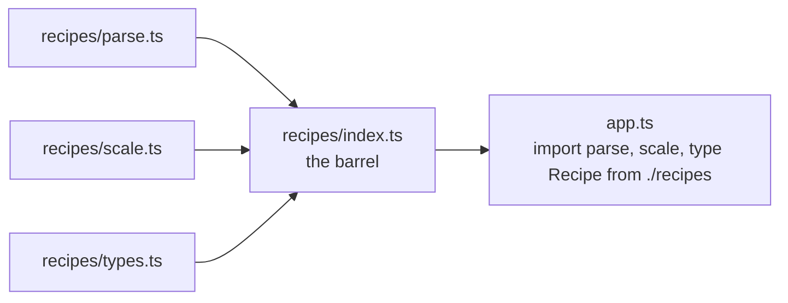

*What to notice: the barrel adds a layer, not new code. Rename and
group there; keep implementations in their own files.*

```ts skip
// recipes/index.ts
export { parse } from './parse'
export { scale as scaleRecipe } from './scale'      // rename on re-export
export type { Recipe, Ingredient } from './types'    // types need `export type`
export * as units from './units'                     // units.grams, units.cups
export * from './validators'                         // everything named
```

Renaming on re-export is how two modules that both export `area` can
live side by side: `export { area as circleArea } from './circle'`.

| Barrels: pros | Barrels: cons |
| --- | --- |
| One import path per feature | `export *` hides what the API is |
| Rename/group without touching sources | Importing the barrel loads *every* file in it |
| Clear public vs internal split | Circular imports: `a.ts` imports the barrel, the barrel imports `a.ts` |
| | Tree-shaking depends on the bundler knowing the barrel is side-effect free (`"sideEffects": false`) |

Gotcha: inside the folder, import siblings directly (`./parse`), never
through the barrel (`./index`) — that is the classic cycle.

### Namespaces (legacy)

Before ESM, TypeScript organized code with `namespace`: a named object
whose `export`ed members are visible, and whose non-exported members are
private. They can nest, hold types, and be written dotted.

```ts
namespace Catalog.Pricing {
  export interface Quote { total: number }
  export function quote(unit: number, qty: number): Quote {
    return { total: round(unit * qty) }
  }
  function round(n: number): number {      // not exported: private
    return Math.round(n * 100) / 100
  }
}

const q: Catalog.Pricing.Quote = Catalog.Pricing.quote(9.99, 3)
// ❌ error TS2339: Property 'round' does not exist on type 'typeof Pricing'.
Catalog.Pricing.round(1)
export { q }
```

A namespace compiles to an IIFE that fills a plain object. ESM replaced
them: files already give you scope, and bundlers cannot tree-shake an
object built at runtime. Where you still see them:

| Where | Why |
| --- | --- |
| `.d.ts` files | `declare namespace NodeJS { interface ProcessEnv ... }` groups ambient types |
| Merged onto a function | callable *and* has properties (below) |
| Generated code | protobuf, GraphQL codegen group types per message |

### Merging a namespace onto a function, class, or enum

Declaration merging lets a `namespace` attach members to a function,
class, or enum of the same name. The classic case is a function that is
callable **and** carries properties and types — think jQuery's `$()` plus
`$.ajax`.

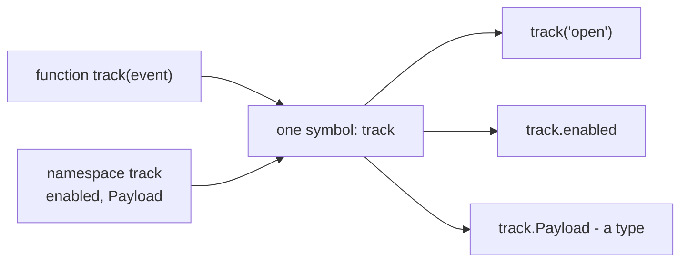

*What to notice: the function contributes the call signature, the
namespace contributes members. Order matters: function first.*

```ts
export function track(event: string, payload?: track.Payload): string {
  return track.enabled ? `${event}:${JSON.stringify(payload ?? {})}` : ''
}

export namespace track {
  export interface Payload { userId?: string }
  export let enabled = true
  export const source = 'web'          // literal type 'web' — no annotation
}

track('open', { userId: 'u1' })
track.enabled = false
```

The order matters because the merge attaches members onto whatever
`measure` already is — put the namespace first and there is nothing to
attach to yet. It is a compile error, not a style choice:

```ts
// ❌ error TS2434: A namespace declaration cannot be located prior to a class or function with which it is merged.
namespace measure {
  export const unit = 'ms'
}
function measure(): number { return 1 }
export { measure }
```

The same merge works on a class (static-like helpers and nested types)
and on an enum (methods for the enum):

```ts
class Album {
  constructor(public title: string) {}
}
namespace Album {
  export interface Meta { year: number }
  export function fromTitle(title: string): Album { return new Album(title) }
}

enum Color { Red, Green }
namespace Color {
  export function parse(s: string): Color | undefined {
    return s === 'red' ? Color.Red : s === 'green' ? Color.Green : undefined
  }
}

const meta: Album.Meta = { year: 1997 }
export { meta }
export const green = Color.parse('green')
```

Gotcha: a namespace that only holds types (no `let`/`const`/`function`)
emits no JavaScript at all — it is then purely a type-level container.

### The `declare` keyword — ambient declarations

`declare` says: *this exists at runtime, I am only describing its type.*
No code is emitted. It is how you talk about JavaScript the compiler
cannot see — a global injected by a script tag, a plain `.js` file, a
package without types.

| Form | Describes |
| --- | --- |
| `declare function slugify(s: string): string` | a function — no body allowed |
| `declare const MAX: 80` | a constant — no initializer, but a literal type is fine |
| `declare let counter: number` | a mutable binding |
| `declare class Ticker { ... }` | a class — signatures only |
| `declare namespace Reporter { ... }` | a group of ambient members |
| `declare module 'name' { ... }` | a whole module (script files only) |
| `declare global { ... }` | additions to the global scope (module files only) |

```ts
export declare function slugify(text: string, maxLength?: number): string
export declare const MAX_SLUG_LENGTH: 80
export declare class Ticker {
  constructor(interval: number)
  start(): void
}
export declare namespace Reporter {
  function report(level: 'info' | 'warn'): void
}
export interface SlugOptions { lower?: boolean }   // types never need `declare`

const t = new Ticker(500)      // ✅ usable — the compiler trusts the declaration
Reporter.report('info')
export { t }
```

Implementations are forbidden in ambient declarations — the compiler
would not know whether to emit them:

```ts
declare class Point {
  x: number
  // ❌ error TS1183: An implementation cannot be declared in ambient contexts.
  move(dx: number): void { this.x += dx }
}
// ❌ error TS1039: Initializers are not allowed in ambient contexts.
declare const VERSION: '2.1.0' = '2.1.0'
export {}
```

Gotcha: `declare const VERSION: '2.1.0'` is a *promise*. If the real JS
exports `'3.0.0'`, nothing catches it. A declaration file is only as
honest as its author.

### Authoring a `.d.ts` for untyped JavaScript

With `allowJs` off (this course), `import { slugify } from './slugify'`
next to a plain `slugify.js` fails: `TS7016: Could not find a declaration
file for module './slugify'. '…/slugify.js' implicitly has an 'any' type.`
A sibling `slugify.d.ts` with the **same base name** gives the compiler
the module's shape.

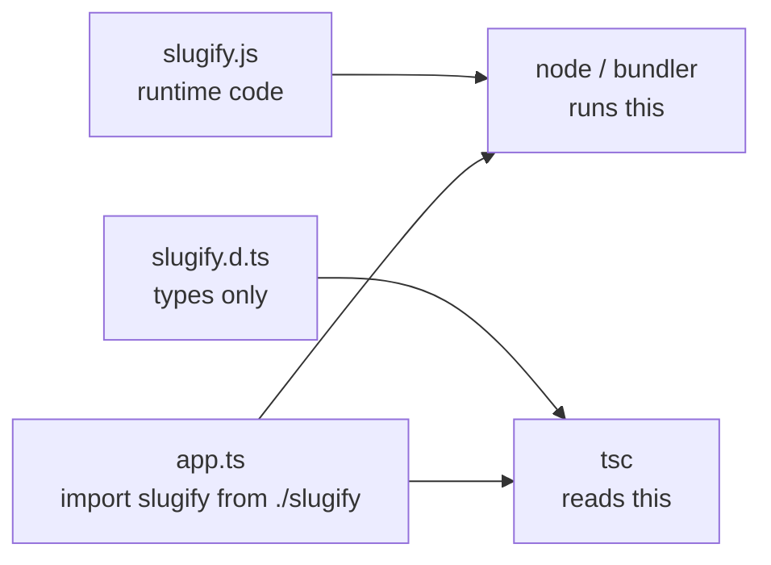

*What to notice: the two files never meet. The `.js` runs, the `.d.ts` is
read — the base name is the only link between them.*

```ts skip
// slugify.d.ts — the type surface for slugify.js
export declare function slugify(text: string, maxLength?: number): string
export declare const MAX_SLUG_LENGTH: 80
export declare const VERSION: '1.4.0'      // literal type, no value
```

Rules for a `.d.ts`:

- Only declarations: `declare function`, `declare const`, `declare
  class`, `interface`, `type`. No bodies, no initializers (TS1183,
  TS1039).
- `export` makes it a module `.d.ts` describing one file; no
  top-level `export` makes it a *global* script whose declarations are
  visible everywhere.
- Keep literal types where the JS is constant (`'1.4.0'`, not `string`).

Two alternatives to hand-writing:

| Approach | When |
| --- | --- |
| `declaration: true` in tsconfig | You own the `.ts` source — `tsc` emits a `.d.ts` per file for consumers |
| `allowJs` + `checkJs` with JSDoc | You own the `.js` source — `/** @param {string} text */` is read as types, no separate file |

### Ambient module declarations — `declare module 'untyped-lib'`

For a *package* without types, you cannot drop a `.d.ts` next to it in
`node_modules`. Instead you declare the module by name, in a script file
(no top-level import/export) that your program includes — usually
`src/types/untyped-lib.d.ts`.

```ts skip
// src/types/untyped-lib.d.ts — a SCRIPT file: no top-level import/export
declare module 'untyped-slug' {
  export function slugify(text: string): string
  export const version: string
}

declare module 'ancient-logger'          // shorthand: every import is `any`

declare module '*.svg' {                 // wildcard: bundler asset imports
  const url: string
  export default url
}
```

Put the same block in a *module* file and its meaning changes — it
becomes an *augmentation* of an existing module, which must therefore
exist:

```ts
// ❌ error TS2664: Invalid module name in augmentation, module 'untyped-slug' cannot be found.
declare module 'untyped-slug' {
  export function slugify(text: string): string
}
export {}
```

Gotcha: the shorthand `declare module 'x'` is a quick unblock and a
permanent hole — every import from `x` is `any`. Prefer typing the two
functions you actually use.

### Global declarations — `declare global` and `export as namespace`

Some JavaScript lives on `globalThis`: a build id injected by the
bundler, a `process.env` variable, a script-tag library. Declare it once
and every file sees it.

```ts
declare global {
  var invoiceBuildId: string
  namespace NodeJS {
    interface ProcessEnv { INVOICE_API_KEY: string }
  }
}

globalThis.invoiceBuildId = 'a1b2c3'
const key: string = process.env.INVOICE_API_KEY    // string, not string | undefined
export { key }
```

`declare global` must sit in a module (this block is one — it exports).
In a global script `.d.ts` you skip the wrapper and write the
declarations at top level.

A library used both as a module and as a `<script>` global (jQuery,
lodash) declares its global name with `export as namespace` — legal only
in `.d.ts` files:

```ts skip
// node_modules/@types/tiny-chart/index.d.ts
export function render(el: unknown): void
export as namespace TinyChart     // <script> users get a global TinyChart.render
```

### `@types` and DefinitelyTyped

Most popular JS packages have community-written types on
**DefinitelyTyped**, published as `@types/<name>`:

```bash
npm i -D @types/lodash      # types for lodash
```

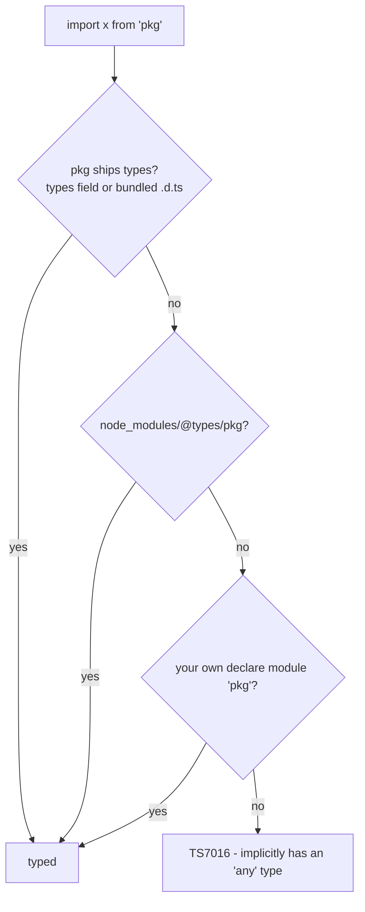

*What to notice: three places, in order. `@types` is a fallback, never a
replacement for types the package ships itself.*

tsconfig knobs for this lookup:

| Option | Effect |
| --- | --- |
| `types: ["node"]` | only these `@types/*` packages are loaded globally (imports still resolve everything) |
| `typeRoots` | folders searched for global type packages instead of `node_modules/@types` |
| `skipLibCheck` | do not type-check `.d.ts` files — faster, and tolerates conflicting `@types` versions |

### Augmenting a module you own — `declare module './x'`

`declare module '<specifier>'` inside a *module* file reopens an existing
module and merges new declarations into it. Interfaces merge; so a
plugin can teach a core module about things the core never knew.

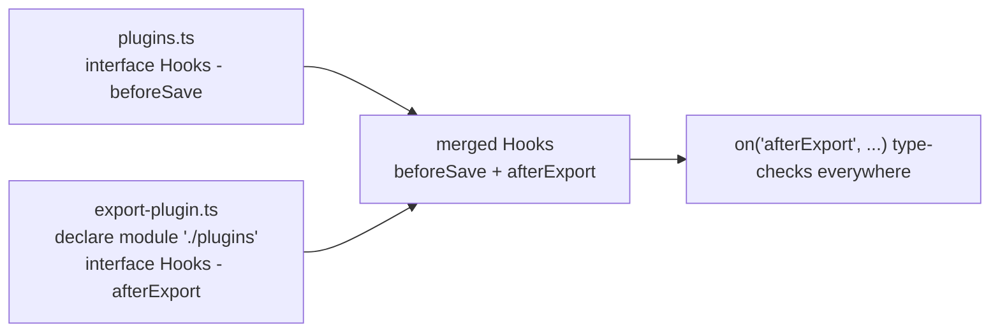

*What to notice: the augmentation lives in the plugin file, but the
merged interface is visible to every file in the program.*

```ts skip
// plugins.ts
export interface Hooks {
  beforeSave: { draft: boolean }
}
export function on<K extends keyof Hooks>(hook: K, fn: (p: Hooks[K]) => void): void {}

// export-plugin.ts
import { on } from './plugins'

declare module './plugins' {
  interface Hooks {
    afterExport: { format: 'pdf' | 'csv' }    // merged into the original
  }
}

on('afterExport', (p) => p.format)            // ✅ 'pdf' | 'csv'
```

Two conditions, both required:

1. The file with `declare module` is itself a module (has an import or
   export) — otherwise it is an ambient declaration, not an augmentation.
2. That file is part of the compiled program: included by tsconfig or
   reached by some import. An augmentation nobody imports is invisible.

Gotcha: only `interface` (and namespaces, and new exports) can be added.
A `type` alias cannot be merged — `type Hooks = ...` in the augmentation
is `TS2300: Duplicate identifier 'Hooks'`. Design extension points as
interfaces.

### Augmenting third-party packages and the global scope

The same syntax patches packages in `node_modules`. This block really
compiles — it adds a method to zod's `ZodType` interface (the runtime
implementation would be your plugin's job):

```ts
import { z } from 'zod'

declare module 'zod' {
  interface ZodType {
    pluginNote(note: string): this
  }
}

const schema = z.object({ email: z.string() }).pluginNote('signup form')
export { schema }
```

The shape you meet most often — adding a field to Express's `Request`
from an auth middleware:

```ts skip
// src/types/express.d.ts — must be a module: note the import
import 'express'

declare module 'express-serve-static-core' {
  interface Request {
    user?: { id: string; role: 'admin' | 'member' }
  }
}
```

| Target | Syntax | File must be |
| --- | --- | --- |
| Your own module | `declare module './plugins' { interface X {} }` | a module |
| A package | `declare module 'zod' { interface X {} }` | a module |
| The global scope | `declare global { interface X {} }` | a module |
| A brand-new package with no types | `declare module 'pkg' { ... }` | a **script** |

Gotcha: the specifier must resolve to where the interface is *declared*.
`express` re-exports `Request` from `express-serve-static-core`, so that
is the module to augment — a wrong guess is TS2664 or a silent no-op.

### ESM vs CommonJS

| | CommonJS (CJS) | ES Modules (ESM) |
| --- | --- | --- |
| Load | `const x = require('x')` | `import x from 'x'` |
| Export | `module.exports = ...`, `exports.f = ...` | `export`, `export default` |
| Resolved | at runtime, can be dynamic | statically, before running |
| Node treats `.js` as | CJS (no `"type"` field) | ESM (`"type": "module"`) |
| Force per file | `.cjs` (TS: `.cts`) | `.mjs` (TS: `.mts`) |
| Top-level `await` | ❌ | ✅ |
| `__dirname`, `__filename` | ✅ | ❌ — use `import.meta.url` / `import.meta.dirname` |
| `require.resolve`, `require.cache` | ✅ | ❌ — `import.meta.resolve` |
| Strict mode | opt-in | always |
| Extensions in relative imports | optional | required by Node |
| Tree-shakable | no | yes |

Much of npm is still CJS. A CJS module has no real `default` export —
`module.exports` *is* the module. A package that serves both worlds is
a **dual package**: `"exports": { "import": "./esm/index.js", "require":
"./cjs/index.cjs" }` in its `package.json`, with matching `types`
entries.

This course is ESM: `"type": "module"` in `package.json`, `module:
ESNext` in tsconfig.

### `esModuleInterop` — default vs namespace imports

Interop maps the one CJS value (`module.exports`) onto ESM's two shapes:
a *default* import and a *namespace* object.

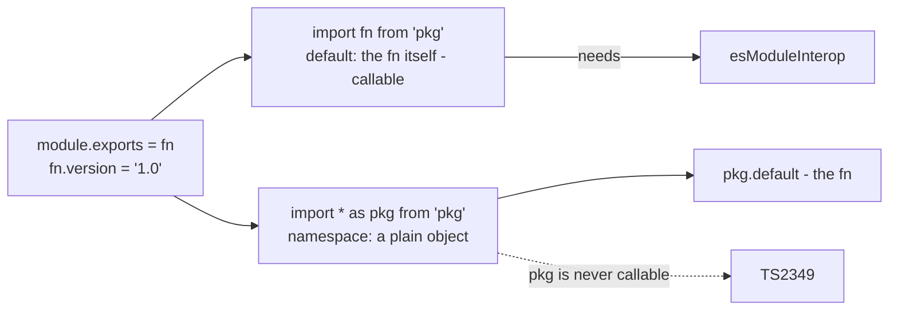

*What to notice: the namespace import is a wrapper object. What was
`module.exports` sits under its `.default`.*

| The CJS package wrote | Import it as | `esModuleInterop` needed? |
| --- | --- | --- |
| `module.exports = fn` | `import fn from 'pkg'` (default) | ✅ |
| `exports.helper = fn` | `import { helper } from 'pkg'` (named) | ❌ |
| anything, whole module | `import * as pkg from 'pkg'` (namespace) | ❌ |

```ts
import * as pathNS from 'node:path'    // node:path is `export =` — a CJS shape
import path from 'node:path'           // default: what module.exports was

const a = path.join('a', 'b')          // ✅
// ❌ error TS2349: This expression is not callable.
pathNS()
export { a }
```

A namespace import is never callable, even when `module.exports` was a
function. Go through `.default` instead — here with a package that has a
real default export:

```ts
import * as zodNS from 'zod'
import zod from 'zod'

const viaDefault = zod.string()
const viaNamespace = zodNS.default.string()      // same function
const viaNamed = zodNS.z.string()
export { viaDefault, viaNamespace, viaNamed }
```

Errors that point at the flag:

| Error | Meaning |
| --- | --- |
| `TS1259: Module 'pkg' can only be default-imported using the 'esModuleInterop' flag` | you wrote `import fn from 'pkg'` for an `export =` module with the flag off |
| `TS2497: Module 'pkg' resolves to a non-module entity and cannot be imported using this construct` | `import * as` of an `export =` *function/class* with the flag off — the namespace cannot be made |

`allowSyntheticDefaultImports` is the type-only half of `esModuleInterop`
(it allows the default import without changing emitted code); bundlers
usually want both on.

### Module resolution — which `moduleResolution` to pick

Resolution answers: *given `'./x'` or `'pkg'`, which file holds the
types?* The strategy must match what runs your code.

| `moduleResolution` | Mimics | Extensions in relative imports | `exports` field | Pick it when |
| --- | --- | --- | --- | --- |
| `node10` (old `node`) | Node before ESM | optional | ignored | legacy projects only |
| `node16` / `nodenext` | real Node ESM + CJS | **required** (`./x.js`) | honored | code run by Node directly |
| `bundler` | Vite / esbuild / webpack | optional | honored | anything a bundler builds (this course) |

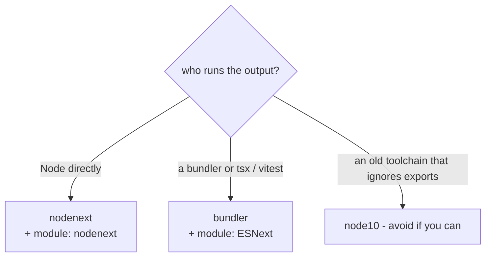

*What to notice: pick by runtime, not by taste. `nodenext` is strict
because Node is strict; `bundler` is lax because bundlers are.*

Why `nodenext` wants `import { x } from './x.js'` for a `./x.ts` file:
TypeScript never rewrites specifiers, and Node needs the extension of the
file that *exists after compilation* — the `.js`. TypeScript maps `.js`
back to `.ts` for type lookup.

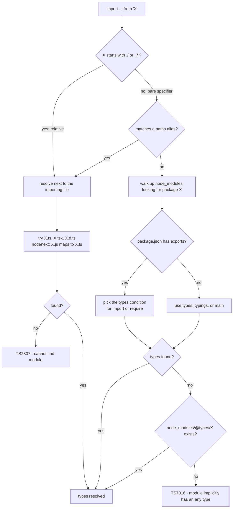

*What to notice: relative specifiers resolve to sibling files; bare
specifiers go through `paths`, then `node_modules` and the package's
`exports`, then the `@types` fallback.*

### `package.json` fields and `paths` aliases

What a package tells the resolver:

| Field | Meaning |
| --- | --- |
| `main` | entry file for old resolvers and CJS |
| `types` / `typings` | the `.d.ts` for `main` |
| `module` | ESM entry, honored by bundlers only |
| `exports` | the modern map: subpaths and conditions (`import`, `require`, `types`, `default`). Locks down what can be imported |

```json
{
  "name": "tiny-chart",
  "exports": {
    ".": {
      "types": "./dist/index.d.ts",
      "import": "./dist/index.js",
      "require": "./dist/index.cjs"
    },
    "./themes": { "types": "./dist/themes.d.ts", "import": "./dist/themes.js" }
  }
}
```

The `types` condition must come **first** — conditions are matched in
order. With `exports` present, `import 'tiny-chart/dist/internal'` is
`TS2307` unless listed.

On your side, `paths` gives short aliases for deep folders:

```json
{
  "compilerOptions": {
    "baseUrl": ".",
    "paths": { "@app/*": ["src/*"], "@shared": ["packages/shared/src/index.ts"] }
  }
}
```

Gotcha: `paths` is a *type-checking* alias. Nothing rewrites the emitted
JS — your bundler (`vite.config` `resolve.alias`), `tsx`, or `tsconfig-
paths` must know the same map, or the code fails at runtime with
`Cannot find module '@app/…'`.

### Triple-slash directives

`///` comments at the very top of a file are compiler instructions from
the pre-tsconfig era.

| Directive | Meaning | Today |
| --- | --- | --- |
| `/// <reference path="./globals.d.ts" />` | include that file in the program | use tsconfig `include` |
| `/// <reference types="node" />` | load `@types/node` | use tsconfig `types` or just import from it |
| `/// <reference lib="es2022" />` | add a built-in lib | use tsconfig `lib` |

```ts
/// <reference types="node" />
/// <reference lib="es2022" />
const home = process.env.HOME
export { home }
```

You still meet them in generated `.d.ts` files (tsc emits `reference
types` for global dependencies) and in Vite's `vite-env.d.ts`
(`/// <reference types="vite/client" />`).

### Organizing a codebase

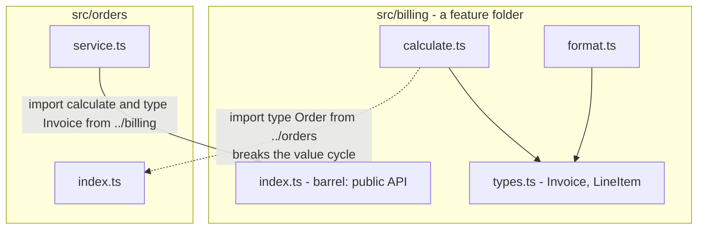

*What to notice: values flow one way, through barrels. A type-only edge
back the other way is free — it is erased.*

| Question | Guidance |
| --- | --- |
| Folder by layer or by feature? | By feature (`billing/`, `orders/`) — a change touches one folder |
| Where do types live? | Next to the code that owns them; a `types/` folder only for ambient `.d.ts` and truly shared contracts |
| Barrel per folder? | Yes for a feature's public API; no barrel-of-barrels at the root |
| Siblings inside a feature | import directly (`./calculate`), never via the folder's own `index` |
| Two features need each other's *types* | `import type` on one side — erased, so no runtime cycle |
| Two features need each other's *values* | extract the shared part into a third module |

Detecting cycles: `madge --circular src` or ESLint's
`import/no-cycle`. The symptom without a tool: an import that is
`undefined` at startup because the module that defines it has not
finished evaluating.

### Reading the errors of this module

| Error | It is telling you |
| --- | --- |
| `TS2307: Cannot find module 'x' or its corresponding type declarations.` | The specifier resolved to nothing — typo, missing package, missing `.js` under `nodenext`, or a subpath not in `exports` |
| `TS7016: Could not find a declaration file for module 'x'. … implicitly has an 'any' type.` | The JS was found, its types were not — install `@types/x` or write a `.d.ts` |
| `TS1259: Module 'x' can only be default-imported using the 'esModuleInterop' flag` | Default import of an `export =` module without interop |
| `TS2497: Module 'x' resolves to a non-module entity …` | `import * as` of an `export =` function without interop |
| `TS2349: This expression is not callable.` | You called a namespace import — use the default import or `.default` |
| `TS2664: Invalid module name in augmentation, module 'x' cannot be found.` | `declare module 'x'` in a module file for an `x` that does not exist — move it to a script `.d.ts`, or fix the specifier |
| `TS1205: Re-exporting a type when 'isolatedModules' is enabled requires using 'export type'.` | Write `export type { T } from` |
| `TS1361: 'X' cannot be used as a value because it was imported using 'import type'.` | You `new`, call or `extends` a type-only import — import it as a value |
| `TS1363: A type-only import can specify a default import or named bindings, but not both.` | Split into two `import type` statements |
| `TS2434: A namespace declaration cannot be located prior to a class or function with which it is merged.` | Move the `namespace` below the function |
| `TS2669: Augmentations for the global scope can only be directly nested in external modules …` | `declare global` in a script — add `export {}` |
| `TS1183: An implementation cannot be declared in ambient contexts.` | A body inside `declare` — remove it |
| `TS1202` / `TS1203` | `import = require` / `export =` under ESM output — use `import`/`export default`, or make the file `.cts` |

## Rules to remember

- One `import`/`export` makes a file a module. `export {}` is the
  cheapest way to say so.
- Mark every type-only name with `type`. Then `tsc`, esbuild, and Babel
  all emit the same JavaScript.
- `import type` of a class gives the instance type only — no `new`, no
  `extends`.
- CJS has one export: `module.exports`. Interop puts it under `default`;
  a namespace import is a plain object, never callable.
- Function first, then `namespace` of the same name.
- `declare` describes; it never implements. A `.d.ts` is a promise.
- `declare module 'x'` in a **script** declares; in a **module** it
  augments. `declare global` is the reverse: module only.
- Only interfaces merge. Design extension points as `interface`.
- Pick `moduleResolution` by who runs the output: `nodenext` for Node,
  `bundler` for everything else.

## Common gotchas

- `import { SomeType }` compiles, but drags the module in at runtime just
  for its side effects — use `import type` when only types are needed.
- Re-exporting a type with `export { T } from ...` breaks file-by-file
  transpilers (esbuild, Babel) at runtime — always `export type { T }`.
- `import * as x` is never callable; for `module.exports = fn` packages
  use the default import (with `esModuleInterop`).
- `export * from './x'` skips `default`. A barrel re-exports a default
  with `export { default as X } from './x'`.
- A `declare module` augmentation must live in a file that is itself a
  module (has at least one import/export) *and* that the program
  includes. Silent no-op otherwise.
- Namespace-before-function merge order is a compile error (TS2434).
- `paths` aliases are for the type checker only — the runtime needs its
  own copy of the map.

## Try it now

→ `exercises/ex01.ts` through `ex06.ts` (ex04 lives in
`exercises/mathlib.d.ts`), then `checkpoint.ts`.
Check with `npm test -- 09`.
