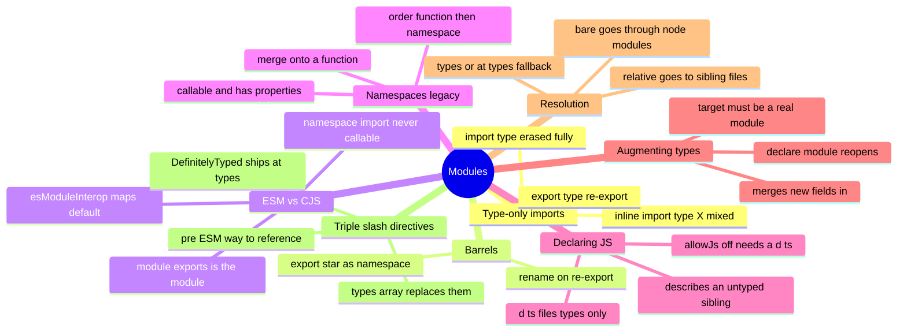

# 09 — Modules & Organization · Cheat-sheet

## Concept map



*What to notice: two branches — type-only imports and barrels — are about
what YOU write; ESM/CJS and resolution are about what the RUNTIME and
COMPILER do with it.*

## Key syntax

```ts
import type { User } from './models'
import { api, type Role } from './api'
export type { User } from './models'
export { parse as parseJson } from './json'
export * as geometry from './geometry'

export function greet(name: string): string { return `Hi ${name}` }
export namespace greet {
  export const defaultName = 'world'
}

// mathlib.d.ts — describes untyped mathlib.js
export declare function add(a: number, b: number): number

declare module './events' {
  interface EventMap {
    keypress: { key: string }
  }
}
```

## Rules to remember

- `import type` / `export type` are ERASED — no runtime import happens,
  no bundler crash on re-exporting a type as if it were a value.
- A CJS package has no real `default` — `esModuleInterop` invents one
  from `module.exports`. A namespace import (`import * as`) never needs
  it, but is never callable either.
- A namespace-onto-function merge must declare the function FIRST, the
  `namespace` block AFTER — reverse order is a compile error (TS2434).
- A `.d.ts` file has ONLY types: `declare function`, `declare const`, no
  bodies, no initializers.
- `declare module '<specifier>'` augmentation only merges if its file is
  itself a module (has an import or export) and is part of the compiled
  program.
- Relative specifiers (`./x`) resolve next to the importing file; bare
  specifiers (`x`) walk `node_modules`, then fall back to
  `node_modules/@types/x`.

## Gotchas

- `import { SomeType }` (no `type` keyword) still compiles — but it loads
  the module at runtime just for a type that later vanishes from the
  emitted code's usage. Prefer `import type` when nothing but types cross
  the boundary.
- `export { T } from './x'` (no `type`) re-exports a type as if it were a
  value — fine for `tsc`, but file-by-file transpilers like esbuild or
  Babel emit a runtime re-export that crashes because `T` doesn't exist
  at runtime. Always `export type { T } from './x'`.
- `import * as pkg from 'pkg'` gives the module namespace OBJECT, never a
  callable — even if `module.exports` was a function. Go through
  `pkg.default` (with interop) instead.
- Triple-slash `/// <reference types="..." />` predates the `types` array
  in tsconfig; you'll mostly see it inside generated `.d.ts` files, not
  hand-write it in application code today.

## Self-quiz

1. Why does `import type { X } from './x'` never trigger `./x`'s
   top-level side effects, while `import { X }` (a type) sometimes does?
2. You wrote `export { Shape } from './shapes'` and a bundler crashed at
   runtime with "Shape is not exported". What's wrong, and what's the fix?
3. A CJS package does `module.exports = connect`. Which import form needs
   `esModuleInterop`: `import connect from 'pkg'` or
   `import * as pkg from 'pkg'`? Which one is ever callable?
4. Why must `export namespace greet { ... }` appear AFTER
   `export function greet() { ... }`, never before?
5. `allowJs` is off and there's a plain `utils.js` next to your `.ts`
   files. What second file makes `import { helper } from './utils'`
   type-check, and what may/may not go inside it?
6. What does `declare module './events' { interface EventMap { ... } }`
   do, and what TWO conditions must hold for it to take effect?
7. You `import './x'` with a bare specifier `x` (no `./`) and get
   TS7016. Walk through the two places the compiler looked before
   giving up.
8. What's the modern replacement for
   `/// <reference types="node" />` in a tsconfig-based project?

<details><summary>Answers</summary>

1. `import type` is erased at compile time — the statement never reaches
   the emitted JavaScript, so nothing ever `require`s or `import`s the
   module. A plain `import { X }` of a type-only name still compiles to a
   real import statement (TypeScript can't always tell your intent), so
   the module — and its side effects — load at runtime.
2. `export { Shape } from './shapes'` re-exports a TYPE with value-export
   syntax; `tsc` erases it correctly, but transpilers that process files
   in isolation (esbuild, Babel) can't tell `Shape` is a type and emit a
   runtime `export` for something that doesn't exist. Fix: `export type
   { Shape } from './shapes'`.
3. `import connect from 'pkg'` needs `esModuleInterop` (it invents a
   `default` from `module.exports`). `import * as pkg from 'pkg'` never
   needs it — but it's the DEFAULT import that's callable; the namespace
   import is a plain object.
4. TypeScript resolves the merge by declaration order: the namespace
   attaches its members onto whatever `greet` already is. If the
   namespace came first, there'd be no function yet to attach to.
5. A sibling `utils.d.ts`. It may contain only type declarations —
   `declare function`, `declare const`, ambient interfaces — never a
   function body or a real initializer.
6. It reopens the module at `'./events'` and merges a `keypress` field
   into its existing `EventMap` interface. It only takes effect if (a)
   the specifier resolves to a real module, and (b) the file containing
   the `declare module` block is itself included in the compiled program
   (reached by some import, directly or transitively).
7. First it checks whether the package itself ships types (a `types`/
   `typings` field in its `package.json`, or a bundled `.d.ts`). If not,
   it checks `node_modules/@types/x`. TS7016 means neither existed —
   install `@types/x` from DefinitelyTyped or write your own `.d.ts`.
8. Nothing to reference — put `"node"` in the tsconfig `compilerOptions.
   types` array (or just install `@types/node`, which most setups pick
   up automatically). Triple-slash `types` references are the pre-tsconfig
   way to do the same thing.

</details>
