# 10 — Async & Error Handling

## Why this exists

Async code moves values through time, and TypeScript tracks *where* the
type lives at each step: inside the `Promise`, or unwrapped by `await`.
Errors are the flip side — anything can be thrown, so a `catch` variable
is `unknown` and you must narrow it before use. This module is about
keeping types honest on both paths: the value that arrives later, and the
failure that arrives instead.

## Map of this module

| Section | Exercise |
| --- | --- |
| `Promise<T>` — a box with a type inside · Building a promise by hand · `.then` / `.catch` / `.finally` · `async` / `await` · `Awaited<T>` | ex01 |
| Floating promises · `return await` · The event loop | ex01 (and every test you write) |
| `Promise.all` · `Promise.allSettled` · `race` / `any` and the combinator table · `await` in a loop | ex02 |
| Timers and `Promise<void>` · A deadline with `Promise<never>` · Retrying · `AbortController` | ex03, checkpoint |
| Anything can be thrown · The narrowing checklist · What an `Error` carries | ex04 |
| Custom error classes · Telling errors apart · Error code maps with `satisfies` | ex05, checkpoint |
| `Result<T, E>` · Working with Results · Throw vs Result | ex06, checkpoint |
| Sync generators first · Async iteration · Async generators | ex07 |

## Where the types attach

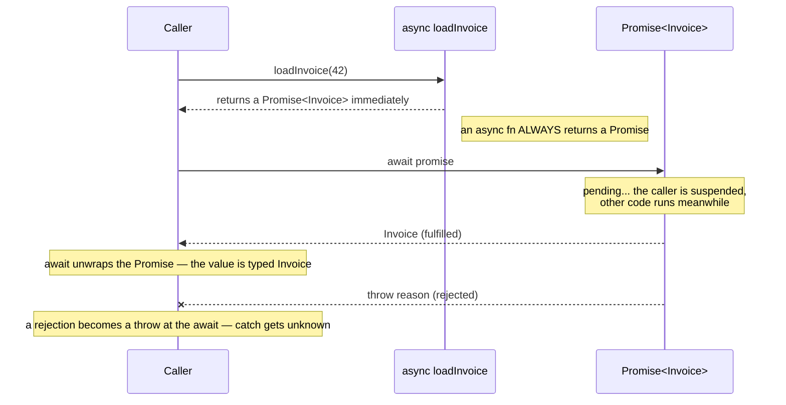

*What to notice: the `Promise<Invoice>` type attaches at the function's
return; `await` is where the compiler peels it off and hands you `Invoice`
— or throws, if the promise rejected.*

## Minimal syntax

```ts
type Invoice = { id: number; total: number }

// an async function's return type is ALWAYS wrapped in Promise
async function loadInvoice(id: number): Promise<Invoice> {
  return { id, total: 99 } // you return the T, TS wraps it
}

// Awaited<T> unwraps promises — even nested ones
type A = Awaited<Promise<string>>          // string
type B = Awaited<Promise<Promise<number>>> // number (all layers)

async function main() {
  const invoice = await loadInvoice(1)     // Invoice — unwrapped

  // Promise.all infers a TUPLE from a tuple of promises
  const [first, second] = await Promise.all([loadInvoice(1), loadInvoice(2)])

  try {
    await loadInvoice(3)
  } catch (e) {
    // e is unknown — narrow before use
    if (e instanceof Error) console.log(e.message)
  }
}
```

### `Promise<T>` — a box with a type inside

A `Promise<T>` is an object that will *eventually* hold a `T`, or a
failure. `T` is the type of the value you get **after** waiting — never
the type of the failure. The failure side is untyped on purpose: any
value can be thrown, so TypeScript refuses to guess.

```ts
async function fetchScore(): Promise<number> {
  return 87
}

const pending = fetchScore()       // Promise<number> — not a number yet

// ❌ error TS2322: Type 'Promise<number>' is not assignable to type 'number'.
const score: number = pending

// ✅ wait for it
async function report() {
  const score: number = await fetchScore()
  return score
}
```

Two special cases you will see constantly:

- `Promise<void>` — "finishes, but hands back nothing". The right return
  type for `async` functions that only have side effects.
- `PromiseLike<T>` — anything with a `.then` method (a *thenable*).
  `await` accepts these too, and `Awaited` unwraps them.

```ts
async function saveDraft(text: string): Promise<void> {
  console.log(`saved ${text.length} chars`)
}

// a thenable is enough — await calls its .then for you
const answer = {
  then(resolve: (value: number) => void) {
    resolve(42)
  },
}

async function main() {
  const n = await answer     // number
  await saveDraft('hello')   // void — nothing to bind
}
```

Gotcha: `Promise<T>` says nothing about *how long* the wait is. A
resolved promise still takes a trip through the event loop before its
`.then` runs (see the event-loop section).

### Building a promise by hand — why `new Promise<T>` needs the `T`

Most promises come from `async` functions. But when you wrap a
callback API — timers, events, old Node APIs — you build one yourself.
The constructor cannot infer `T` from the `resolve` calls inside the
callback, so an unannotated `new Promise(...)` is `Promise<unknown>`.

```ts
const untyped = new Promise((resolve) => resolve(42))   // Promise<unknown>

// ❌ error TS2322: Type 'Promise<unknown>' is not assignable to type 'Promise<number>'.
const wanted: Promise<number> = untyped

// ✅ give T explicitly — now resolve(value) is checked against number
const typed = new Promise<number>((resolve) => resolve(42))

// ✅ or let the annotation on the left flow in
const alsoTyped: Promise<number> = new Promise((resolve) => resolve(42))
```

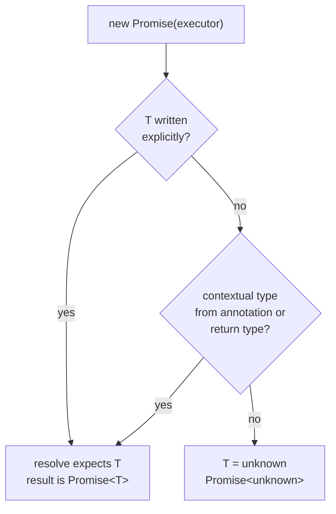

*What to notice: inference flows INTO the executor, never out of it.
Nothing you pass to `resolve` changes `T`.*

`resolve` accepts `T | PromiseLike<T>`. Resolving with a promise
*adopts* it — the outer promise settles with the inner one's result.
That is why `Promise<Promise<T>>` never exists at runtime: the runtime
flattens it before anyone can observe it.

```ts
const inner = Promise.resolve(5)
const outer = Promise.resolve(inner)     // Promise<number>, not Promise<Promise<number>>

const adopted = new Promise<number>((resolve) => resolve(inner))   // ✅ allowed
```

Gotcha: `reject` takes `any`. Throwing a non-`Error` compiles fine — and
lands in someone's `catch` as a value with no `.message`. Always reject
with an `Error` instance.

### `.then`, `.catch`, `.finally` — chaining flattens

Before `async`/`await`, every promise was consumed with `.then`. You
still need it for one-liners and for libraries. Each method returns a
*new* promise, and its `T` is computed from what your callback returns.

```ts
const total = Promise.resolve(3)

const doubled = total.then((n) => n * 2)                    // Promise<number>
const label = total.then((n) => Promise.resolve(`#${n}`))   // Promise<string> — flattened
const safe = label.catch(() => 'fallback')                  // Promise<string>
const widened = doubled.catch(() => 'fallback')             // Promise<string | number>
const logged = doubled.finally(() => console.log('done'))   // Promise<number> — finally cannot change T

// ❌ error TS2322: Type 'Promise<string | number>' is not assignable to type 'Promise<number>'.
const onlyNumbers: Promise<number> = widened
```

| Method | Callback receives | Result type |
| --- | --- | --- |
| `.then(f)` | the value `T` | `Promise<Awaited<ReturnType<f>>>` — flattened |
| `.catch(g)` | the reason as `any` | `Promise<T \| Awaited<ReturnType<g>>>` — widened |
| `.finally(h)` | nothing | `Promise<T>` — unchanged |

Gotcha: `.catch` *widens*. A handler that returns a fallback string
turns `Promise<number>` into `Promise<string | number>`. Either return
the same `T`, or rethrow.

### `async` / `await` — return `T`, get `Promise<T>`

`async` marks a function whose body may pause. Two rules follow: the
function always returns a promise, and inside it `await` unwraps one.

```ts
async function fetchCount() {
  return 12                 // inferred: Promise<number>
}

async function fetchName(): Promise<string> {
  return 'Ada'              // you return string; TS wraps it
}

// ❌ error TS1064: The return type of an async function or method must be the global Promise<T> type. Did you mean to write 'Promise<number>'?
async function fetchAge(): number {
  return 30
}
```

`await` works on anything. A non-promise passes through unchanged (after
a microtask tick). Outside an `async` function it is an error — except
at the top level of an ES module, where the whole module becomes async.

```ts
async function demo() {
  const n = await 5                  // number — awaiting a non-promise is allowed
  const s = await Promise.resolve('x')   // string
  return [n, s] as const
}

function notAsync() {
  // ❌ error TS1308: 'await' expressions are only allowed within async functions and at the top levels of modules.
  const n = await Promise.resolve(1)
  return n
}
```

Arrow functions and methods take the keyword in the same place:

```ts
const loadTags = async (id: number): Promise<string[]> => [`tag-${id}`]

class Catalog {
  async count(): Promise<number> { return 3 }
  static async open(): Promise<Catalog> { return new Catalog() }
}
```

Gotcha: annotate `Promise<T>`, not `T`. TS infers the wrapper for you
when you leave the annotation off, but an explicit `T` is a hard error
(TS1064). Also, `await` inside a plain callback (`items.forEach(async
...)`) does not make the outer function wait — see the loop section.

### `Awaited<T>` — unwrapping in the type world

`await` unwraps at runtime; `Awaited<T>` is the same operation on
types. It is recursive — it keeps peeling while there is a promise or
thenable left — and it passes non-promises through.

```ts
type A = Awaited<Promise<string>>                 // string
type B = Awaited<Promise<Promise<number>>>        // number — every layer
type C = Awaited<number>                          // number — untouched
type D = Awaited<Promise<string> | number>        // string | number — distributes

async function loadTotal() {
  return 42
}
type Total = Awaited<ReturnType<typeof loadTotal>>   // number

const t: Total = 42
```

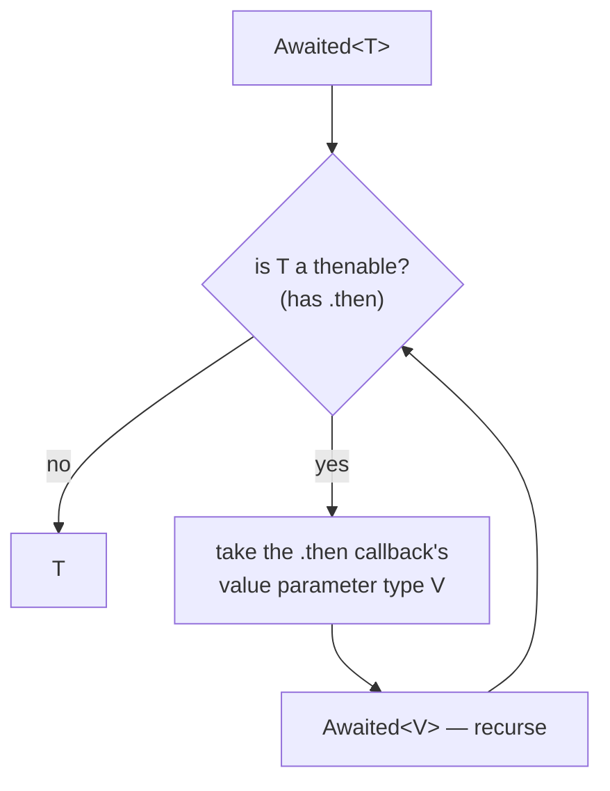

*What to notice: the loop runs until nothing thenable is left. That is
why `Awaited<Promise<Promise<T>>>` is just `T`.*

Gotcha: `ReturnType<typeof asyncFn>` is `Promise<T>`, not `T`. Wrap it
in `Awaited` when you want the resolved value — the pattern is
`Awaited<ReturnType<typeof fn>>`.

### Floating promises and the always-true condition

A promise nobody awaits still runs — but its rejection has nowhere to
go, and its result is lost. TypeScript catches one common form: using a
promise where a boolean was expected.

```ts
async function isReady(): Promise<boolean> {
  return true
}

async function boot() {
  // ❌ error TS2801: This condition will always return true since this 'Promise<boolean>' is always defined.
  if (isReady()) console.log('ready')

  // ✅ await first — now it is a boolean
  if (await isReady()) console.log('ready')
}
```

The other form — calling an `async` function and dropping the result —
compiles silently. Say it out loud with `void`:

```ts
async function flushLogs(): Promise<void> {}

void flushLogs()   // "I know this is a promise; I chose not to wait"
```

Gotcha: a forgotten `await` inside `try` means the `catch` never sees
the rejection. Linters (`@typescript-eslint/no-floating-promises`) exist
for exactly this — the compiler alone does not flag it.

### `return await` vs `return` inside `try`

Returning a promise from an `async` function and returning its awaited
value give the same result — *except* inside a `try`. Without `await`,
the rejection happens after the function has already left the `try`.

```ts
async function loadConfig(): Promise<string> {
  throw new Error('config missing')
}

async function readLoose(): Promise<string> {
  try {
    return loadConfig()          // promise escapes — catch never runs
  } catch {
    return 'default'
  }
}

async function readSafe(): Promise<string> {
  try {
    return await loadConfig()    // rejection is caught here
  } catch {
    return 'default'
  }
}
```

Rule: inside `try`, `return await`. Outside it, plain `return` is fine
and saves one tick.

### The event loop in one diagram

Tests in this module check *order*. Three queues explain every case:
the current synchronous code, then all microtasks (promise callbacks),
then one macrotask (a timer, I/O).


*What to notice: `await` never resumes before the current sync code
finishes, and microtasks always beat timers — even `setTimeout(..., 0)`.*

```ts
console.log('1 sync')
setTimeout(() => console.log('4 timer'), 0)
Promise.resolve().then(() => console.log('3 microtask'))
console.log('2 sync')
```

Gotcha: `await x` where `x` is not a promise still yields to the
microtask queue. It is never free.

### `Promise.all` — tuple in, tuple out

`Promise.all` runs promises *concurrently* and resolves when all
succeed. The typing is the interesting part: pass a tuple and you get a
tuple back, one type per slot; pass an array and you get an array.

```ts
async function loadCount(): Promise<number> { return 3 }
async function loadTitle(): Promise<string> { return 'Inbox' }
async function loadFlag(): Promise<boolean> { return true }

async function main() {
  const trio = await Promise.all([loadCount(), loadTitle(), loadFlag()])
  //    ^? [number, string, boolean]
  const [count, title, flag] = trio

  const ids = [1, 2, 3]
  const labels = await Promise.all(ids.map(async (id) => `item-${id}`))
  //    ^? string[]

  const mixed = await Promise.all([loadCount(), 'plain'])
  //    ^? [number, string] — non-promises pass straight through
}
```

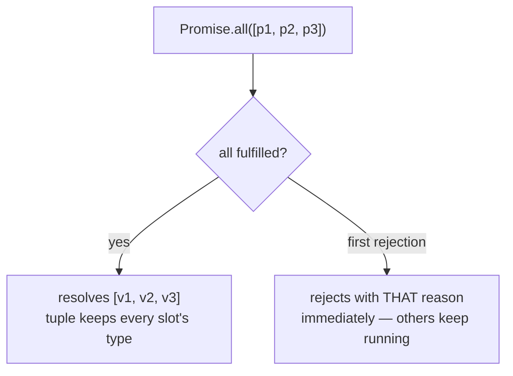

*What to notice: the input shape is the output shape — `Promise.all` is
`Awaited` mapped over a tuple. The first failure ends the wait, but does
not cancel the other promises.*

Gotcha: the result is only a tuple if the *argument* is a tuple literal.
`const jobs = [a, b]` is inferred as an array, so `Promise.all(jobs)`
gives an array. Write `[a, b] as const` or pass the literal directly.

### `Promise.allSettled` — a discriminated union per slot

When you want *every* outcome — successes and failures — use
`allSettled`. It never rejects. Each slot is a `PromiseSettledResult<T>`,
which is a discriminated union tagged by `status`.

```ts
// the shape you get back, spelled out
type Settled<T> =
  | { status: 'fulfilled'; value: T }
  | { status: 'rejected'; reason: any }

async function loadPage(n: number): Promise<string> {
  if (n === 2) throw new Error('page 2 is missing')
  return `page-${n}`
}

async function main() {
  const jobs = [loadPage(1), loadPage(2), loadPage(3)]
  const results = await Promise.allSettled(jobs)   // PromiseSettledResult<string>[]

  for (const r of results) {
    // ❌ error TS2339: Property 'value' does not exist on type 'PromiseSettledResult<string>'.
    console.log(r.value)

    // ✅ narrow on the tag first — same as any discriminated union (module 05)
    if (r.status === 'fulfilled') console.log(r.value)   // string
    else console.log(String(r.reason))                    // reason is any — wrap it
  }
}
```

Gotcha: `reason` is `any`, because anything can be rejected with. Treat
it like a caught error: `String(r.reason)` or narrow with `instanceof`.

### `Promise.race`, `Promise.any`, and the combinator table

`race` settles with the *first* promise to settle — fulfilled or
rejected — so its type is the union of the members. `any` waits for the
first *fulfilment* and only rejects if all reject, with an
`AggregateError` that carries every reason.

```ts
async function loadCount(): Promise<number> { return 3 }
async function loadTitle(): Promise<string> { return 'Inbox' }

async function main() {
  const fastest = await Promise.race([loadCount(), loadTitle()])   // number | string
  const firstOk = await Promise.any([loadCount(), loadCount()])    // number

  try {
    await Promise.any([Promise.reject(new Error('a')), Promise.reject(new Error('b'))])
  } catch (e) {
    if (e instanceof AggregateError) console.log(e.errors.length)   // 2
  }
}
```

| Combinator | Resolves when | Rejects when | Result type for `[Promise<A>, Promise<B>]` |
| --- | --- | --- | --- |
| `Promise.all` | all fulfil | the first rejects | `[A, B]` |
| `Promise.allSettled` | all settle | never | `[PromiseSettledResult<A>, PromiseSettledResult<B>]` |
| `Promise.race` | the first settles | the first settles by rejecting | `A \| B` |
| `Promise.any` | the first fulfils | all reject (`AggregateError`) | `A \| B` |

Gotcha: `race` on an empty array is pending forever. And a
`Promise<never>` member contributes nothing to the union — the trick the
deadline helper below relies on.

### `await` in a loop vs `Promise.all`

`await` inside a `for` loop runs one step at a time. That is sometimes
what you want (rate limits, ordering). When it is not, build all the
promises first and `Promise.all` them.

```ts
async function fetchPrice(sku: string): Promise<number> {
  return sku.length * 10
}

async function sequential(skus: string[]): Promise<number[]> {
  const prices: number[] = []
  for (const sku of skus) prices.push(await fetchPrice(sku))   // one after another
  return prices
}

async function concurrent(skus: string[]): Promise<number[]> {
  return Promise.all(skus.map((sku) => fetchPrice(sku)))       // all in flight at once
}
```

Gotcha: `skus.forEach(async (sku) => { await ... })` looks sequential
but is neither sequential nor awaited — `forEach` ignores the returned
promises. Use `for...of` or `map` + `Promise.all`.

### Timers and `Promise<void>`

Wrapping `setTimeout` is the classic hand-built promise. The return
annotation `Promise<void>` flows into `new Promise`, so `T` is inferred.

```ts
function sleep(ms: number): Promise<void> {
  return new Promise((resolve) => setTimeout(resolve, ms))
}

async function main() {
  await sleep(10)
  console.log('10ms later')
}
```

The timer *handle* has a different type per platform: `number` in
browsers, `NodeJS.Timeout` in Node (which is what this course compiles
against). `ReturnType<typeof setTimeout>` is portable.

```ts
const handle = setTimeout(() => {}, 10)      // NodeJS.Timeout here

// ❌ error TS2322: Type 'Timeout' is not assignable to type 'number'.
const asNumber: number = handle

// ✅ portable — whatever setTimeout returns on this platform
let timer: ReturnType<typeof setTimeout> | undefined
timer = setTimeout(() => {}, 10)
clearTimeout(timer)
```

### A deadline with `Promise<never>`

To give a promise a time limit, `race` it against a timer that only
ever rejects. The typing trap: an unannotated rejecting promise is
`Promise<unknown>`, and `unknown` swallows `T` in the union.

```ts
function withDeadlineLoose<T>(work: Promise<T>, ms: number): Promise<T> {
  const timer = new Promise((_resolve, reject) =>
    setTimeout(() => reject(new Error('deadline passed')), ms),
  )
  // ❌ error TS2322: Type 'Promise<unknown>' is not assignable to type 'Promise<T>'.
  return Promise.race([work, timer])
}
```

`Promise<never>` says "this can only reject". `T | never` is `T`, so
the race keeps the real type.

```ts
function withDeadline<T>(work: Promise<T>, ms: number): Promise<T> {
  let timer: ReturnType<typeof setTimeout> | undefined
  const deadline = new Promise<never>((_resolve, reject) => {
    timer = setTimeout(() => reject(new Error(`deadline of ${ms}ms passed`)), ms)
  })
  return Promise.race([work, deadline]).finally(() => clearTimeout(timer))
}
```

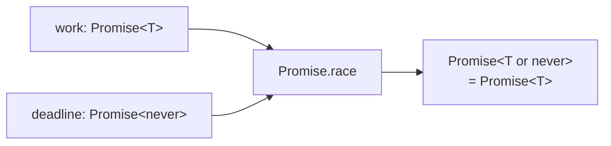

*What to notice: `never` is the identity of a union — it vanishes. That
is the whole reason to annotate the rejecting promise.*

Gotcha: the timer keeps the Node process alive until it fires. Clear it
in a `.finally` so a fast `work` does not leave a dangling timer.

### Retrying — keep the last error

A retry loop needs a place to remember the most recent failure. Its type
is `unknown`, because that is what `catch` hands you.

```ts
function sleep(ms: number): Promise<void> {
  return new Promise((resolve) => setTimeout(resolve, ms))
}

async function retryWithBackoff<T>(
  task: () => Promise<T>,
  tries: number,
  shouldRetry: (e: unknown) => boolean = () => true,
): Promise<T> {
  let lastError: unknown
  for (let attempt = 1; attempt <= tries; attempt++) {
    try {
      return await task()          // return await — so the catch sees rejections
    } catch (e) {
      lastError = e
      if (!shouldRetry(e)) break
      await sleep(attempt * 50)    // grow the pause each round
    }
  }
  throw lastError
}
```

Gotcha: `task` must be a *function* that makes a fresh promise. A
promise settles once; retrying `await samePromise` just returns the
same rejection every time.

### `AbortController` — cancelling with a signal

Promises cannot be cancelled. The standard workaround is an
`AbortSignal`: the caller owns an `AbortController`, hands out its
`signal`, and the async work listens for `abort`.

```ts
function sleepUntilAborted(ms: number, signal: AbortSignal): Promise<void> {
  return new Promise((resolve, reject) => {
    if (signal.aborted) return reject(signal.reason)
    const timer = setTimeout(resolve, ms)
    signal.addEventListener(
      'abort',
      () => {
        clearTimeout(timer)
        reject(signal.reason)         // reason is any — usually a DOMException
      },
      { once: true },
    )
  })
}

const controller = new AbortController()
void sleepUntilAborted(5000, controller.signal).catch(() => console.log('cancelled'))
controller.abort()
```

`fetch(url, { signal })` and most Node APIs accept the same signal, so
one `controller.abort()` cancels a whole tree of work.

### Anything can be thrown — `catch (e)` is `unknown`

`throw` takes any expression. Strings, numbers, plain objects,
`undefined` — all legal. The strict flag `useUnknownInCatchVariables`
therefore types the caught value `unknown`, and an annotation narrower
than that is refused.

```ts
function risky(kind: number): never {
  if (kind === 1) throw 'plain string'
  if (kind === 2) throw { code: 42 }
  if (kind === 3) throw new RangeError('out of range')
  throw undefined
}

try {
  risky(2)
} catch (e) {
  // ❌ error TS18046: 'e' is of type 'unknown'.
  console.log(e.message)
}
```

```ts
try {
  JSON.parse('{')
// ❌ error TS1196: Catch clause variable type annotation must be 'any' or 'unknown' if specified.
} catch (e: Error) {
  console.log(e.message)
}
```

Gotcha: an `await` turns a *rejection* into a *throw* at that line. The
same `unknown` rule applies — a rejected promise can carry any value.

### The narrowing checklist

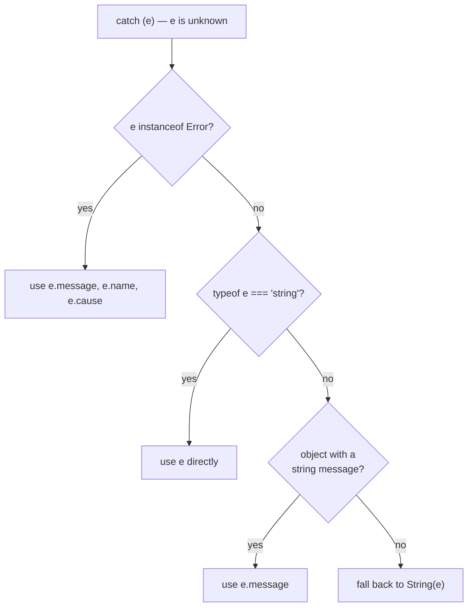

*What to notice: `unknown` forces this checklist — the compiler won't let
you touch `e.message` until a check proves it exists.*

Each step is an ordinary narrowing from module 05. The first two are
one-liners:

```ts
function fromError(e: unknown): string | undefined {
  if (e instanceof Error) return e.message     // e: Error
  if (typeof e === 'string') return e          // e: string
  return undefined
}
```

The third step — "an object with a string `message`" — is the one people
skip. Three checks are needed: it is an object, it is not `null`, and
the property is really a string.

```ts
function fromMessageObject(e: unknown): string | undefined {
  if (typeof e === 'object' && e !== null && 'message' in e) {
    // e: object & Record<'message', unknown>
    if (typeof e.message === 'string') return e.message
  }
  return undefined
}

fromMessageObject({ message: 'disk full' })   // 'disk full'
fromMessageObject({ message: 404 })           // undefined — a number is not a message
```

Gotcha: `String(e)` on a plain object gives `'[object Object]'`. It is
the *last* resort, not the first. And `e.toString()` is not safe on
`unknown` at all — `null` has no methods.

### What an `Error` carries

`Error` is a class with a fixed set of fields. `cause` (ES2022) lets a
high-level error carry the low-level one that triggered it, so nothing
is lost when you wrap and rethrow.

```ts
const boom = new Error('cannot save invoice', { cause: new Error('ENOSPC: disk full') })

boom.message   // string
boom.name      // string — 'Error' by default, the class name for built-ins
boom.stack     // string | undefined — filled in by the engine
boom.cause     // unknown — anything can be a cause

// ❌ error TS18046: 'boom.cause' is of type 'unknown'.
console.log(boom.cause.message)

// ✅ narrow it like any unknown
if (boom.cause instanceof Error) console.log(boom.cause.message)
```

| Property | Type | Who sets it |
| --- | --- | --- |
| `message` | `string` | the constructor's first argument |
| `name` | `string` | the class for built-ins; **you**, for subclasses |
| `stack` | `string \| undefined` | the engine, at construction |
| `cause` | `unknown` | `new Error(msg, { cause })` — the `ErrorOptions` bag |

Rethrowing keeps the original stack. Wrapping with `cause` keeps it
*and* adds context:

```ts
async function readSettings(path: string): Promise<string> {
  throw new Error(`ENOENT: ${path}`)
}

async function loadSettings(path: string): Promise<string> {
  try {
    return await readSettings(path)
  } catch (e) {
    throw new Error(`settings unavailable`, { cause: e })   // e stays reachable
  }
}
```

Gotcha: `instanceof Error` can fail across *realms* — an error created
in an iframe, a worker, or a `vm` context has a different `Error`
constructor. The "object with a string message" check in the checklist
is your fallback for those. (Older ES5 targets also broke `instanceof`
for subclasses; at ES2022 that problem is gone.)

### Custom error classes

Subclassing `Error` gives you three things: a type `instanceof` can
narrow to, extra fields, and a `name` that shows up in logs. Parameter
properties (`readonly file: string` in the constructor) declare and
assign the fields in one line.

```ts
class ConfigError extends Error {
  constructor(
    readonly file: string,
    readonly line: number,
    options?: ErrorOptions,            // { cause?: unknown }
  ) {
    super(`bad config in ${file}:${line}`, options)
    this.name = 'ConfigError'          // otherwise logs say "Error: ..."
  }
}

const failure = new ConfigError('app.toml', 12, { cause: new SyntaxError('unexpected =') })
failure.file          // string
failure.line          // number
String(failure)       // 'ConfigError: bad config in app.toml:12'

// ❌ error TS2540: Cannot assign to 'line' because it is a read-only property.
failure.line = 13
```

The parts, and why each one is there:

| Line | Purpose |
| --- | --- |
| `extends Error` | inherits `message`/`stack`, makes `instanceof Error` true |
| `readonly file: string` (parameter property) | a typed field callers can read, never reassign |
| `super(message, options)` | sets `message`, forwards `cause` |
| `this.name = 'ConfigError'` | `name` is not set automatically — without this, `String(e)` says `Error:` |

In Node you can also call `Error.captureStackTrace(this, ConfigError)`
in the constructor to trim the constructor frame from `stack`. It is
optional and Node-only.

Gotcha: forgetting `this.name` is the number-one mistake. Tests that
check `e.name === 'ConfigError'` fail, and stack traces read as plain
`Error`.

### Telling errors apart — `instanceof` chains and `kind` tags

Inside a `catch`, `instanceof` narrows `unknown` to a specific class.
Check the *most specific* class first, and rethrow anything you do not
recognise.

```ts
class ConfigError extends Error {
  constructor(readonly file: string) {
    super(`bad config in ${file}`)
    this.name = 'ConfigError'
  }
}

function describe(e: unknown): string {
  if (e instanceof ConfigError) return `fix ${e.file}`            // ConfigError
  if (e instanceof SyntaxError) return `syntax: ${e.message}`     // SyntaxError
  if (e instanceof Error) return e.message                        // any other Error
  throw e                                                          // not ours — pass it on
}
```

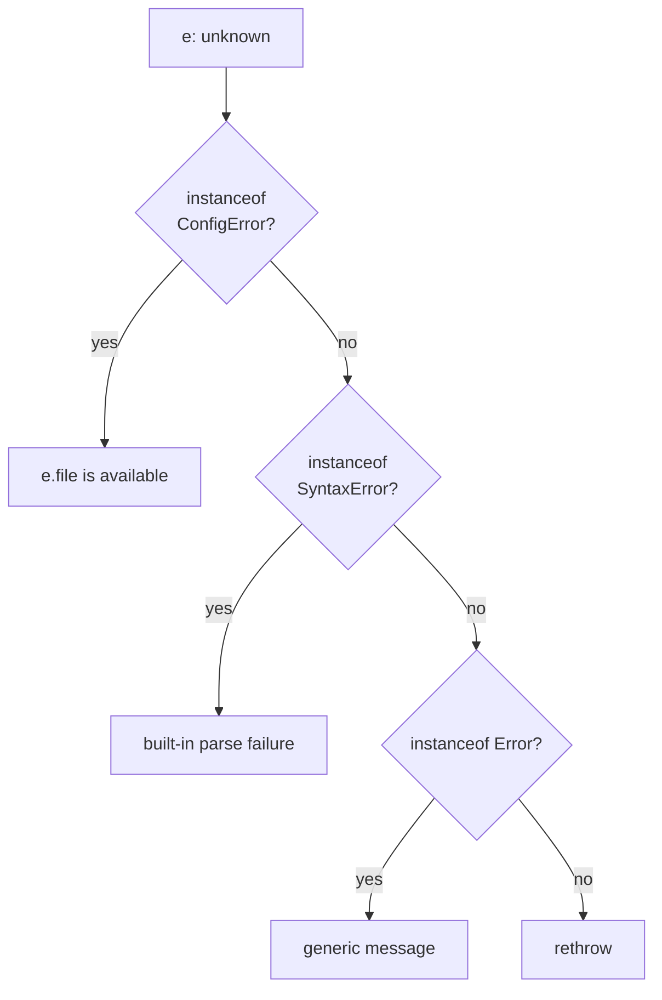

*What to notice: subclasses go first. `instanceof Error` at the top
would match a `ConfigError` too and hide its fields.*

An alternative to a class hierarchy is a plain **tagged union** of
failure objects — no `throw` involved, and exhaustiveness checking for
free:

```ts
type AppFailure =
  | { kind: 'network'; status: number }
  | { kind: 'validation'; field: string }
  | { kind: 'timeout'; ms: number }

function explain(f: AppFailure): string {
  switch (f.kind) {
    case 'network': return `HTTP ${f.status}`
    case 'validation': return `invalid ${f.field}`
    case 'timeout': return `gave up after ${f.ms}ms`
  }
}
```

| | `class extends Error` + `instanceof` | `{ kind: ... }` tagged union |
| --- | --- | --- |
| Carries a stack trace | ✅ | ❌ |
| Travels through `throw` / rejection | ✅ | ✅ (but usually returned instead) |
| Exhaustiveness check | ❌ (a chain of ifs) | ✅ (`switch` on `kind`, `never` at the end) |
| Survives `JSON.stringify` | partly (own fields only) | ✅ |
| Cross-realm safe | ❌ | ✅ |

### Error code maps with `satisfies`

A map from error kinds to codes should be *complete* — every kind gets a
code — and *precise* — reading a code gives its literal, not `number`.
`satisfies` checks completeness without widening; `as const` keeps the
literals.

```ts
type ErrorKind = 'notFound' | 'timeout' | 'server'

const incomplete = {
  notFound: 404,
  timeout: 408,
  // ❌ error TS1360: Type '{ notFound: number; timeout: number; }' does not satisfy the expected type 'Record<ErrorKind, number>'.
} satisfies Record<ErrorKind, number>
```

```ts
type ErrorKind = 'notFound' | 'timeout' | 'server'

const statusOf = {
  notFound: 404,
  timeout: 408,
  server: 500,
} as const satisfies Record<ErrorKind, number>

const code = statusOf.timeout     // 408 — the literal, thanks to as const
```

Gotcha: `const statusOf: Record<ErrorKind, number> = {...}` also checks
completeness, but every read is then `number`. `satisfies` validates
*without* replacing the inferred type.

### `Result<T, E>` — the error type in the signature

`throw` erases the error type: whatever you throw, the caller's `catch`
sees `unknown`. A `Result` is a discriminated union that carries either
the value or the error, so both types are visible in the signature and
the compiler forces the caller to check which one arrived.

```ts
type Ok<T> = { ok: true; value: T }
type Err<E> = { ok: false; error: E }
type Result<T, E> = Ok<T> | Err<E>

function ok<T>(value: T): Ok<T> {
  return { ok: true, value }
}
function err<E>(error: E): Err<E> {
  return { ok: false, error }
}

function parsePort(raw: string): Result<number, string> {
  const n = Number(raw)
  if (!Number.isInteger(n) || n < 1 || n > 65535) return err(`not a port: ${raw}`)
  return ok(n)
}

const port = parsePort('8080')

// ❌ error TS2339: Property 'value' does not exist on type 'Result<number, string>'.
console.log(port.value)

// ✅ narrow on ok first
if (port.ok) console.log(port.value)     // number
else console.log(port.error)             // string
```

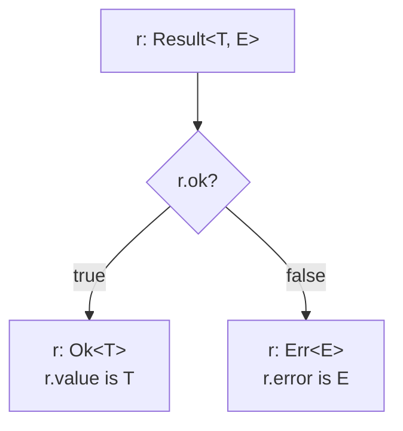

*What to notice: it is the same discriminated-union narrowing as module
05 — `ok` is the tag, `value` and `error` only exist on their own arm.*

Gotcha: `ok(n)` infers `Ok<number>` from the argument; `err('...')`
infers `Err<string>`. Both are assignable to the declared `Result`. You
rarely need to write the type arguments by hand.

### Working with Results — mapping, defaults, and promises

Once errors are values, you can transform them with ordinary functions.
The three shapes below cover most needs.

```ts continue
// transform the error, pass an Ok through untouched
function mapErr<T, E, F>(r: Result<T, E>, fn: (e: E) => F): Result<T, F> {
  return r.ok ? r : err(fn(r.error))
}

// chain a second fallible step — the Err short-circuits
function andThen<T, U, E>(r: Result<T, E>, next: (value: T) => Result<U, E>): Result<U, E> {
  return r.ok ? next(r.value) : r
}

// get the value or compute a fallback from the error
function unwrapOrElse<T, E>(r: Result<T, E>, fallback: (e: E) => T): T {
  return r.ok ? r.value : fallback(r.error)
}

const upper = mapErr(parsePort('abc'), (msg) => msg.toUpperCase())   // Result<number, string>
const fallback = unwrapOrElse(parsePort('abc'), () => 3000)          // 3000
```

Converting a throwing call into a `Result` is the bridge between the
two worlds. Normalise the caught `unknown` so `E` is always `Error`:

```ts continue
function attempt<T>(fn: () => T): Result<T, Error> {
  try {
    return ok(fn())
  } catch (e) {
    return err(e instanceof Error ? e : new Error(String(e)))
  }
}

const parsed = attempt(() => JSON.parse('{') as unknown)   // Result<unknown, Error>
```

The async version returns `Promise<Result<T, E>>` — a promise that
*never rejects*, because every failure has been folded into the value.
`await` it, then narrow on `.ok`; no `try` needed at the call site.

```ts continue
async function loadPort(): Promise<Result<number, string>> {
  return parsePort('80')
}

async function main() {
  const r = await loadPort()        // Result<number, string> — no try/catch
  if (r.ok) console.log(r.value)
}
```

Libraries such as `neverthrow` ship this exact pattern with a fluent
API (`.map`, `.andThen`, `ResultAsync`). The types you just wrote are
what they build on.

Gotcha: an `Err` passed through `mapErr` or `andThen` should be returned
*as the same object*, not rebuilt — `return r` when `!r.ok`, as above.
Callers may compare by identity.

### Throw vs Result — which one do I reach for?

| | `throw` + `try/catch` | `Result<T, E>` union |
| --- | --- | --- |
| Error type visible in signature | ❌ (`catch` gets `unknown`) | ✅ (`E` is right there) |
| Compiler forces handling | ❌ | ✅ (must check `.ok`) |
| Works across `await` | ✅ (rejections) | ✅ (`Promise<Result<T, E>>`) |
| Stack trace | ✅ automatic | only if `E` is an `Error` |
| Propagates without code | ✅ (bubbles up) | ❌ (every layer checks or forwards) |
| Composes with `Promise.all` | rejects the whole batch | ✅ each slot keeps its own outcome |
| Idiomatic for | unexpected failures | expected, recoverable failures |

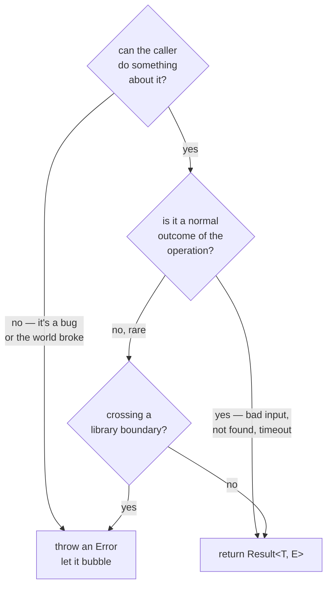

*What to notice: the question is not "is it an error" but "who should be
forced to look at it". `Result` forces the caller; `throw` trusts
someone up the stack.*

### Sync generators first — `function*` and `Generator<Y, R, N>`

A generator is a function that can pause with `yield` and resume later.
Its type has three slots: `Y` is what it yields, `R` is what it finally
returns, `N` is what `next(arg)` sends back in.

```ts
function* idsFrom(start: number): Generator<number, string, boolean> {
  let id = start
  while (true) {
    const stop = yield id           // stop: boolean — the N slot
    if (stop) return 'stopped'      // string — the R slot
    id += 1
  }
}

const ids = idsFrom(100)
ids.next()        // { value: 100, done: false }   — IteratorResult<number, string>
ids.next(false)   // { value: 101, done: false }
ids.next(true)    // { value: 'stopped', done: true }
```

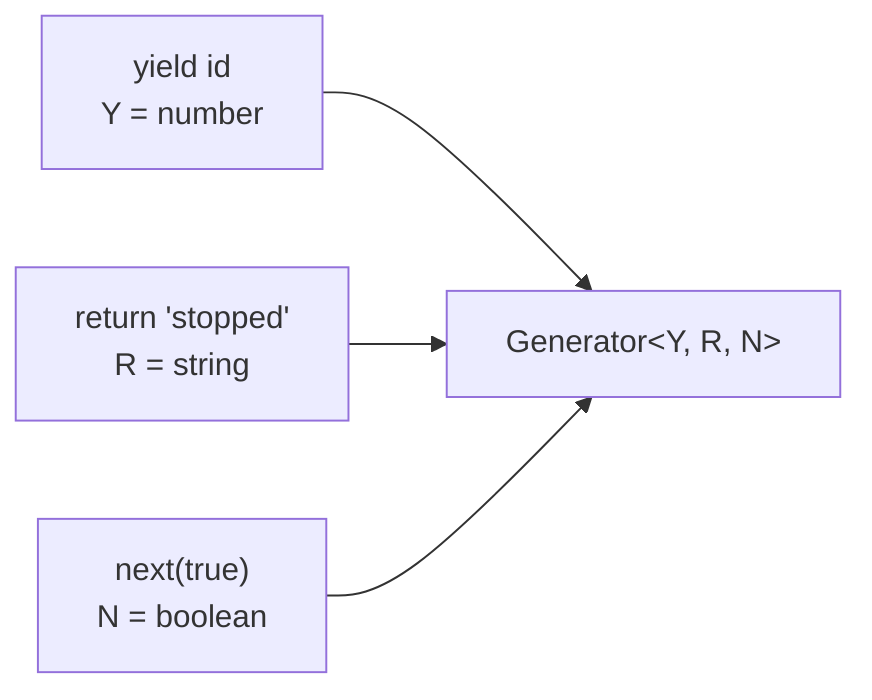

*What to notice: each keyword feeds one type slot. `for...of` only sees
`Y` — it drops `R` and always sends `undefined` as `N`.*

That last point is a real compiler check:

```ts
function* idsFrom(start: number): Generator<number, string, boolean> {
  const stop = yield start
  return stop ? 'stopped' : 'done'
}

// ❌ error TS2763: Cannot iterate value because the 'next' method of its iterator expects type 'boolean', but for-of will always send 'undefined'.
for (const id of idsFrom(1)) console.log(id)
```

Most generators do not take input. Write `Generator<number>` (the
defaults are `R = any`, `N = any`) or the precise `Generator<number,
void, undefined>` and `for...of` is happy.

```ts
function* evens(limit: number): Generator<number, void, undefined> {
  for (let n = 0; n <= limit; n += 2) yield n
}

for (const n of evens(6)) console.log(n)   // 0 2 4 6
const all = [...evens(4)]                  // number[] — spread drives the iterator too
```

Gotcha: a generator is *lazy*. `evens(1_000_000)` does nothing until
something calls `next()`.

### Async iteration — `AsyncIterable` and `for await`

An async iterable is a source whose `next()` returns a *promise* of the
next item. `for await` awaits each one. Streams, paginated APIs, and
sockets all fit this shape.

| Protocol | Method | `next()` returns | Consumed with |
| --- | --- | --- | --- |
| `Iterable<T>` | `[Symbol.iterator]()` | `IteratorResult<T>` | `for...of`, spread |
| `AsyncIterable<T>` | `[Symbol.asyncIterator]()` | `Promise<IteratorResult<T>>` | `for await` |

```ts
// the protocol, written by hand — any object with this method qualifies
const pages: AsyncIterable<string> = {
  async *[Symbol.asyncIterator]() {
    yield 'page-1'
    yield 'page-2'
  },
}

async function main() {
  for await (const page of pages) console.log(page)   // page: string

  // for await also accepts a sync iterable of promises (or plain values)
  for await (const n of [Promise.resolve(1), 2]) console.log(n)   // n: number
}
```

Both directions of the mix-up have a diagnostic:

```ts
async function* ticks(): AsyncGenerator<number, void, unknown> {
  yield 1
}

async function main() {
  // ❌ error TS2488: Type 'AsyncGenerator<number, void, unknown>' must have a '[Symbol.iterator]()' method that returns an iterator.
  for (const n of ticks()) console.log(n)

  // ❌ error TS2504: Type '5' must have a '[Symbol.asyncIterator]()' method that returns an async iterator.
  for await (const n of 5) console.log(n)
}
```

In Node, `process.stdin`, file streams and HTTP bodies are async
iterables; the web `ReadableStream` is one too. `for await (const chunk
of stream)` is the modern way to consume any of them.

Gotcha: `for await` is sequential by design — it waits for each item
before asking for the next. It is a loop, not a `Promise.all`.

### Async generators — `AsyncGenerator<Y, R, N>` and lazy streams

`async function*` produces an `AsyncGenerator<Y, R, N>` — the same three
slots as a sync generator, delivered through promises. It is the easiest
way to *build* an `AsyncIterable`, and it can `await` between yields.

```ts
function sleep(ms: number): Promise<void> {
  return new Promise((resolve) => setTimeout(resolve, ms))
}

async function* heartbeat(every: number, count: number): AsyncGenerator<number, void, unknown> {
  for (let beat = 1; beat <= count; beat++) {
    await sleep(every)      // pause between items
    yield beat              // Y = number
  }
}

async function* wrongYield(): AsyncGenerator<number, void, unknown> {
  // ❌ error TS2322: Type 'string' is not assignable to type 'number'.
  yield 'tick'
}
```

Helpers should **accept** the wide protocol type `AsyncIterable<T>` and
**return** the concrete `AsyncGenerator<U, void, unknown>`. That way a
caller can pass a stream, a generator, or a hand-written object, and
your helper stays lazy — nothing runs until someone pulls.

```ts continue
async function* take<T>(source: AsyncIterable<T>, limit: number): AsyncGenerator<T, void, unknown> {
  let seen = 0
  for await (const item of source) {
    if (seen >= limit) return
    yield item
    seen += 1
  }
}

async function* filterStream<T>(
  source: AsyncIterable<T>,
  keep: (item: T) => boolean,
): AsyncGenerator<T, void, unknown> {
  for await (const item of source) {
    if (keep(item)) yield item
  }
}

async function main() {
  const odds = filterStream(heartbeat(5, 10), (n) => n % 2 === 1)   // AsyncGenerator<number, void, unknown>
  for await (const n of take(odds, 3)) console.log(n)               // 1 3 5 — then stops pulling
}
```

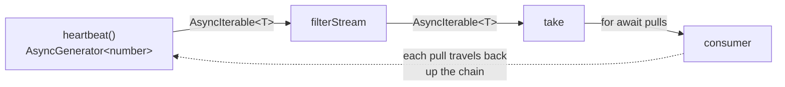

*What to notice: values flow left to right, but DEMAND flows right to
left. Nothing above `take` computes an item until the loop asks.*

| Type | Role | Use it for |
| --- | --- | --- |
| `AsyncIterable<T>` | protocol — "can be `for await`ed" | parameters |
| `AsyncIterator<T>` | the object with `next()` | rarely written by hand |
| `AsyncGenerator<Y, R, N>` | concrete result of `async function*` | return types |

Gotcha: an async generator with a source parameter typed `any` yields
`any`. Keep sources typed `AsyncIterable<T>` so the element type
survives `for await`.

### How it shows up at runtime

| Thing | At runtime |
| --- | --- |
| `Promise<T>` | a real `Promise` object; `typeof p === 'object'`, `p instanceof Promise` is `true`. The `T` is gone. |
| `async function` | a real function — `fn.constructor.name === 'AsyncFunction'`. Calling it always yields a `Promise`. |
| `Awaited<T>`, `PromiseLike<T>` | pure types — nothing emitted |
| `class ConfigError extends Error` | a real class; `instanceof` works; `e.name` is whatever you assigned |
| `readonly file` | erased — the property is writable in JS; only the compiler stops you |
| `Result<T, E>` | a plain object `{ ok: true, value }` — survives `JSON.stringify` intact |
| `AsyncGenerator` | a real generator object with `next()`, `return()`, `throw()` |

Serialising errors surprises people: `message` and `stack` are
*non-enumerable*, so they do not show up.

```ts
class ConfigError extends Error {
  constructor(readonly file: string) {
    super(`bad config in ${file}`)
    this.name = 'ConfigError'
  }
}

const e = new ConfigError('app.toml')
JSON.stringify(e)          // '{"file":"app.toml","name":"ConfigError"}' — no message, no stack
Object.keys(e)             // ['file', 'name'] — the fields YOU assigned
String(e)                  // 'ConfigError: bad config in app.toml' — uses name + message
```

Log `e.message` and `e.stack` explicitly, or build a plain object, when
an error must cross a JSON boundary.

### Reading the compiler errors

| Code | Message (abridged) | What it is telling you |
| --- | --- | --- |
| TS1064 | The return type of an async function must be the global `Promise<T>` type | you wrote `: T` on an `async` function — write `: Promise<T>` |
| TS1308 | `await` expressions are only allowed within async functions and at the top levels of modules | add `async` to the enclosing function |
| TS2801 | This condition will always return true since this `Promise<...>` is always defined | you tested a promise, not its value — `await` it |
| TS1196 | Catch clause variable type annotation must be `any` or `unknown` | `catch (e: Error)` is illegal — drop the annotation and narrow |
| TS18046 | `'e' is of type 'unknown'` | narrow (`instanceof`, `typeof`) before touching a property |
| TS2339 | Property `value` does not exist on type `PromiseSettledResult<T>` / `Result<T, E>` | narrow on the discriminant (`status`, `ok`) first |
| TS2322 | `Promise<unknown>` is not assignable to `Promise<T>` | a hand-built promise lost its `T` — annotate `new Promise<T>` / `Promise<never>` |
| TS2322 | `Type 'Timeout' is not assignable to type 'number'` | Node timer handles are not numbers — use `ReturnType<typeof setTimeout>` |
| TS2488 / TS2504 | must have a `[Symbol.iterator]()` / `[Symbol.asyncIterator]()` method | `for...of` on an async source, or `for await` on a non-iterable |
| TS2763 | `for-of will always send 'undefined'` | your generator's `N` slot must accept `undefined` to be used in `for...of` |

### Rules to remember

- An `async` function returns `Promise<T>`. Annotate the wrapper; return
  the `T`.
- `await` unwraps one value at runtime; `Awaited<T>` unwraps every layer
  in the type.
- `new Promise<T>` needs its `T` — nothing inside the executor can infer
  it. A promise that only rejects is `Promise<never>`.
- `Promise.all`: tuple in, tuple out, first rejection wins.
  `allSettled`: never rejects, narrow each slot on `status`.
- `catch (e)` is `unknown`. Narrow with `instanceof Error` first, then
  the rest of the checklist.
- A custom error sets `this.name`, uses `readonly` parameter properties,
  and forwards `cause` through `super(message, { cause })`.
- `Result<T, E>` puts `E` in the signature and forces the `.ok` check.
  Use it for expected failures; `throw` for the unexpected.
- Accept `AsyncIterable<T>`, return `AsyncGenerator<U, void, unknown>`,
  and stay lazy.

## Common gotchas

- `async` wraps the return type for you — writing `Promise<Promise<T>>`
  by hand is almost always a mistake; `await` and `Awaited` flatten it,
  and the runtime never nests promises anyway.
- `Promise.all` rejects on the FIRST failure; `Promise.allSettled` waits
  for everything and never rejects.
- `r.value` doesn't exist until you check `r.status === 'fulfilled'` —
  settled results are a discriminated union.
- `catch (e: Error)` is illegal — only `unknown` or `any` are allowed as
  catch annotations. Narrow instead.
- A rejecting promise you build yourself (e.g. for timeouts) should be
  typed `Promise<never>` so `Promise.race` keeps the real `T`.
- `return somePromise` inside `try` skips the `catch`. Use `return await`.
- `if (asyncCheck())` is always true (TS2801). `await` it.
- `{ message: 404 }` is not a usable error message — the property must
  be a string, and `String({})` is `'[object Object]'`.
- Forgetting `this.name` in an `Error` subclass makes every log line say
  `Error:`.
- `forEach(async ...)` awaits nothing. Use `for...of` or `Promise.all`.

## Try it now

→ `exercises/ex01.ts` through `ex07.ts`, then `checkpoint.ts`.
Check with `npm test -- 10`.
