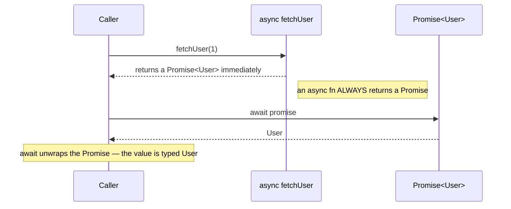
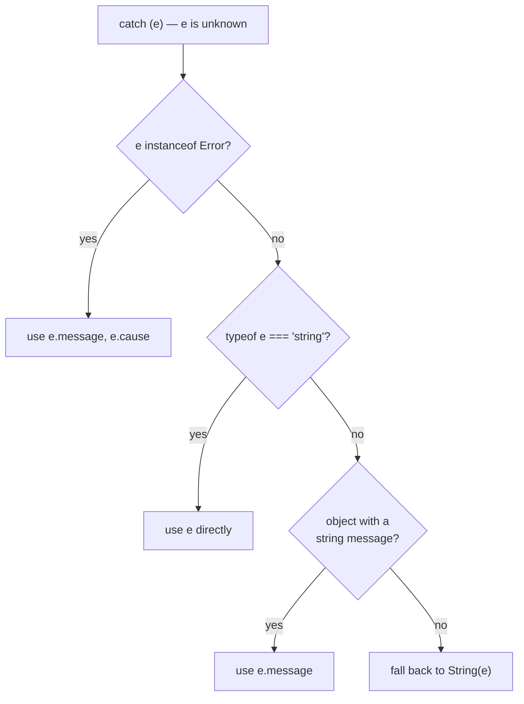

# 10 — Async & Error Handling

## Why this exists

Async code moves values through time, and TypeScript tracks *where* the
type lives at each step: inside the `Promise`, or unwrapped by `await`.
Errors are the flip side — anything can be thrown, so a `catch` variable
is `unknown` and you must narrow it before use.

## Where the types attach



*What to notice: the `Promise<User>` type attaches at the function's
return; `await` is where the compiler peels it off and hands you `User`.*

## Minimal syntax

```ts
// an async function's return type is ALWAYS wrapped in Promise
async function fetchUser(id: number): Promise<{ name: string }> {
  return { name: `user-${id}` } // you return the T, TS wraps it
}

// Awaited<T> unwraps promises — even nested ones
type A = Awaited<Promise<string>>          // string
type B = Awaited<Promise<Promise<number>>> // number (all layers)

// Promise.all infers a TUPLE from a tuple of promises
const [n, s] = await Promise.all([fetchNum(), fetchStr()]) // [number, string]

// allSettled never rejects — narrow each result by its status
for (const r of await Promise.allSettled(jobs)) {
  if (r.status === 'fulfilled') use(r.value) // value only exists here
  else log(r.reason)                         // reason only exists here
}
```

## Narrowing an unknown error



*What to notice: `unknown` forces this checklist — the compiler won't let
you touch `e.message` until a check proves it exists.*

```ts
class HttpError extends Error {
  constructor(readonly status: number, url: string, cause?: unknown) {
    super(`HTTP ${status} for ${url}`, { cause }) // cause chains errors
    this.name = 'HttpError'
  }
}

try {
  await fetchUser(1)
} catch (e) {          // e: unknown (strict mode)
  if (e instanceof HttpError) console.log(e.status) // narrowed
}
```

## Throw vs Result

| | `throw` + `try/catch` | `Result<T, E>` union |
| --- | --- | --- |
| Error type visible in signature | ❌ (`catch` gets `unknown`) | ✅ (`E` is right there) |
| Compiler forces handling | ❌ | ✅ (must check `.ok`) |
| Works across `await` | ✅ (rejections) | ✅ (`Promise<Result<T, E>>`) |
| Idiomatic for | unexpected failures | expected, recoverable failures |

## Common gotchas

- `async` wraps the return type for you — writing `Promise<Promise<T>>`
  by hand is almost always a mistake; `await` and `Awaited` flatten it.
- `Promise.all` rejects on the FIRST failure; `Promise.allSettled` waits
  for everything and never rejects.
- `r.value` doesn't exist until you check `r.status === 'fulfilled'` —
  settled results are a discriminated union.
- `catch (e: Error)` is illegal — only `unknown` or `any` are allowed as
  catch annotations. Narrow instead.
- A rejecting promise you build yourself (e.g. for timeouts) should be
  typed `Promise<never>` so `Promise.race` keeps the real `T`.

## Try it now

→ `exercises/ex01.ts` through `ex07.ts`, then `checkpoint.ts`.
Check with `npm test -- 10`.
