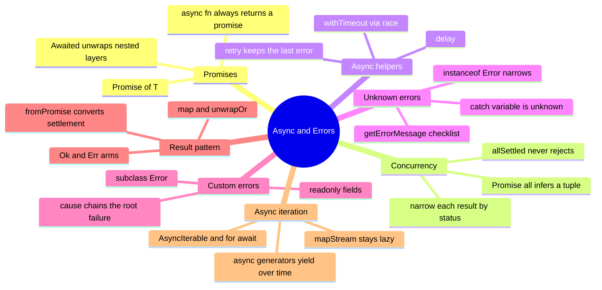

# 10 — Async & Error Handling · Cheat-sheet

## Concept map



*What to notice: everything on the left (Promises, Concurrency, Async
iteration) is about VALUES moving through time; everything on the right
(Unknown errors, Custom errors, Result pattern) is about FAILURES moving
through the same paths.*

## Key syntax

```ts
async function f(id: number): Promise<string> {
  return `user-${id}` // you return T, TS wraps it in Promise<T>
}
type A = Awaited<Promise<Promise<number>>> // number — all layers peeled

const [a, b] = await Promise.all([p1, p2]) // tuple, one type per slot
const settled = await Promise.allSettled([p1, p2])
for (const r of settled) {
  if (r.status === 'fulfilled') use(r.value) // only exists after the check
  else log(r.reason)
}

function withTimeout<T>(p: Promise<T>, ms: number): Promise<T> {
  const timeout = new Promise<never>((_resolve, reject) =>
    setTimeout(() => reject(new Error('timed out')), ms),
  )
  return Promise.race([p, timeout]) // Promise<never> keeps the result Promise<T>
}

try {
  await risky()
} catch (e) {
  // e: unknown — strict mode forbids `catch (e: Error)`
  if (e instanceof Error) console.log(e.message)
}

class HttpError extends Error {
  constructor(readonly status: number, cause?: unknown) {
    super(`HTTP ${status}`, { cause }) // cause chains the original error
    this.name = 'HttpError'
  }
}

type Result<T, E> = { ok: true; value: T } | { ok: false; error: E }

async function* countdown(from: number): AsyncGenerator<number, void, unknown> {
  for (let i = from; i > 0; i -= 1) yield i
}
for await (const n of countdown(3)) console.log(n) // 3, 2, 1
```

## Rules to remember

- An `async` function's return type is ALWAYS `Promise<T>` — you write
  and return `T`, the compiler adds the wrapper.
- `Awaited<T>` unwraps every `Promise` layer at once, however deep.
- `Promise.all` on a tuple infers a tuple back; it rejects on the FIRST
  failure. `Promise.allSettled` waits for everything and never rejects.
- A `catch` variable is `unknown` in strict mode — narrow before use,
  the same checklist as any other `unknown`.
- `Result<T, E>` puts the error type in the SIGNATURE, so the compiler
  forces the caller to check `.ok` before reading `.value` or `.error`.
- `AsyncIterable<T>` is the type to ACCEPT in a helper; `AsyncGenerator`
  is one concrete way to PRODUCE one. `for await` drives either.

## Gotchas

- `Promise<Promise<T>>` by hand is almost always a mistake — `await` and
  `Awaited` exist to flatten nesting, not to be typed by hand.
- `r.value` / `r.reason` on an `allSettled` result don't exist until you
  check `r.status` — it's a discriminated union, not a loose object.
- A promise built only to reject (e.g. a timeout) should be typed
  `Promise<never>` — that way `Promise.race` keeps the real `T` instead
  of widening.
- `{ message: 404 }` is NOT a usable error message — always confirm
  `typeof e.message === 'string'` before trusting it.
- An async generator's declared yield type is not inferred from a bare
  `any` source; keep the source parameter as `AsyncIterable<T>` so the
  compiler propagates the real element type through `for await`.

## Self-quiz

1. What is the return type of `async function f() { return 5 }` — do you
   need to write `Promise<number>` yourself?
2. What does `Awaited<Promise<Promise<string>>>` resolve to?
3. Why does `Promise.all` reject early while `Promise.allSettled` never
   does?
4. Why is `catch (e: Error)` illegal, and what type does `e` get instead?
5. What must you check before reading `.value` on a settled result from
   `Promise.allSettled`?
6. Give one reason to prefer a `Result<T, E>` return over `throw`.
7. Why should a timeout promise built for `Promise.race` be typed
   `Promise<never>` rather than left to infer?
8. What's the difference between `AsyncIterable<T>` and
   `AsyncGenerator<T, TReturn, TNext>`, and which should a helper accept?

<details><summary>Answers</summary>

1. `Promise<number>` — TypeScript infers it; no annotation needed.
2. `string` — `Awaited` peels off every layer, not just one.
3. `Promise.all` is built for "all must succeed"; the first rejection is
   already fatal, so it doesn't wait. `allSettled` is built for
   "run everything, tell me what happened to each", so it always waits.
4. Any value can be thrown, not just `Error`s, so TypeScript only allows
   `unknown` (or `any`) as a catch annotation; `e` is `unknown` by
   default in strict mode.
5. `r.status === 'fulfilled'` — `.value` only exists on that branch,
   `.reason` only on the `'rejected'` branch.
6. The error type is visible in the function signature and the compiler
   forces callers to check `.ok` before touching the value — a `throw`
   hides the error type behind `unknown` in the caller's `catch`.
7. `Promise<never>` signals "this promise can only reject, never
   resolve," so it contributes nothing to the resolved type of
   `Promise.race([p, timeout])` — the race stays `Promise<T>`.
8. `AsyncIterable<T>` just describes "can be looped with `for await`" —
   any source qualifies, including generators. `AsyncGenerator` is the
   concrete type of a generator function's return, adding `.next()`,
   `.return()`, and `.throw()`. Helpers should accept the wider
   `AsyncIterable<T>` so callers aren't forced to use a generator.

</details>
