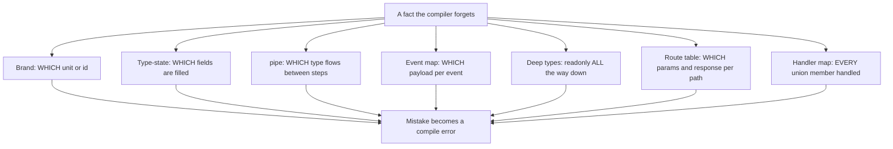
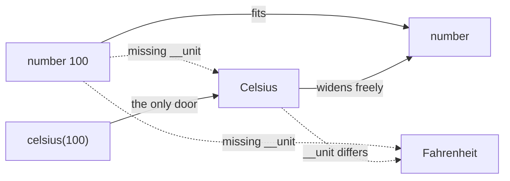
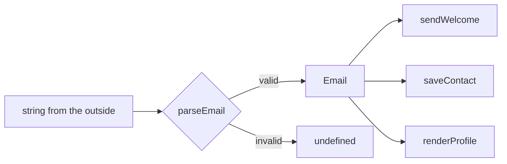
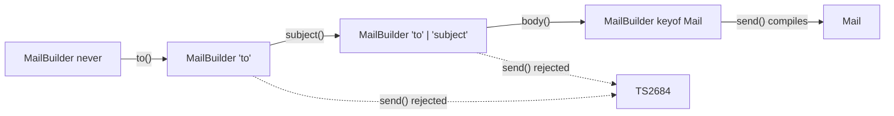
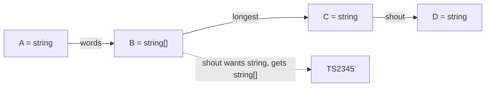
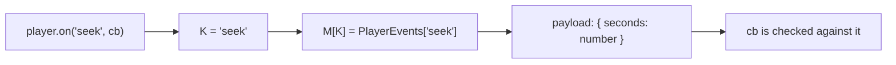
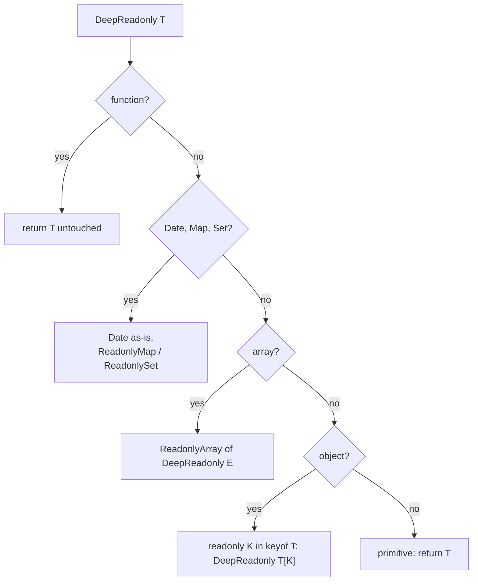
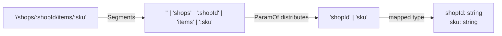
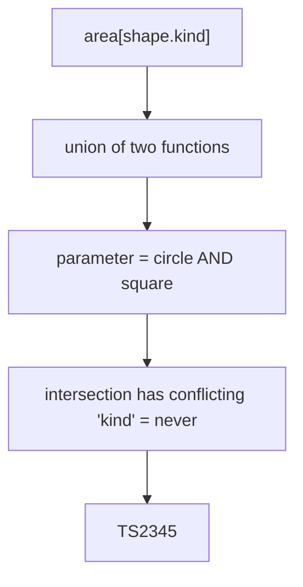

# 11 — Advanced Patterns

## Why this exists

TypeScript is structural: two types with the same shape are interchangeable,
even when they mean different things. `Meters` and `Seconds` are both just
`number`, so nothing stops you from dividing them the wrong way round. The
patterns in this module push a fact the compiler would otherwise forget —
a unit, a "which fields are filled in" checklist, an event's payload, a
complete list of states — *into the type system*, so a mistake becomes a
compile error instead of a 3 a.m. page.

## Map of this module

| Section | Prepares |
| --- | --- |
| Nominal vs structural, brands, `unique symbol`, parse-don't-validate, brands at runtime | ex01 |
| Builder with type-state, `this`-guarded `build()`, when a builder is overkill | ex02 |
| `pipe`/`compose` overloads, variadic tuples, HOF pitfalls | ex03 |
| Typed event emitter, listener storage, `once`/`void`/Node | ex04 |
| `DeepReadonly`/`DeepPartial`/`DeepRequired`, special cases, `Equal` | ex05 |
| Template-literal route params, route table, the return-boundary cast | ex06 |
| Exhaustive handler maps, `satisfies`, correlated unions, `Object.entries` | ex07 |
| `as const` enums, action factories, phantom state, `ThisType`, illegal states | checkpoint and beyond |

## One move, seven costumes



*What to notice: every pattern is the same move — encode intent as a type,
then let ordinary assignability do the policing.*

## Minimal syntax

```ts
type InvoiceId = string & { readonly __brand: 'InvoiceId' }
const invoiceId = (raw: string) => raw as InvoiceId   // the ONE cast

function refund(id: InvoiceId) {
  return `refunded ${id}`
}

refund(invoiceId('inv-42'))   // ✅
// ❌ error TS2345: Argument of type 'string' is not assignable to parameter of type 'InvoiceId'.
refund('inv-42')
```

A brand is a property that exists only in the type. At runtime `id` is still
a plain string — the whole cost is one cast in one constructor function.

### Brand by intersection with a phantom property

Structural typing asks "does the shape fit?", never "where did this come
from?". `charge(amountCents, customerNumber)` accepts its two numbers
swapped, and bills customer 4999 for 12.34. Languages with *nominal* types
(Java, C#) would reject that if the two were distinct types. TypeScript has
no nominal types — but you can fake one: intersect the primitive with an
object type whose property nobody will ever set. A plain `number` lacks the
property, so it no longer fits.

```ts
type Celsius = number & { readonly __unit: 'Celsius' }
type Fahrenheit = number & { readonly __unit: 'Fahrenheit' }

const celsius = (n: number) => n as Celsius
const fahrenheit = (n: number) => n as Fahrenheit

function toFahrenheit(c: Celsius): Fahrenheit {
  return fahrenheit((c * 9) / 5 + 32)   // arithmetic still works: Celsius IS a number
}

toFahrenheit(celsius(100))   // ✅
// ❌ error TS2345: Argument of type 'number' is not assignable to parameter of type 'Celsius'.
toFahrenheit(100)
// ❌ error TS2345: Argument of type 'Fahrenheit' is not assignable to parameter of type 'Celsius'.
toFahrenheit(fahrenheit(212))
```



*What to notice: a brand is a one-way door. Branded values flow OUT to
`number` for free (so `c * 9` works); raw numbers cannot flow IN.*

Gotcha: the phantom property is a string key, so anyone can *forge* it.
This compiles, and it should worry you:

```ts
type UserTag = string & { readonly __brand: 'UserTag' }

const forged = Object.assign('u1', { __brand: 'UserTag' as const })
const tag: UserTag = forged   // accepted — the shape matches
```

### `unique symbol` — the brand nobody can forge

Key the phantom property with a `unique symbol` that you never export.
Code outside the module cannot name the key, so it cannot build the shape.

```ts
declare const tag: unique symbol   // declare = type-only, nothing emitted

type Tagged<T, Name extends string> = T & { readonly [tag]: Name }

type OrderId = Tagged<string, 'OrderId'>
type CustomerId = Tagged<string, 'CustomerId'>

const orderId = (raw: string) => raw as OrderId
const customerId = (raw: string) => raw as CustomerId

function cancelOrder(id: OrderId) {
  return `cancelled ${id}`
}
cancelOrder(orderId('o-1'))
// ❌ error TS2345: Argument of type 'CustomerId' is not assignable to parameter of type 'OrderId'.
cancelOrder(customerId('c-1'))
```

`Tagged<T, Name>` is a reusable helper: one line per new brand. Brand
strings (`OrderId`, `Email`, `Slug`) as readily as numbers — mixed-up ids
are the most common bug brands catch.

### The third style: a `newtype` class

A class with a `private` member is nominal by construction — TypeScript
treats two classes with separate private declarations as different types,
even when their shapes match. The cost: a wrapper object at runtime.

```ts
class AccountId {
  private declare readonly nominal: void   // declare = no runtime field
  constructor(readonly value: string) {}
}
class LedgerId {
  private declare readonly nominal: void
  constructor(readonly value: string) {}
}

const a: AccountId = new AccountId('acc-1')
// ❌ error TS2322: Type 'LedgerId' is not assignable to type 'AccountId'.
const b: AccountId = new LedgerId('led-1')
// ❌ error TS2741: Property 'nominal' is missing in type '{ value: string; }' but required in type 'AccountId'.
const c: AccountId = { value: 'acc-2' }
```

| Style | Runtime cost | Forgeable? | Works with `===`, `Map` keys, JSON | Reach for it when |
| --- | --- | --- | --- | --- |
| `T & { __brand: 'X' }` | none | yes (string key) | yes — it is still the primitive | default; simple and readable |
| `T & { [uniqueSym]: 'X' }` | none | no (symbol is private to the module) | yes | library code, or when forgery matters |
| class with `private` field | one object per value | no | no — compare `.value`, serialize manually | you also want methods on the value |

### Where the one cast lives: parse, don't validate

The cast `as Email` is a lie the compiler accepts. Put it in exactly one
place — a function that *checks* the raw value first. Everything downstream
takes the brand and never checks again.

```ts
type Email = string & { readonly __brand: 'Email' }

function parseEmail(raw: string): Email | undefined {
  return /^[^@\s]+@[^@\s]+$/.test(raw) ? (raw as Email) : undefined
}

function sendWelcome(to: Email) {
  return `welcome, ${to}`
}

const input: string = 'ada@example.com'   // from a form, a file, a request
// ❌ error TS2345: Argument of type 'string' is not assignable to parameter of type 'Email'.
sendWelcome(input)

const email = parseEmail(input)   // Email | undefined
if (email) sendWelcome(email)     // ✅ validated once, trusted everywhere
```



*What to notice: validation happens at one boundary. The brand carries the
proof inward, so the three consumers cannot receive an unchecked string.*

Gotcha: `as Email` sprinkled through the codebase gives you the paperwork of
brands with none of the safety. Grep for the cast — there should be one hit.

### Brands at runtime, unbranding, and keys

Brands are erased. Runtime code sees the primitive.

```ts
type Sku = string & { readonly __brand: 'Sku' }
const sku = (raw: string) => raw as Sku

const s = sku('AB-1')
typeof s                        // 'string' — the brand is gone
JSON.stringify({ s })           // '{"s":"AB-1"}'

const plain: string = s         // unbranding is free: Sku extends string
type Unbrand<T> = T extends string ? string : T extends number ? number : T
type Raw = Unbrand<Sku>         // string

const stock: Record<Sku, number> = {}   // brands work as Record keys...
stock[sku('AB-1')] = 3
const count = stock[sku('AB-1')]        // number | undefined (noUncheckedIndexedAccess)

const prices = new Map<Sku, number>()   // ...and as Map keys
prices.set(sku('AB-1'), 999)
```

Gotcha: `if (typeof id === 'Sku')` can never work — there is nothing to
detect. A brand is compile-time intent, not runtime validation.

### Builder with type-state: the generic is a checklist

A builder collects fields step by step. The bug: calling `build()` before
every field is set. Fix: track the *set of supplied keys* in a generic
parameter, and let `build()` demand the full set.



*What to notice: each step adds one key to the union. Only the node whose
union equals `keyof Mail` may call `send()`. Order does not matter, only
completeness.*

```ts
interface Mail {
  to: string
  subject: string
  body: string
}

class MailBuilder<K extends keyof Mail = never> {
  // Pick<Mail, K> stores the checklist STRUCTURALLY — see the next section
  constructor(private readonly draft: Pick<Mail, K>) {}

  to(address: string): MailBuilder<K | 'to'> {
    return new MailBuilder<K | 'to'>({ ...this.draft, to: address } as Pick<Mail, K | 'to'>)
  }
  subject(text: string): MailBuilder<K | 'subject'> {
    return new MailBuilder<K | 'subject'>({ ...this.draft, subject: text } as Pick<Mail, K | 'subject'>)
  }
  body(text: string): MailBuilder<K | 'body'> {
    return new MailBuilder<K | 'body'>({ ...this.draft, body: text } as Pick<Mail, K | 'body'>)
  }

  // `this` parameter: callable only when K already covers every key
  send(this: MailBuilder<keyof Mail>): Mail {
    return { ...this.draft }
  }
}

const draft = new MailBuilder<never>({})
const mail = draft.to('ada@example.com').subject('hi').body('...').send()   // ✅ Mail

const half = draft.to('ada@example.com')
// ❌ error TS2684: The 'this' context of type 'MailBuilder<"to">' is not assignable to method's 'this' of type 'MailBuilder<keyof Mail>'.
half.send()
```

Three things to read closely: `= never` starts the chain with *no* keys;
`MailBuilder<K | 'to'>` grows the union by one key per step; and
`send(this: MailBuilder<keyof Mail>)` uses a `this` parameter (module 04 —
a fake first parameter, erased at runtime) as the gate. Each step returns a
**new** builder rather than mutating, so `half` keeps its narrow type even
after you call `.subject()` on it.

### Why `Pick<Mail, K>` — a generic that appears nowhere is invisible

Assignability is structural, and that applies to classes too. If `K` is
only used in method signatures that return `MailBuilder<...>`, two builders
with different `K` have the same *shape*, and the gate does not close.

```ts
class Loose<K extends string = never> {
  add<N extends string>(n: N): Loose<K | N> {
    return new Loose()
  }
  done(this: Loose<'a' | 'b'>) {}
}

new Loose().add('a').done()   // compiles! Loose<'a'> looks identical to Loose<'a' | 'b'>
```

Storing `Pick<Mail, K>` makes the checklist part of the object's shape:
`Pick<Mail, 'to'>` is missing `subject` and `body`, so
`MailBuilder<'to'>` is no longer assignable to `MailBuilder<keyof Mail>`.

The one cast in each step is also explained by structure. TypeScript sees
the spread as `Pick<Mail, K> & { to: string }` and cannot prove that equals
`Pick<Mail, K | 'to'>` for an unknown `K`:

```ts
interface Mail {
  to: string
  subject: string
}
class Builder<K extends keyof Mail = never> {
  constructor(private readonly draft: Pick<Mail, K>) {}
  to(address: string): Builder<K | 'to'> {
    // ❌ error TS2345: Argument of type 'Pick<Mail, K> & { to: string; }' is not assignable to parameter of type 'Pick<Mail, "to" | K>'.
    return new Builder<K | 'to'>({ ...this.draft, to: address })
  }
}
```

### When a builder is overkill

If all fields are known at one call site, an object parameter already gives
you exhaustiveness — a missing key is a TS2345 at the literal.

```ts
interface Mail { to: string; subject: string; body: string }
function send(mail: Mail) {
  return mail.to
}
// ❌ error TS2345: Argument of type '{ to: string; subject: string; }' is not assignable to parameter of type 'Mail'.
send({ to: 'ada@example.com', subject: 'hi' })
```

| Reach for | when |
| --- | --- |
| a required-args object | every field is known in one place |
| a type-state builder | fields arrive in different places or over time, or the fluent API *is* the product |
| a plain (untyped-state) builder | fields are all optional with defaults |

### `pipe` and `compose` via overloads

`pipe(f, g, h)` returns a function that runs `f`, feeds the result to `g`,
then to `h`. The type must flow *through*: `g`'s input is `f`'s output.
A single rest-parameter signature cannot express "each element depends on
its neighbour", so you write one overload per arity.

```ts
// The ladder: one overload per arity. Only the signatures are shown —
// ex03 has you write the ladder and the implementation underneath it.
declare function pipe<A, B>(ab: (a: A) => B): (a: A) => B
declare function pipe<A, B, C>(ab: (a: A) => B, bc: (b: B) => C): (a: A) => C
declare function pipe<A, B, C, D>(ab: (a: A) => B, bc: (b: B) => C, cd: (c: C) => D): (a: A) => D

const words = (s: string) => s.trim().split(/\s+/)
const longest = (ws: string[]) => ws.reduce((a, b) => (b.length > a.length ? b : a), '')
const shout = (w: string) => w.toUpperCase()

const headline = pipe(words, longest, shout)   // (a: string) => string

// ❌ error TS2345: Argument of type '(w: string) => string' is not assignable to parameter of type '(b: string[]) => string'.
pipe(words, shout, longest)
```



*What to notice: the overload names the type between every pair of
functions. A mismatch is reported at the function whose INPUT does not match
the previous OUTPUT.*

Why the implementation signature is loose: it sits *below* the overloads
and is invisible to callers. It only has to be compatible with each
overload, and `unknown -> unknown` is. The precision lives in the overloads.

`compose` is the same ladder read right-to-left — `compose(g, f)(x)` is
`g(f(x))`, mirroring math notation:

```ts
function compose<A, B>(ab: (a: A) => B): (a: A) => B
function compose<A, B, C>(bc: (b: B) => C, ab: (a: A) => B): (a: A) => C
function compose(...fns: Array<(x: unknown) => unknown>) {
  return (input: unknown) => fns.reduceRight((acc, fn) => fn(acc), input)
}

const count = (xs: string[]) => xs.length
const wordCount = compose(count, (s: string) => s.split(' '))   // (a: string) => number
```

### The variadic-tuple alternative

Since TS 4.0, variadic tuple types can *walk* a tuple of functions and check
every adjacent pair. The type is harder to read, but any arity works.

```ts
type AnyFn = (...args: any[]) => any

// Rebuild the tuple so each function's return feeds the next one's parameter.
type PipeArgs<F extends AnyFn[], Acc extends AnyFn[] = []> =
  F extends [(...args: infer A) => infer B]
    ? [...Acc, (...args: A) => B]
    : F extends [(...args: infer A) => any, ...infer Tail]
      ? Tail extends [(arg: infer B) => any, ...any[]]
        ? PipeArgs<Tail, [...Acc, (...args: A) => B]>
        : Acc
      : Acc

type LastReturn<F extends AnyFn[]> = F extends [...any[], (...args: any) => infer R] ? R : never

function pipeAll<F extends AnyFn[]>(
  ...fns: PipeArgs<F> extends F ? F : PipeArgs<F>
): (arg: Parameters<F[0]>[0]) => LastReturn<F> {
  return (arg) => {
    let acc: unknown = arg
    for (const fn of fns as AnyFn[]) acc = fn(acc)
    return acc as LastReturn<F>
  }
}

const check = pipeAll((s: string) => s.trim(), (s: string) => s.length, (n: number) => n > 3)
// check: (arg: string) => boolean

// ❌ error TS2345: Argument of type '(s: string) => number' is not assignable to parameter of type '(s: string) => string'.
pipeAll((s: string) => s.length, (s: string) => s.trim())
```

`PipeArgs<F> extends F ? F : PipeArgs<F>` is the trick: if the rebuilt
tuple matches what you passed, accept it; otherwise the *rebuilt* tuple
becomes the expected type. Unlimited arity, but the *previous* function
gets blamed and the type is hard to read — which is why fp-ts, Redux and
RxJS all ship overload ladders instead.

### `flow`, point-free style, and HOF pitfalls

Naming differs between libraries. In fp-ts, `pipe(value, f, g)` starts
with a *value* and returns a value (`pipeValue<A, B, C>(a: A, ab, bc): C` —
same overload ladder, one extra parameter in front); `flow(f, g)` starts
with functions and returns a function, which is what this module calls
`pipe`.

*Point-free* style passes functions by name instead of wrapping them in a
lambda: `names.map(shout)` instead of `names.map((n) => shout(n))`. It reads
well — and hides an arity trap that TypeScript cannot catch:

```ts
const nums = ['10', '10', '10'].map(parseInt)   // [10, NaN, 2] — map passes (value, index)
const fixed = ['10', '10', '10'].map((s) => parseInt(s, 10))
```

Two generic-inference pitfalls hit higher-order code constantly:

```ts
// 1. Literals widen in arrays: T becomes string, not 'draft' | 'sent'
function firstOf<T>(xs: T[]) {
  return xs[0]
}
const w = firstOf(['draft', 'sent'])          // string | undefined

// `const T` (TS 5.0) keeps the literals
function firstConst<const T>(xs: readonly T[]) {
  return xs[0]
}
const k = firstConst(['draft', 'sent'])       // 'draft' | 'sent' | undefined

// 2. Every argument is an inference site — TS unions them instead of erroring
function machine<S extends string>(initial: S, states: S[]) {
  return { initial, states }
}
machine('idle', ['running'])                  // compiles: S = 'idle' | 'running'

// NoInfer (TS 5.4) removes one site from inference, so it is CHECKED instead
function machineStrict<S extends string>(initial: NoInfer<S>, states: S[]) {
  return { initial, states }
}
// ❌ error TS2345: Argument of type '"idle"' is not assignable to parameter of type '"running"'.
machineStrict('idle', ['running'])
```

### Typed event emitter: the `EventMap`

An untyped emitter accepts any event name with any payload. The fix is an
interface that maps each event *name* to its *payload*, and methods that
are generic over the name.

```ts
interface PlayerEvents {
  play: { track: string }
  seek: { seconds: number }
  stop: void                     // no payload
}

type Listener<P> = (payload: P) => void

class Emitter<M> {
  private listeners: Partial<{ [K in keyof M]: Array<Listener<M[K]>> }> = {}

  on<K extends keyof M>(event: K, cb: Listener<M[K]>): () => void {
    const list = this.listeners[event] ?? []
    list.push(cb)
    this.listeners[event] = list
    return () => this.off(event, cb)   // unsubscribe function
  }

  off<K extends keyof M>(event: K, cb: Listener<M[K]>): void {
    const list = this.listeners[event]
    if (list) this.listeners[event] = list.filter((l) => l !== cb)
  }

  emit<K extends keyof M>(event: K, ...args: M[K] extends void ? [] : [payload: M[K]]): void {
    const payload = args[0] as M[K]
    this.listeners[event]?.forEach((l) => l(payload))
  }
}

const player = new Emitter<PlayerEvents>()
player.on('seek', (p) => p.seconds)          // p: { seconds: number }
player.emit('play', { track: 'intro.mp3' })
player.emit('stop')                          // void payload: no second argument

// ❌ error TS2345: Argument of type '{ seconds: number; }' is not assignable to parameter of type '{ track: string; }'.
player.emit('play', { seconds: 3 })
// ❌ error TS2345: Argument of type '"pause"' is not assignable to parameter of type 'keyof PlayerEvents'.
player.on('pause', () => {})
```



*What to notice: `K` is fixed per call, so `M[K]` resolves to ONE payload
type — the link between name and payload holds for the length of the call.*

The `...args: M[K] extends void ? [] : [payload: M[K]]` rest tuple makes
`emit('stop')` legal and `emit('stop', x)` illegal. A plain `payload: M[K]`
would demand `emit('stop', undefined)` (TS2554 otherwise).

### `once`, unsubscribe, and Node's `EventEmitter<T>`

Two conveniences fall out of the pattern. `on` returning an unsubscribe
function means callers never need to keep the callback around. `once` is a
listener that unsubscribes itself — and because `on` is public and precise,
it needs no access to the store:

```ts continue
class OnceEmitter<M> extends Emitter<M> {
  once<K extends keyof M>(event: K, cb: Listener<M[K]>): void {
    const stop = this.on(event, (payload) => {
      stop()
      cb(payload)
    })
  }
}

const deck = new OnceEmitter<PlayerEvents>()
deck.once('play', (p) => console.log('first track:', p.track))   // p: { track: string }
```

Node's built-in emitter is generic since `@types/node` 20. Its map uses a
*tuple of arguments* per event, because Node listeners take several
positional arguments:

```ts
import { EventEmitter } from 'node:events'

const jobs = new EventEmitter<{ progress: [percent: number]; done: [] }>()
jobs.on('progress', (percent) => percent.toFixed(0))   // percent: number
jobs.emit('progress', 50)
jobs.emit('done')
// ❌ error TS2345: Argument of type '[]' is not assignable to parameter of type 'never'.
jobs.emit('cancelled')
```

### Listener storage and the one local cast

The public surface is precise. Storage is the hard part: one container must
hold callbacks for *every* event at once.

| Store | Type | Casts needed |
| --- | --- | --- |
| mapped object (above) | `Partial<{ [K in keyof M]: Array<Listener<M[K]>> }>` | none — indexing with generic `K` keeps `M[K]` |
| `Map` | `Map<keyof M, Array<Listener<any>>>` | one `any` — a `Map` value type cannot depend on its key |

The `Map` version is common in the wild; the `any` is confined to a private
field and never leaks into `on`/`emit`:

```ts
class MapEmitter<M> {
  private store = new Map<keyof M, Array<(payload: any) => void>>()   // the one loose type

  on<K extends keyof M>(event: K, cb: (payload: M[K]) => void): void {
    const list = this.store.get(event) ?? []
    list.push(cb)
    this.store.set(event, list)
  }
  emit<K extends keyof M>(event: K, payload: M[K]): void {
    this.store.get(event)?.forEach((cb) => cb(payload))
  }
}
```

Gotcha: `M[K]` only stays precise while `K` is a *generic* in scope. Once
you index with the widened `keyof M`, TypeScript sees the union of all
payloads — and a callback taking the union of all payloads is not what
anyone stored. That is why the loose type lives in the store, not the API.

### Deep utility types: `DeepReadonly`, `DeepPartial`, `DeepRequired`

`Readonly<T>` and `Partial<T>` stop at the first level — `config.ui.theme`
is still writable under `Readonly<Config>`. A recursive conditional type
goes all the way down. Three branches must come *before* the generic
`object` branch:



*What to notice: order matters because every branch is a subtype of
`object`. Arrays, functions, `Date` and `Map` are all objects; the generic
branch would catch them first and mangle them.*

```ts
// The worked example strips readonly all the way down. DeepReadonly and
// DeepPartial (ex05) use the SAME branch order with different modifiers.
interface Snapshot {
  readonly number: string
  readonly lines: ReadonlyArray<{ readonly sku: string; readonly qty: number }>
  readonly customer: { readonly name: string; readonly vip: boolean }
  readonly issued: Date
  readonly tags: ReadonlySet<string>
  total(): number
}

type DeepMutable<T> =
  T extends (...args: any[]) => any ? T
  : T extends Date ? T
  : T extends ReadonlyMap<infer K, infer V> ? Map<DeepMutable<K>, DeepMutable<V>>
  : T extends ReadonlySet<infer E> ? Set<DeepMutable<E>>
  : T extends ReadonlyArray<infer E> ? Array<DeepMutable<E>>
  : T extends object ? { -readonly [K in keyof T]: DeepMutable<T[K]> }
  : T

declare const locked: Snapshot
// ❌ error TS2540: Cannot assign to 'name' because it is a read-only property.
locked.customer.name = 'Ada'
// ❌ error TS2339: Property 'push' does not exist on type 'readonly { readonly sku: string; readonly qty: number; }[]'.
locked.lines.push({ sku: 'x', qty: 1 })

declare const draft: DeepMutable<Snapshot>
draft.customer.name = 'Ada'                 // ✅ writable all the way down
draft.lines.push({ sku: 'x', qty: 1 })      // ✅ a real Array again
draft.tags.add('rush')                      // ✅ Set, not ReadonlySet
draft.total()                               // ✅ the method passed through untouched
draft.issued.getTime()                      // ✅ Date left alone
```

What goes wrong without the early exits — a *naive* version mangles
functions, dates and arrays:

```ts
type Naive<T> = T extends object ? { -readonly [K in keyof T]: Naive<T[K]> } : T
type NaivePartial<T> = T extends object ? { [K in keyof T]?: NaivePartial<T[K]> } : T

declare const fn: Naive<() => number>
// ❌ error TS2349: This expression is not callable.
fn()
declare const when: Naive<Date>
// ❌ error TS2339: Property 'getTime' does not exist on type 'Naive<Date>'.
when.getTime()
declare const tags: NaivePartial<string[]>
// ❌ error TS2322: Type '(string | undefined)[]' is not assignable to type 'string[]'.
const plain: string[] = tags
```

The array case is subtle. A homomorphic mapped type over a type parameter
*does* keep array-ness (`readonly string[]` comes out right), but the `?`
modifier leaks `undefined` into every element. Handle arrays explicitly
and you never depend on that rule.

Gotcha (`exactOptionalPropertyTypes`): `DeepPartial` produces `theme?:`
keys. Writing `{ theme: undefined }` is a TS2375 — omit the key instead.

The runtime companions are shallow too. `Object.freeze` returns
`Readonly<T>` and freezes one level; a deep freeze recurses and returns
`DeepReadonly<T>` (one cast at the return, since `freeze` cannot know you
recursed). A deep merge takes `(base: T, patch: DeepPartial<T>): T` and
must check `Array.isArray` before "is it an object?" — arrays *replace*,
plain objects *merge*.

```ts
const cfg = Object.freeze({ ui: { theme: 'dark' } })
// ❌ error TS2540: Cannot assign to 'ui' because it is a read-only property.
cfg.ui = { theme: 'light' }
cfg.ui.theme = 'light'   // compiles, and works at runtime — both the type and the freeze are shallow
```

### Testing deep types with `Equal`, displaying them with `Prettify`

Deep types are easy to get subtly wrong. Assert them at the type level with
the `Equal` helper from type-challenges (module 08) — a wrong type is a
compile error, not a silent pass:

```ts
type Equal<X, Y> = (<T>() => T extends X ? 1 : 2) extends (<T>() => T extends Y ? 1 : 2) ? true : false
type Expect<T extends true> = T

type DeepMutable<T> =
  T extends (...args: any[]) => any ? T
  : T extends ReadonlyArray<infer E> ? Array<DeepMutable<E>>
  : T extends object ? { -readonly [K in keyof T]: DeepMutable<T[K]> }
  : T

type _ok = Expect<Equal<DeepMutable<{ readonly a: { readonly b: readonly number[] } }>, { a: { b: number[] } }>>
// ❌ error TS2344: Type 'false' does not satisfy the constraint 'true'.
type _shallow = Expect<Equal<DeepMutable<{ readonly a: { readonly b: number } }>, { a: { readonly b: number } }>>

// Hovering a deep type shows `DeepMutable<Snapshot>`; Prettify forces it to expand
type Prettify<T> = { [K in keyof T]: T[K] } & {}
type Shown = Prettify<DeepMutable<{ readonly a: { readonly b: number } }>>   // { a: DeepMutable<{ readonly b: number }> }
```

Recursion has limits. A conditional type that recurses *inside* another
type constructor stops around depth 50; a *tail* call (the recursion is the
whole branch result) gets 1000 iterations:

```ts
type Wrapped<N extends number, A extends unknown[] = []> =
  A['length'] extends N ? A : [...Wrapped<N, [...A, 1]>]
// ❌ error TS2589: Type instantiation is excessively deep and possibly infinite.
type Deep = Wrapped<60>

type Tail<N extends number, A extends unknown[] = []> =
  A['length'] extends N ? A : Tail<N, [...A, 1]>
type Fine = Tail<999>          // ✅ tail-recursive, well within the limit
```

Real data rarely nests 50 levels, so `DeepReadonly` is safe on models. It
is not safe on *recursive* types like a JSON tree — add an explicit
`T extends JsonValue ? T : ...` exit before you find out.

### Template-literal route params: parsing `:id` out of a path

A route path like `'/shops/:shopId/items/:sku'` *contains* its parameter
names. Template-literal types with `infer` can read them out, so the
compiler knows which params a call must supply.

```ts
// Split on '/', keeping every piece as a union member
type Segments<P extends string> =
  P extends `${infer Head}/${infer Tail}` ? Head | Segments<Tail> : P

// Keep only the pieces that start with ':' — distributes over the union
type ParamOf<S extends string> = S extends `:${infer Name}` ? Name : never

type ParamNames<P extends string> = ParamOf<Segments<P>>
type Params<P extends string> = { [K in ParamNames<P>]: string }

type ItemNames = ParamNames<'/shops/:shopId/items/:sku'>   // 'shopId' | 'sku'
type ItemParams = Params<'/shops/:shopId/items/:sku'>     // { shopId: string; sku: string }
type NoParams = Params<'/status'>                         // {}
```



*What to notice: the parse is two small types, not one clever one. Split,
then filter, then build — each step is testable on its own.*

Another strategy skips the split: match `${string}:${infer Name}/${infer Rest}`
(a param followed by more path) and recurse on `` `/${Rest}` ``, then match a
trailing `${string}:${infer Name}`. The pattern's literal `/` *consumes* the
slash after the param, so re-prefixing `/` hands the next round a string
that is still shaped like a path. Both work; pick the one you can read back.

Gotcha: `${infer Head}/${infer Tail}` is *lazy* on `Head` — it matches the
shortest possible prefix, so the split happens at the first `/`. That is
what makes recursion on `Tail` walk the path left to right.

### A route table and a client that infers the response

Pair the parser with an interface mapping each path to its response type.
A generic `K extends keyof Routes` then pins path, params and response
together in a single call:

```ts
type Segments<P extends string> = P extends `${infer Head}/${infer Tail}` ? Head | Segments<Tail> : P
type ParamOf<S extends string> = S extends `:${infer Name}` ? Name : never
type ParamNames<P extends string> = ParamOf<Segments<P>>
type Params<P extends string> = { [K in ParamNames<P>]: string }

interface Catalog {
  '/shops/:shopId': { name: string; open: boolean }
  '/shops/:shopId/items/:sku': { sku: string; price: number }
  '/status': { up: boolean }
}

type Fetcher = (url: string) => Promise<unknown>

function createClient<R>(fetcher: Fetcher) {
  return {
    get<K extends keyof R & string>(path: K, params: Params<K>): Promise<R[K]> {
      const url = path.replace(/:(\w+)/g, (_, name: string) => params[name as ParamNames<K>])
      return fetcher(url) as Promise<R[K]>   // the cast at the generic return boundary
    },
  }
}

const api = createClient<Catalog>(async (url) => ({ url }))

async function demo() {
  const item = await api.get('/shops/:shopId/items/:sku', { shopId: '7', sku: 'AB-1' })
  item.price                                     // number — inferred from the route key
  // ❌ error TS2345: Argument of type '{}' is not assignable to parameter of type 'Params<"/shops/:shopId">'.
  await api.get('/shops/:shopId', {})
  // ❌ error TS2345: Argument of type '"/nope"' is not assignable to parameter of type '"/shops/:shopId/items/:sku" | "/status" | "/shops/:shopId"'.
  await api.get('/nope', {})
}
```

Why the cast is normal here: `fetcher` returns `Promise<unknown>` because
the network returns *bytes*. The cast says "I trust the server to honour
the table". That is a *trust boundary*, the same kind as `as Email` — one
place, clearly marked. If you cannot trust the server, validate with a
schema (module 12, zod) and drop the cast.

Query strings parse the same way — split on `&`, then on `=`:

```ts
type QueryKeys<S extends string> =
  S extends `${infer K}=${string}&${infer Rest}` ? K | QueryKeys<Rest>
  : S extends `${infer K}=${string}` ? K
  : never

type PageKeys = QueryKeys<'page=1&limit=20'>   // 'page' | 'limit'
```

### Exhaustive handler maps: `Record<Union, Handler>` vs `switch`

Two ways to handle every member of a union. Both are exhaustive; they
report a missing member in different places.

```ts
type Light = 'red' | 'green' | 'yellow'

function assertNever(x: never): never {
  throw new Error(`unexpected ${String(x)}`)
}

function nextBySwitch(light: Light): Light {
  switch (light) {
    case 'red': return 'green'
    case 'green': return 'yellow'
    // ❌ error TS2345: Argument of type '"yellow"' is not assignable to parameter of type 'never'.
    default: return assertNever(light)
  }
}

// ❌ error TS2741: Property 'yellow' is missing in type '{ red: "green"; green: "yellow"; }' but required in type 'Record<Light, Light>'.
const NEXT: Record<Light, Light> = { red: 'green', green: 'yellow' }
```

| | `switch` + `assertNever` | `Record<Union, Handler>` |
| --- | --- | --- |
| Missing member caught | at the `default` branch | at the object literal |
| Error location | inside the function, on `assertNever` | right where the handlers live |
| Handlers are data | no | yes — pass, spread, test, serialise |
| Handler types can differ per key | yes, naturally | needs `satisfies` (next section) |
| Runtime guard when `x` is not in the union | throws | `undefined` handler — add a check if inputs are untrusted |
| Fits when | logic is control flow | logic is a table (state machines, dispatch, labels) |

A handler map with one shared signature dispatches with no cast, because
every value in the map has the same type:

```ts
type Channel = 'email' | 'sms' | 'push'

const deliver: Record<Channel, (msg: string) => string> = {
  email: (msg) => `mail: ${msg}`,
  sms: (msg) => msg.slice(0, 160),
  push: (msg) => `push: ${msg}`,
}

function notify(channel: Channel, msg: string) {
  return deliver[channel](msg)   // ✅ union of identical function types
}
```

Gotcha: `deliver[channel]` is *not* `T | undefined` here even with
`noUncheckedIndexedAccess` — `Record<Channel, ...>` has three known keys,
not an index signature. It would be `| undefined` for `Record<string, ...>`.

### `satisfies` keeps literal handler types

Annotating with `Record<...>` *replaces* the literal's inferred type with
the annotation. `satisfies` checks against it but keeps what you wrote —
so a handler that ignores its argument stays `() => number`. Combine it
with `as const` and string values keep their literal types too.

```ts
type PaymentMethod = 'card' | 'cash'

const feeAnnotated: Record<PaymentMethod, (amount: number) => number> = {
  card: (amount) => amount * 0.03,
  cash: () => 0,
}
// ❌ error TS2322: Type '(amount: number) => number' is not assignable to type '() => number'.
const zeroA: () => number = feeAnnotated.cash

const fee = {
  card: (amount: number) => amount * 0.03,
  cash: () => 0,
} satisfies Record<PaymentMethod, (amount: number) => number>
const zero: () => number = fee.cash   // ✅ literal type kept

const label = { card: 'Card', cash: 'Cash' } as const satisfies Record<PaymentMethod, string>
const l: 'Card' = label.card          // ✅ literal kept — without `as const` it widens to string
```

Both forms fail to compile when a `PaymentMethod` is missing from the
literal — `satisfies` gives up nothing on exhaustiveness.

### The correlated-union problem when dispatching

When handlers take *different* argument types (one per union member), the
map is a union of functions. Calling a union of functions requires an
argument that satisfies *all* of them — the intersection — which collapses
to `never`:

```ts
type Shape = { kind: 'circle'; r: number } | { kind: 'square'; side: number }

const area = {
  circle: (s: Extract<Shape, { kind: 'circle' }>) => Math.PI * s.r ** 2,
  square: (s: Extract<Shape, { kind: 'square' }>) => s.side ** 2,
}

function areaOf(shape: Shape) {
  // ❌ error TS2345: Argument of type 'Shape' is not assignable to parameter of type 'never'.
  return area[shape.kind](shape)
}
```

TypeScript does not *correlate* `shape.kind` with `shape` — it sees the
union `'circle' | 'square'` on one side and the union `Shape` on the
other, and cannot prove they match member for member.



*What to notice: nothing is wrong with your map. The loss happens the moment
`shape.kind` is read as a plain union instead of "the kind of THIS shape".*

Two fixes. The pragmatic one is a single cast at the dispatch site
(`(area[shape.kind] as (s: Shape) => number)(shape)`). The principled one
(TS 4.6+) derives both the union and the map from one lookup type, and
keeps the discriminant generic:

```ts
type ShapeMap = { circle: { r: number }; square: { side: number } }

type Shape<K extends keyof ShapeMap = keyof ShapeMap> = { [P in K]: { kind: P } & ShapeMap[P] }[K]

const area: { [K in keyof ShapeMap]: (s: ShapeMap[K]) => number } = {
  circle: (s) => Math.PI * s.r ** 2,
  square: (s) => s.side ** 2,
}

function areaOf<K extends keyof ShapeMap>(shape: Shape<K>) {
  return area[shape.kind](shape)   // ✅ K ties the key to the argument
}
areaOf({ kind: 'circle', r: 2 })
```

Because `K` stays generic inside `areaOf`, `area[shape.kind]` has type
`(s: ShapeMap[K]) => number` and `shape` is `{ kind: K } & ShapeMap[K]` —
the same `K` on both sides, so the call checks.

### `Object.keys` / `Object.entries` helpers

`Object.keys(obj)` returns `string[]`, not `(keyof T)[]`, because the object
may carry extra keys at runtime (structural typing again). When you *own*
the object and know it is exact — a handler map, an `as const` table —
a typed helper is reasonable:

```ts
function typedKeys<T extends object>(obj: T) {
  return Object.keys(obj) as Array<keyof T>
}
function typedEntries<T extends object>(obj: T) {
  return Object.entries(obj) as Array<[keyof T, T[keyof T]]>
}

const limits = { free: 10, pro: 100, team: 1000 } as const
for (const [plan, limit] of typedEntries(limits)) {
  plan    // 'free' | 'pro' | 'team'
  limit   // 10 | 100 | 1000
}
```

Gotcha: the cast is a promise. `typedKeys(someSubclassInstance)` will list
keys your type never mentioned. Use it on data you constructed yourself.

### `as const` objects as enums, and action factories

A frozen object literal plus two `typeof` lookups gives you an enum with
none of `enum`'s quirks: plain values, tree-shakeable, and a derived union.

```ts
const Priority = { low: 0, normal: 1, high: 2 } as const

type Priority = (typeof Priority)[keyof typeof Priority]   // 0 | 1 | 2
type PriorityName = keyof typeof Priority                   // 'low' | 'normal' | 'high'

const p: Priority = Priority.high
// ❌ error TS2322: Type '3' is not assignable to type 'Priority'.
const q: Priority = 3

const settings = Object.freeze({ mode: 'fast', retries: 3 } as const)   // frozen at runtime AND type
```

`keyof typeof X` reads "the keys of the type of the value X" — the pattern
for looking up any runtime table at the type level.

A *discriminated-union factory* builds one union member from its tag,
using `Extract` to pick the member and `Omit` to strip the tag from the
payload:

```ts
type Action =
  | { type: 'add'; text: string }
  | { type: 'remove'; id: number }

function createAction<T extends Action['type']>(
  type: T,
  payload: Omit<Extract<Action, { type: T }>, 'type'>,
): Extract<Action, { type: T }> {
  return { type, ...payload } as Extract<Action, { type: T }>
}

const add = createAction('add', { text: 'buy milk' })   // { type: 'add'; text: string }
// ❌ error TS2353: Object literal may only specify known properties, and 'id' does not exist in type 'Omit<{ type: "add"; text: string; }, "type">'.
createAction('add', { id: 1 })
```

The cast is the same "generic return boundary" as in the API client: TS
cannot prove `{ type: T, ...Omit<X, 'type'> }` equals `X` for an abstract
`T`.

### Phantom state in generics, and `ThisType<T>`

The builder tracked *keys*. A phantom type parameter can track any
*state* — a query that must be sent before rows are read, a connection
that must be opened before use. Same recipe: a generic that appears in the
class body (a `declare` field costs nothing at runtime) and `this`-guarded
methods.

```ts
type QueryState = 'building' | 'sent'

class Query<S extends QueryState = 'building'> {
  private declare readonly state: S   // phantom — makes S part of the shape
  constructor(private readonly sql: string) {}

  where(clause: string): Query<'building'> {
    return new Query(`${this.sql} where ${clause}`)
  }
  send(this: Query<'building'>): Query<'sent'> {
    return new Query<'sent'>(this.sql)
  }
  rows(this: Query<'sent'>): string[] {
    return [this.sql]
  }
}

new Query('select 1').where('id = 1').send().rows()   // ✅
// ❌ error TS2684: The 'this' context of type 'Query<"building">' is not assignable to method's 'this' of type 'Query<"sent">'.
new Query('select 1').rows()
```

`ThisType<T>` is a marker interface with no members. Inside an object
literal whose contextual type includes `ThisType<T>`, `this` is `T` — the
tool for fluent object-literal APIs (Vue's options API uses it):

```ts
function makeObject<D, M>(desc: { data: D; methods: M & ThisType<D & M> }): D & M {
  return { ...desc.data, ...desc.methods } as D & M
}

const counter = makeObject({
  data: { count: 0 },
  methods: {
    inc() {
      this.count++          // this: { count: number } & { inc(): void } — no noImplicitThis error
    },
  },
})
counter.inc()
```

### Tagged templates, illegal states, overloads vs conditional returns

A tagged template function receives the literal strings and the
interpolated values separately — so you can type what may be interpolated:

```ts
function sql(strings: TemplateStringsArray, ...values: Array<string | number>) {
  return strings.raw.join('?') + ` -- ${values.length} params`
}

sql`select * from orders where id = ${7} and status = ${'paid'}`   // ✅
// ❌ error TS2345: Argument of type 'Date' is not assignable to parameter of type 'string | number'.
sql`select * from orders where issued > ${new Date()}`
```

**Make illegal states unrepresentable.** Every pattern in this module is an
instance of this rule. The cheapest form is choosing a union over optional
flags:

```ts
interface Report {
  title: string
}

// loading + data + error can all be set at once — 8 combinations, 3 valid
interface LoadFlags {
  loading: boolean
  report?: Report
  error?: Error
}

// exactly 3 states, each carrying only what it needs
type LoadState =
  | { status: 'loading' }
  | { status: 'done'; report: Report }
  | { status: 'failed'; error: Error }

function title(s: LoadState) {
  return s.status === 'done' ? s.report.title : s.status   // no "is report defined?" dance
}
```

When a return type depends on an argument, you can use overloads or a
conditional return type. Both are fluent-developer tools; they trade off
differently:

```ts
interface Report {
  title: string
}

// overloads: each case is a plain signature, implementation is loosely typed
function load(id: string): Promise<Report>
function load(id: string, sync: true): Report
function load(id: string, sync?: true): Report | Promise<Report> {
  const report = { title: id }
  return sync ? report : Promise.resolve(report)
}

// conditional return: one signature, but the body must cast
function loadC<S extends boolean = false>(id: string, sync?: S): S extends true ? Report : Promise<Report> {
  const report = { title: id }
  return (sync ? report : Promise.resolve(report)) as S extends true ? Report : Promise<Report>
}

const a: Promise<Report> = load('r1')
const b: Report = loadC('r1', true)
```

| | overloads | conditional return type |
| --- | --- | --- |
| Readable in hover / docs | each case listed | one dense signature |
| Works when the argument is a *union* | no — picks the first matching overload | yes — distributes |
| Implementation body | checked loosely, no cast | needs a cast (TS cannot narrow the conditional) |
| Reach for | a handful of concrete cases | the result must track a generic through |

### Reading the compiler's errors

| Error | What it is telling you | Where in this module |
| --- | --- | --- |
| TS2345 `'number' is not assignable to parameter of type 'Celsius'` | a raw value hit a branded parameter — go through the constructor | brands |
| TS2322 `Type 'number' is not assignable to type 'Celsius'` | same, at an assignment or return | brands |
| TS2684 `The 'this' context of type 'X<"to">' is not assignable to method's 'this' of type 'X<keyof Mail>'` | a `this`-guarded method was called before the state was complete | builder, phantom state |
| TS2345 `Argument of type 'Pick<Mail, K> & {...}' is not assignable to 'Pick<Mail, "to" \| K>'` | TS cannot relate a spread to a generic `Pick` — one cast on the spread | builder |
| TS2345 on a `pipe` argument | function *n*'s input does not match function *n-1*'s output | pipe |
| TS2554 `Expected 2 arguments, but got 1` on `emit` | a `void` payload without the rest-tuple trick | emitter |
| TS2345 `...is not assignable to parameter of type 'never'` on `handlers[x.kind](x)` | the correlated-union problem — cast, or the `K`-generic shape | handler maps |
| TS2741 `Property 'yellow' is missing in type ...` on a `Record` literal | your handler map is not exhaustive — usually a union member was just added | handler maps |
| TS2589 `Type instantiation is excessively deep and possibly infinite` | a recursive type hit the depth limit — make it tail-recursive or add an exit | deep types |
| TS2536 `Type 'K' cannot be used to index type 'M'` | `K` is not constrained to `keyof M` — add `K extends keyof M` | emitter, route table |
| TS2344 `Type 'false' does not satisfy the constraint 'true'` | an `Expect<Equal<...>>` assertion failed — the types differ | testing deep types |

## Mental model

- **Brand** = one constructor, one cast, erased at runtime.
- **Type-state** = a generic that must appear in the body (`Pick`,
  `declare` field) plus a `this` parameter as the gate.
- **pipe** = overloads name the type between every neighbour; the
  implementation signature is loose on purpose.
- **Event map** = `K extends keyof M` ties name to payload per call; storage
  either keeps `M[K]` via a mapped object or hides one `any`.
- **Deep types** = functions, `Date`/`Map`/`Set`, arrays, *then* `object`.
- **Route table** = template-literal parse + `keyof Routes` generic; one
  trust-boundary cast at `return`.
- **Handler map** = exhaustive at the literal; `satisfies` keeps literals;
  differing handler signatures need `K` or a cast to dispatch.

## Common gotchas

- Brands are erased at runtime — `typeof id` is still `'string'`. The cast
  belongs in ONE constructor function, nowhere else.
- A builder generic that appears nowhere in the class body is ignored by
  assignability — store `Pick<Config, K>` so the type-state is structural.
- `DeepReadonly` without a function-type early-exit will mangle methods into
  `{ readonly ... }` objects; test arrays before `object` (arrays are objects),
  and give `Date`/`Map`/`Set` their own branches.
- `M[K]` lookups only stay precise inside generic signatures — once you index
  a listener store with a union key you'll need a local cast.
- Dispatching from a handler map (`handlers[shape.kind](shape)`) needs a cast
  or a generic `K` when handler signatures differ: TS can't correlate the key
  union with the argument union.
- `NoInfer` and `const T` are opt-in. Without them, TS unions inference
  candidates and widens literals — silently.
- `noUncheckedIndexedAccess` applies to index signatures (`Record<string, T>`,
  `Map#get`), not to `Record<'a' | 'b', T>` with known keys.

## Try it now

→ `exercises/ex01.ts` through `ex07.ts`, then `checkpoint.ts`.
Check with `npm test -- 11`.
