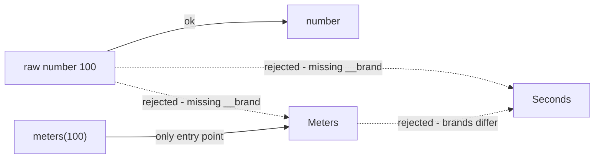
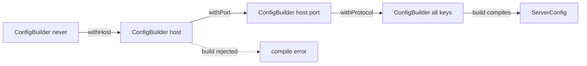

# 11 — Advanced Patterns

## Why this exists

TypeScript is structural: two types with the same shape are interchangeable,
even when they mean different things (`Meters` and `Seconds` are both just
`number`). The patterns in this module encode *intent* into types, so the
compiler rejects mixed-up ids, half-built objects, wrong event payloads, and
forgotten union members.

## Branded (nominal) types

A brand is a phantom property that exists only at the type level. It makes a
structural type behave nominally: only values that went through your
constructor function count.



*What to notice: a plain `number` fits neither brand, and the two brands
don't fit each other — swapping distance and time is now a compile error.*

```ts
type Meters = number & { readonly __brand: 'Meters' }
type Seconds = number & { readonly __brand: 'Seconds' }

const meters = (n: number) => n as Meters // one cast, at the boundary

function speed(distance: Meters, time: Seconds): number {
  return distance / time // brands are still numbers at runtime
}
```

## Builder with type-state

Track which fields have been supplied in a generic parameter. Each `.with*()`
returns the builder with one more key added; `.build()` uses a `this`
parameter that only accepts the fully-supplied builder.



*What to notice: the generic parameter is a checklist. `build()` demands the
full checklist, so an incomplete chain can't even compile.*

```ts
class ConfigBuilder<K extends keyof ServerConfig = never> {
  constructor(private readonly data: Pick<ServerConfig, K>) {}
  withHost(host: string): ConfigBuilder<K | 'host'> { /* ... */ }
  build(this: ConfigBuilder<keyof ServerConfig>): ServerConfig { /* ... */ }
}
```

## `pipe` — composition typed end to end

Overloads chain the types: the output of each function must feed the next.

```ts
function pipe<A, B>(ab: (a: A) => B): (a: A) => B
function pipe<A, B, C>(ab: (a: A) => B, bc: (b: B) => C): (a: A) => C
// ...one overload per arity; loose implementation signature below them
```

## Typed event emitter

An `EventMap` interface maps event names to payload types. Generic methods
look the payload up per call:

```ts
interface AppEvents { login: { userId: string } }

class TypedEmitter<M> {
  on<K extends keyof M>(event: K, cb: (payload: M[K]) => void): void { /* ... */ }
  emit<K extends keyof M>(event: K, payload: M[K]): void { /* ... */ }
}
```

## Recursive mapped types

`Readonly<T>` and `Partial<T>` are shallow. Recurse yourself — but pass
functions through untouched and handle arrays before `object`:

```ts
type DeepReadonly<T> = T extends (...args: any[]) => any ? T
  : T extends ReadonlyArray<infer E> ? readonly DeepReadonly<E>[]
  : T extends object ? { readonly [K in keyof T]: DeepReadonly<T[K]> }
  : T
```

## Template-literal route params

A template-literal type can *parse* a path string and extract its `:params`:

```ts
type ParamNames<P extends string> =
  P extends `${string}:${infer Name}/${infer Rest}` ? Name | ParamNames<`/${Rest}`>
  : P extends `${string}:${infer Name}` ? Name
  : never
// ParamNames<'/users/:id/posts/:postId'> -> 'id' | 'postId'
```

A route table (`path -> response type`) plus a generic `request<K>` then
infers the response type from the route key alone.

## Exhaustive handler maps

| | `switch` + `assertNever` | `Record<State, handler>` |
| --- | --- | --- |
| Missing case caught | at the `default` | at the object literal |
| Error location | inside the function | right where handlers live |
| Handlers are data | ❌ | ✅ (can pass around, spread) |

```ts
const labels: Record<OrderState, string> = {
  pending: '…', paid: '…', shipped: '…', delivered: '…',
} // add a state to the union -> this literal stops compiling
```

## Common gotchas

- Brands are erased at runtime — `typeof id` is still `'string'`. The cast
  belongs in ONE constructor function, nowhere else.
- A builder generic that appears nowhere in the class body is ignored by
  assignability — store `Pick<Config, K>` so the type-state is structural.
- `DeepReadonly` without a function-type early-exit will mangle methods into
  `{ readonly ... }` objects; test arrays before `object` (arrays are objects).
- `M[K]` lookups only stay precise inside generic signatures — once you index
  a listener store with a union key you'll need a local cast.
- Dispatching from a handler map (`handlers[shape.kind](shape)`) needs a cast:
  TS can't correlate the key union with the argument union.

## Try it now

→ `exercises/ex01.ts` through `ex07.ts`, then `checkpoint.ts`.
Check with `npm test -- 11`.
