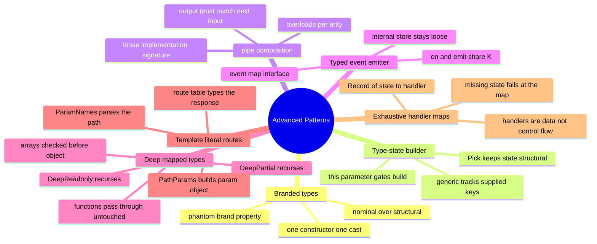

# 11 — Advanced Patterns · Cheat-sheet

## Concept map



*What to notice: every branch is the same move — push a fact the compiler
would otherwise forget (a brand, a supplied-keys checklist, a payload type,
a full state list) into the type system so a mistake becomes a compile
error instead of a runtime one.*

## Key syntax

```ts
// brand
type Meters = number & { readonly __brand: 'Meters' }

// type-state builder
class Builder<K extends keyof T = never> {
  constructor(private data: Pick<T, K>) {}
  with<Key extends keyof T>(k: Key, v: T[Key]): Builder<K | Key> { /* ... */ }
  build(this: Builder<keyof T>): T { return { ...this.data } as T }
}

// pipe overloads
function pipe<A, B>(ab: (a: A) => B): (a: A) => B
function pipe<A, B, C>(ab: (a: A) => B, bc: (b: B) => C): (a: A) => C

// event map
class Emitter<M> {
  on<K extends keyof M>(e: K, cb: (p: M[K]) => void): void { /* ... */ }
  emit<K extends keyof M>(e: K, p: M[K]): void { /* ... */ }
}

// deep mapped type
type DeepReadonly<T> = T extends (...a: any[]) => any ? T
  : T extends ReadonlyArray<infer E> ? readonly DeepReadonly<E>[]
  : T extends object ? { readonly [K in keyof T]: DeepReadonly<T[K]> }
  : T

// template-literal params
type ParamNames<P extends string> =
  P extends `${string}:${infer N}/${infer R}` ? N | ParamNames<`/${R}`>
  : P extends `${string}:${infer N}` ? N
  : never

// exhaustive handler map
const TRANSITIONS: Record<State, (e: Event) => State> = { /* every state, or it won't compile */ }
```

## Rules to remember

- A brand cast (`as Meters`) lives in exactly ONE constructor function —
  every other place just uses the branded type.
- A builder's type-state generic must be stored somewhere in the class
  (e.g. `Pick<T, K>`) or it's invisible to assignability and does nothing.
- `pipe` overloads chain types positionally: function *n*'s input must
  equal function *n-1*'s output; only the loose implementation signature
  goes below all the overloads.
- An event map's `K extends keyof M` ties `on`/`emit`'s payload type to the
  event name for that ONE call — the internal store can't keep that link,
  so it's typed loosely on purpose.
- Recursive mapped types need a function early-exit and must check arrays
  BEFORE the generic `object` branch (arrays are objects too).
- `Record<State, handler>` fails to compile the moment a state is missing
  a handler — no `default` branch to forget.

## Gotchas

- Brands are erased at runtime; `typeof meters(1)` is `'number'`. Don't
  rely on brands for runtime validation — only for compile-time intent.
- `noUncheckedIndexedAccess` means `Map#get` and `arr[i]` return
  `T | undefined` even when you "know" the key exists — narrow or use `??`.
- `M[K]` lookups stay precise only inside a generic signature; once a
  value is stored under a widened `keyof M` key, reading it back needs a
  local cast (contained to the implementation, not the public API).
- `exactOptionalPropertyTypes` means `DeepPartial`'s `?:` fields reject an
  explicit `undefined` — omit the key instead of setting it to `undefined`.
- Dispatching `handlers[key](arg)` from a `Record` of DIFFERENT handler
  shapes (one per union member) needs a cast — TS can't correlate the key
  union with the matching argument union. A single shared handler type
  (like a reducer) doesn't have this problem.

## Self-quiz

1. Why doesn't `const m: Meters = 100` compile, even though `Meters` is
   "just a number" at runtime?
2. In the type-state builder, why must `K` be stored in the class (e.g.
   via `Pick<T, K>`) instead of just living as a type parameter?
3. Why does `pipe` need one overload per arity instead of a single generic
   rest-parameter signature?
4. In `TypedEmitter<M>`, why is the internal listener store typed loosely
   (e.g. `Map<keyof M, Array<(p: any) => void>>`) even though `on`/`emit`
   are precisely typed?
5. Why must `DeepReadonly` check for a function type before recursing into
   `object`?
6. Why must arrays be checked before the generic `object` branch in a
   recursive mapped type?
7. What does `ParamNames<'/a/:x/:y'>` produce, and why does the recursive
   case re-prefix the rest with `/`?
8. What compile-time guarantee does `Record<State, handler>` give you that
   a `switch` with `default: assertNever(x)` does not?
9. Why does adding a new member to a `State` union break a
   `Record<State, handler>` literal immediately, without running anything?

<details><summary>Answers</summary>

1. `Meters = number & { readonly __brand: 'Meters' }` — a plain `number`
   is missing the `__brand` property, so it's not assignable to `Meters`
   even though every `Meters` value IS a `number`.
2. A generic parameter that never appears in the class body is invisible
   to structural assignability — two builders with different `K` would
   look identical to the type checker. Storing `Pick<T, K>` makes the
   supplied-keys checklist part of the actual shape.
3. Rest-parameter generics can't chain each function's output into the
   next one's input positionally — every overload pins down A, B, C, …
   explicitly so TS can check adjacent pairs.
4. Because a single `Map` value has to hold callbacks for EVERY event at
   once — TS can't express "this array only holds `login` callbacks."
   Precision lives on the public `on`/`emit` methods instead.
5. Functions are objects too (`typeof fn === 'function'` but `fn extends
   object` is also true) — without the early exit, mapping over a
   function's "properties" would strip its call signature.
6. Arrays are objects (`Array extends object`) — mapping over an array
   with `{ [K in keyof T]: ... }` would produce an object with numeric
   string keys, not an array type.
7. `'x' | 'y'`. The recursive case matches everything before the first
   `:name/`, so re-adding the leading `/` keeps the remainder a valid path
   string for the next recursive match.
8. The missing case fails at the OBJECT LITERAL itself, at the exact
   place the handlers are defined — not later, inside a function body, and
   not only when that code path actually runs.
9. The object literal must satisfy `Record<State, handler>`, which now
   requires one more key. TypeScript checks object literals structurally
   at compile time, so the mismatch is a type error, not a runtime gap.

</details>
