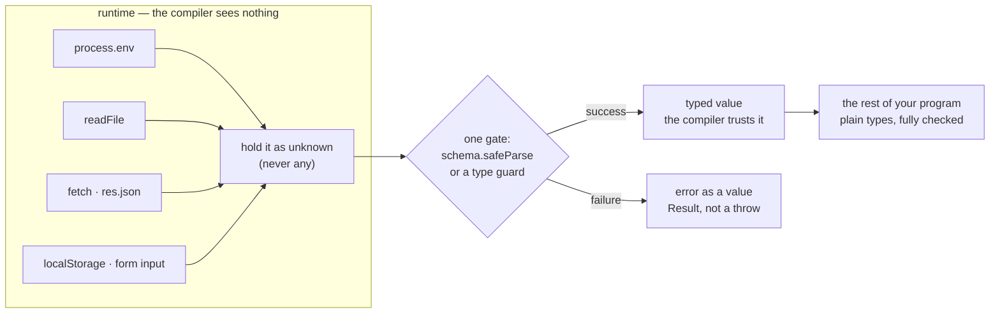
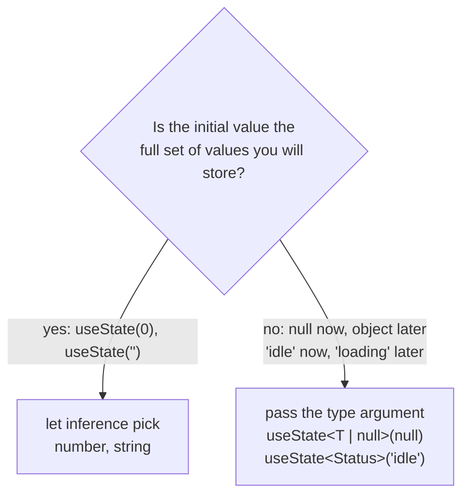
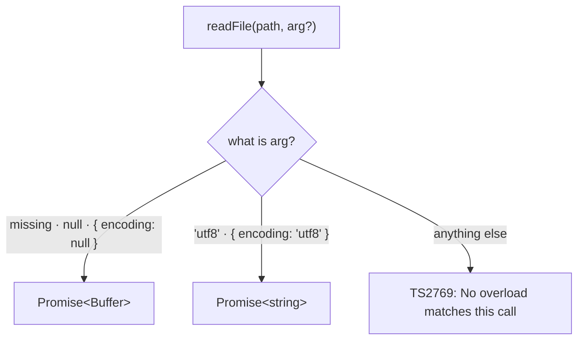
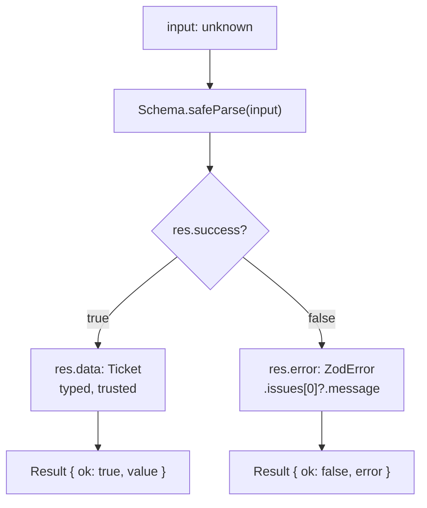
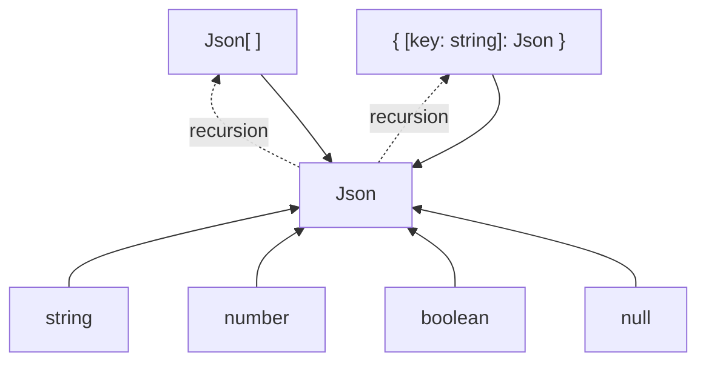
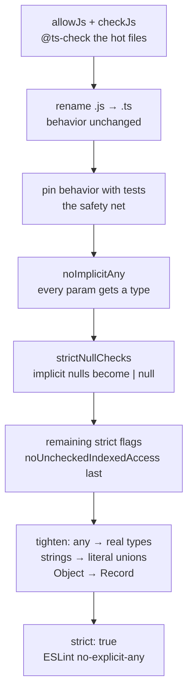
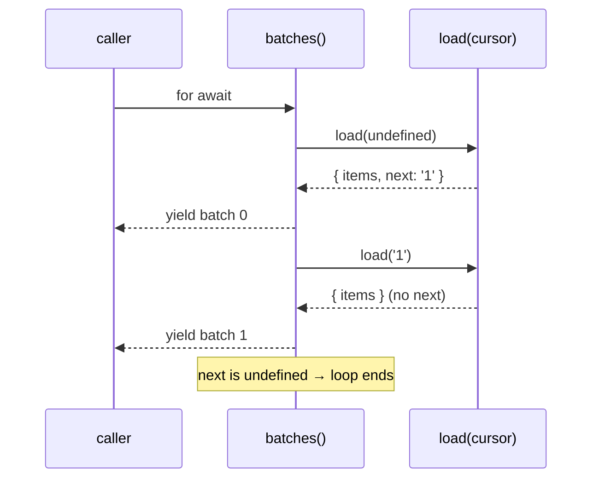

# 12 — Real-World TypeScript

## Why this exists

Every type you have written so far is erased before the program runs. Real
programs constantly meet data the compiler never saw — env vars, files,
JSON from the network, whatever a user typed. This module is about that
boundary: turning untrusted runtime data into trusted static types, plus
the everyday typing work around it (React, Node, migrating old JS,
designing from the types down).

## The runtime/static boundary



*What to notice: everything left of the gate is runtime-only — no
annotation can make it safe. There is exactly one place where data earns
its static type. Past that gate, ordinary `type`s are enough.*

The rule has a name: **parse, don't validate**. A validator says "yes/no"
and hands back the same loose value. A parser hands back a *new* value
whose type proves the check happened. Every section below is a variation
on that idea.

## Map of this module

| Section | Exercise |
| --- | --- |
| Props, `ReactNode`, `ComponentProps`, hooks, `as const` tuples | ex01 |
| `process.env`, `requireEnv`, `readFile` overloads, injected readers | ex02 |
| zod: schema as value, `z.infer`, `safeParse`, `Result` | ex03 |
| `JSON.parse` is `any`, recursive `Json`, `safeJsonParse` | ex04 |
| Migrating JS → TS: rename, pin, tighten | ex05 |
| Declaration-driven design, cursors, injected `fetch` | ex06 |
| All of the above, funneled through `Result` | checkpoint |

## Minimal syntax

```ts
import { z } from 'zod'
import type { ComponentProps, ReactNode } from 'react'

// 1 · validation: the schema is a VALUE, the type is DERIVED from it
const UserSchema = z.object({ id: z.number(), name: z.string() })
type User = z.infer<typeof UserSchema>        // { id: number; name: string }

const res = UserSchema.safeParse(JSON.parse('{"id":1,"name":"Ada"}'))
if (res.success) res.data                     // typed as User
else res.error                                // ZodError — no throw

// 2 · Node: every env var might be missing
const port: string | undefined = process.env.PORT

// 3 · React without JSX: a component is just a typed function
type BadgeProps = { label: string; onClick?: () => void }
declare function Badge(props: BadgeProps): ReactNode
type Extracted = ComponentProps<typeof Badge> // BadgeProps again
```

### Props are just a type — a component is just a function

React never sees your types. A component is a function from a props
object to a tree, so its contract is an ordinary object type. No JSX is
needed to type it — and none is used in this course.

```ts
import type { ReactNode } from 'react'

type ChipProps = {
  label: string                 // required
  size?: number                 // optional — may be absent
  onRemove?: (label: string) => void
}

// destructuring defaults replace React's old defaultProps
function Chip({ label, size = 16, onRemove }: ChipProps): ReactNode {
  onRemove?.(label)
  return `${label} @ ${size}px`
}

Chip({ label: 'ts' })                        // ✅ size defaults to 16
// ❌ error TS2345: Argument of type '{}' is not assignable to parameter of type 'ChipProps'.
Chip({})
```

Gotcha: a default in the destructuring makes `size` a `number` *inside*
the function while the prop stays optional *outside*. Both views are
right — they describe different sides of the call.

### `ReactNode`, `ReactElement`, `JSX.Element`, `children` — and why many skip `FC`

Three return types, from widest to narrowest. Pick by what you promise
to return.

| Type | What it accepts | Use it for |
| --- | --- | --- |
| `ReactNode` | element, string, number, `null`, `undefined`, boolean, arrays of those | component return types, `children` |
| `ReactElement` | one created element only | "this always returns an element" |
| `JSX.Element` | a `ReactElement<any, any>` | what JSX expressions evaluate to |

Return `ReactNode` from components — it lets you return `null` for
"render nothing" without a special case. `children` is an ordinary prop;
`PropsWithChildren<P>` adds it as `children?: ReactNode`. `FC<P>` types
the whole function at once — it works, but a plain function with a
return annotation is what most teams prefer: it supports generics,
overloads and defaults with no ceremony.

```ts
import type { ReactNode, ReactElement, JSX, PropsWithChildren, FC } from 'react'

const anything: ReactNode = ['title', 42, null, undefined, true]
declare const el: ReactElement
const same: JSX.Element = el                 // ✅ JSX.Element is a ReactElement
// ❌ error TS2353: Object literal may only specify known properties, and 'x' does not exist in type ...
const notRenderable: ReactNode = { x: 1 }

type CardProps = PropsWithChildren<{ title: string }>

function Card({ title, children }: CardProps): ReactNode {
  return [title, children]
}
Card({ title: 'Hi', children: 'body' })      // ✅
Card({ title: 'Hi' })                        // ✅ children is optional

// FC works too — but it cannot be generic and hides the return type
const Tag: FC<{ label: string }> = ({ label }) => label
```

### `ComponentProps` — extract props instead of repeating them

Writing a props shape twice invites drift. `ComponentProps<typeof C>`
reads the props type back off the component; `ComponentProps<'button'>`
reads the intrinsic element's props (`onClick`, `disabled`, `type`, ...).

```ts
import type { ComponentProps, ReactNode } from 'react'

declare function Toggle(props: { on: boolean; onFlip: () => void }): ReactNode

type ToggleProps = ComponentProps<typeof Toggle>   // { on: boolean; onFlip: () => void }
type ButtonProps = ComponentProps<'button'>        // every native button attribute

// wrap a native element and forward its props without listing them
type IconButtonProps = ButtonProps & { icon: string }
declare function IconButton(props: IconButtonProps): ReactNode
IconButton({ icon: 'save', disabled: true, type: 'submit' })
```

Gotcha: `typeof` is required — `ComponentProps<Toggle>` asks for a
*type* named `Toggle`, and the component is a *value*.

### Event handler types

React wraps DOM events in `SyntheticEvent` types, generic over the
element. `ChangeEvent<HTMLInputElement>` gives `e.target.value: string`.
Those `HTML*Element` names come from the `DOM` lib, which this course's
`tsconfig` leaves out (it is a Node course) — so the example uses a tiny
stand-in shape. In a browser project, write the real element type.

```ts
import type { ChangeEvent, MouseEvent } from 'react'

type InputLike = { value: string }           // stand-in for HTMLInputElement
type ButtonLike = { disabled: boolean }      // stand-in for HTMLButtonElement

const onNameChange = (e: ChangeEvent<InputLike>) => e.target.value.trim()
const onSave = (e: MouseEvent<ButtonLike>) => e.currentTarget.disabled

type FormProps = {
  onNameChange: (e: ChangeEvent<InputLike>) => void
  onSave: (e: MouseEvent<ButtonLike>) => void
}
const props: FormProps = { onNameChange, onSave }   // ✅ shapes line up
```

### Typing hooks: `useState`, `useRef`, `useReducer`, `useCallback`

Hooks are generic functions. The one decision is: **let inference pick
the type, or pass it explicitly?** Pass it whenever the *initial* value
is narrower than the values you will store later — `null` now, an object
later; `'idle'` now, `'loading'` later. React's signatures are declared
inline below so the examples stand on their own.

```ts
import type { Dispatch, SetStateAction, RefObject } from 'react'

declare function useState<S>(initial: S | (() => S)): [S, Dispatch<SetStateAction<S>>]
declare function useRef<T>(initial: T | null): RefObject<T | null>
declare function useReducer<S, A>(reducer: (s: S, a: A) => S, init: S): [S, Dispatch<A>]
declare function useCallback<T extends Function>(cb: T, deps: readonly unknown[]): T

// inference widens 'idle' to string — typos slip through
const [loose, setLoose] = useState('idle')
setLoose('lodaing')                          // ✅ compiles — that is the bug

// explicit union — the typo is caught
type Status = 'idle' | 'loading' | 'done'
const [status, setStatus] = useState<Status>('idle')
// ❌ error TS2345: Argument of type '"lodaing"' is not assignable to parameter of type 'SetStateAction<Status>'.
setStatus('lodaing')
```

```ts continue
// null now, a value later: say so in the type argument
type Session = { userId: string }
const [session, setSession] = useState<Session | null>(null)
setSession({ userId: 'u1' })                 // ✅
setSession((prev) => prev ?? null)           // ✅ updater form is typed too

// refs start empty — the null is part of the type
const timer = useRef<number>(null)
timer.current = 42

// useReducer: a discriminated action union makes dispatch exhaustive-checkable
type Action = { type: 'add'; amount: number } | { type: 'reset' }
function reduce(total: number, action: Action): number {
  switch (action.type) {
    case 'add': return total + action.amount
    case 'reset': return 0
  }
}
const [total, dispatch] = useReducer(reduce, 0)
dispatch({ type: 'reset' })                  // ✅
// ❌ error TS2345: Argument of type '{ type: "add"; }' is not assignable to parameter of type 'Action'.
dispatch({ type: 'add' })

const double = useCallback((n: number) => n * 2, [])   // typed as (n: number) => number
```



*What to notice: `useState(null)` infers `S = null` — the setter then
accepts nothing else. The type argument is how you tell React what the
state will become.*

### Custom hooks return tuples — `as const`

A hook that returns `[value, setter]` looks like a tuple but, without
help, infers an *array* whose every slot is `value | setter`. `as const`
freezes the positions into a readonly tuple.

```ts
function useVisibleLoose(initial: boolean) {
  let visible = initial
  const hide = () => (visible = false)
  return [visible, hide]                     // (boolean | (() => boolean))[]
}
const [, hideLoose] = useVisibleLoose(true)
// ❌ error TS2349: This expression is not callable. Not all constituents of type 'boolean | (() => boolean)' are callable.
hideLoose()

function useVisible(initial: boolean) {
  let visible = initial
  const hide = () => (visible = false)
  return [visible, hide] as const            // readonly [boolean, () => boolean]
}
const [, hide] = useVisible(true)
hide()                                       // ✅ slot 1 is the function
```

Gotcha: an explicit return annotation `: [boolean, () => boolean]` also
works and gives a *mutable* tuple. `as const` is shorter and the
readonly-ness is usually what you want from a hook.

### Generic components and discriminated prop unions

A generic component is a generic function — `FC` cannot express that,
plain functions can. And when one prop decides which others are
required, make the props a discriminated union (module 05) instead of
a pile of optionals.

```ts
import type { ReactNode } from 'react'

// generic: T flows from `items` into `render`
declare function List<T>(props: { items: T[]; render: (item: T) => ReactNode }): ReactNode
List({ items: [1.5, 2.5], render: (n) => n.toFixed(1) })   // n: number

// discriminated: variant 'link' REQUIRES href, variant 'button' REQUIRES onPress
type ActionProps =
  | { variant: 'link'; href: string }
  | { variant: 'button'; onPress: () => void }
declare function Action(props: ActionProps): ReactNode

Action({ variant: 'link', href: '/docs' })   // ✅
// ❌ error TS2345: Argument of type '{ variant: "link"; }' is not assignable to parameter of type 'ActionProps'.
Action({ variant: 'link' })
```

### `process.env` is `string | undefined` — handle it once with `requireEnv`

Node types `process.env` as an index signature: every key *might* be
missing. Under `strictNullChecks`, that `undefined` follows the value
until you handle it.

```ts
const port = process.env.PORT                // string | undefined

// ❌ error TS18048: 'port' is possibly 'undefined'.
port.length

const withDefault = port ?? '3000'           // ✅ string — an optional var with a fallback
console.log(withDefault)
```

`process.env.PORT!` silences the error and keeps the crash. For a
*required* variable, fail loudly, early, once: a helper centralizes the
check and makes the failure message useful. Taking the env as a
parameter (defaulting to `process.env`) lets tests pass a plain object.

```ts
type Env = Record<string, string | undefined>   // the honest shape of process.env

function requireEnv(name: string, env: Env = process.env): string {
  const value = env[name]
  if (value === undefined) throw new Error(`Missing required env var: ${name}`)
  return value
}

const dbUrl = requireEnv('DATABASE_URL')                    // string, or a clear throw
const fromTest = requireEnv('TOKEN', { TOKEN: 'abc' })      // ✅ no real env needed
console.log(dbUrl, fromTest)
```

Do it at startup, in one `config.ts`, so the rest of the program reads
`config.dbUrl: string` and never sees `undefined`.

### Augmenting `ProcessEnv` — naming the variables you use

Global augmentation (module 09) applied to `NodeJS.ProcessEnv` makes
your variable names autocomplete and catches typos in the key. Keep the
properties optional — augmentation cannot make a runtime value exist.

```ts
declare global {
  namespace NodeJS {
    interface ProcessEnv {
      DATABASE_URL?: string
      NODE_ENV?: 'development' | 'test' | 'production'
    }
  }
}

const mode = process.env.NODE_ENV            // 'development' | 'test' | 'production' | undefined
const db = process.env.DATABASE_URL          // still string | undefined — correctly
console.log(mode, db)
```

Gotcha: declaring `DATABASE_URL: string` (required) is a lie the
compiler will believe. The value can still be missing at runtime.

### `readFile` overloads: `Buffer` vs `string`

`fs` functions are overloaded on the encoding argument. No encoding
means bytes (`Buffer`); an encoding such as `'utf8'` means text
(`string`). The overload you hit is decided at compile time from the
arguments you pass.

```ts
import { readFile } from 'node:fs/promises'
import { readFileSync } from 'node:fs'

const bytes = await readFile('notes.md')             // Promise<Buffer> resolved
const text = await readFile('notes.md', 'utf8')      // Promise<string> resolved
const text2 = await readFile('notes.md', { encoding: 'utf8' })   // also string

// ❌ error TS2322: Type 'NonSharedBuffer' is not assignable to type 'string'.
const wrong: string = readFileSync('notes.md')

// ❌ error TS2769: No overload matches this call.
const nonsense = readFile('notes.md', 42)

console.log(bytes.toString('utf8') === text, text2)
```



*What to notice: the encoding argument is the switch. `Buffer` and
`string` are different types — a function that expects text must be
handed the `'utf8'` overload.*

### Inject the reader — `(path: string) => Promise<string>`

Code that calls `readFile` directly needs real files to test. Take the
reader as a parameter instead. The parameter's type is *narrower* than
`readFile` (one overload, one shape), and the real function still fits
it because a wrapper picks the overload.

```ts
import { readFile } from 'node:fs/promises'

type FileReader = (path: string) => Promise<string>

async function loadConfig(path: string, read: FileReader): Promise<string[]> {
  const text = await read(path)
  return text.split('\n').map((line) => line.trim())
}

const realReader: FileReader = (p) => readFile(p, 'utf8')          // ✅ string overload
// ❌ error TS2322: Type 'Promise<NonSharedBuffer>' is not assignable to type 'Promise<string>'.
const wrongReader: FileReader = (p) => readFile(p)

const inTests = loadConfig('any.txt', async () => 'a\n b \n')     // ✅ fake reader
const forReal = loadConfig('config.txt', realReader)
console.log(inTests, forReal)
```

Gotcha: `readFile` itself is *not* assignable to `FileReader` without
the wrapper — its first overload returns `Buffer`. Injecting the
narrower function type is the point: the caller decides how bytes become
text.

### Node odds and ends you will type every week

| Thing | Type | Note |
| --- | --- | --- |
| `Buffer.from('hi')` | `Buffer` | bytes; `.toString('utf8')` makes text |
| `setTimeout(...)` | `NodeJS.Timeout` | in browsers it is `number` — say `ReturnType<typeof setTimeout>` for both |
| `path.join(a, b)` | `string` | never concatenate paths by hand |
| `import.meta.url` | `string` (a `file://` URL) | ESM's replacement for `__dirname` |
| `process.argv` | `string[]` | slot 0 is node, 1 is the script, args start at 2 |
| `process.exitCode = 1` | `number \| undefined` | preferred over `process.exit(1)` — lets I/O flush |

```ts
import path from 'node:path'
import { fileURLToPath } from 'node:url'

const here = path.dirname(fileURLToPath(import.meta.url))   // __dirname, ESM style
const configPath = path.join(here, 'config.json')

const timer: ReturnType<typeof setTimeout> = setTimeout(() => {}, 100)
clearTimeout(timer)

const [command, target] = process.argv.slice(2)             // string | undefined each
// ❌ error TS18048: 'command' is possibly 'undefined'.
command.toUpperCase()

if (command === undefined) {
  console.error('usage: tool <command> [target]')
  process.exitCode = 2                                      // ✅ non-zero = failure
} else {
  console.log(command, target ?? '(none)', configPath)
}
```

### A schema is a value; the type is derived — `z.infer<typeof S>`

Types are erased, so they cannot check anything. A zod schema is a
runtime object that *can* — and its static type is derived from it, so
the validator and the type never drift. You write the shape once.

```ts
import { z } from 'zod'

const ProductSchema = z.object({
  sku: z.string().min(1),
  price: z.number().int().nonnegative(),
  currency: z.enum(['EUR', 'USD']),
  tags: z.array(z.string()),
})

type Product = z.infer<typeof ProductSchema>
// { sku: string; price: number; currency: 'EUR' | 'USD'; tags: string[] }

const p: Product = { sku: 'A1', price: 999, currency: 'EUR', tags: [] }   // ✅
console.log(ProductSchema.parse(p).sku)
```

Gotcha: `z.infer<ProductSchema>` fails with *'ProductSchema' refers to a
value, but is being used as a type here* (TS2749). The schema is a
value — `typeof` lifts it into type space. Same rule as
`ComponentProps<typeof C>`.

### `parse` throws, `safeParse` returns a discriminated result

Both run the same checks. `parse` returns the typed value or throws a
`ZodError`. `safeParse` never throws — it returns
`{ success: true, data } | { success: false, error }`, a discriminated
union you narrow with `if (res.success)`. At a boundary prefer
`safeParse`: failures become values (module 10's `Result` idea), not
exceptions you might forget to catch.

```ts
import { z } from 'zod'

const TicketSchema = z.object({ id: z.string(), seats: z.number().int().positive() })
type Ticket = z.infer<typeof TicketSchema>

type Result<T, E> = { ok: true; value: T } | { ok: false; error: E }

// safeParse's own result IS a Result — this just renames the fields to the course's shape
function parseTicket(input: unknown): Result<Ticket, z.ZodError> {
  const res = TicketSchema.safeParse(input)
  return res.success
    ? { ok: true, value: res.data }            // res.data: Ticket
    : { ok: false, error: res.error }          // res.error: ZodError
}

console.log(parseTicket({ id: 't1', seats: 2 }))     // { ok: true, value: {...} }
console.log(parseTicket({ id: 't1', seats: 0 }))     // { ok: false, error: ZodError }

try {
  TicketSchema.parse('nope')                         // throws
} catch (e) {
  if (e instanceof z.ZodError) console.log(e.issues.length)
}
```



*What to notice: `success` is the discriminant. Narrowing on it is the
only way to reach `data` — the compiler will not let you use the value
before the check.*

### The schema vocabulary

Every zod schema is built from small pieces that chain. The table covers
what you will reach for weekly; each entry's `z.infer` is on the right.

| Schema | Inferred type | Note |
| --- | --- | --- |
| `z.string().min(1).max(80)` | `string` | `.regex()`, `.length()`; formats are top-level: `z.email()`, `z.url()`, `z.uuid()` |
| `z.number().int().positive()` | `number` | `.min()`, `.max()`, `.nonnegative()` |
| `z.boolean()` | `boolean` | |
| `z.literal('v1')` | `'v1'` | |
| `z.enum(['low', 'high'])` | `'low' \| 'high'` | `.options` gives the array back |
| `z.array(S)` | `T[]` | `.min(1)` for non-empty |
| `z.object({...})` | object | unknown keys are *stripped*; `z.strictObject` rejects them |
| `z.record(z.string(), S)` | `Record<string, T>` | dictionaries |
| `z.union([A, B])` | `A \| B` | tries each member in order |
| `z.discriminatedUnion('kind', [...])` | tagged union | reads the tag first — one attempt, precise errors |
| `z.unknown()` | `unknown` | accept anything, decide later |
| `z.iso.datetime()` | `string` | dates in JSON are strings — see below |
| `S.optional()` | `T \| undefined` | key may be absent |
| `S.nullable()` | `T \| null` | key present, value may be null |
| `S.nullish()` | `T \| null \| undefined` | both |
| `S.default(x)` | `T` on output, `T \| undefined` on input | fills in when missing |

```ts
import { z } from 'zod'

const NoteSchema = z.object({
  title: z.string().min(1),
  body: z.string().optional(),               // body?: string | undefined
  pinnedAt: z.iso.datetime().nullable(),     // pinnedAt: string | null
  priority: z.enum(['low', 'high']).default('low'),
})
type Note = z.infer<typeof NoteSchema>

const note = NoteSchema.parse({ title: 'Todo', pinnedAt: null })
console.log(note.priority)                   // 'low' — the default was applied

// tagged members → discriminatedUnion: reads the tag first, infers a union you can switch on
const PaymentSchema = z.discriminatedUnion('method', [
  z.object({ method: z.literal('card'), last4: z.string().length(4) }),
  z.object({ method: z.literal('bank'), iban: z.string() }),
])
type Payment = z.infer<typeof PaymentSchema>
function describe(p: Payment): string {
  switch (p.method) {
    case 'card': return `card ending ${p.last4}`
    case 'bank': return `bank ${p.iban}`
  }
}
console.log(describe(PaymentSchema.parse({ method: 'card', last4: '4242' })))
```

Gotcha: `z.object` *strips* unknown keys silently. If extra keys should
be an error (a config file with a typo'd key), use `z.strictObject`.

### `.transform()`, `z.input` vs `z.output`, `.refine()`, `z.coerce`

A schema can *change* the value while parsing. Then it has two types:
what goes in (`z.input`) and what comes out (`z.output`). `z.infer` is
an alias for `z.output`. `.refine()` adds a custom check without
changing the type. `z.coerce.*` converts first (`'42'` → `42`), useful
for env vars and query strings, which are always strings.

```ts
import { z } from 'zod'

const EventSchema = z.object({
  name: z.string(),
  at: z.string().transform((s) => new Date(s)),        // string in, Date out
  attendees: z.coerce.number().int().default(1),       // '12' → 12
}).refine((e) => e.attendees <= 500, { message: 'venue holds 500' })

type EventInput = z.input<typeof EventSchema>
// { name: string; at: string; attendees?: unknown }
type Event = z.output<typeof EventSchema>
// { name: string; at: Date; attendees: number }

const ev: Event = EventSchema.parse({ name: 'Meetup', at: '2026-09-14', attendees: '12' })
console.log(ev.at.getFullYear(), ev.attendees + 1)   // 2026 13
```

Gotcha: a `.refine()` runs only when the base checks pass, and its
failure message lands in `issues` like any other. Use it for rules that
span fields (`end > start`), not for what `.min()` already does.

### Reading a `ZodError`

`error.issues` is the flat list: each issue has a `code`, a `path`
(array of keys into the input) and a `message`. Three helpers reshape
it for humans.

| Helper | Returns | Use it for |
| --- | --- | --- |
| `error.issues` | `ZodIssue[]` | first message, logging |
| `z.flattenError(error)` | `{ formErrors, fieldErrors }` | form field messages, one level deep |
| `z.treeifyError(error)` | nested `{ errors, properties }` | mirrors the object's shape |
| `z.prettifyError(error)` | `string` | CLI output |

```ts
import { z } from 'zod'

const SignupSchema = z.object({ email: z.email(), age: z.number().int().min(13) })
const res = SignupSchema.safeParse({ email: 'not-an-email', age: 9 })

if (!res.success) {
  const first = res.error.issues[0]
  console.log(first?.path, first?.message)              // ['email'] 'Invalid email address'

  const flat = z.flattenError(res.error)
  console.log(flat.fieldErrors.age)                     // ['Too small: ...']

  const tree = z.treeifyError(res.error)
  console.log(tree.properties?.email?.errors)           // ['Invalid email address']

  console.log(z.prettifyError(res.error))               // multi-line, for terminals
}
```

Gotcha: `issues[0]` is `ZodIssue | undefined` under
`noUncheckedIndexedAccess` — a failed parse always has at least one
issue, but the type cannot know that. Use `?.` and a fallback.

### zod vs plain types — and when not to use zod

| | plain `type` / `interface` | zod schema |
| --- | --- | --- |
| Exists at runtime | ❌ erased | ✅ a real object |
| Can validate input | ❌ | ✅ `parse` / `safeParse` |
| Static type | written by hand | derived with `z.infer` |
| Can drift from reality | easily | schema IS the source of truth |
| Can transform / default | ❌ | ✅ `.transform()`, `.default()` |
| Error messages | compile-time only | runtime, per field, with paths |
| Cost | free | dependency + runtime work + bundle size |
| Compile cost | negligible | large schemas can hit TS2589 |
| Use for | data you created yourself | anything crossing a boundary |

Skip zod when the data never crosses a boundary (values your own code
built), when a one-line `typeof` guard is enough, or in a library that
must stay dependency-free. Alternatives with the same "schema → type"
idea: **valibot** (smaller, tree-shakeable), **arktype** (types as
strings), or hand-written type predicates (module 05) for two or three
fields.

### `JSON.parse` returns `any` — wrap it as `unknown`

`JSON.parse`'s signature predates `unknown`, so it returns `any` — and
`any` disables checking on everything it touches. Assign the result to
`unknown` the moment it appears. Now the compiler *forces* a check.

```ts
function greet(user: { name: string }): string {
  return `hi ${user.name}`
}

const loose = JSON.parse('{"nmae":"Ada"}')   // any
greet(loose)                                 // ✅ compiles, crashes later: undefined name
loose.anything.goes.here                     // ✅ compiles — nothing is checked

const raw: unknown = JSON.parse('{"nmae":"Ada"}')
// ❌ error TS2345: Argument of type 'unknown' is not assignable to parameter of type '{ name: string; }'.
greet(raw)

// ✅ narrow, then use
if (typeof raw === 'object' && raw !== null && 'name' in raw && typeof raw.name === 'string') {
  greet({ name: raw.name })
}
```

### A recursive `Json` type

JSON can hold exactly six things: string, number, boolean, `null`,
arrays of JSON, objects of JSON. A recursive alias says so — and is the
honest return type of a JSON parser: nothing about *your* shape, only
about what JSON can carry.

```ts
type JsonPrimitive = string | number | boolean | null
type JsonArray = Json[]
type JsonObject = { [key: string]: Json }
type Json = JsonPrimitive | JsonArray | JsonObject

const ok: Json = { id: 1, tags: ['a', 'b'], meta: { deleted: null, nested: [[true]] } }

// ❌ error TS2322: Type 'Date' is not assignable to type 'Json'.
const notJson: Json = new Date()

console.log(ok)
```



*What to notice: `undefined`, `Date`, `Map`, functions and `bigint` are
absent. If your object holds one of those, it cannot round-trip through
JSON unchanged.*

Gotcha: `Array.isArray(value)` narrows `Json` to `JsonArray`, and
`typeof value === 'object' && value !== null && !Array.isArray(value)`
narrows to `JsonObject` — but a key lookup on it is still
`Json | undefined`. The type describes JSON, not your schema. For your
schema, use zod.

### `safeJsonParse` — a `Result`, not a throw

`JSON.parse` throws a `SyntaxError` on bad text. Wrap it so a malformed
payload becomes a value the caller must handle, and so the success type
is `Json`, not `any`.

```ts
type JsonPrimitive = string | number | boolean | null
type Json = JsonPrimitive | Json[] | { [key: string]: Json }
type Result<T, E> = { ok: true; value: T } | { ok: false; error: E }

function safeJsonParse(text: string): Result<Json, Error> {
  try {
    return { ok: true, value: JSON.parse(text) as Json }   // any → Json, on purpose
  } catch (e) {
    return { ok: false, error: e instanceof Error ? e : new Error(String(e)) }
  }
}

const good = safeJsonParse('{"a":[1,2]}')
if (good.ok) console.log(good.value)          // Json
const bad = safeJsonParse('{')
if (!bad.ok) console.log(bad.error.message)   // "Expected property name or '}' in JSON at position 1"
```

Gotcha: the `catch` variable is `unknown` (module 01,
`useUnknownInCatchVariables`) — `e.message` does not compile until you
check `instanceof Error`. `JSON.parse` only ever throws `SyntaxError`,
but the type system does not know that.

### What `JSON.stringify` drops, and what it throws on

Serialization is lossy in ways the type system cannot see.

| Value | `JSON.stringify` does |
| --- | --- |
| `undefined`, functions, symbols as object values | **drops the key** |
| the same inside an array | becomes `null` |
| `Date` | becomes an ISO string (`.toJSON()`) |
| `Map`, `Set` | become `{}` |
| `NaN`, `Infinity` | become `null` |
| `bigint` | **throws** `TypeError` |
| a cycle (`a.self = a`) | **throws** `TypeError` |

```ts
const snapshot = { when: new Date(0), skip: undefined, count: NaN }
console.log(JSON.stringify(snapshot))        // {"when":"1970-01-01T00:00:00.000Z","count":null}

// replacer and reviver are typed (key: string, value: any) => any
const compact = JSON.stringify({ a: 1, secret: 'x' }, (key, value) => (key === 'secret' ? undefined : value), 2)
const revived = JSON.parse('{"when":"1970-01-01T00:00:00.000Z"}', (key, value) =>
  key === 'when' && typeof value === 'string' ? new Date(value) : value,
)
console.log(compact, revived)
```

Gotcha: **dates in JSON are strings.** After `JSON.parse`, `when` is a
`string`, whatever your type says. Either keep it a string in the type
(`z.iso.datetime()`) or convert at the gate (`.transform((s) => new
Date(s))`, or a reviver). Never annotate a parsed value as `Date` and
hope.

### `satisfies Json` — check serializability at compile time

Before you send an object across the wire, ask the compiler whether it
survives the trip. `satisfies Json` (module 08) checks the literal
against the recursive type without widening it.

```ts
type JsonPrimitive = string | number | boolean | null
type Json = JsonPrimitive | Json[] | { [key: string]: Json }

const payload = { id: 7, tags: ['a'], createdAt: '2026-09-14' } satisfies Json
payload.tags.push('b')                       // ✅ still string[] — satisfies kept the literal type

// ❌ error TS1360: Type '{ id: number; createdAt: Date; }' does not satisfy the expected type 'Json'.
const leaky = { id: 7, createdAt: new Date() } satisfies Json

// ❌ error TS1360: Type '{ note: undefined; }' does not satisfy the expected type 'Json'.
const dropped = { note: undefined } satisfies Json
```

### Migrating JS → TS, step zero: `allowJs`, `checkJs`, `// @ts-check`

You do not have to rename anything to start. `allowJs` lets `.ts` import
`.js`; `checkJs` type-checks the JS too; a `// @ts-check` comment opts a
single file in. JSDoc comments then supply types the compiler reads —
real checking, zero syntax change.

```json
{
  "compilerOptions": {
    "allowJs": true,
    "checkJs": false,
    "strict": false
  }
}
```

```js
// @ts-check
/** @param {string} id  @returns {Promise<{ id: string, total: number }>} */
async function loadInvoice(id) {
  return { id, total: 0 }
}
loadInvoice(42)   // error TS2345 — already caught, still a .js file
```

Turn `checkJs` on globally once most files pass, then start renaming.

### Rename, then tighten: the `any` budget and one flag at a time

Renaming `.js` → `.ts` changes nothing at runtime, but the compiler now
needs types for every parameter. Give yourself an `any` budget: let
`any` stand where inference cannot help, count them, and pay them down
file by file. Turn strict flags on **one at a time**, in the order that
finds the most bugs per hour.



*What to notice: tests come before any type changes. Types changing
behavior is the one thing a migration must never do — the tests prove
it did not.*

The checklist, in order:

1. Tests that pin current behavior. No types yet.
2. `allowJs` + `@ts-check` on the riskiest files; fix what JSDoc finds.
3. Rename `.js` → `.ts`, one folder at a time. `any` is allowed.
4. `noImplicitAny`: annotate parameters. Count the remaining `any`s.
5. `strictNullChecks`: make every implicit `null` explicit.
6. The remaining strict flags, then `noUncheckedIndexedAccess`.
7. Tighten: stringly states → unions, `Object` → `Record`, callbacks →
   promises, `@ts-ignore` → `@ts-expect-error` → nothing.
8. ESLint `no-explicit-any`; the budget is now zero.

Never change behavior and types in the same commit. If tightening a type
*surfaces* a bug, that is the migration working — fix it in a separate
change, keep the tests green.

```ts
// legacy shape after the rename — compiles, checks nothing
function totalLoose(order: any): any {
  return order.lines.reduce((sum: number, l: any) => sum + l.price * l.qty, 0)
}

// tightened — same body, real types
type Line = { price: number; qty: number }
type Order = { lines: Line[] }
function total(order: Order): number {
  return order.lines.reduce((sum, l) => sum + l.price * l.qty, 0)
}
console.log(totalLoose({ lines: [] }), total({ lines: [{ price: 2, qty: 3 }] }))
```

### `@ts-expect-error` vs `@ts-ignore`

Both silence the next line. Only one tells you when the silence is no
longer needed: `@ts-expect-error` *errors* if the line stops erroring
(TS2578), so it cleans itself up as the migration progresses.
`@ts-ignore` stays forever, hiding whatever appears later.

```ts
declare function legacyCall(x: number): void

// @ts-expect-error legacy passes a string — remove when the caller is fixed
legacyCall('42')

// the block-comment form works too — and here the line is fine, so the directive itself errors
/* @ts-expect-error */ legacyCall(42)   // ❌ error TS2578: Unused '@ts-expect-error' directive.
```

Use `@ts-expect-error` with a reason, always. Keep `@ts-ignore` for
editor and tooling quirks only.

### The tightening catalogue

Loose JavaScript has recurring smells. Each has a standard TypeScript
replacement.

| JS habit | TS replacement | What it buys |
| --- | --- | --- |
| `status = 'open'` (any string) | `'open' \| 'closed'` literal union | exhaustive `switch`, typo-proof |
| `x = null` "for now" | `T \| null`, explicit | every read is narrowed |
| `let o = {}` then `o.x = 1` | `Record<string, number>` or a typed object | no "property does not exist" |
| `arguments` | rest parameter `(...args: number[])` | typed, works in arrows |
| callback `(err, data) => ...` | `Promise<T>` / `async` | `await` and typed errors |
| `Object` / `{}` as a type | `Record<K, V>` or `object` | `Object` matches everything |

```ts
// stringly state → literal union (behavior identical, typos now caught)
type TicketState = 'open' | 'closed'
type Ticket = { id: string; state: TicketState; closedBy: string | null }   // explicit null

function close(t: Ticket, who: string): Ticket {
  return { ...t, state: 'closed', closedBy: who }
}
// ❌ error TS2322: Type '"colsed"' is not assignable to type 'TicketState'.
const typo: Ticket = { id: 't1', state: 'colsed', closedBy: null }

// Object → Record
let countsLoose: Object = {}
// ❌ error TS2339: Property 'open' does not exist on type 'Object'.
countsLoose.open = 1
const counts: Record<TicketState, number> = { open: 0, closed: 0 }
counts.open += 1

// arguments → rest params
function sumAll(...values: number[]): number {
  return values.reduce((a, b) => a + b, 0)
}
console.log(close({ id: 't1', state: 'open', closedBy: null }, 'ada'), sumAll(1, 2, 3))
```

Third-party JS without types gets a `.d.ts` (module 09) — an
`index.d.ts` with `declare module 'legacy-lib'` is enough to start.

### Declaration-driven design: write the signatures first

For a new feature, write the public types and function signatures
before any body. The types are the agreement; the bodies are the
consequence. The compiler then reports the moment an implementation
drifts from the agreement — and you can write callers and tests against
the signatures before the logic exists.

```ts
// 1 · the agreement — types only
interface Batch<T> {
  items: T[]
  next?: string                       // absent on the last batch
}
type LoadBatch<T> = (cursor?: string) => Promise<Batch<T>>
type Comment = { id: number; text: string }

// 2 · a caller written against the agreement, before any real loader exists
async function firstTexts(load: LoadBatch<Comment>): Promise<string[]> {
  return (await load()).items.map((c) => c.text)
}

// 3 · an implementation that must satisfy LoadBatch — the compiler checks the fit
const inMemory: LoadBatch<Comment> = async (cursor) => ({ items: [{ id: 1, text: cursor ?? 'first' }] })
console.log(await firstTexts(inMemory))
```

Gotcha: with `exactOptionalPropertyTypes`, `next?: string` means the key
is *absent*, not set to `undefined`. If a real API sends
`"next": null`, declare `next: string | null` instead — and the loop
condition changes with it.

### Cursor pagination types and an injected fetcher

Cursor pagination is a loop over a `LoadBatch<T>`: call with no cursor,
then with each batch's `next`, until it is missing. Injecting the loader
is the same move as injecting `readFile` — tests pass a fake, production
passes a `fetch` wrapper. An `AsyncIterable` (module 10) yields batches
lazily, so callers can stop early without a flag.

```ts
interface Batch<T> { items: T[]; next?: string }
type LoadBatch<T> = (cursor?: string) => Promise<Batch<T>>

async function* batches<T>(load: LoadBatch<T>): AsyncIterable<Batch<T>> {
  let cursor: string | undefined
  do {
    const batch = await load(cursor)
    yield batch
    cursor = batch.next
  } while (cursor !== undefined)
}

// a fake loader: three batches, then done
const fake: LoadBatch<number> = async (cursor) => {
  const n = Number(cursor ?? 0)
  return n < 2 ? { items: [n], next: String(n + 1) } : { items: [n] }
}

for await (const batch of batches(fake)) {
  console.log(batch.items)                   // [0] [1] [2]
  if (batch.items.includes(1)) break         // stop early — no further loads happen
}
```



*What to notice: the cursor is threaded from one response into the next
request. The generator holds that state, so the caller only sees
batches.*

### Typing `fetch`: `Response`, `res.json()`, `RequestInit`, `URLSearchParams`

`fetch` is typed in Node and browsers alike: `fetch(input, init?:
RequestInit): Promise<Response>`. The trap is `res.json()`, which returns
`Promise<any>` — same problem as `JSON.parse`. Wrap it to `unknown` and
validate.

```ts
import { z } from 'zod'

const PageSchema = z.object({ items: z.array(z.string()), next: z.string().optional() })
type Page = z.infer<typeof PageSchema>

async function loadPage(cursor?: string): Promise<Page> {
  const url = new URL('https://api.example.com/items')
  const query = new URLSearchParams({ limit: '50' })
  if (cursor !== undefined) query.set('cursor', cursor)
  url.search = query.toString()

  const init: RequestInit = { method: 'GET', headers: { accept: 'application/json' } }
  const res: Response = await fetch(url, init)
  if (!res.ok) throw new Error(`HTTP ${res.status}`)

  const body: unknown = await res.json()     // any → unknown, then the gate
  return PageSchema.parse(body)
}
console.log(typeof loadPage)
```

Gotcha: `res.json()` also throws on a non-JSON body, and `fetch` itself
rejects only on *network* failure — a 404 resolves normally. Check
`res.ok`. A real client wraps all three failures into one `Result`.

### Tooling one-pagers

| Tool | What it adds | The one setting |
| --- | --- | --- |
| `tsc --noEmit` | type-check in CI, no output | run it before tests |
| `tsx` | run `.ts` directly for scripts | `npx tsx scripts/seed.ts` |
| ESLint + `typescript-eslint` | lint with type information | `recommendedTypeChecked` |
| — `no-floating-promises` | forgot `await`? error | catches un-awaited async calls |
| — `no-explicit-any` | every `any` is a lint error | the end of the `any` budget |
| vitest `expectTypeOf` | assert types in tests | `expectTypeOf(x).toEqualTypeOf<T>()` |
| `tsconfig` `include` / `exclude` | which files tsc sees | exclude `dist`, `node_modules` |
| `sourceMap: true` | stack traces point at `.ts` lines | pair with `--enable-source-maps` |

```ts
import { expectTypeOf } from 'vitest'

type Page<T> = { items: T[]; next?: string }
declare function load(): Promise<Page<number>>

expectTypeOf(load).returns.resolves.toEqualTypeOf<Page<number>>()   // a type assertion that fails the build
```

### Reading the errors of this module

| Error | It is telling you | Fix |
| --- | --- | --- |
| TS7016 *Could not find a declaration file for module 'x'* | the JS package ships no types | `npm i -D @types/x`, or a `declare module 'x'` in a `.d.ts` |
| TS2345 *Argument of type 'unknown' is not assignable...* | you held `JSON.parse` as `unknown` (good) and skipped the gate | narrow with a guard or `safeParse` |
| TS18048 *'process.env.X' is possibly 'undefined'* | env vars can be missing | `??` a default, or `requireEnv` |
| TS2769 *No overload matches this call* | `readFile` got an argument no overload accepts | pass `'utf8'` or an options object |
| TS2322 *Type 'Promise<Buffer>' is not assignable to 'Promise<string>'* | the `Buffer` overload where text was promised | wrap: `(p) => readFile(p, 'utf8')` |
| TS2345 *... not assignable to 'SetStateAction<null>'* | `useState(null)` inferred `S = null` | `useState<T \| null>(null)` |
| TS2589 *Type instantiation is excessively deep* | a huge or deeply recursive zod schema | split the schema; annotate `z.ZodType<T>` on recursive parts |
| TS2578 *Unused '@ts-expect-error' directive* | the line you suppressed now compiles | delete the directive — progress |

## Rules to remember

- `unknown` at the boundary, never `any`. `JSON.parse` and `res.json()`
  return `any` — assign to `unknown` immediately. One gate per boundary;
  past it, plain types.
- The schema is a value; derive the type with `z.infer<typeof S>`.
  `safeParse` at boundaries, `parse` when a throw is what you want.
- `process.env.X` is `string | undefined`. Handle it once, at startup.
- Inject IO (`readFile`, `fetch`) as a narrow function type; tests pass
  fakes.
- Hooks: pass the type argument when the initial value is narrower than
  the state will be. Custom hooks return `as const`.
- Migration: rename → pin with tests → tighten, one flag at a time.
- New features: signatures first, bodies second.

## Common gotchas

- `JSON.parse` returns `any`, not `unknown` — wrap it (or assign to
  `unknown`) before it infects the codebase. Module 01 ex04 was the
  warm-up for this.
- `process.env.X` is `string | undefined`. Handle the `undefined` once,
  early (a `requireEnv` helper) — don't sprinkle `!` everywhere.
- `z.infer` needs `typeof`: `z.infer<typeof Schema>`, never
  `z.infer<Schema>`. Same for `ComponentProps<typeof C>`.
- A hook returning `[value, fn]` without `as const` infers an *array*
  of `value | fn`, not a tuple. `useState(null)` infers `null` forever;
  `useState('idle')` widens to `string` — write the type argument.
- `readFile(p)` returns a `Buffer`; only the `'utf8'` overload returns
  `string`. An injected `(path) => Promise<string>` needs the wrapper.
- Dates do not survive JSON — they come back as strings. Convert at the
  gate or keep them strings in the type.
- `issues[0]` is possibly `undefined` under strict indexing even though
  a failed parse always has one. Use `?.` and a fallback.
- During a migration, never change behavior and types in the same step.

## Try it now

→ `exercises/ex01.ts` through `ex06.ts`, then `checkpoint.ts`.
Check with `npm test -- 12`.
