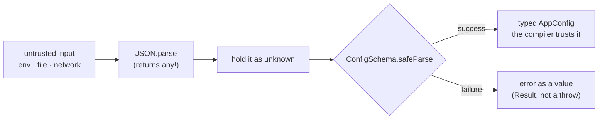

# 12 — Real-World TypeScript

## Why this exists

Every type you've written so far is erased before the program runs. Real
programs constantly meet data the compiler never saw — env vars, files,
JSON from the network. This module is about that boundary: turning
untrusted runtime data into trusted static types, plus the everyday
typing work around it (React, Node, migrating old JS).

## The runtime/static boundary



*What to notice: everything left of `safeParse` is runtime-only — no
annotation can make it safe. The schema is the single gate where runtime
data earns its static type.*

## Minimal syntax

```ts
import { z } from 'zod'
import type { ComponentProps, ReactNode } from 'react'

// 1 · validation: the schema is a VALUE, the type is DERIVED from it
const UserSchema = z.object({ id: z.number(), name: z.string() })
type User = z.infer<typeof UserSchema>        // { id: number; name: string }

const res = UserSchema.safeParse(JSON.parse('{"id":1,"name":"Ada"}'))
if (res.success) res.data                     // typed as User
else res.error                                // ZodError — no throw

// 2 · Node: every env var might be missing
const port: string | undefined = process.env.PORT

// 3 · React without JSX: a component is just a typed function
type BadgeProps = { label: string; onClick?: () => void }
declare function Badge(props: BadgeProps): ReactNode
type Extracted = ComponentProps<typeof Badge> // BadgeProps again
```

## zod vs plain types

| | plain `type` / `interface` | zod schema |
| --- | --- | --- |
| Exists at runtime | ❌ erased | ✅ a real object |
| Can validate input | ❌ | ✅ `parse` / `safeParse` |
| Static type | written by hand | derived with `z.infer` |
| Can drift from reality | easily | schema IS the source of truth |
| Cost | free | dependency + runtime work |
| Use for | data you created yourself | anything crossing a boundary |

## Migrating JS → TS — the order matters

1. Rename `.js` → `.ts`; let `any` stand temporarily.
2. Pin current behavior with tests — the safety net.
3. Tighten: `any` → real types, stringly states → literal unions,
   implicit nulls → explicit `| null`.
4. Behavior unchanged; only compile-time knowledge grew.

## Common gotchas

- `JSON.parse` returns `any`, not `unknown` — wrap it (or assign to
  `unknown`) before it infects the codebase. Module 01 ex04 was the
  warm-up for this.
- `process.env.X` is `string | undefined`. Handle the `undefined` once,
  early (a `requireEnv` helper) — don't sprinkle `!` everywhere.
- `z.infer` needs `typeof`: `z.infer<typeof Schema>`, never
  `z.infer<Schema>`.
- A hook returning `[value, fn]` without `as const` infers an *array*
  of `value | fn`, not a tuple.
- During a migration, never change behavior and types in the same step.

## Try it now

→ `exercises/ex01.ts` through `ex06.ts`, then `checkpoint.ts`.
Check with `npm test -- 12`.
