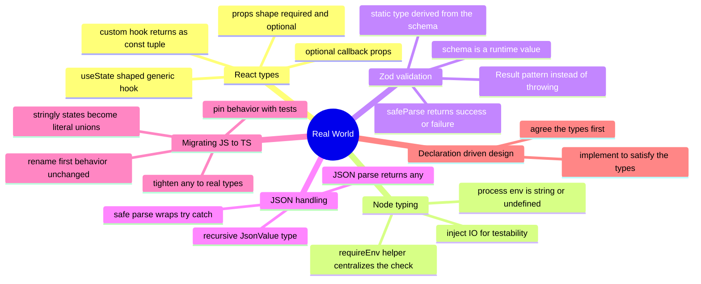

# 12 — Real-World TypeScript · Cheat-sheet

## Concept map



*What to notice: every branch answers the same question — how does a type
survive contact with data the compiler never saw. React and Node typing
describe shapes you control; zod and JSON handling describe shapes you
don't.*

## Key syntax

```ts
// zod: schema is a value, type is derived
const UserSchema = z.object({ id: z.number(), name: z.string() })
type User = z.infer<typeof UserSchema>
const res = UserSchema.safeParse(input)
if (res.success) res.data
else res.error

// recursive JSON type
type JsonValue = string | number | boolean | null | JsonValue[] | { [k: string]: JsonValue }

// Node: env is always optional
function requireEnv(name: string, env = process.env): string {
  const value = env[name]
  if (value === undefined) throw new Error(`Missing required env var: ${name}`)
  return value
}

// React without JSX: a component is just a typed function
type Props = { label: string; onClick?: () => void }
declare function Badge(props: Props): ReactNode
type Extracted = ComponentProps<typeof Badge>

// custom hook — as const to keep the tuple shape
function useToggle(initial: boolean) {
  let on = initial
  const toggle = () => ((on = !on), on)
  return [on, toggle] as const
}
```

## Rules to remember

- A schema is a runtime value; a `type`/`interface` is erased. Derive the
  type FROM the schema (`z.infer<typeof S>`) so they can never drift.
- `JSON.parse` returns `any`, not `unknown` — assign it to a typed
  variable (or wrap it in a safe-parse helper) the moment it appears.
- `process.env.X` is always `string | undefined`. Handle the missing case
  once, in one helper, not with `!` scattered through the codebase.
- A hook returning `[value, fn]` needs `as const`, or it widens to an
  array of `value | fn` instead of a fixed-shape tuple.
- Migration order: rename → pin behavior with tests → tighten types.
  Never change behavior and types in the same step.
- Declaration-driven design: agree the types first, implement to satisfy
  them — the compiler tells you the moment the implementation drifts.

## Gotchas

- `z.infer<Schema>` (no `typeof`) is a common typo — it must be
  `z.infer<typeof Schema>`.
- `safeParse` never throws; `parse` does. Prefer `safeParse` at
  boundaries so failures are values, not exceptions.
- `Record<string, string | undefined>` is the honest type for
  `process.env` — indexing can always miss.
- `Array.isArray` narrows `unknown`, but a recursive `JsonValue` still
  needs a runtime check before you trust its shape at a given key.
- Retyping `any` to something real can surface bugs the original loose
  code was silently allowing — that's the migration working as intended,
  not a regression.

## Self-quiz

1. Why is `JSON.parse`'s return type of `any` more dangerous than
   `unknown` would be?
2. Write the recursive shape of `JsonValue` from memory.
3. Why should a custom hook return `[state, setter] as const` instead of
   a plain array?
4. What is the type of `process.env.ANYTHING`, and what pattern
   centralizes handling its `undefined` case?
5. Why is `z.infer<typeof Schema>` preferred over writing the equivalent
   `type` by hand?
6. In a JS → TS migration, what must happen BEFORE any type gets
   tightened, and why?
7. What's the difference between `parse` and `safeParse` on a zod
   schema?
8. In one sentence, what does "declaration-driven design" mean?
9. Why does `ComponentProps<typeof Component>` avoid re-writing a props
   shape by hand?

<details><summary>Answers</summary>

1. `any` disables checking on everything it touches and spreads
   silently through the codebase; `unknown` forces a check (a narrow or
   a schema) before the value can be used at all.
2. `type JsonValue = string | number | boolean | null | JsonValue[] | { [key: string]: JsonValue }`.
3. Without `as const` the return type widens to `(State | Setter)[]` — an
   array where every element could be either type — losing the fixed
   position-by-position shape a tuple gives you.
4. `string | undefined`; a `requireEnv(name, env = process.env)` helper
   that throws (or returns a `Result`) once, in one place.
5. Hand-written types can drift from the schema that actually validates
   the data; deriving the type FROM the schema makes drift impossible —
   there's only one source of truth.
6. Tests that pin the current behavior — the safety net that proves the
   later type-tightening step didn't change what the code does.
7. `parse` throws on invalid input; `safeParse` returns a
   `{ success, data }` or `{ success: false, error }` object — errors as
   values, not exceptions.
8. Agree on the types for a feature first, then write the implementation
   to satisfy them, instead of discovering the shape as you code.
9. It extracts the props type directly from the component's own type
   signature, so the props shape is written exactly once — on the
   component — and everywhere else just references it.

</details>
