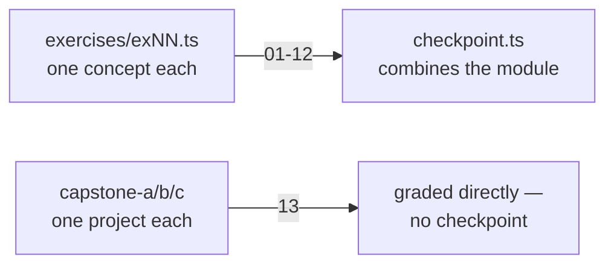
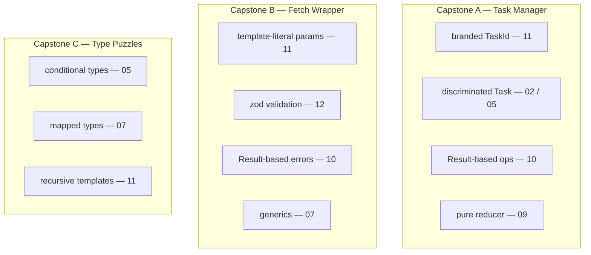

# 13 — Capstones

## Why this exists

Twelve modules taught you the pieces — literal types, discriminated unions,
generics, async, zod, branded types, template-literal parsing. A capstone
forces you to pick the RIGHT pieces for a real problem with no TODO comment
telling you which one. This module has no `checkpoint.ts`: each capstone
file below IS the graded work.

## How this module is different



*What to notice: every earlier module narrows down to a single checkpoint
file. This module has no narrowing step — each capstone file is both the
exercise AND the checkpoint for its own project.*

## The three capstones



*What to notice: no capstone is "new" material — each one is a fresh
combination of tools you already have. Reading the header docblock of a
capstone file is like reading a project README before you start coding.*

## How to work on them

Each capstone is ONE `.ts` file plus ONE `.test.ts` file. Read the header
docblock first — it lists the goals, the acceptance criteria, and which
earlier modules to revisit if a pattern feels unfamiliar. Work top to
bottom; later exports usually depend on earlier ones (e.g. capstone A's
`execute` calls `addTask` / `completeTask` / `removeTask`).

| Capstone | File | Focus |
| --- | --- | --- |
| A | `capstone-a-task-manager.ts` | discriminated state, pure reducers, branded ids |
| B | `capstone-b-fetch-wrapper.ts` | inferred generics, template-literal parsing, zod |
| C | `capstone-c-type-puzzles.ts` | conditional & recursive type-level programming |

Run one capstone at a time with `-t`:

```sh
npm test -- 13 -t capstone-a
npm test -- 13 -t capstone-b
npm test -- 13 -t capstone-c
```

Every `expectTypeOf` assertion in the test files is written to FAIL against
the `unknown`/`any` stubs and PASS once your implementation is precise —
the same contract as every earlier module, just at project scale.

## Common gotchas

- These files are bigger than a normal exercise. Read the WHOLE docblock
  before writing code — later requirements often constrain earlier design
  choices (e.g. capstone A's `Task` shape has to support both `statusLabel`
  AND `sortTasks` AND `execute`).
- A generic function's BODY only knows the upper bound of its type
  parameter, not the caller's exact instantiation — you'll sometimes need
  one explicit cast at a `return` to match a precise declared signature
  (see capstone B's `apiClient`). That's normal, not a smell — the public
  signature is still fully checked at every call site.
- Immutability bugs hide in helper functions, not just the ones you're
  testing: if `addTask` mutates `state.tasks` in place, a later
  `filterTasks` test can fail for a completely unrelated reason.
- `{}` as a TypeScript type means "any non-nullish value", not "an object
  with no properties" — it will NOT reject extra properties on an object
  literal. Reach for `Record<string, never>` if you truly need to forbid
  every key.

## Try it now

→ `exercises/capstone-a-task-manager.ts`, `capstone-b-fetch-wrapper.ts`,
`capstone-c-type-puzzles.ts` — in any order. Check with `npm test -- 13`.
