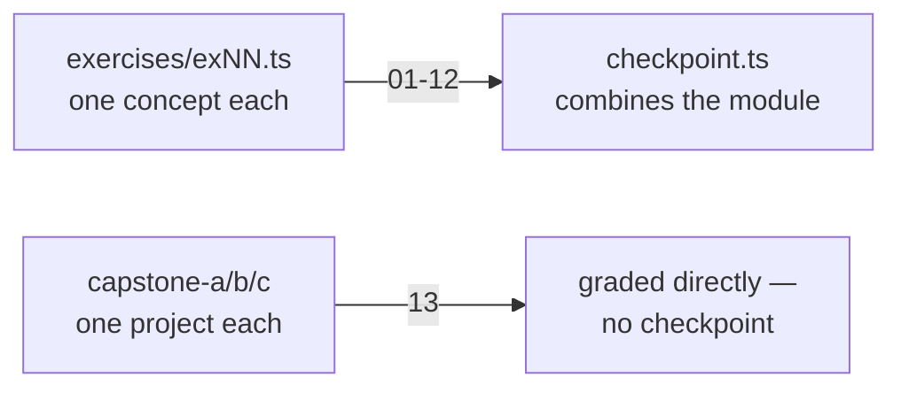
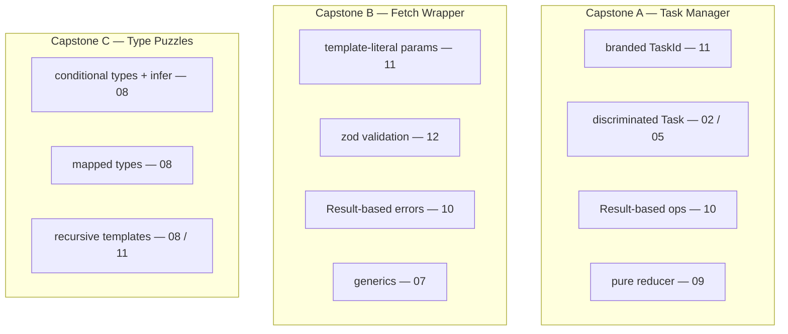
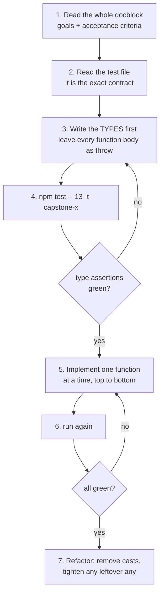
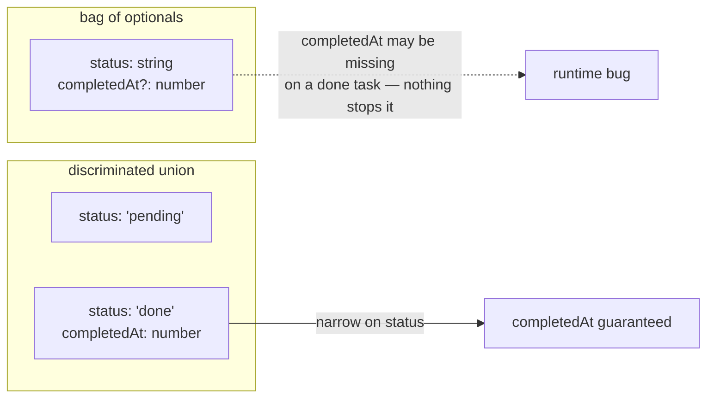
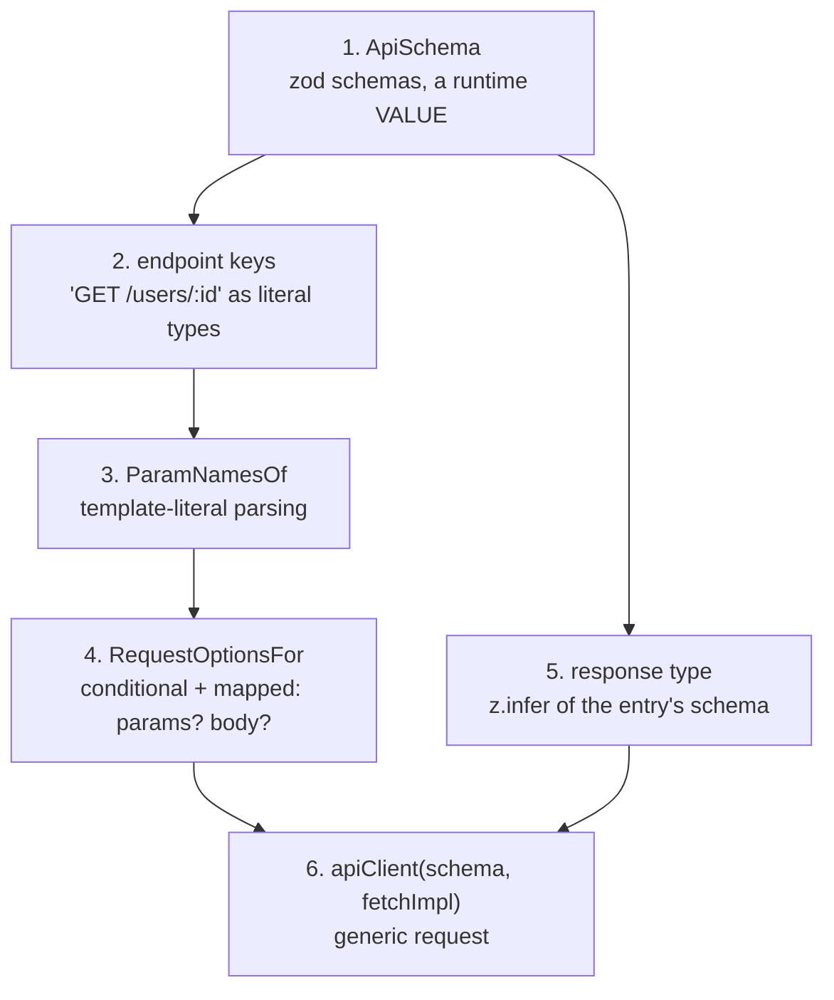
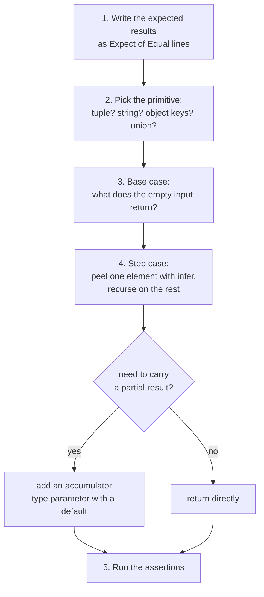

# 13 — Capstones

## Why this exists

Twelve modules taught you the pieces — literal types, discriminated unions,
generics, async, zod, branded types, template-literal parsing. A capstone
forces you to pick the RIGHT pieces for a real problem with no TODO comment
telling you which one. This module has no `checkpoint.ts`: each capstone
file below IS the graded work.

## How this module is different



*What to notice: every earlier module narrows down to a single checkpoint
file. This module has no narrowing step — each capstone file is both the
exercise AND the checkpoint for its own project.*

## Map of this module

| Section | Prepares you for |
| --- | --- |
| A workflow for project-sized work | all three capstones |
| Reading an acceptance test | all three — the tests ARE the spec |
| Design notes: Capstone A | `capstone-a-task-manager.ts` |
| Design notes: Capstone B | `capstone-b-fetch-wrapper.ts` |
| Design notes: Capstone C | `capstone-c-type-puzzles.ts` |
| When are you done? | ticking the roadmap |

## The three capstones



*What to notice: no capstone is "new" material — each one is a fresh
combination of tools you already have. Reading the header docblock of a
capstone file is like reading a project README before you start coding.*

| Capstone | File | Focus | Tests |
| --- | --- | --- | --- |
| A | `capstone-a-task-manager.ts` | discriminated state, pure reducers, branded ids | 27 |
| B | `capstone-b-fetch-wrapper.ts` | inferred generics, template-literal parsing, zod | 11 |
| C | `capstone-c-type-puzzles.ts` | conditional & recursive type-level programming | 14 |

Run one capstone at a time with `-t`:

```sh
npm test -- 13 -t capstone-a
npm test -- 13 -t capstone-b
npm test -- 13 -t capstone-c
```

## A workflow for project-sized work

A drill has one TODO. A project has twenty, and they depend on each
other. Order matters: design the types first, make the type assertions
pass, and only then write the runtime code.



*What to notice: types come before bodies. A stub whose signature is
right already passes every `expectTypeOf` line — that is fast, free
feedback before you write a single line of logic.*

Three habits that make this work:

- **Read top to bottom, then code top to bottom.** Later exports use
  earlier ones (capstone A's `execute` calls `addTask`, `completeTask`,
  `removeTask`). If you implement `execute` first you'll fight stubs that
  throw.
- **Keep the exported names.** The test file imports each export by name.
  Rename one and the whole test file fails to compile — every test in it
  goes red at once, not just the one you touched.
- **Commit after each green function.** A project-sized file is where a
  "quick cleanup" silently breaks three earlier tests. Small commits let
  you diff back to the last known-good state.

## Reading an acceptance test

Every test file makes two kinds of claims. Runtime claims use `expect`.
Type claims use `expectTypeOf` and `@ts-expect-error`. Both must hold —
a wrong type fails the run even when the values are right.

```ts
import { expectTypeOf } from 'vitest'

type Result<T, E> = { ok: true; value: T } | { ok: false; error: E }

function parsePort(raw: string): Result<number, string> {
  const n = Number(raw)
  return Number.isInteger(n) && n > 0 ? { ok: true, value: n } : { ok: false, error: `bad port: ${raw}` }
}

// the whole signature, exactly
expectTypeOf(parsePort).toEqualTypeOf<(raw: string) => Result<number, string>>()

// just the return type, or just the parameters
expectTypeOf(parsePort).returns.toEqualTypeOf<Result<number, string>>()
expectTypeOf(parsePort).parameters.toEqualTypeOf<[raw: string]>()

// "at least this shape" — extra properties are fine, missing ones are not
expectTypeOf({ ok: true as const, value: 1, extra: 'x' }).toMatchTypeOf<{ ok: true; value: number }>()
```

| Assertion | Passes when | Fails when |
| --- | --- | --- |
| `toEqualTypeOf<T>()` | the type is **exactly** `T` | it is wider, narrower, missing `readonly`, or has `any` |
| `toMatchTypeOf<T>()` | the type is **assignable to** `T` | it lacks something `T` requires |
| `.returns` / `.parameters` | you want one slice of a function type | — |
| `// @ts-expect-error` above a line | that line **does not compile** | it compiles — the error you promised is missing |

`toEqualTypeOf` is strict in ways that surprise people:

```ts
import { expectTypeOf } from 'vitest'

type Snapshot = { readonly items: readonly string[] }
declare const s: { items: string[] }

// ✅ assignable — a mutable shape fits a readonly one
expectTypeOf(s).toMatchTypeOf<Snapshot>()

// ❌ not EQUAL — readonly is part of the exact type
expectTypeOf(s).toEqualTypeOf<Snapshot>()
```

So when a test says `toEqualTypeOf<{ readonly state: TaskState }>`, your
function must return exactly that — `readonly` included. Read the
expected type character by character.

A `@ts-expect-error` test is the mirror image: it proves your types
*reject* something.

```ts
type UserId = string & { readonly __brand: 'UserId' }

// @ts-expect-error — a raw string must not be a UserId
const bad: UserId = 'u-1'
```

If your `UserId` were just `string`, the assignment would compile, the
directive would become "unused", and TypeScript reports that as an error
(TS2578). Either way the test pins the behavior.

## Design notes: Capstone A — task manager

The core decision: model the task as a **union of states**, not as one
object with optional fields.



*What to notice: with a union, the compiler knows `completedAt` exists
exactly when `status === 'done'` — the invariant lives in the type, not in
your discipline.*

**Purity is enforced by `readonly`.** The state holds `readonly Task[]`.
That single word turns every accidental mutation into a compile error, so
you're pushed toward spread, `map`, `filter`, and copy-then-sort:

```ts
type Item = { readonly id: number; readonly name: string }
type Store = { readonly items: readonly Item[] }

function rename(store: Store, id: number, name: string): Store {
  // ❌ error TS2339: Property 'push' does not exist on type 'readonly Item[]'.
  store.items.push({ id, name })

  // ✅ build a new array; untouched items keep their identity
  return { ...store, items: store.items.map((it) => (it.id === id ? { ...it, name } : it)) }
}

function sorted(store: Store): readonly Item[] {
  // ❌ error TS2339: Property 'sort' does not exist on type 'readonly Item[]'.
  return store.items.sort((a, b) => a.id - b.id)
}

function sortedCopy(store: Store): readonly Item[] {
  // ✅ copy first — sort mutates, the copy absorbs it
  return [...store.items].sort((a, b) => a.id - b.id)
}
```

Note the test that checks `other` is *the same object reference* after
`completeTask`. Immutable update means "replace what changed, keep the
rest" — `map` returning the original element for non-matches does exactly
that.

**Expected failures are values.** "Task not found" and "task already done"
are two *different* errors the caller may react to differently. A
`Result<T, string>` puts that in the signature; a `throw` hides it. Module
10 has the pattern; module 11 has the branded-id pattern for `TaskId`.

**The reducer signature is the whole design.** `execute(state, command,
now)` takes the clock as an argument so it is pure: same inputs, same
outputs, no `Date.now()` inside. Each `Command` variant maps to one
`Message` variant — sketch that table on paper before writing the switch,
and end the switch with `assertNever` so a future command can't be
forgotten.

## Design notes: Capstone B — fetch wrapper

This one is layered. Each layer is testable on its own — build and check
them bottom-up.



*What to notice: layers 2 to 5 are pure type-level work. You can prove
each with a one-line `expectTypeOf` in a scratch file before touching the
runtime client.*

**Develop type-level pieces in isolation.** Write a helper type, then
assert it against a literal — no runtime needed:

```ts
import { expectTypeOf } from 'vitest'

// the PATH is what comes after the first space
type PathOf<K extends string> = K extends `${string} ${infer Path}` ? Path : never

expectTypeOf<PathOf<'GET /users/:id'>>().toEqualTypeOf<'/users/:id'>()
expectTypeOf<PathOf<'POST /posts'>>().toEqualTypeOf<'/posts'>()
expectTypeOf<PathOf<'nospace'>>().toEqualTypeOf<never>()
```

Module 11's `ParamNames` is the second step of this chain; the capstone
asks you to compose it with the layer above.

**Conditional properties are mapped types, not optionals.** "A `params`
field only if the path has `:params`" is a decision the type must make.
The tool is an intersection of small pieces, each one either a real object
type or `{}`:

```ts
import { expectTypeOf } from 'vitest'

type WithFlag<F extends boolean> = (F extends true ? { flag: true } : {}) & { name: string }

expectTypeOf<WithFlag<true>>().toMatchTypeOf<{ flag: true; name: string }>()
expectTypeOf<WithFlag<false>>().toEqualTypeOf<{ name: string }>()
```

**The cast at the generic boundary is normal.** Inside
`request<K extends keyof S>`, the body only knows `K` is *some* key, so a
value you build for a specific `K` won't be seen as
`z.infer<S[K]['response']>` without one cast at the `return`. The public
signature is still fully checked at every call site; module 07's
"could be instantiated with a different subtype" error is the reason.

**Never touch the network.** `fetchImpl` is injected. Type it as the
smallest shape you need (a function returning a promise of something with
`ok`, `status`, and `json()`), not the full `typeof fetch` — narrower
dependencies are easier to fake and to reason about (module 12, ex02).

## Design notes: Capstone C — type puzzles

Eleven utilities, each a small recursive or conditional type. The method
is the same every time.



*What to notice: every recursive type has the same skeleton — a base case
on the empty input and a step case that peels one element with `infer`.
The accumulator is the only optional part.*

**Test types before you trust them.** The `Equal` helper below is the
standard type-challenges trick — it is strict enough to tell `any` from
`unknown` and `{ a: 1 }` from `{ readonly a: 1 }`:

```ts
type Equal<X, Y> =
  (<T>() => T extends X ? 1 : 2) extends (<T>() => T extends Y ? 1 : 2) ? true : false
type Expect<T extends true> = T

// a small recursive puzzle, built with the skeleton above
type Reverse<T extends readonly unknown[], Acc extends unknown[] = []> =
  T extends readonly [infer Head, ...infer Rest] ? Reverse<Rest, [Head, ...Acc]> : Acc

type _t1 = Expect<Equal<Reverse<[1, 2, 3]>, [3, 2, 1]>>
type _t2 = Expect<Equal<Reverse<[]>, []>>
type _t3 = Expect<Equal<Reverse<['a']>, ['a']>>
```

If a puzzle is wrong, the `Expect<...>` line errors with TS2344 (`Type
'false' does not satisfy the constraint 'true'`) — the same signal
`expectTypeOf` gives in the test file.

**The building blocks, by input kind:**

| Input | Peel one element with | Base case |
| --- | --- | --- |
| tuple `T` | `T extends [infer H, ...infer R]` | `[]` |
| string `S` | `S extends \`${infer H}${infer R}\`` or split on a delimiter `\`${infer Before}${D}${infer After}\`` | `''` |
| object keys | `{ [K in keyof T]: ... }[keyof T]` to turn a mapping into a union | `never` |
| union `U` | a distributive conditional (`U extends U ? ... : never`) | `never` |
| nested tuple | `H extends readonly unknown[] ? recurse into H : keep H` | `[]` |

**Two traps specific to this capstone:**

- *Distribution.* A bare type parameter in `T extends ... ? :` distributes
  over unions. That is what you want for `IsNever` style checks only when
  you remember that `never` distributes to `never` — wrap in a tuple
  (`[T] extends [never]`) to test the whole thing. Module 08, ex03.
- *Optional keys.* `{ a?: number }` and `{ a: number | undefined }` are
  different types. The `?` modifier is detectable by mapping each key
  through `{} extends Pick<T, K>` — a required key can't be satisfied by
  an empty object, an optional one can. Module 08, ex05 and ex09.

## When are you done?

A capstone is complete when its test file is fully green, with **no**
`any` left in your exports and no `@ts-expect-error` you added yourself
to silence a real problem. Then:

1. Run the whole module once more: `npm test -- 13`.
2. Ask your instructor to review the file beyond the tests — naming,
   simpler typings, leftover casts.
3. Tick the capstone in `ROADMAP.md`.

## Common gotchas

- These files are bigger than a normal exercise. Read the WHOLE docblock
  before writing code — later requirements often constrain earlier design
  choices (e.g. capstone A's `Task` shape has to support both `statusLabel`
  AND `sortTasks` AND `execute`).
- A generic function's BODY only knows the upper bound of its type
  parameter, not the caller's exact instantiation — you'll sometimes need
  one explicit cast at a `return` to match a precise declared signature
  (see capstone B's `apiClient`). That's normal, not a smell — the public
  signature is still fully checked at every call site.
- Immutability bugs hide in helper functions, not just the ones you're
  testing: if `addTask` mutates `state.tasks` in place, a later
  `filterTasks` test can fail for a completely unrelated reason.
- `{}` as a TypeScript type means "any non-nullish value", not "an object
  with no properties" — it will NOT reject extra properties on an object
  literal. Reach for `Record<string, never>` if you truly need to forbid
  every key.
- `toEqualTypeOf` distinguishes `readonly` and optional (`?`) from their
  mutable/required twins. If a type assertion fails and the shapes look
  identical, diff the modifiers.
- A test helper that calls one of your exports at `describe` scope would
  run while the file is being collected — the test files avoid that on
  purpose. Keep the same discipline in any scratch tests you write.
- Recursive types hit a depth limit (TS2589, "excessively deep"). If a
  puzzle blows up on a long input, move the recursion into tail position
  (return the recursive call directly, with an accumulator) — TypeScript
  optimizes tail-recursive conditional types.

## Try it now

→ `exercises/capstone-a-task-manager.ts`, `capstone-b-fetch-wrapper.ts`,
`capstone-c-type-puzzles.ts` — in any order. Check with `npm test -- 13`.
