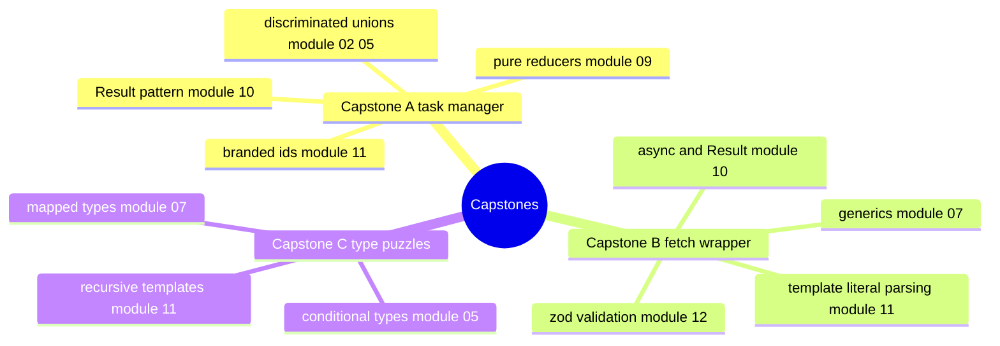

# 13 — Capstones · Course recap

## You finished the course

Twelve modules built the vocabulary; this module spent it. Three small,
real projects, each combining tools from across the whole course instead
of drilling one at a time:

- **Capstone A** — a task manager's core: branded ids so an id can never
  be swapped for a raw string, a `Task` type that only reveals
  `completedAt` once you've narrowed to `'done'`, pure add/complete/
  remove/filter/sort operations, a `Command` parser, and a reducer that
  turns state + command into new state + typed messages.
- **Capstone B** — a fetch wrapper whose `request('GET /users/:id', ...)`
  infers the exact response type and the exact required params from the
  endpoint key alone, validating every response with zod at the boundary.
- **Capstone C** — a small type-level puzzle library: string
  manipulation, object-path lookups, union/intersection conversion, and
  deep tuple recursion.

## Concept map — where each capstone drew from



*What to notice: nothing here is new syntax — every branch points back to
a module you already finished. A capstone is a design exercise, not a
syntax lesson.*

## Key syntax — patterns worth keeping

```ts
// Branded id — the ONLY way to produce one is through the constructor.
type Brand<T, B extends string> = T & { readonly __brand: B }
const userId = (raw: string) => raw as Brand<string, 'UserId'>

// Pure reducer shape — never mutate, always return a NEW state.
function execute(state: State, cmd: Command, now: number): { state: State; messages: Message[] }

// Response type inferred from a string KEY, not a manual generic.
type ResponseOf<S extends ApiSchema, K extends keyof S> = z.infer<S[K]['response']>

// Distributive-conditional trick to avoid `never` collapsing a comparison.
type IsNever<T> = [T] extends [never] ? true : false
```

## Rules to remember

- A discriminated union only reveals its variant-specific fields AFTER
  you narrow on the discriminant — design the discriminant first, the
  fields follow.
- Pure functions return NEW containers; never reuse or reassign the
  input's arrays/objects, even when only one entry changed.
- Inside a generic function body, you only get the CONSTRAINT's shape,
  not the caller's exact type — a single explicit cast at the return is
  the normal way to bridge that gap.
- `{}` accepts any non-nullish value in TypeScript — it does not mean
  "no properties allowed." Use `Record<string, never>` when you need that.
- Validate untrusted data (network responses, CLI args) at the boundary
  and derive the static type FROM the validator — never write the shape
  twice.

## Gotchas

- `expectTypeOf<never>()` itself can misbehave (distributive conditional
  types collapse `Actual extends X ? A : B` to `never` when `Actual` IS
  `never`) — compare the whole containing type instead of isolating a bare
  `never` with `.returns` or a standalone type argument.
- Fixtures that call a not-yet-implemented function must live INSIDE an
  `it(...)` callback, never at `describe(...)` scope — a throw during test
  *collection* takes the whole file down, not just one test.
- `vi.fn(async () => ...)` with an argument-less implementation infers
  `Parameters<T>` as `[]`; type it explicitly if you'll inspect
  `.mock.calls[n][0]` later.

## What to build next

The course is finished, but the tools aren't done being useful. Some
directions to keep going:

- Turn capstone A into an actual CLI (`process.argv`, real stdout) —
  the library core is already there.
- Swap capstone B's fake `fetchImpl` for the real `fetch` and point it at
  a public JSON API; keep the zod validation exactly as strict.
- Add 3-5 more puzzles to capstone C's library (`DeepPartial`, `Mutable`,
  `LastOf<Union>`) and write your own failing-first tests for them.
- Pick a small side project and require yourself to enable every strict
  flag this course used from day one, instead of adding them later.
