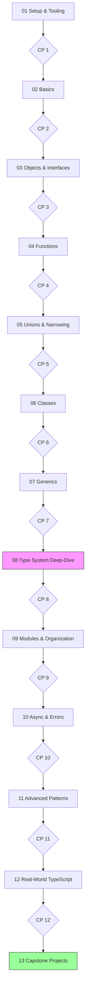

# Course Roadmap

Your progress tracker. Modules build on each other — follow the arrows.
Diamonds are graded checkpoints: pass the checkpoint's tests to unlock a
checkbox below.

*What to notice: the path is linear until the heart of the course — module
08, the type-system deep-dive (highlighted) — everything before it is
preparation, everything after it is application.*

## Progress

### 01 — Setup & Tooling
- [ ] Lesson read
- [ ] Exercises ex01–ex04
- [ ] ✦ Checkpoint 1 passed

### 02 — Basics
- [ ] Lesson read
- [ ] Exercises ex01–ex08
- [ ] ✦ Checkpoint 2 passed

### 03 — Objects & Interfaces
- [ ] Lesson read
- [ ] Exercises ex01–ex07
- [ ] ✦ Checkpoint 3 passed

### 04 — Functions
- [ ] Lesson read
- [ ] Exercises ex01–ex07
- [ ] ✦ Checkpoint 4 passed

### 05 — Unions & Narrowing
- [ ] Lesson read
- [ ] Exercises
- [ ] ✦ Checkpoint 5 passed

### 06 — Classes
- [ ] Lesson read
- [ ] Exercises
- [ ] ✦ Checkpoint 6 passed

### 07 — Generics
- [ ] Lesson read
- [ ] Exercises
- [ ] ✦ Checkpoint 7 passed

### 08 — Type System Deep-Dive
- [ ] Lesson read
- [ ] Exercises
- [ ] Type-challenges puzzle set
- [ ] ✦ Checkpoint 8 passed

### 09 — Modules & Organization
- [ ] Lesson read
- [ ] Exercises
- [ ] ✦ Checkpoint 9 passed

### 10 — Async & Error Handling
- [ ] Lesson read
- [ ] Exercises
- [ ] ✦ Checkpoint 10 passed

### 11 — Advanced Patterns
- [ ] Lesson read
- [ ] Exercises
- [ ] ✦ Checkpoint 11 passed

### 12 — Real-World TypeScript
- [ ] Lesson read
- [ ] Exercises
- [ ] ✦ Checkpoint 12 passed

### 13 — Capstone Projects
- [ ] Capstone A: typed CLI task manager
- [ ] Capstone B: type-safe fetch wrapper
- [ ] Capstone C: type-level puzzle library
