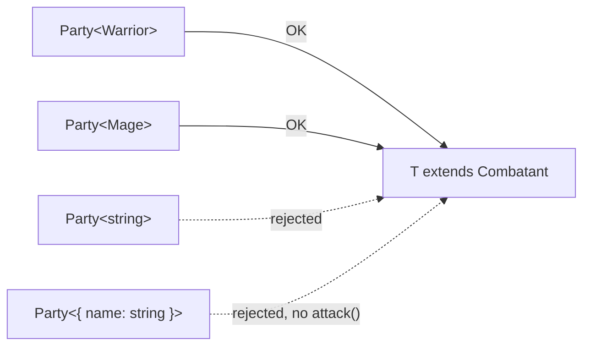

# 06 — "class Party of T" … "T must satisfy Combatant"

That phrase is from the hierarchy diagram at the top of `06-classes/LESSON.md`.
It is not tied to any exercise. It previews a **generic class with a constraint**.

Two words are doing the work:

| Diagram phrase              | TypeScript                          | Meaning |
|-----------------------------|-------------------------------------|---------|
| "class Party of T"          | `class Party<T>`                    | A generic class. `T` is a placeholder for whatever kind of member the party holds. |
| "T must satisfy Combatant"  | `class Party<T extends Combatant>`  | A constraint. Any type may fill `T`, as long as it has everything `Combatant` requires. |

So the dashed arrow says: `Party` does **not** implement `Combatant` itself.
It only demands that its members do.



*A type satisfies the constraint when it has at least the members of
`Combatant`. Extra members are fine. Missing members are an error.*

Runnable version: `npx tsx playground/06-lesson__party-of-t.ts`

```ts
interface Combatant { name: string; attack(): number }

class Party<T extends Combatant> {
  private members: T[] = []
  add(member: T) { this.members.push(member) }
  totalDamage() {
    // safe: the constraint guarantees every member has attack()
    return this.members.reduce((sum, m) => sum + m.attack(), 0)
  }
}

new Party<Warrior>()   // OK
new Party<Combatant>() // OK, mixes Warriors and Mages
new Party<string>()    // error: string does not satisfy Combatant
```
