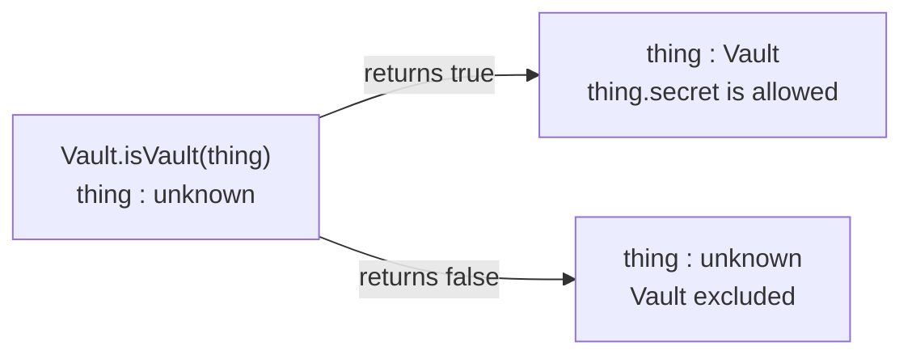
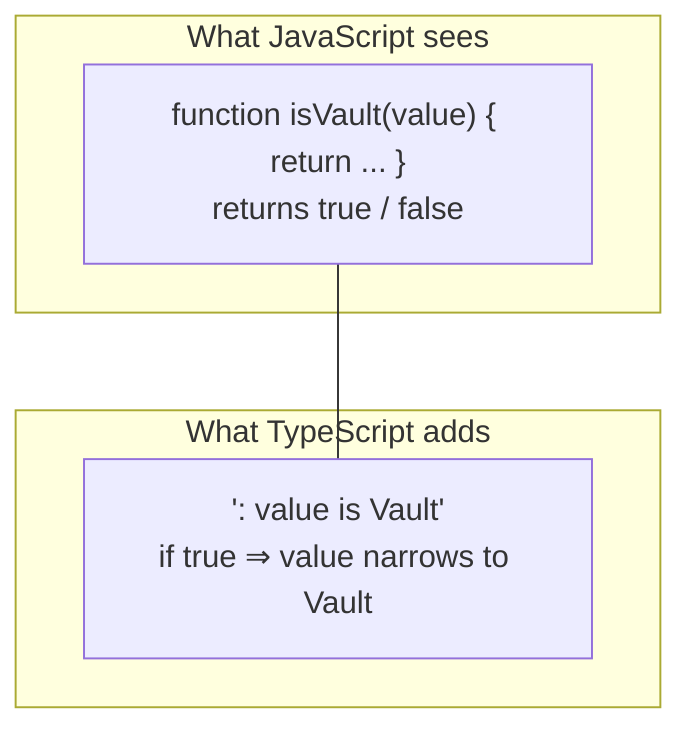

# Type predicate — `value is Vault`

Companion diagram for [`06-lesson__type-predicate-recap.ts`](./06-lesson__type-predicate-recap.ts).
Preview this file in VS Code (`⇧⌘V`) to see the Mermaid render.

*A predicate turns a boolean check into a narrowing point. The same call, with a plain `boolean` return type, would leave `thing` as `unknown` on both branches.*

*The predicate is erased at runtime. Only the checker uses it, so the body must really test the shape — TypeScript trusts you.*
